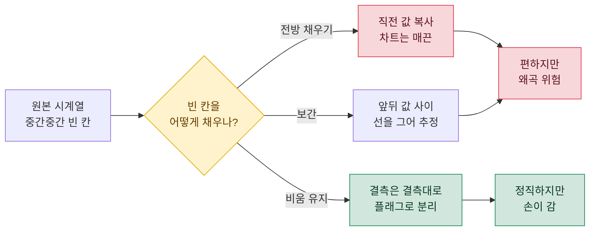
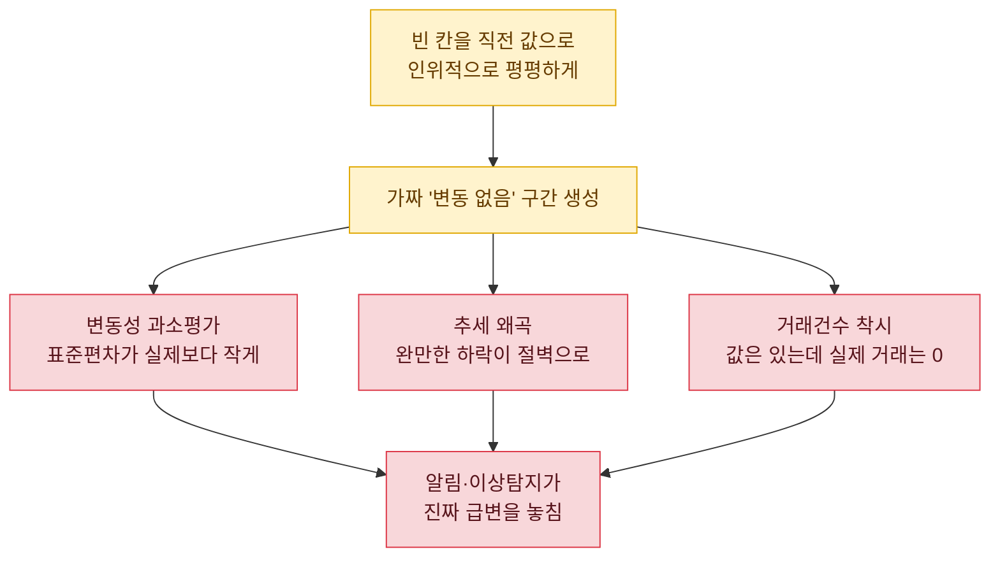
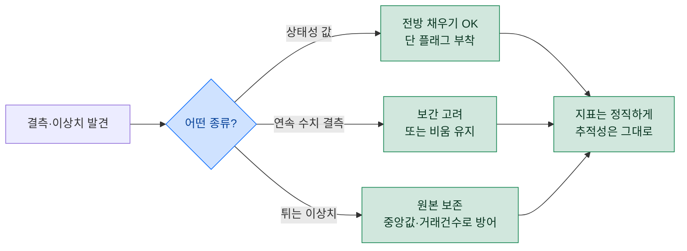

> "빈 칸이 있으면 바로 위 숫자로 채워." — 이 한 문장이 내 대시보드를 몇 주간 조용히 거짓말하게 만들었다.

데이터 분석을 하다 보면 결측(빈 값)과 이상치(툭 튀는 값)는 손님처럼 매일 찾아온다. 크롤러가 한 번 실패하고, 정산 배치가 하루 밀리고, 어떤 아이템은 그날 거래가 아예 없다. 그때 가장 손쉬운 처방이 바로 '직전 값으로 채우기', 영어로 forward fill(전방 채우기)이다. 아래로 쭉 끌어내리는 그 동작. 편하다. 그런데 나는 이걸 습관처럼 쓰다가 크게 데였다. 오늘은 그 실패담과, 대신 뭘 했는지를 남긴다.

## 전방 채우기가 대체 뭐길래 다들 먼저 손이 갈까?

전방 채우기는 이름 그대로다. 값이 비어 있으면 시간순으로 바로 앞에 있던 값을 그대로 가져와 채운다. 엑셀에서 위 셀을 아래로 드래그하는 것, SQL에서 `LAG`로 직전 행을 당겨오는 것이 전부 같은 아이디어다.

왜 이렇게 인기가 많을까. 첫째, 직관적이다. "어제 상태가 오늘도 유지된다"는 가정은 꽤 많은 경우 자연스럽다. 둘째, 구현이 짧다. 셋째, 빈 칸이 사라지니 차트가 예뻐진다. 바로 이 세 번째가 함정의 입구였다. 예뻐진 것과 정확해진 것은 전혀 다른 얘기인데.



## 그래서 언제 써도 괜찮을까?

먼저 억울하지 않게 변호부터. 전방 채우기가 정당한 상황은 분명히 있다. 핵심 조건은 하나다. **빈 칸이 '값이 없음'이 아니라 '값이 안 변함'을 뜻할 때.**

예를 들어 상태(status)성 데이터가 그렇다. 어떤 유저의 등급이 '실버'로 찍힌 뒤 다음 이벤트까지 아무 기록이 없다면, 그 사이 등급은 정말로 실버였을 가능성이 높다. 계약 정보, 설정값, 구독 상태처럼 '한 번 정해지면 다음 변경 전까지 유지되는' 값은 직전 값으로 끌고 오는 게 오히려 정답이다.

| 상황 | 빈 칸의 의미 | 전방 채우기 |
| --- | --- | --- |
| 유저 등급/구독 상태 | 안 바뀌어서 기록이 없음 | 적절 |
| 설정값·플래그 | 마지막 설정이 유효 | 적절 |
| 하루 거래가 없던 시세 | 그날 값을 모름 | 위험 |
| 매출·방문자 수 | 진짜로 0이거나 미집계 | 위험 |

표의 아래 두 줄이 오늘의 주인공이다. '모름'과 '안 변함'은 겉보기엔 똑같이 빈 칸이지만, 데이터가 하는 말은 정반대다.

## 시세 데이터에서는 왜 독이 되나?

내가 데인 곳이 바로 여기다. 합성 예시로 재현해 보겠다. 어떤 아이템의 현금 시세를 매일 크롤링해 중앙값으로 집계하는 파이프라인을 상상하자(실데이터 아님, 전부 더미다).

문제는 거래가 뜸한 날이다. 주중엔 활발하다가 주말에 매물이 뚝 끊기는 아이템이 있다. 거래가 없으면 그날 중앙값은 결측이다. 여기에 전방 채우기를 걸면 이런 일이 벌어진다.

| 날짜 | 실제 거래 | 원본 중앙값(원) | 전방 채우기 후(원) |
| --- | --- | --- | --- |
| 월 | 있음 | 12,000 | 12,000 |
| 화 | 있음 | 11,800 | 11,800 |
| 수 | 없음 | (결측) | 11,800 |
| 목 | 없음 | (결측) | 11,800 |
| 금 | 있음 | 9,500 | 9,500 |

수요일과 목요일, 시세는 사실 아무도 모른다. 그런데 전방 채우기는 "화요일 11,800원이 이틀 더 유지됐다"고 단언한다. 금요일에 9,500원으로 뚝 떨어졌다는 건, 실제로는 수·목 사이 어딘가에서 서서히 빠졌을 수도 있는데, 차트에는 목요일까지 평평하다가 금요일에 절벽처럼 꺾이는 가짜 모양이 남는다.

이게 왜 심각하냐면, 이 왜곡된 시계열 위에서 2차 지표들이 계산되기 때문이다.



변동성이 실제보다 작게 잡히면, 시세가 정말로 요동칠 때 울려야 할 이상 알림이 침묵한다. 평평한 가짜 데이터로 학습한 기준선이 관대해진 탓이다. 나는 이 지점에서 "왜 급등을 놓쳤지?"를 며칠 헤맸다.

## 이상치를 직전 값으로 '덮는' 건 또 다른 함정

결측만 문제가 아니다. 이상치도 마찬가지다. 크롤러가 파싱을 잘못해서 시세가 갑자기 0원이나 990,000원처럼 말도 안 되는 값으로 찍히는 날이 있다. 여기서 유혹이 온다. "이상치니까 직전 정상값으로 바꿔치기하자."

이건 두 가지를 한꺼번에 망친다. 첫째, 진짜 급변과 크롤링 오류를 구분하지 못한다. 990,000원이 파싱 버그일 수도 있지만, 정말 품귀로 폭등한 진짜 신호일 수도 있다. 직전 값으로 덮어버리면 그 판단 기회를 영영 날린다. 둘째, 원본을 잃는다. 나중에 "그날 왜 이 값이지?"를 되짚을 근거가 사라진다.

## 그럼 뭘 해야 하나 — 내가 쓰는 대안들

데인 뒤 정착한 원칙은 세 가지다.

첫째, **결측은 결측대로 남기고, 채운 값에는 반드시 플래그를 붙인다.** 값 컬럼 옆에 `is_filled` 같은 표식 컬럼을 하나 둔다. 그러면 나중에 "채워진 행은 빼고 봐"가 한 줄 필터로 가능해진다. 이건 예전에 과금/무과금을 별도 플래그 컬럼으로 분리해두면 온갖 세그먼트 질문이 필터 하나로 풀렸던 경험과 정확히 같은 발상이다.

둘째, **연속형 수치는 채울 거면 보간(interpolation)을 고려한다.** 보간은 앞뒤 값 사이를 직선으로 이어 중간을 추정하는 방식이다. 수·목이 비었고 화요일 11,800원, 금요일 9,500원이라면, 전방 채우기는 둘 다 11,800원으로 두지만 선형 보간은 그 사이를 완만하게 이어준다. '절벽'이 '경사'로 바뀐다. 물론 보간도 추정이므로 만능은 아니다. 다만 "직전 값 복사"보다는 데이터의 실제 움직임에 가깝다.

셋째, **집계 단계에서 애초에 이상치에 강한 통계량을 쓴다.** 나는 시세 집계에 평균 대신 중앙값(median)을 쓴다. 중앙값은 소수의 튀는 값에 거의 흔들리지 않기 때문이다. 여기에 거래건수를 항상 함께 집계한다. 값 하나만 보면 "11,800원"이지만, 거래건수가 0이면 그 값은 믿을 게 못 된다는 걸 즉시 알 수 있다.



## SQL로는 어떻게 표현하나?

개념만 일반화해서 옮기면 이렇다. 전방 채우기 자체는 `LAG`나 `LAST_VALUE` 같은 윈도우 함수로 직전 유효값을 당겨오는 형태다. 중요한 건 채웠다는 사실을 함께 남기는 것.

```sql
-- 합성/더미 예시. 실제 테이블·스키마 아님.
SELECT
    d.trade_date,
    d.raw_median_price,
    -- 원본이 비면 직전 유효값을 끌어옴(전방 채우기)
    COALESCE(
        d.raw_median_price,
        LAG(d.raw_median_price) IGNORE NULLS
            OVER (PARTITION BY d.item_id ORDER BY d.trade_date)
    ) AS price_ffill,
    -- 채운 행을 반드시 표시
    CASE WHEN d.raw_median_price IS NULL THEN 1 ELSE 0 END AS is_filled,
    d.trade_count
FROM daily_price_dummy AS d;
```

포인트는 `is_filled` 컬럼이다. 이 한 칸 덕분에 분석 단계에서 "채운 값은 변동성 계산에서 제외", "거래건수 0인 날은 추세선에서 제외" 같은 선택을 자유롭게 할 수 있다. 값을 채우되, 채웠다는 진실은 지운다. 이게 내가 배운 균형점이다.

## 마무리

전방 채우기는 나쁜 도구가 아니다. 상태성 데이터에서는 오히려 정답이다. 문제는 도구가 아니라 '무지성 적용'이었다. 빈 칸이 "안 변함"을 뜻하는지 "모름"을 뜻하는지 묻지 않고 일단 아래로 끌어내린 순간, 내 대시보드는 매끈하지만 거짓인 그래프가 됐다.

정리하면 이렇다. 채우기 전에 "이 빈 칸은 무슨 말을 하고 있나"를 먼저 묻는다. 상태성이면 채우되 플래그를 달고, 연속 수치면 보간을 고려하고, 시세처럼 움직이는 값은 원본을 보존한 채 중앙값과 거래건수로 방어한다. 데이터를 예쁘게 만드는 것과 정직하게 다루는 것 사이에서, 나는 이제 주저 없이 정직 쪽에 선다. 매끈한 거짓보다 울퉁불퉁한 진실이 훨씬 덜 위험하다는 걸, 며칠을 헤매고 나서야 배웠다.

## 참고자료

- [[price-monitoring-pipeline-crawl-mssql]] — 시세 수집·적재·집계 파이프라인 전체 구조(중앙값·거래건수 집계의 맥락)
- [[paying-flag-segmentation]] — 플래그 컬럼으로 세그먼트를 분리해두는 발상
- [[game-data-sql-recipes-retention-ltv]] — 윈도우 함수(LAG/LEAD) 활용 레시피
- [[game-metrics-7-definitions]] — 지표 정의를 먼저 합의하는 습관
- game-data-recipes 리포지토리: https://github.com/DBhyeong/game-data-recipes

<!-- 안전: 합성/더미 데이터, 회사·실데이터·PII 없음. -->
