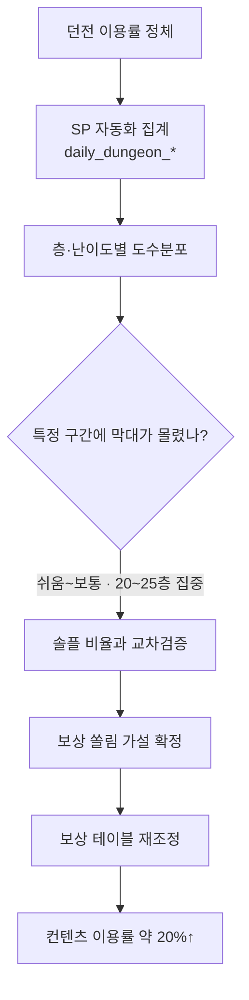
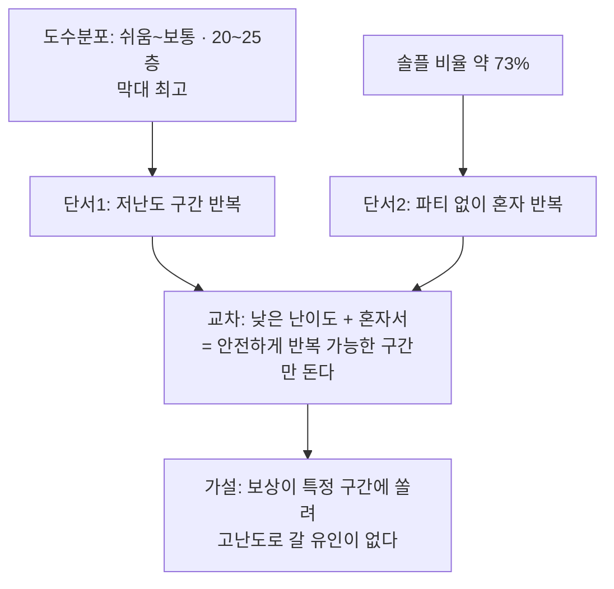

드래곤네스트 시절, 던전 콘텐츠 하나의 이용률이 좀처럼 안 오르는 걸 붙잡고 있었다. 처음엔 클리어율·이용률 같은 %지표를 계속 뽑아봤다. 숫자는 나오는데 "왜 안 도는가"에 대한 답은 안 나왔다. 평균과 비율은 전체를 한 줄로 요약해줄 뿐, **어디에 몰려 있는지**는 말해주지 않았다. 며칠을 헤매다 관점을 바꿨다. 요약값 하나 말고, **값이 흩어진 모양 자체**를 그려보자. 층별·난이도별로 클리어 횟수를 세어 막대로 찍어보니, 특정 구간에 막대가 유독 솟아 있는 게 한눈에 보였다. 이 글은 그 도수분포(히스토그램) 진단법을 방법론 중심으로 정리한 것이다.

먼저 전체 흐름부터 본다.



## 평균과 비율만 보면 왜 밸런스 문제가 안 보였나?

이용률이나 클리어율은 전체 유저를 하나의 숫자로 뭉갠다. 문제는 **모양이 다른 두 분포가 같은 평균을 가질 수 있다**는 점이다. 유저들이 전체 층에 고르게 퍼져서 돈 결과의 "평균 층수"와, 유저 대부분이 특정 구간에만 몰려서 반복한 결과의 "평균 층수"가 우연히 비슷하게 나올 수 있다.

비유하자면 반 평균 점수가 70점이라는 정보만으로는 "다들 고만고만하게 70점"인지 "절반은 100점, 절반은 40점"인지 알 수 없는 것과 같다. 내가 이용률·클리어율만 붙잡고 있던 게 정확히 이 함정이었다. **분포의 모양**을 보지 않고서는 쏠림을 발견할 수 없었다.

## 도수분포는 정확히 뭘 세는 도구인가?

도수분포(frequency distribution)는 단순하다. 관측값을 몇 개의 구간(bin)으로 나누고, 각 구간에 몇 번 들어왔는지(도수)를 세는 것뿐이다. 히스토그램은 그걸 막대로 그린 그림이다.

여기서는 두 축으로 구간을 잡았다.

- **층(floor) 구간**: 1~5층, 6~10층, … 식으로 5단위로 묶음
- **난이도 등급**: 쉬움 / 보통 / 어려움


이 두 축을 교차한 구간마다 클리어 횟수를 세면, "어느 난이도의 어느 층에서" 유저가 몰려 반복하는지가 표 하나에 다 담긴다. 요약 지표 하나로는 못 보던 걸, 구간을 쪼개는 순간 볼 수 있게 된다.

## Excel과 파이썬, 실제로 어떻게 도수분포를 쌓았나?

매일 도는 반복 집계를 사람이 손으로 짤 이유는 없었다. 클리어 로그를 층·난이도 구간별로 묶는 부분은 Stored Procedure(`daily_dungeon_*` 류)로 자동화해두고, 결과 테이블만 매일 아침 받아봤다.

```sql
-- 개념 예시(합성). 실제 스키마 아님.
-- 던전 클리어 로그를 난이도·층 구간별로 집계
SELECT
    difficulty,                        -- 'easy' / 'normal' / 'hard'
    (floor_no / 5) * 5 AS floor_bin,   -- 층을 5단위 구간으로 묶음
    COUNT(*)                    AS clear_count,
    SUM(CASE WHEN reward_flag = 1 THEN 1 ELSE 0 END) AS reward_count
FROM   daily_dungeon_clear
WHERE  clear_date = @target_date
GROUP  BY difficulty, (floor_no / 5) * 5
ORDER  BY difficulty, floor_bin;
```

이 집계 결과를 Excel에서는 `FREQUENCY` 함수나 피벗 테이블로 막대그래프까지 바로 뽑았다. 유관부서에 공유할 때는 이 Excel 도수분포표가 제일 빨리 읽혔다 — 숫자 표보다 막대 높이 하나가 훨씬 직관적이었다. 반복 처리가 필요할 땐 파이썬으로도 같은 걸 그렸다.

```python
import pandas as pd
import matplotlib.pyplot as plt

# df: 위 SQL 집계 결과를 읽어온 데이터프레임 (difficulty, floor_bin, clear_count)
pivot = df.pivot_table(
    index="floor_bin", columns="difficulty",
    values="clear_count", aggfunc="sum", fill_value=0
)

pivot.plot(kind="bar", stacked=True, figsize=(10, 5))
plt.title("층 구간별 클리어 도수분포")
plt.xlabel("층 구간")
plt.ylabel("클리어 횟수(도수)")
plt.show()
```

결과는 명확했다. 막대는 고르게 퍼지지 않았다. **쉬움~보통 난이도, 20~25층 구간**에서 막대가 유독 높이 솟아 있었다. 유저들이 던전 전체를 골고루 도는 게 아니라, 이 좁은 구간을 반복해서 돌고 있었다는 뜻이다.

## 그 쏠림이 우연이 아니라는 건 어떻게 확인했나?

도수분포 하나만으로 결론을 내리면 위험하다. 막대가 솟았다고 해서 그게 왜 솟았는지까지 말해주진 않기 때문이다. 그래서 같은 시기에 보고 있던 다른 지표와 겹쳐봤다. 던전에서의 **솔플(솔로 플레이) 선호도가 약 73%**였다.



두 단서를 겹치니 그림이 하나로 맞춰졌다. 유저들은 혼자서도 안전하게 반복할 수 있는 낮은 난이도의 좁은 층 구간에서 보상만 반복 파밍하고 있었다. 파티를 짜서 높은 층까지 도전할 이유가 없었던 것이다. 도수분포가 "어디에 쏠렸는지"를 좌표로 찍어줬다면, 솔플 비율은 "왜 거기 머무르는지"에 대한 설명을 보태준 셈이다. 지표 하나로 끝내지 않고 다른 지표와 겹쳐 봐야 가설이 근거를 갖는다는 걸 다시 확인한 순간이었다.

## 그래서 무엇을 바꿨고, 결과는 어땠나?

이 도수분포 자료를 한국 분석 결과 그대로 북미·동남아 유관부서와 공유했다. 근거가 표 하나에 다 들어 있으니 설명이 오래 걸리지 않았다. "여기, 이 구간에 막대가 몰려 있습니다"라는 그림 한 장이 말보다 빨랐다.

이후 기획팀은 저난도 구간에 쏠려 있던 보상 획득 효율을 손보고, 상위 층·상위 난이도로 향할 유인을 보강했다. 그 결과 **컨텐츠 이용률이 약 20% 상승**했다.

여기서 다시 강조하고 싶은 건, 도수분포의 가치가 어떤 정교한 통계 기법에 있지 않다는 점이다. 구간을 나누고 세는 것뿐인데도, 평균이라는 요약값이 지워버린 "쏠림의 위치"를 되살려준다. 문제를 "이용률이 낮다"는 막연한 문장이 아니라 "쉬움~보통, 20~25층"이라는 구체적 좌표로 바꿔주는 것 — 그게 이 방법이 하는 일 전부다.

## 정리 — 분포를 보지 않으면 쏠림은 안 보인다

- 평균·비율 같은 요약 지표는 **분포의 모양**을 지운다. 같은 평균도 다른 쏠림에서 나올 수 있다.
- 도수분포는 층·난이도 같은 구간(bin)을 나누고 관측 횟수를 세는 단순한 도구지만, 쏠림의 **위치**를 좌표로 찍어준다.
- 반복 집계는 SP로 자동화하고, 시각화는 Excel `FREQUENCY`·피벗이나 파이썬 `matplotlib`으로 — 도구는 상황에 맞게 고르면 된다.
- 히스토그램에서 나온 가설은 **다른 지표(솔플 비율 등)와 교차검증**해야 근거가 완성된다.

다음 글에서는 이런 여러 지표를 한 화면에 겹쳐 보는 방법 — 레이더·파이 차트로 과금 구간별 분포를 한눈에 비교하는 방식을 정리한다.

- 방법론·합성 스키마 레시피: [github.com/DBhyeong/game-data-recipes](https://github.com/DBhyeong/game-data-recipes)
