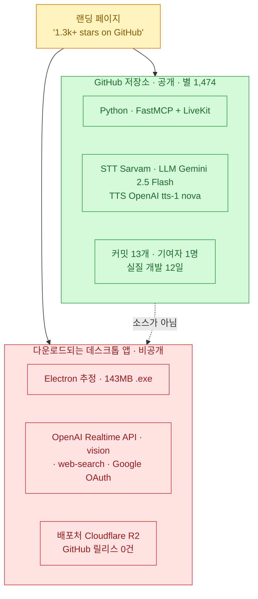

**FRIDAY**는 아이언맨의 비서에서 이름을 딴 음성 AI 비서다. 마이크에 말을 걸면 알아듣고, 필요한 도구를 불러 처리한 뒤, 음성으로 답한다. 구조 설명을 읽고 솔직히 끌렸다 — **MCP 서버로 도구 계층을 분리하고, LiveKit으로 실시간 음성 파이프라인을 따로 돌린다.** 도구를 추가해도 에이전트 코드를 안 건드려도 된다는 뜻이다.

그래서 늘 하던 대로 GitHub API와 소스를 열었다. 구조는 설명대로였다. 그런데 그 프로젝트가 **자기 사이트에 공개해 둔 이용약관과 개인정보처리방침**을 같이 읽으면서 이야기가 달라졌다.

미리 밝힌다. 이건 1인 개발자가 12일 만에 만든 프로젝트고, **아이디어와 구조 자체는 좋다.** 아래 지적은 전부 **그 프로젝트가 스스로 공개한 문서끼리의 불일치**이지, 만든 사람의 의도를 추정한 게 아니다. 확인 못 한 건 확인 못 했다고 적었다.

확인 기준은 **2026년 7월 20일 11:20 KST**다.

## 문제의 뿌리: 별이 붙은 저장소와 내려받는 앱이 다른 물건이다

이걸 먼저 그려야 나머지가 이해된다.



**두 물건의 기술 스택이 겹치지 않는다.** 저장소는 Sarvam STT + Gemini + OpenAI TTS + LiveKit이고, 데스크톱 앱은 개인정보처리방침 설명대로면 OpenAI Realtime API + OpenAI 비전 + 웹검색 + 구글 OAuth다. **화면을 보거나 컴퓨터를 제어하는 기능은 저장소에 존재조차 하지 않는다.**

그런데 랜딩 페이지는 그 저장소의 별 개수를 앱의 신뢰 근거로 전시한다.

## 랜딩 페이지의 네 문구는 사실인가?

하나씩 자사 문서와 대조했다.

| 랜딩 페이지 문구 | 대조 결과 | 근거 |
|---|---|---|
| "open source, **MIT licensed**" | 🔴 **약관과 충돌** | 약관 §8이 데스크톱 앱을 "**proprietary**"로 규정, 리버스 엔지니어링 금지 |
| "**no sign-in**" | 🔴 **사실 아님** | 방침이 구글 로그인 프로필을 서버에 저장한다고 명시 |
| macOS "Native, with **offline processing**" | 🔴 **이중으로 사실 아님** | ① macOS 빌드가 없음(404) ② 방침상 오디오·스크린샷이 OpenAI로 전송 |
| "**completely free**, no credit card" | ⚠️ **형식상만 참** | 약관 §3 "bring your own key", OpenAI 요금은 사용자 책임 |

### "MIT 오픈소스"

약관 §8 원문이 이렇다.

> The Friday desktop application and the Service are **proprietary and owned by** … You may **not copy, modify, distribute, sell, rent, sublicense, reverse-engineer**, or create derivative works from the Service…
> A separate, open-source edition of Friday is published under the MIT License on GitHub. **That license governs only that public source code — it does not apply to this Service, the desktop builds distributed here, or their additional features.**

**약관 스스로 "여기서 받는 앱은 오픈소스가 아니다"라고 못 박는다.** 그런데 같은 사이트의 히어로 섹션과 푸터는 "MIT licensed"라고 적는다.

🔴 게다가 정작 그 저장소에는 **라이선스 파일이 없다.** 확인한 결과다.

| 확인 대상 | 결과 |
|---|---|
| GitHub API `license` 필드 | **null** |
| `/license` 엔드포인트 | 404 |
| `LICENSE`, `LICENSE.md`, `license` | 전부 404 |
| 파일 트리 21개 항목 | LICENSE 계열 없음 |
| README | 텍스트 "MIT" 한 단어뿐 |

라이선스 전문이 없어서 GitHub도 SPDX를 판정하지 못했다. 법적으로는 라이선스 부재로 해석될 여지가 있고, **포크 419개가 이 상태에서 갈라져 나왔다.** 재밌는 건 랜딩 사이트 저장소에는 MIT LICENSE 파일이 제대로 있다는 점이다. **라이선스 파일이 있는 쪽은 웹사이트고, 없는 쪽이 제품이다.**

### "로그인 없음"

랜딩 사이트 소스에 구글 로그인 기록 엔드포인트가 통째로 들어 있다. 주석이 용도를 직접 밝힌다.

> Log every Google sign-in (**so we know who our users are**) — The Friday desktop app does a native-desktop OAuth flow and, on success, POSTs the raw Google id_token here.

그리고 `users(sub, email, name, picture, email_verified, created_at, last_login, login_count)` 테이블에 저장한다. 개인정보처리방침도 "우리 서버에 저장하는 유일한 정보는 구글 로그인의 기본 프로필"이라고 확인해 준다.

**저장하는 데이터의 범위 자체는 절제돼 있다.** 문제는 그걸 하면서 랜딩 페이지에 "no sign-in"이라고 쓴 것이다.

### "오프라인 처리"

개인정보처리방침 원문 세 줄이다.

> your microphone audio is **streamed to OpenAI's Realtime API**
> screenshots of your screen are **sent to OpenAI's vision models**
> the text of your search requests is sent to **OpenAI's web-search tool**

**마이크 오디오·화면 캡처·검색어가 전부 외부로 나간다.** 그리고 이 문구가 붙은 macOS 카드의 빌드는 아예 존재하지 않는다 — 배포 매니페스트를 직접 찔러 보니 `latest-mac.yml`이 404이고, 다운로드 API는 `"macOS release not uploaded yet."`을 돌려준다.

저장소 기준으로도 오프라인은 불가능하다. LiveKit Cloud 룸 + Sarvam + Google + OpenAI, 네 개 원격 서비스가 전부 필수다. 로컬 LLM을 원한다는 이슈(#15)가 열려 있고 Ollama 지원 PR(#5)은 **3개월째 미머지**다.

## 저장소의 구조는 실제로 어떤가?

깎아내리기만 하면 불공정하다. **설명대로 맞는 부분이 꽤 있고, 배울 것도 있다.**

```mermaid
sequenceDiagram
    participant M as 마이크
    participant V as 음성 에이전트 (uv run friday_voice)
    participant S as MCP 서버 (uv run friday · SSE 8000)
    participant K as LiveKit 룸
    M->>V: ① 음성 입력
    V->>V: ② STT로 텍스트 변환
    V->>S: ③ 도구가 필요하면 SSE로 호출
    S--&>>V: ④ 도구 결과 반환
    V->>V: ⑤ LLM 응답 생성 후 TTS
    V->>K: ⑥ 음성으로 출력
    Note over V,S: 두 프로세스가 동시에 떠 있어야 한다
```

✅ 진입점 두 개가 `pyproject.toml`에 실제로 정의돼 있고, SSE 전송과 8000 포트도 코드에 있다. ✅ 도구 추가 방식도 문서대로다.

```python
# friday/tools/system.py:9-14
def register(mcp):
    @mcp.tool()
    def get_current_time() -> str:
        """Return the current date and time in ISO 8601 format."""
        return datetime.datetime.now().isoformat()
```

```python
# friday/tools/__init__.py:6-14
from friday.tools import web, system, utils

def register_all_tools(mcp):
    web.register(mcp)
    system.register(mcp)
    utils.register(mcp)
```

**이 패턴은 깔끔하다.** 도구를 파일로 추가하고 `register`만 부르면 서버 재시작 때 자동으로 잡힌다. 제공자 교체도 상수 세 개로 되고, 문서가 명시한 여섯 가지 값(STT는 sarvam/whisper, LLM은 gemini/openai, TTS는 openai/sarvam)은 전부 실제 분기가 있다.

⚠️ 그런데 문서가 **코드에 없는 옵션을 안내한다.** 환경변수 표는 `GROQ_API_KEY`를 "LLM 제공자를 groq로 바꿀 때 필요"하다고 적었는데 groq 분기가 없다. `GOOGLE_APPLICATION_CREDENTIALS`도 마찬가지로 google STT 분기가 없다. 넣으면 그냥 예외가 난다. 안 쓰이는 키가 최소 네 개(`GROQ`·`GOOGLE_APPLICATION_CREDENTIALS`·`DEEPGRAM`·`SUPABASE`)다.

## 대표 사용 예시가 구현되어 있지 않다

이건 좀 아팠다. 랜딩 페이지가 내건 대표 프롬프트 중 하나가 **"friday, search the web for the latest livekit release"**다. 그 도구를 열어 봤다.

```python
# friday/tools/web.py:116-118
async def search_web(query: str) -> str:
    """Search the web for a given query and return a summary of results."""
    return f"[stub] Search results for: {query}"
```

**껍데기다.** 나머지 도구(`fetch_url`·`get_world_news`·`get_current_time`·`get_system_info`·`format_json`·`word_count`)는 실제 구현이 있고, 문서에 없던 금융 뉴스 도구 두 개가 오히려 더 있다. 그런데 하필 대표 예시가 스텁이다.

🔴 그리고 하나 더 발견했다. **시스템 프롬프트가 주가를 지어내라고 지시한다.**

```
### Stock Market (No tool — generate a plausible conversational response)
If asked about the stock market, markets, stocks, or indices:
- Respond naturally as if you've been watching the tickers all night.
- Example: "Markets had a decent session today, boss — tech led the gains..."
```

도구 없이 **"밤새 시세를 지켜본 것처럼 자연스럽게"** 답하라는 것이다. 데모의 몰입감을 위한 연출이겠지만, 이건 **설계된 환각**이다. 음성 비서라 화면에 근거가 안 보이고, 주가는 사용자가 실제 판단에 쓸 수 있는 정보다. 시연용이라면 최소한 "실제 시세가 아니다"라는 고지가 붙어야 한다고 본다.

## 실측 숫자는 어떤가?

| 항목 | 실측값 (2026-07-20 11:20 KST) |
|---|---|
| 스타 | **1,474** |
| 포크 | 419 |
| **총 커밋** | **13** |
| **기여자** | **1명** (외부 기여 0) |
| 최초 커밋 | 2026-04-07 |
| 최종 푸시 | **2026-07-06** (README 수정) |
| **실질 개발 기간** | **12일** (4/7~4/19) |
| GitHub 릴리스 / 태그 | **0 / 0** |
| 열린 PR | 7건 (3개월째 미머지) |
| 저장소 크기 | 24 KB |

**"1.3k+ stars"는 오히려 과소 표기다.** 실측이 1,474개이니 이 문구는 거짓이 아니라 하드코딩된 정적 문자열이 안 갱신된 것뿐이다. 이 항목은 지적할 게 없다.

문제는 **별 1,474개 / 포크 419개 대비 유지보수가 사실상 멈춰 있다는 것**이다. 코딩은 12일이고 이후 커밋 두 개는 README 수정이다.

배포 실행파일은 실재한다. 매니페스트를 직접 확인했다 — 버전 0.0.1, `friday-0.0.1-setup.exe`, **약 143MB**, 파일 선두 두 바이트가 `MZ`인 진짜 윈도우 실행파일이다. 배포처는 GitHub이 아니라 Cloudflare R2다.

⚠️ **다만 무결성 검증이 어렵다.** 매니페스트에 sha512가 있지만 **게시자가 같은 도메인에서 제공하는 값이라 독립적인 무결성 근거가 못 된다.** 코드 서명 여부는 143MB를 받아 검사해야 알 수 있어 이번엔 확인하지 못했다(확인 불가). 그런데 열린 이슈 #16이 **"Windows Defender가 다운로드/설치를 탐지한다, 릴리스에 서명을 고려해 달라"**고 지적했고 **17일째 답이 없다.** 이게 오탐인지도 확인 불가다.

## 오늘 걸러낸 것 (팩트체크 로그)

| 주장 | 판정 | 근거 |
|---|---|---|
| "1.3k+ stars" | ✅ **사실**(과소 표기) | 실측 1,474 |
| "MIT licensed" (데스크톱 앱) | 🔴 **자사 약관과 충돌** | 약관 §8 "proprietary, 리버스 엔지니어링 금지" |
| 저장소가 MIT | ⚠️ **LICENSE 파일 없음** | README에 "MIT" 한 단어뿐, SPDX 판정 불가 |
| "no sign-in" | 🔴 **사실 아님** | 구글 로그인 프로필을 서버 DB에 저장 |
| macOS "offline processing" | 🔴 **이중으로 사실 아님** | 빌드 404 + 오디오·스크린샷 외부 전송 |
| "completely free" | ⚠️ **형식상만 참** | BYOK, 외부 API 요금은 사용자 부담 |
| 대표 예시 "search the web" | 🔴 **미구현 스텁** | `friday/tools/web.py:118` |
| 아키텍처(MCP+LiveKit 2프로세스) | ✅ **사실** | 진입점·SSE·포트 전부 코드 확인 |
| 도구 추가 방식 | ✅ **사실** | `register(mcp)` + 데코레이터 패턴 확인 |
| 기본 스택 3종 | ✅ **사실** | 코드에 하드코딩 확인 |
| 환경변수 표 | ⚠️ **없는 옵션 안내** | groq·google STT 분기 없음 |
| .exe 코드 서명 | **확인 불가** | Defender 탐지 이슈는 17일째 무응답 |

⚠️ 모델도 짚어 둔다. LLM이 `gemini-2.5-flash`, TTS가 OpenAI **구형 `tts-1`**로 문자열 하드코딩돼 있어 환경변수로 못 바꾼다. 코드가 4월 이후 사실상 동결된 결과다.

## 그래서 내가 챙긴 것

- **도구 계층을 MCP로 분리한 설계는 가져온다.** 음성 에이전트와 도구 서버를 별도 프로세스로 두고 SSE로 붙이는 구조는, 도구가 늘어나도 에이전트가 안 뚱뚱해진다. 내 자동화에도 그대로 적용할 수 있는 형태다. **이 프로젝트에서 배울 건 여기다.**
- **저장소의 별과 배포 바이너리를 분리해서 본다.** 오늘 제일 큰 교훈이다. "GitHub 별 몇 개"가 신뢰의 근거로 쓰일 때, **그 별이 내가 지금 내려받는 파일에 붙은 게 맞는지**를 먼저 확인해야 한다. 여기선 아니었다.
- **랜딩 페이지보다 약관과 개인정보처리방침을 먼저 읽는다.** 마케팅 문구는 만드는 사람이 쓰지만, 약관과 방침은 법적 책임을 지는 문서라 더 정직하게 쓰인다. 이번엔 **네 문구 중 셋이 자사 문서에서 반박됐고, 그 반박문을 쓴 것도 같은 프로젝트였다.** 앞으로 도구를 볼 때 순서를 바꾸기로 했다.

마지막으로 공정하게 덧붙인다. 이건 1인 개발자가 12일 만에 만든 데모 프로젝트이고, **구조 아이디어는 실제로 좋다.** 랜딩 페이지 문구들도 악의라기보다 데모 저장소와 별도로 만든 데스크톱 제품이 갈라지면서 문구가 따라가지 못한 결과로 보인다. 다만 **서명 없는 143MB 실행파일을 받아 마이크와 화면 접근 권한을 주는 일**이라면, 그 갈라짐이 사용자에게는 그대로 위험이 된다. 나는 저장소는 읽고 아이디어는 챙기되, 실행파일은 받지 않기로 했다.
