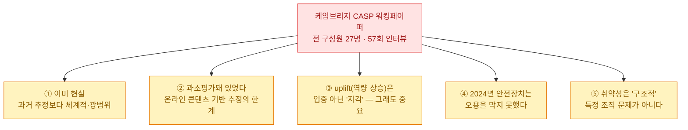
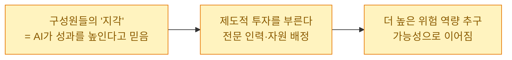

오늘 낮에 [[gpt-5-6-model-guidance-prompt-diet-and-agent-skills|GPT-5.6 가이드]]를 정리하며 "실시간 사이버·생물학 오용 분류기"라는 안전장치 얘기에 밑줄을 그었다. 그때 든 질문 — **프런티어 랩들은 왜 응답 생성 도중에 출력을 실시간으로 검열하는, 비용도 지연도 큰 장치를 굳이 넣을까?** 그 답의 절반쯤을, 누가 나에게 검토를 부탁한 케임브리지대 보고서에서 봤다.

먼저 분명히 해 둔다. 이 글은 **방어·정책 관점의 논평**이다. 원 보고서에는 무기·탈옥·물질 관련 구체 서술이 있지만, **그런 조작 가능한 내용은 이 글에서 전부 의도적으로 뺐다.** 여기서 다루는 건 "그래서 만드는 쪽·규제하는 쪽·막는 쪽은 무엇을 해야 하나"뿐이다.

## 이 보고서는 무엇인가?

**케임브리지대 AI 과학·정책 프로그램(CASP)**의 프런티어 AI 워킹페이퍼(Antonia Juelich, 2026)다. 저자는 2025\~2026년에 걸쳐 나이지리아 북동부에서 **활동 조직 전(前) 구성원 27명을 57회 대면 인터뷰**해, "이 조직이 AI를 쓰는가, 쓴다면 어떻게 쓰는가"를 물었다. 결과는 **활동 중인 조직의 프런티어 AI 사용에 대한 첫 현장 증거**다.

## 왜 그동안 과소평가돼 있었나?

이게 방법론적으로 가장 중요한 대목이라고 봤다. **기존 평가는 대체로 '온라인에 올라온 콘텐츠'를 근거로** 삼았다. 그 렌즈로 보면 극단주의 지지자들의 AI 활용은 느리고, 주로 선전물 제작에 그치는 것처럼 보였다. 그런데 이 연구는 **현장 인터뷰**라는 다른 렌즈를 댔고, 실제 활용이 훨씬 더 넓고 조직적이었다는 결론에 닿았다.

교훈은 도구 자체를 넘어선다. **관측 방법이 관측 결과를 규정한다.** 공개된 흔적(SNS·포럼)만 보면 위협을 과소평가하기 쉽다 — 정작 민감한 활동은 흔적을 안 남기기 때문이다. 이건 내가 [[parsing-korean-public-docs-pdf-hwp-to-markdown-reindexing|공개 데이터와 'AI가 읽을 수 있는' 데이터는 다르다]]고 적었던 얘기의 어두운 버전이다 — **'보이는 것'과 '실제'의 간극.**

## 'uplift(역량 상승)'는 정말 입증됐나?

여기서 저자는 대단히 신중하다. 그리고 나는 그 신중함이 이 보고서의 신뢰도를 높인다고 봤다. 인터뷰이들은 AI로 "정확도가 올랐다"고 느꼈다고 진술한다. 하지만 저자는 **이 '역량 상승(uplift)'이 결론적으로 입증된 것은 아니다**라고 못박는다.

핵심 통찰은 이거다 — **입증 여부와 별개로, '지각' 그 자체가 동력이 된다.** "AI가 우리를 더 잘하게 한다"는 믿음이 서면, 조직은 거기에 사람과 돈을 붓고, 그 투자가 다시 더 위험한 방향의 추구로 이어질 수 있다. 그래서 "실제로 얼마나 강해졌나"를 정밀히 재는 것과 별개로, **믿음의 방향** 자체를 위협 지표로 봐야 한다는 것이다. 데이터를 다루는 사람으로서 "지각과 실측을 분리해 다루라"는 이 태도가 특히 인상적이었다.

## 2024년의 안전장치는 왜 막지 못했나?

보고서가 다루는 시기(대체로 2024년까지)에는 **당시의 안전장치가 오용을 실질적으로 막지 못했다**고 기록한다. 계정을 여러 제공사에 걸쳐 두면 한 곳의 거부·정지가 큰 걸림돌이 되지 않았다는 것이다. 다만 저자는 **"더 최근의 안전장치 업데이트가 더 큰 장애물이 되는지는 알 수 없다"**고 분명히 단서를 단다.

바로 이 지점이 오늘 정리한 [[gpt-5-6-model-guidance-prompt-diet-and-agent-skills|GPT-5.6]]과 정면으로 맞물린다. GPT-5.6은 **출력 생성 도중 실시간으로 도는 사이버·생물학 오용 분류기**를 넣었고, 그 때문에 정당한 이중용도(dual-use) 작업까지 가끔 느려지거나 개입받는다고 공식 가이드가 밝힌다. 왜 그 비용을 감수할까? 이 보고서가 그리는 **"안전장치 대 우회"의 군비경쟁**이 그 배경이다.

> ⚠️ 균형을 위해. 보고서는 최근 안전장치의 효과를 **평가하지 않았다**(시기 밖). 그러니 "요즘 모델도 못 막는다"는 결론으로 넘기면 과장이다. 반대로 "이제 다 막힌다"도 근거가 없다. 정확한 독법은 **"막는 쪽과 뚫는 쪽이 계속 겨루는 중이고, 최근 라운드의 승패는 아직 데이터가 없다"**이다.

## 진짜 핵심 — 취약성은 '구조적'이다

내가 이 보고서에서 가장 오래 붙든 문장은 이거다. **취약성은 특정 조직에 고유한 것이 아니라 구조적이다.** 이 조직이 자원이나 정교함에서 예외적이어서 가능했던 게 아니라는 뜻이다. 초국가적 네트워크가 확산을 가속했지만 그것이 전제조건은 아니고, **도구는 공개돼 있으며 진입 장벽이 낮다.**

그래서 저자의 결론이 단단하다 — **잘 기록된 단 하나의 사례만으로도 이걸 '현재의 보안 문제'로 다루기에 충분하다.** 일반화가 필요 없다는 것이다. 특정 집단의 특수 사건이 아니라, **공개된 프런티어 도구가 존재하는 한 누구에게나 열려 있는 구조**이기 때문이다.

## 그래서 누가 무엇을 해야 하나?

보고서가 방어 진영에 넘기는 숙제는 명확하다.

| 주체 | 해야 할 일 |
|---|---|
| **AI 개발자** | 현재의 안전 아키텍처가 '고립된 개별 사용자'가 아니라 **조직화된 적대자**에게도 견디는지 재평가 |
| **정책결정자** | 테러 목적 AI 채택을 **현재진행형 국가안보 사안**으로 취급 |
| **정보·수사기관** | 진화하는 위협을 **모니터링·차단** |
| **모두 함께** | 공유 방법론·정보공유 채널·공동 대응 마련 |

저자는 마지막에 뼈아픈 질문을 던진다 — *"그런 협력이 지금 문제의 규모에 걸맞은 수준으로 존재하는가?"* 개별 랩의 분류기(공급 측)만으로는 부족하고, 안전은 **모델 밖의 사회적·제도적 층위**까지 걸쳐야 한다는 얘기다.

## 한계도 정확히 — 자기보고의 불확실성

책임 있게 읽으려면 이것도 함께 봐야 한다. 이 연구는 **자기보고(self-report) 인터뷰**에 기반한다. 과장·축소가 섞일 수 있고, 저자도 응답자 간 교차검증과 2차 자료 대조를 시도했지만 주제의 민감성과 접근의 어려움 때문에 **늘 가능하진 않았다**고 인정한다. 즉 "AI가 이만큼 강하게 만들었다"를 실측한 문서가 아니라, **"활용이 실재하고, 지각된 효용이 투자를 낳고 있다"를 보인 질적 증거**로 읽는 게 맞다.

## 내 생각 — 방어자의 렌즈로

이 보고서를 검토하며 세 가지가 남았다. 첫째, **이중용도(dual-use)의 무게.** 같은 능력이 보안 연구·방어에도 쓰이고 오용에도 쓰인다. 그래서 안전장치는 '전부 차단'이 아니라 **정당한 작업을 살리면서 오용만 거르는** 어려운 균형일 수밖에 없다 — GPT-5.6이 "정당한 작업엔 접근을 유지한다"고 굳이 밝힌 이유다. 둘째, **관측의 함정.** 공개 흔적만 보면 위협도 기회도 과소평가한다. 데이터쟁이로서 "보이는 데이터가 전부가 아니다"를 다시 새겼다. 셋째, **문제의 층위.** 이건 모델 하나 잘 만든다고 닫히는 문제가 아니라, 개발·정책·수사가 함께 붙어야 하는 문제다.

그래서 나는 이 논문에서 **"어떻게 오용하나"가 아니라 "왜 방어를 사회 전체의 문제로 봐야 하나"**를 가져간다. 오늘 GPT-5.6이 비싼 실시간 분류기를 넣은 것도, 결국 이런 현실에 대한 공급 측 응답의 한 조각일 것이다. 남은 건 그 조각들을 잇는 협력이다.

## 참고자료

- 원 보고서: Antonia Juelich, *Frontier AI Working Paper Series No. 1/2026*, **Cambridge Programme on AI Science & Policy (CASP)**, University of Cambridge (2026). — 본 글은 요약·관찰/시사점 등 **분석·정책 섹션만** 근거로 하며 조작 가능한 구체 내용은 의도적으로 배제.
- 관련(내 글): [[gpt-5-6-model-guidance-prompt-diet-and-agent-skills|GPT-5.6 — 실시간 오용 분류기와 안전 스택]] · [[parsing-korean-public-docs-pdf-hwp-to-markdown-reindexing|공개돼 있다 ≠ 읽을 수 있다]]

<!-- 안전: 회사 실데이터·PII·자격증명 없음. 테러·무기·탈옥·CBRN 등 조작 가능한 구체 기법/수치/인용은 의도적으로 전부 배제하고, 학술 보고서의 고수준 분석·정책·방어 시사점만 논평. 목적은 오용 확산이 아니라 방어·정책 논의. 원 보고서의 민감 섹션(무기·물질 관련)은 인용·재구성하지 않음. -->
