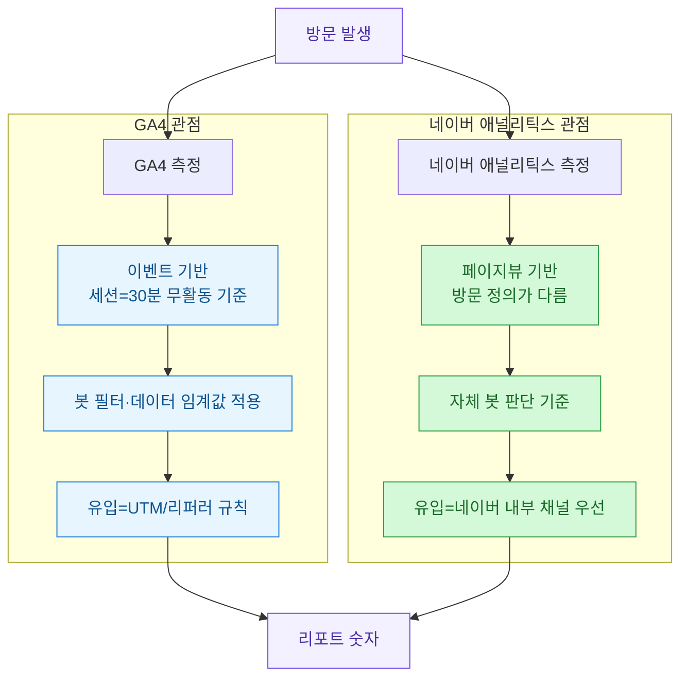
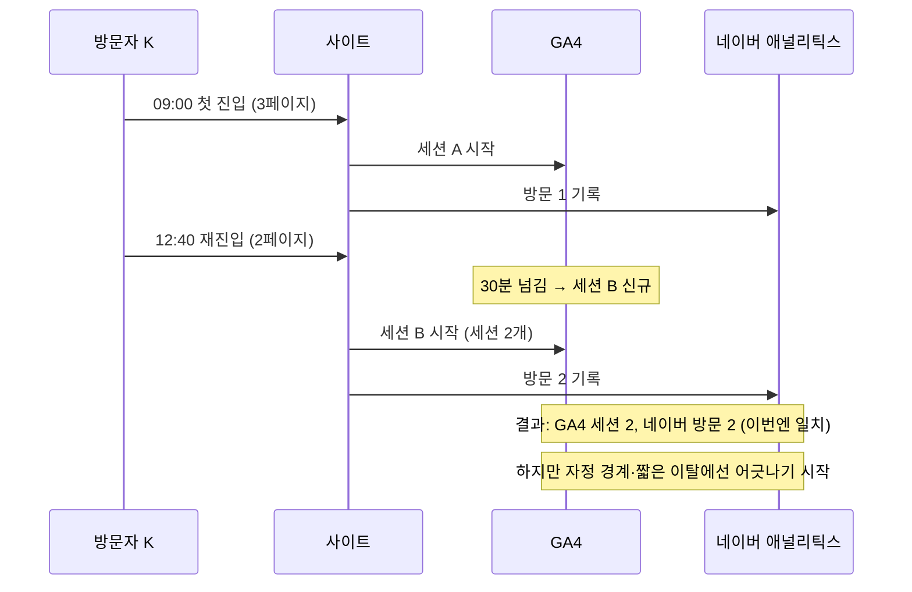
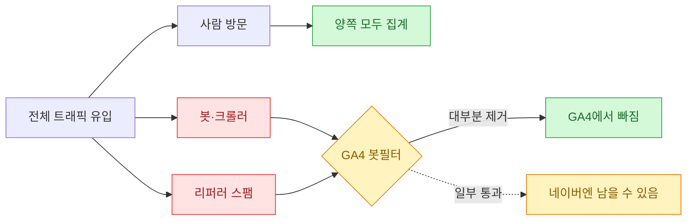
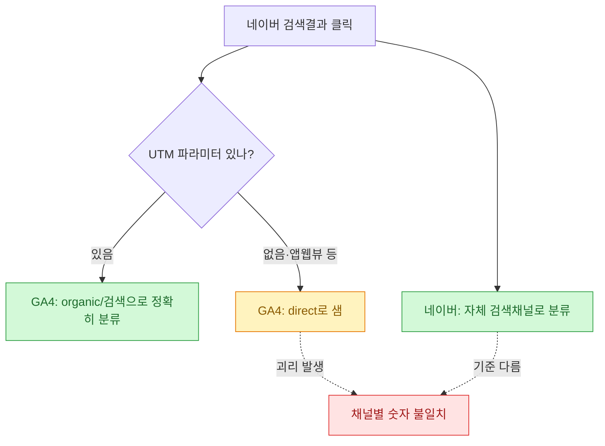
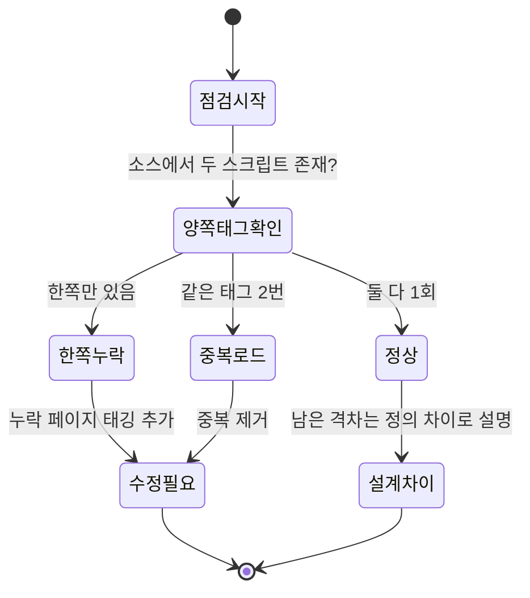
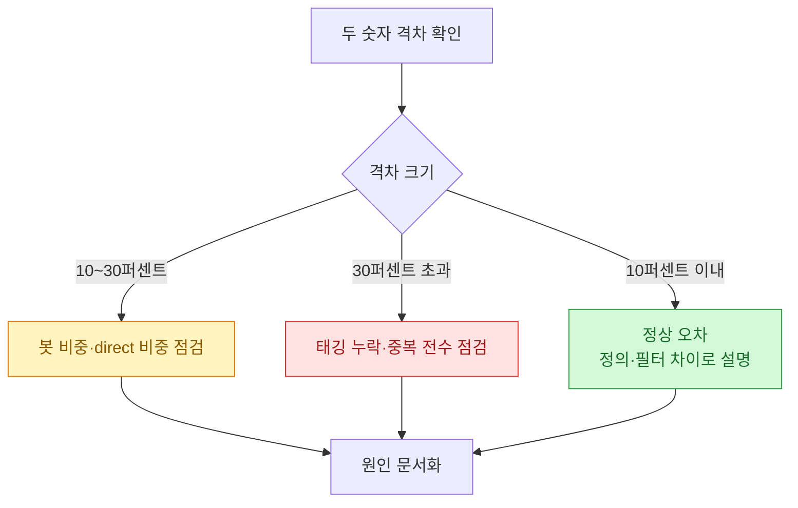

리포트를 정리하다 보면 매번 같은 질문을 받는다. "GA에서는 어제 방문자 1,000명인데 네이버 애널리틱스는 1,240명이래요. 뭐가 맞는 거예요?" 처음엔 나도 둘 중 하나가 틀렸다고 생각했다. 그런데 몇 번 파보고 나니, 둘 다 맞고 둘 다 틀렸다는 게 정답에 가깝다는 걸 알게 됐다. 두 도구는 애초에 **다른 자를 들고 같은 방을 재고 있다**.

이 글은 그 "다른 자"가 정확히 뭐가 다른지, 숫자가 안 맞을 때 어디부터 봐야 하는지를 체크리스트로 정리한 기록이다. 아래 표·도식·수치는 전부 **합성(더미) 데이터**다. 특정 사이트의 실제 트래픽이 아니라, 흔히 나타나는 패턴을 재현한 예시라는 점을 먼저 밝혀둔다.

## 왜 애초에 숫자가 다를 수밖에 없나?

두 도구는 데이터를 수집하는 방식부터 세는 단위, 필터링 기준이 다르다. 같은 방문 하나를 두고도 "이건 셀까 말까"를 다르게 판단한다.



핵심은 이거다. 두 숫자가 다른 건 버그가 아니라 **설계 차이의 자연스러운 결과**인 경우가 대부분이다. 문제는 "정상적인 설계 차이"와 "진짜 태깅이 잘못된 오류"를 구분하는 일이다.

## 세션과 방문을 각자 어떻게 세는가?

가장 큰 차이는 "한 사람의 한 번 방문"을 어떻게 하나로 묶느냐다. 같은 사용자가 아침에 한 번, 점심에 한 번 들어왔을 때 이걸 방문 1로 볼지 2로 볼지가 도구마다 다르다.

| 구분 | GA4 (예시) | 네이버 애널리틱스 (예시) |
|---|---|---|
| 세는 단위 | 세션(이벤트 묶음) | 방문(페이지뷰 묶음) |
| 세션 종료 기준 | 30분 무활동 시 종료 | 도구 자체 기준(대체로 30분대) |
| 자정 넘김 | 날짜 경계에서 분리되는 경우 있음 | 처리 방식이 다를 수 있음 |
| 재방문 처리 | 같은 사용자 식별 후 세션 분리 | 방문 단위로 재계산 |

같은 하루를 두고도 "세션 수"와 "방문 수"는 정의가 다르니, 이 둘을 나란히 놓고 "왜 안 맞냐"고 묻는 것 자체가 사과와 오렌지를 비교하는 셈이다. 비교하려면 최소한 **같은 성격의 지표끼리** 놓아야 한다. 아래는 합성 데이터로 만든 하루치 예시다.



## 봇과 리퍼러 스팸이 숫자를 얼마나 부풀리나?

숫자가 크게 벌어질 때 첫 번째로 의심하는 게 봇 트래픽이다. GA4는 알려진 봇·스파이더를 자동으로 걸러내는 필터가 기본으로 켜져 있지만, 네이버 애널리틱스는 판단 기준이 다르다. 그래서 봇이 많은 날엔 한쪽만 숫자가 붕 뜨는 일이 생긴다.



간단한 진단으로, 유입 로그(합성)에서 봇으로 의심되는 비중이 얼마나 되는지 훑어보는 코드다. user-agent 문자열과 비정상적으로 짧은 체류를 신호로 삼는다.

```python
import pandas as pd

# 합성(더미) 데이터: 실제 트래픽 아님
logs = pd.DataFrame({
    "ua": ["Mozilla/5.0 ...", "python-requests/2.31", "Mozilla/5.0 ...",
           "SomeCrawler/1.0", "Mozilla/5.0 ...", "curl/8.4", "Mozilla/5.0 ..."],
    "dwell_sec": [42, 0, 88, 1, 30, 0, 55],
    "referrer": ["naver.com", "spam-ref.example", "google.com",
                 "-", "instagram.com", "spam-ref.example", "-"],
})

bot_hint = ("requests|crawler|curl|spider|bot")
logs["suspect_bot"] = (
    logs["ua"].str.contains(bot_hint, case=False)   # 봇스러운 UA
    | (logs["dwell_sec"] <= 1)                       # 체류 1초 이하
    | logs["referrer"].str.contains("spam", case=False)  # 스팸 리퍼러
)

total = len(logs)
suspect = int(logs["suspect_bot"].sum())
print(f"전체 {total}건 중 봇 의심 {suspect}건 "
      f"({suspect/total:.0%})")
# 예시 출력: 전체 7건 중 봇 의심 3건 (43%)
```

이 43퍼센트라는 숫자 자체는 합성 예시라 의미가 없지만, 요점은 **한쪽 도구만 이 3건을 빼고 세면 그만큼 차이가 벌어진다**는 것이다. 두 숫자의 격차가 대략 이 봇 비중과 맞아떨어지면, 원인의 상당 부분을 봇으로 설명할 수 있다.

## 유입 채널이 왜 서로 다르게 잡히나?

방문자 총량보다 더 자주 어긋나는 게 "어디서 들어왔나"다. 특히 네이버는 자사 서비스에서 온 유입을 자기 기준으로 세밀하게 분류하고, GA4는 UTM 파라미터와 리퍼러 규칙을 따른다. 그래서 같은 방문이 한쪽에선 "네이버 검색", 다른 쪽에선 "직접 유입(direct)"으로 잡히곤 한다.



특히 모바일 앱 내 웹뷰나 인앱 브라우저에서 넘어오는 유입은 리퍼러가 비거나 뭉개져서 GA4에서 direct 비중을 부풀리는 대표적 원인이다. 리포트에서 direct가 유난히 크다면 이걸 먼저 의심한다.

## 태깅이 정말 빠진 건 아닌지 어떻게 확인하나?

여기까지가 "정상적인 차이"라면, 진짜 오류인 경우도 있다. 특정 페이지에 측정 스크립트가 하나만 심겨 있거나, 한쪽 태그가 중복 로드되거나, 특정 템플릿에서 태그가 통째로 빠진 경우다. 이건 설계 차이가 아니라 고쳐야 할 버그다.



전수로 확인하기 어려우니, 주요 URL 목록을 받아 두 태그가 각각 몇 번 로드되는지 훑는 간단한 점검 스크립트를 쓴다. 아래도 합성 데이터 기준 예시다.

```python
# 합성(더미) 데이터: 페이지별 태그 로드 점검 결과 예시
pages = [
    {"url": "/",          "ga4": 1, "naver": 1},
    {"url": "/event",     "ga4": 1, "naver": 0},  # 네이버 태그 누락 의심
    {"url": "/product/a", "ga4": 2, "naver": 1},  # GA4 중복 로드 의심
    {"url": "/guide",     "ga4": 1, "naver": 1},
]

for p in pages:
    issues = []
    if p["ga4"] == 0:      issues.append("GA4 누락")
    if p["naver"] == 0:    issues.append("네이버 누락")
    if p["ga4"] > 1:       issues.append("GA4 중복")
    if p["naver"] > 1:     issues.append("네이버 중복")
    verdict = ", ".join(issues) if issues else "정상"
    print(f'{p["url"]:<14} -> {verdict}')

# 예시 출력:
# /              -> 정상
# /event         -> 네이버 누락
# /product/a     -> GA4 중복
# /guide         -> 정상
```

이렇게 페이지 단위로 "누락"과 "중복"만 걸러내도, 리포트 격차의 진짜 원인이 설계 차이인지 태깅 버그인지 상당히 갈린다.

## 그래서 어디까지가 정상 오차인가?

경험적으로, 두 도구의 총량 차이가 대략 10\~20퍼센트 안쪽이면 위에서 설명한 정의·필터 차이로 대체로 설명이 된다. 그보다 크게 벌어지면 봇 유입이 몰렸거나 태깅에 실제 구멍이 있을 가능성이 높다. 아래는 판단 흐름을 요약한 것이다. 수치 기준은 합성 예시이며 사이트마다 다르다.



## 리포트에 뭐라고 써야 오해가 안 생기나?

내가 내린 결론은, 두 숫자를 억지로 하나로 맞추려 하지 말자는 것이다. 대신 리포트에 **어느 도구를 기준(single source of truth)으로 삼는지**를 명시하고, 다른 도구의 숫자는 참고값으로 병기하는 편이 훨씬 덜 혼란스럽다. "왜 다르냐"는 질문에는 "정의가 다르다"는 답을 미리 각주로 달아둔다.

핵심 3줄로 정리한다.

- 두 도구는 세션/방문 정의, 봇 필터, 유입 분류 기준이 달라서 **숫자가 다른 게 정상**이다.
- 격차가 크면 봇 비중과 direct 비중, 그리고 태그 누락/중복을 순서대로 점검한다.
- 리포트는 기준 도구 하나를 정하고 나머지는 참고값으로 병기해 오해를 줄인다.

같은 방을 두 개의 자로 재고 있다는 사실만 팀이 공유해도, "누가 맞냐"는 소모적인 논쟁의 절반은 사라진다.
