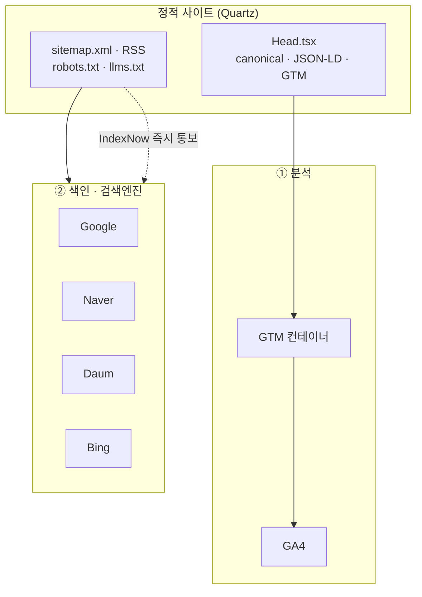
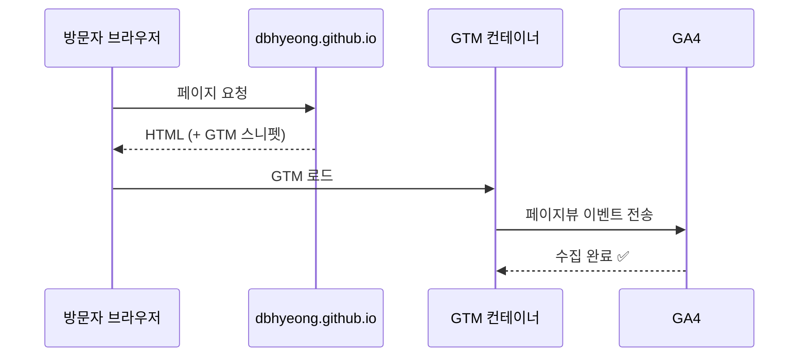
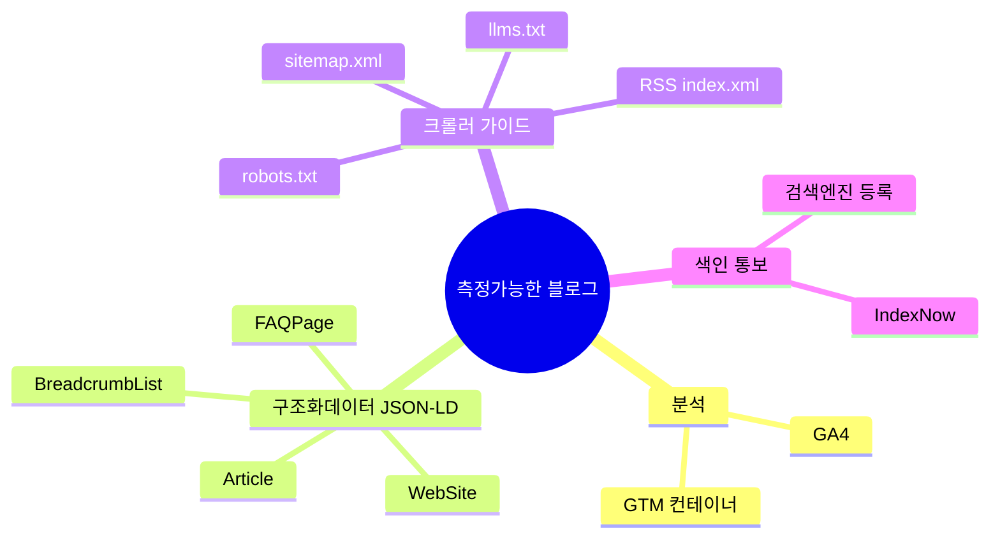
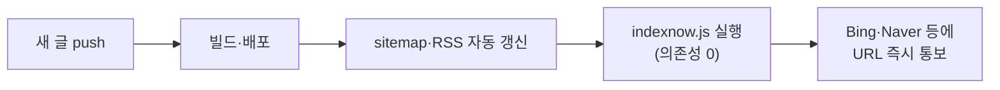
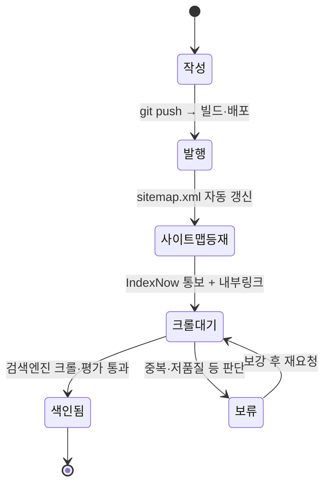

[이전 글](build-tech-blog-with-quartz-github-pages)에서 Quartz로 블로그를 0원에 만들었다. 그런데 글을 몇 개 올리고 나니 **답답한 게 하나 있었다 — 이게 읽히긴 하나?** 방문자가 있는지, 검색에 뜨는지, 새 글이 며칠 만에 색인되는지 전부 깜깜이였다.

그래서 사이트를 **"측정 가능한" 블로그**로 바꿨다. 크게 두 갈래였다. **(1) 분석** — 누가 얼마나 보는지 GTM·GA4로 재고, **(2) 색인** — 검색엔진에 등록하고 새 글을 IndexNow로 즉시 알리는 것. 이 글은 그 셋업 기록이다.

## 전체 그림 — '측정 가능한 블로그'의 두 갈래



> 왼쪽 사이트는 빌드 때 **자동 생성**되는 것들(sitemap·RSS·구조화데이터)이고, 내가 한 일은 **오른쪽 둘을 연결**한 것이다. 이 글은 그 연결선을 하나씩 푼다.

## 방문자 1명이 GA4에 잡히기까지는?

먼저 분석. 두 도구를 썼는데 역할이 다르다.

- **GA4(Google Analytics 4)** — 방문·체류·유입경로를 재는 **분석 도구**.
- **GTM(Google Tag Manager)** — 분석·광고 같은 **태그들을 코드 수정 없이 관리하는 "리모컨"**. GA4를 페이지에 직접 박지 않고 **GTM을 통해** 얹었다.



### 왜 GA4를 직접 안 박고 GTM을 거쳤나?

처음엔 "그냥 GA4 코드 한 줄 넣으면 되지 왜 두 개나?" 싶었다. 그런데 **나중에 이벤트(스크롤·클릭·검색 등)를 추가하거나 다른 태그를 붙일 때**, GTM이 있으면 **사이트를 다시 빌드·배포할 필요가 없다.** GTM 웹 콘솔에서 태그만 켜고 끄면 된다. 정적 사이트(빌드가 필요한 구조)에선 이 "코드 재배포 없이 태그 관리"가 특히 이득이었다.

GTM 스니펫은 Quartz의 커스텀 `Head` 컴포넌트에 직접 넣었다. (실제 컨테이너 ID는 플레이스홀더로 표기 — 이 값 자체는 클라이언트에 공개되는 ID지만, 예시는 더미로.)

```html
<!-- Head.tsx 안에 삽입: GTM이 그 안에서 GA4를 로딩 -->
<script>(function(w,d,s,l,i){ /* GTM 표준 스니펫 */ })
  (window,document,'script','dataLayer','GTM-XXXXXXX');</script>
```

## 검색엔진엔 어떻게, 어디에 등록했나?

분석이 "방문 후"를 본다면, 색인은 "방문 전" — **검색에 떠야 방문이 생긴다.** 네 곳에 소유 확인 후 사이트맵을 제출했다.

| 검색엔진 | 소유 확인 방식 | 비고 |
|---|---|---|
| Google | Search Console (메타태그/도메인) | 사이트맵·URL 검사·색인 요청 |
| Bing | Webmaster Tools | IndexNow 기본 지원 |
| Naver | 서치어드바이저 | 크롤러 **Yeti** 허용 필요 |
| Daum | 검색등록 | robots에 인증 **PIN** 명시 |

크롤러를 막지 않으려고 `robots.txt`도 손봤다 — **검색 크롤러와 (선택적으로) AI 크롤러를 허용**하고, 네이버 Yeti·다음 인증을 넣고, 사이트맵 위치를 알렸다.

```
User-agent: *
Allow: /
Sitemap: https://example.com/sitemap.xml
# Naver Yeti, Daum 인증 PIN 등 검색엔진별 항목 추가
```

## 검색엔진이 글을 더 잘 이해하게 하려면? (구조화 데이터)

검색엔진은 사람처럼 글을 "읽는" 게 아니라 **구조화된 신호(JSON-LD)** 를 본다. 그래서 빌드 때 **schema.org 구조화 데이터를 자동 생성**하도록 했다. 어떤 신호들을 깔았는지 분류해 보면:



> **JSON-LD**란? 페이지 안에 숨겨두는 **"이 페이지는 이런 내용이에요"라는 기계용 설명표**다. 예컨대 `Article`(글 제목·작성일), `BreadcrumbList`(현재 위치 경로), `FAQPage`(질문형 H2를 Q&A로) 같은 것. 이게 있으면 검색결과에 **리치 스니펫**(별점·FAQ 펼침 등)으로 더 눈에 띌 수 있다. 그래서 이 블로그는 **H2 소제목을 질문형(`~?`)** 으로 쓴다 — 그게 자동으로 FAQ 구조화 데이터가 된다.

`llms.txt`도 추가했는데, 이건 **AI(LLM)에게 사이트 핵심을 요약해 주는** 비교적 새 규약이다. 검색을 넘어 "AI 답변에 인용되기(GEO/AEO)"까지 염두에 둔 장치다.

## 새 글이 검색에 '빨리' 뜨게 하려면? (IndexNow)

사이트맵만 제출하면 검색엔진이 **자기 주기에 맞춰 천천히** 와서 긁는다. 새 글이 며칠씩 안 잡히기도 한다. 이걸 앞당기려고 **IndexNow**를 붙였다 — 새 글을 올리는 즉시 검색엔진에 **"이 URL 새로 생겼어, 와서 봐"라고 핑(ping)** 을 쏘는 방식.



키 파일 하나를 사이트 루트에 올려두고(IndexNow 규약상 **공개되는 키**다), 발행 후 스크립트로 URL을 통보한다.

```bash
# 의존성 0짜리 통보 스크립트 (키는 사이트 루트에 호스팅)
node indexnow.js https://example.com/blog/새글
```

> ⚠️ **솔직한 한계**: "통보 200 OK"는 **"접수"** 일 뿐 **"색인 보장"이 아니다.** 구글의 색인 제출 API도 공식적으론 `JobPosting`·`BroadcastEvent` 용도라, 일반 글은 결국 **사이트맵 + 내부링크 + 시간**으로 색인된다. IndexNow는 "더 빨리 발견되게" 돕는 것이지 순위를 올리는 마법이 아니다. 핵심 글은 그냥 Search Console에서 **수동 색인 요청**하는 게 제일 확실했다.

## 그래서 글 하나는 어떤 상태들을 거쳐 색인되나?

위 과정을 글 한 편의 **생명주기**로 그리면 이렇게 된다.



이 상태도를 그리고 나서야 **"내가 손댈 수 있는 구간"과 "기다려야 하는 구간"** 이 분명해졌다. 발행~사이트맵 등재까지는 자동·즉시지만, **크롤대기 → 색인됨**은 검색엔진의 몫이라 조급해할 필요가 없다는 걸 받아들이게 됐다.

## 측정은 어떻게 자동으로 뽑나?

마지막으로, 매번 콘솔을 들여다보기 싫어서 **데이터를 코드로 뽑는 작은 툴킷**을 만들었다. 서비스 계정으로 인증해 GSC·GA4·GTM·IndexNow를 스크립트로 호출한다. (인증 키 파일은 **절대 저장소에 안 올린다** — `.gitignore`로 차단.)

```bash
# 예: 검색 성과·GA4 리포트를 CLI로 (키는 환경변수/플래그로 주입)
python gsc_report.py --site https://example.com --days 28
python ga4_report.py --property <GA4_PROPERTY_ID>
```

이 GSC 호출은 나중에 **Claude Code에 MCP로 붙여**, 에이전트가 검색 성과를 직접 보고 SEO 작업을 하게 만들었다. (그 이야기는 [[claude-code-mcp-servers-github-pat-oauth-dcr-fix|MCP 서버 붙인 기록]]에서.)

## 배운 점

블로그를 "만든 것"과 "측정 가능하게 만든 것"은 완전히 다른 일이었다. 만드는 건 하루, **측정 붙이는 건 GTM·구조화데이터·색인 통보까지 여러 조각을 맞추는** 일이었다.

- **분석과 색인은 별개**다. GA4는 "온 사람"을, 검색 등록·IndexNow는 "올 사람"을 다룬다. 둘 다 있어야 깜깜이가 풀린다.
- **자동으로 굽는 것(sitemap·RSS·JSON-LD)과 내가 연결하는 것(GTM·등록·통보)을 구분**하니 할 일이 명확해졌다.
- **색인은 못 서두른다.** "통보 = 색인"이 아니라는 걸 인정하고, 핵심 글만 수동 색인 요청하는 게 정신건강에 좋았다.

---

> 같이 보면 좋은 글: [[build-tech-blog-with-quartz-github-pages|Quartz로 기술 블로그 0원에 만든 기록]] · [[plaintext-md-llm-knowledge-vault|벡터DB 없이 만든 평문 MD 지식볼트]] · 내 소개는 [[about]].

*위 셋업·한계는 전부 실제 작업 그대로이며, 컨테이너/측정 ID·키는 모두 플레이스홀더로 바꿨습니다. 각 검색엔진·GA4·IndexNow의 정책은 추후 바뀔 수 있어요.*
