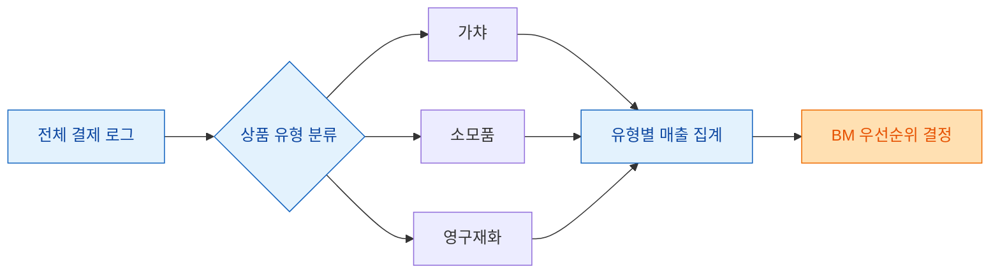
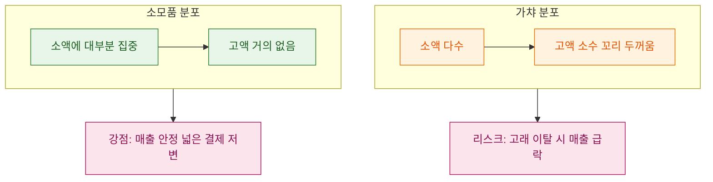
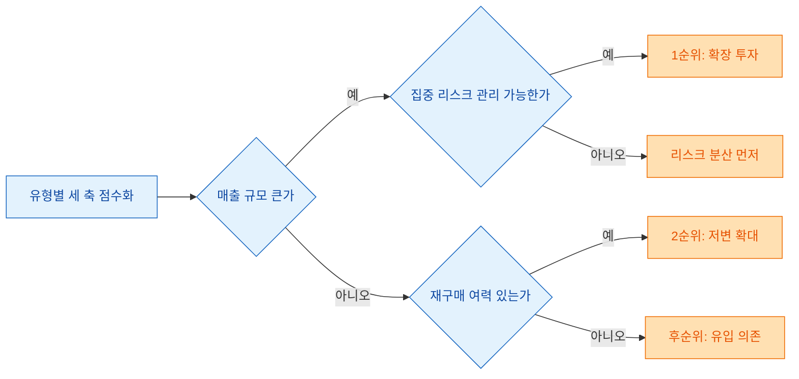

> "다음 분기에 뭘 먼저 만들까요?" 이 한 질문에 감이 아니라 매출 분포로 답하는 게 내 일이다.

기획 회의 때 가장 자주 나오는 말이 있다. "이번엔 가챠를 하나 더 뽑을까요, 아니면 소모품 라인을 늘릴까요?" 개발 리소스는 한정돼 있고, 하나를 고르면 다른 하나는 다음 분기로 밀린다. 나는 데이터 분석가로서 이 선택을 감이 아니라 **매출 분포**로 풀어내는 일을 한다. 오늘은 상품을 세 유형으로 나눠, 각각이 실제로 얼마나 벌고 어떤 유저가 사는지를 보고 BM 우선순위를 정하는 과정을 정리해 본다. 참고로 아래 숫자는 전부 설명용 더미다. 실제 게임 데이터가 아니다.

## 상품을 왜 세 유형으로 나누나?

게임 안 상품은 수백 종이라도, 매출 관점에서는 크게 세 통에 담긴다.

| 유형 | 정의(쉽게) | 대표 예시 | 소비 성격 |
|------|-----------|-----------|-----------|
| 가챠(뽑기) | 확률로 결과가 정해지는 상품 | 캐릭터/장비 뽑기 | 반복·확률형 |
| 소모품 | 쓰면 없어지는 상품 | 재화 회복약, 강화 재료 | 반복·소진형 |
| 영구재화 | 한 번 사면 계속 남는 상품 | 코스튬, 편의 기능 해제 | 일회·영구형 |

이렇게 묶는 이유는 셋의 **매출 리듬이 완전히 다르기** 때문이다. 가챠는 신규 상품이 나올 때 폭발했다가 가라앉고, 소모품은 유저가 게임을 하는 한 잔잔하게 계속 팔린다. 영구재화는 한 번 사면 재구매가 없어서 신규 유입에 매출이 묶인다. 리듬이 다르면 "다음에 뭘 만드느냐"의 답도 달라진다.

## 파이 차트로 뭘 먼저 보나?

가장 먼저 그리는 건 단순한 파이 차트다. "지난 분기 총매출을 세 유형이 어떻게 나눠 가졌나"를 한눈에 보기 위해서다. 예시 더미로 이렇게 나왔다고 하자.

| 유형 | 매출 비중(더미) | 결제 건수 비중(더미) |
|------|----------------|----------------------|
| 가챠 | 62% | 34% |
| 소모품 | 25% | 51% |
| 영구재화 | 13% | 15% |

여기서 벌써 재밌는 신호가 보인다. 가챠는 **매출 62%인데 건수는 34%**다. 즉 한 번 결제할 때 금액이 크다는 뜻이다. 반대로 소모품은 건수 51%인데 매출은 25%다. 자주 팔리지만 객단가가 낮다. 영구재화는 둘 다 낮다.

파이 차트만 보면 "가챠가 제일 크니 가챠에 몰빵"이라는 결론이 나오기 쉽다. 하지만 그건 절반짜리 답이다. 비중이 크다고 **성장 여력**까지 큰 건 아니기 때문이다. 그래서 나는 파이 하나로 끝내지 않고, 유저별 결제액의 도수분포를 반드시 같이 본다.

## 도수분포는 파이가 숨긴 걸 어떻게 드러내나?

도수분포(히스토그램)는 "결제액 구간별로 유저가 몇 명이냐"를 막대로 보여주는 그림이다. 파이가 "총합"을 보여준다면, 도수분포는 "그 총합이 소수 고래한테서 나왔는지, 다수 소액 유저한테서 나왔는지"를 드러낸다.

가챠의 유저별 결제액 분포를 더미로 그려보면 이런 모양이 자주 나온다.

| 결제액 구간(더미) | 가챠 유저 수 | 소모품 유저 수 |
|-------------------|-------------|---------------|
| 소액(1만 원 미만) | 1,200명 | 3,400명 |
| 중간(1만~10만 원) | 600명 | 900명 |
| 고액(10만 원 이상) | 240명 | 90명 |

가챠는 오른쪽 꼬리(고액 구간)가 두껍다. 매출의 상당 부분이 소수 고액 유저에게서 나온다는 뜻이다. 소모품은 반대로 왼쪽(소액)에 유저가 몰려 있다. 넓고 얕게 팔린다.

이 그림이 중요한 이유가 있다. 가챠가 매출 62%를 차지해도, 그게 240명 고액 유저에게 크게 의존한다면 **리스크가 집중**돼 있다는 뜻이다. 그 유저들이 이탈하면 매출이 한 번에 꺾인다. 반대로 소모품은 매출은 작아도 저변이 넓어서 안정적이다. 파이 차트만 봤으면 놓쳤을 이야기다.

## 그럼 BM 우선순위는 어떤 기준으로 정하나?

나는 세 축을 같이 놓고 점수를 매긴다. 감으로 순위를 매기지 않기 위해서다.

| 판단 축 | 무엇을 보나 | 왜 중요한가 |
|---------|------------|------------|
| 매출 규모 | 파이에서 차지하는 비중 | 지금 얼마나 버는가 |
| 매출 집중도 | 도수분포 꼬리 두께 | 소수 의존 리스크가 큰가 |
| 재구매 여력 | 반복 결제가 가능한 구조인가 | 앞으로 더 벌 수 있는가 |

영구재화가 우선순위에서 자주 밀리는 이유가 여기 있다. 한 번 사면 끝이라 재구매 여력이 구조적으로 낮다. 매출을 늘리려면 계속 신규 유저가 들어와야 하는데, 그건 BM이 아니라 유입(마케팅)의 몫이다. 반면 가챠와 소모품은 기존 유저가 반복 결제하는 구조라 BM 개선의 효과가 직접 매출로 돌아온다.

더미 예시로 결론을 내보면 이렇다. 1순위는 가챠 라인 확장이다. 매출 규모가 가장 크고 재구매 구조도 있다. 다만 고액 의존 리스크가 있으니, 확장과 동시에 **중간 결제 구간 유저를 늘리는 장치**(예: 소액에서 중액으로 자연스럽게 넘어가는 상품 설계)를 같이 붙인다. 2순위는 소모품 저변 확대다. 안정적이고 넓게 팔리니 객단가만 살짝 올려도 총매출이 늘어난다. 영구재화는 후순위로, 신규 유입 캠페인이 있을 때 묶어서 파는 정도로 둔다.

## 이 분석에서 내가 조심하는 것

숫자를 다루다 보면 함정에 빠지기 쉽다. 몇 가지 스스로 거는 브레이크를 적어둔다.

- 비중이 크다고 성장 여력이 큰 게 아니다. 이미 포화된 유형일 수 있다.
- 평균 결제액 하나로 판단하지 않는다. 평균은 고래 몇 명이 통째로 끌어올린다. 그래서 도수분포와 중앙값을 같이 본다.
- 유형 분류 자체가 결과를 바꾼다. 같은 상품을 소모품으로 볼지 재화로 볼지에 따라 파이가 달라지므로, 분류 기준을 먼저 못 박고 시작한다.
- 한 분기만 보지 않는다. 신상 가챠가 나온 직후 분기는 매출이 부풀려져 있다. 여러 분기를 겹쳐 리듬을 확인한다.

## 마무리

BM 우선순위 결정은 결국 "한정된 리소스를 어디에 먼저 쓸까"라는 질문이다. 파이 차트로 지금 누가 얼마나 버는지 보고, 도수분포로 그 매출이 얼마나 건강하게(넓게) 나오는지 확인한 뒤, 매출 규모·집중도·재구매 여력 세 축으로 점수를 매기면 감이 아니라 근거로 답할 수 있다. 화려한 모델이 필요한 게 아니다. 상품을 잘 나누고, 파이와 히스토그램 두 장을 나란히 놓는 것만으로도 회의실의 논쟁이 데이터 위에서 정리된다. 다음에 "뭘 먼저 만들까요"라는 질문을 받으면, 나는 또 이 두 장을 펴 들 것이다.

## 참고자료

- [[arpu-vs-arppu]] — 유형별 객단가를 볼 때 함께 보는 지표
- [[revenue-simulation-dau-pu-arppu]] — 매출을 DAU·PU·ARPPU로 분해해 시뮬레이션하기
- [[game-data-sql-recipes-retention-ltv]] — 리텐션·LTV까지 이어지는 SQL 레시피
- [[game-metrics-7-definitions]] — 기본 지표 7개 정의 정리
- game-data-recipes 저장소: https://github.com/DBhyeong/game-data-recipes

<!-- 안전: 합성/더미 데이터, 회사·실데이터·PII 없음. -->
