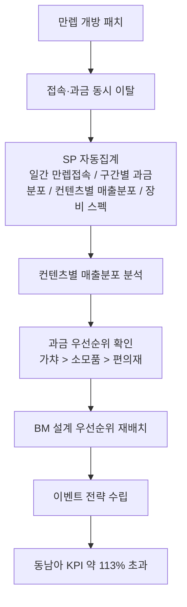
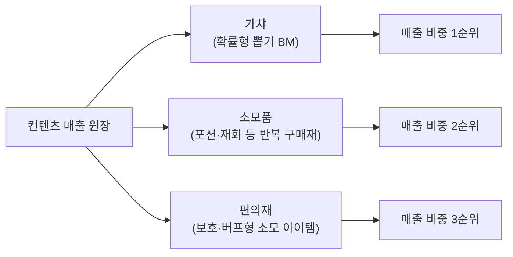
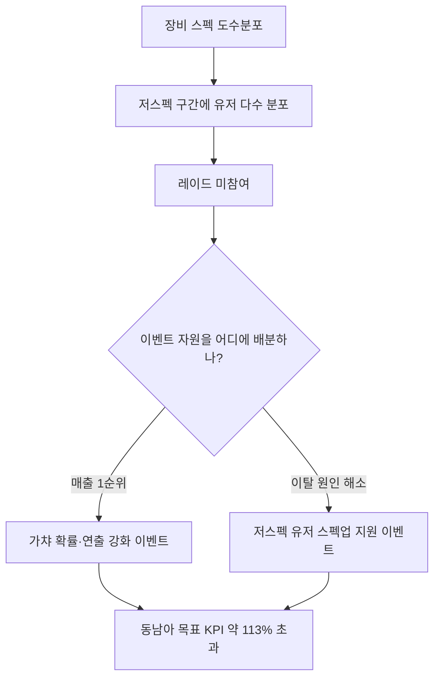

만렙 개방 패치를 내보낸 다음 날, 접속 지표와 과금 지표가 같이 꺾였다. 처음엔 "만렙 찍었으니 할 게 없어서 그런가 보다" 정도로 생각했다. 그런데 이 판단으로는 아무것도 못 고친다. 접속이 빠진 것과 과금이 빠진 것이 같은 원인인지, BM 전체가 문제인지 특정 컨텐츠만 문제인지 몰랐기 때문이다. 그래서 컨텐츠별 매출을 쪼개보기로 했다. 결과는 예상과 달랐다 — 문제는 BM 전체가 아니라 **우선순위를 잘못 배분한 자원**이었다.

먼저 전체 흐름부터 본다.



## 만렙 개방 후 왜 접속과 과금이 같이 빠졌나?

만렙을 찍으면 유저의 목표가 "레벨업"에서 "레이드·엔드콘텐츠"로 옮겨간다. 그런데 장비 스펙 도수분포를 뽑아보니 저스펙 구간에 몰려 있는 유저 비중이 컸다. **스펙이 안 되니 레이드에 못 들어가고, 못 들어가니 접속할 이유가 줄고, 접속이 줄면 과금할 접점 자체가 사라진다.** 접속 이탈과 과금 이탈이 같은 시점에 같이 나타난 건 이 하나의 사슬 때문이었다.

여기서 멈추면 "스펙업 컨텐츠를 늘리자"는 뻔한 결론으로 끝난다. 하지만 스펙업 컨텐츠를 늘리는 것도 자원이 든다. **어디에 자원을 먼저 태워야 하는지**를 알려면 애초에 매출이 어디서 나오는지부터 봐야 했다.

## 컨텐츠별 매출분포는 어떻게 쪼개서 봤나?

일간 만렙 접속, 구간별 과금분포, 컨텐츠별 매출분포, 장비 스펙 — 이 네 가지를 Stored Procedure(SP)로 묶어 매일 자동 집계했다. 사람이 매번 쿼리를 짜는 대신, 배치가 채워둔 표를 놓고 판단만 하면 되도록 만든 것이다.

```sql
-- 개념 예시(합성). 실제 스키마 아님.
-- 컨텐츠 카테고리별 매출 비중과 순위를 함께 뽑는다
SELECT
    content_type,                                  -- 'gacha' / 'consumable' / 'convenience'
    SUM(revenue_amt)                                  AS revenue_sum,
    RANK() OVER (ORDER BY SUM(revenue_amt) DESC)      AS revenue_rank
FROM   content_revenue
WHERE  play_date BETWEEN @start_date AND @end_date
GROUP  BY content_type
ORDER  BY revenue_sum DESC;
```

컨텐츠를 세 축으로 나눴다.



파이차트와 레이더차트로 시각화해서 기획·사업PM과 공유했는데, 결론은 명확했다. **가챠 > 소모품 > 편의재 순으로 매출 비중이 크게 갈렸고, 그중에서도 가챠가 전체 매출에서 압도적으로 큰 비중을 차지하고 있었다.** 편의재 쪽 유저 민원이 체감상 제일 시끄러웠던 것과는 정반대 그림이었다. 목소리 큰 쪽이 매출이 큰 쪽은 아니라는 걸 숫자로 확인한 순간이었다. (표에 들어가는 실제 금액·정확 비중은 여기서 공개하지 않는다. 우선순위 서열 자체가 인사이트다.)

## 과금 우선순위를 알면 BM 설계는 뭐부터 달라지나?

이 서열을 알기 전엔 세 컨텐츠에 자원을 비슷하게 나눠 쓰고 있었다. 편의재 아이템 종류를 늘리고, 소모품 할인 이벤트를 돌리고, 가챠는 "이미 잘 돌아가니까" 후순위로 미뤄뒀다. 매출분포를 보고 나서는 순서를 뒤집었다.

- **가챠(1순위)**: 확률·연출·신규 픽업 주기처럼 매출에 직결되는 변수를 최우선으로 점검. 여기서 밸런스가 무너지면 매출 전체가 흔들린다.
- **소모품(2순위)**: 신규 컨텐츠와 맞물려 소비량이 늘어나도록 유지·보수하되, 가챠만큼의 설계 리소스를 태우지 않는다.
- **편의재(3순위)**: 민원 대응·편의성 개선 목적으로는 계속 손보되, 매출 관점의 우선순위는 가장 낮게 잡는다.

핵심은 **컨텐츠마다 자원을 태우는 이유가 다르다는 걸 인정하는 것**이었다. 가챠는 매출을 지키는 축, 소모품은 매출을 보조하는 축, 편의재는 매출이 아니라 리텐션·경험을 지키는 축. 이 셋을 같은 잣대로 우선순위를 매기면 계속 잘못된 곳에 자원이 몰린다.

## 저스펙 이탈과 매출 우선순위를 이벤트 전략으로 어떻게 연결했나?

이제 처음 질문으로 돌아온다. 저스펙 유저의 레이드 미참여를 풀어야 하는데, 매출의 큰 축은 가챠다. 두 사실을 따로 놓고 보면 이벤트 방향이 갈린다. "스펙업 컨텐츠부터 늘리자"로 가면 매출 축과는 무관한 투자가 되고, "가챠 이벤트만 밀자"로 가면 저스펙 유저는 계속 소외된다.



실제로는 **두 이벤트를 같이 설계**했다. 가챠 쪽엔 매출 축을 지키는 확률·연출 강화 이벤트를, 동시에 저스펙 유저에게는 장비 스펙을 끌어올릴 수 있는 지원 이벤트를 붙여서 레이드 참여 문턱을 낮췄다. 스펙업 지원 이벤트로 참여 유저가 늘면, 그 유저들이 다시 가챠 소비층으로 들어오는 구조다. 이 조합을 동남아 시장에 적용한 결과가 **목표 KPI 매출 약 113% 초과 달성**이었고, 상반기 KPI도 이 흐름 위에서 최종 달성했다.

## 정리 — 매출 우선순위를 모르면 목소리 큰 쪽에 자원이 샌다

- 접속·과금이 같이 빠지면, 원인을 하나로 뭉뚱그리지 말고 **컨텐츠별 매출분포**부터 쪼갠다.
- 우리 경우엔 **가챠 > 소모품 > 편의재** 순으로 매출 비중이 갈렸고, 가챠가 압도적으로 큰 비중이었다.
- BM 설계는 컨텐츠마다 **자원을 태우는 이유**를 구분해야 한다. 매출을 지키는 컨텐츠와 경험을 지키는 컨텐츠는 같은 우선순위가 아니다.
- 이탈 원인(저스펙)과 매출 우선순위(가챠)가 다른 곳을 가리킬 땐, 두 이벤트를 병행 설계해 서로 맞물리게 하는 게 답이었다.

민원은 시끄러운 쪽에서 나오고, 매출은 조용한 쪽에서 나올 수 있다. 이 둘을 구분하는 게 매출분포 분석의 실질적인 값어치였다. 다음 글에서는 이번 글에서 나온 "구간별 과금분포"를 조금 더 파고들어, 과금 구간이 특정 지점에서 꺾이는 이탈 신호를 조기에 잡는 방법을 정리한다.

- 방법론·합성 스키마 레시피: [github.com/DBhyeong/game-data-recipes](https://github.com/DBhyeong/game-data-recipes)
