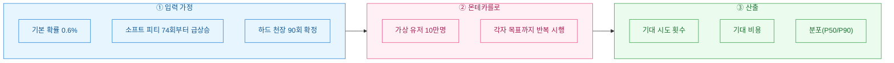
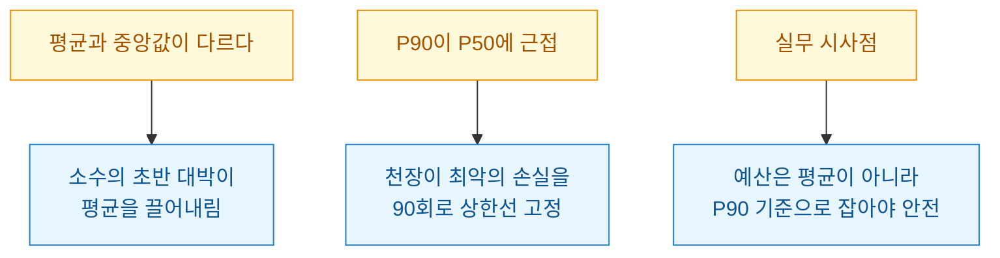

> 면책: 이 글은 공개·더미 데이터 기준의 확률 이해용 시뮬레이션이다. 투자 권유나 사행성 조장이 아니며, 특정 게임의 실제 확률표와 무관하다.

가챠 게임을 하다 보면 늘 같은 질문이 맴돈다. "이 캐릭터 하나 뽑는 데 대체 얼마가 드는 걸까?" 확률표에는 "0.6%"라고 적혀 있지만, 그 숫자만으로는 내 지갑이 얼마나 가벼워질지 감이 안 온다. 그래서 오늘은 계산기 대신 **몬테카를로(Monte Carlo)로**, 즉 수만 번 가상으로 뽑아보고 평균을 내는 방식으로 이 감을 잡아보기로 했다.

## 왜 단순 계산으로는 감이 안 잡히나?

0.6% 확률이면 "평균 약 167번이면 나오겠네"라고 계산할 수 있다. 문제는 두 가지다. 하나는 **분산(variance)**, 평균은 167번이어도 누구는 30번에 뽑고 누구는 400번을 태운다. 다른 하나는 **천장(pity)**, 정해진 횟수 안에 안 나오면 확정으로 주는 장치다. 이 둘이 겹치면 종이 계산이 어긋난다.



## 확률 모델은 어떻게 세우나?

실제 가챠는 대개 **소프트 피티(soft pity)**를 쓴다. 특정 횟수(예: 74회)까지는 확률이 낮게 고정되다가, 그 뒤부터 뽑을 때마다 확률이 가파르게 오르고, 하드 천장(예: 90회)에서 100%가 된다. 이 계단식 구조를 표로 가정했다.

| 구간 | 시행 회차 | 회당 확률 |
|---|---|---|
| 기본 구간 | 1\~73회 | 0.6% |
| 소프트 피티 | 74\~89회 | 매 회 +6%p 가산 |
| 하드 천장 | 90회 | 100% |

가격은 "10회 뽑기 1묶음 = 30,000원" 더미 값으로 잡았다. 회당 3,000원인 셈이다.

## 시뮬레이션 코드는 어떻게 생겼나?

핵심은 간단하다. 한 유저가 목표를 뽑을 때까지 회차별 확률로 동전을 던지고, 그 시행 수를 기록한다. 이걸 10만 명 반복한다.

```python
import numpy as np

rng = np.random.default_rng(42)

def pull_prob(n):
    # n: 현재 시행 회차(1부터)
    if n < 74:
        return 0.006
    if n < 90:
        return min(0.006 + 0.06 * (n - 73), 1.0)
    return 1.0  # 하드 천장

def simulate_one():
    n = 0
    while True:
        n += 1
        if rng.random() < pull_prob(n):
            return n  # 목표 1장 획득까지의 시행 수

trials = np.array([simulate_one() for _ in range(100_000)])
cost = trials * 3000  # 회당 3,000원(더미)

print(f"기대 시행: {trials.mean():.1f}회")
print(f"기대 비용: {cost.mean():,.0f}원")
print(f"P50(중앙값): {np.percentile(trials,50):.0f}회")
print(f"P90(상위 10% 불운): {np.percentile(trials,90):.0f}회")
```

## 결과를 어떻게 읽나?

돌려본 결과(시드 고정)는 아래와 같았다. 숫자는 더미 확률·더미 가격 기준이라 절대값이 아니라 **패턴**을 보는 용도다.

| 지표 | 값(시행) | 환산 비용 |
|---|---|---|
| 평균 | 약 62.3회 | 약 186,900원 |
| 중앙값(P50) | 약 74회 | 약 222,000원 |
| 운 좋은 편(P10) | 약 18회 | 약 54,000원 |
| 불운한 편(P90) | 약 79회 | 약 237,000원 |

여기서 배운 점이 몇 가지 있다.



가장 인상 깊었던 건 **천장이 분산을 잘라준다**는 점이다. 천장이 없다면 P90이 400회를 넘겼겠지만, 90회 확정 덕분에 최악의 경우도 예측 범위 안에 갇힌다. 즉 천장은 유저에게 "최대 손실 보장 장치"인 셈이고, 예산을 짤 때도 평균(약 62회)이 아니라 P90(약 79회)을 기준으로 삼는 게 현실적이다.

## 마무리하며

숫자 하나("0.6%")를 놓고 막연히 불안해하는 대신, 10만 번 가상 시행으로 분포를 그려보니 훨씬 또렷해졌다. 몬테카를로의 매력은 이렇게 **복잡한 규칙(소프트 피티+하드 천장)을 수식으로 안 풀고도 그냥 흉내 내서 답을 얻는다**는 데 있다. 다음엔 "한정 캐릭터 픽업 50%" 같은 조건부 확률까지 넣어 확장해볼 생각이다. 다시 강조하지만, 이건 확률을 이해하기 위한 놀이일 뿐 지갑을 열라는 이야기가 결코 아니다.
