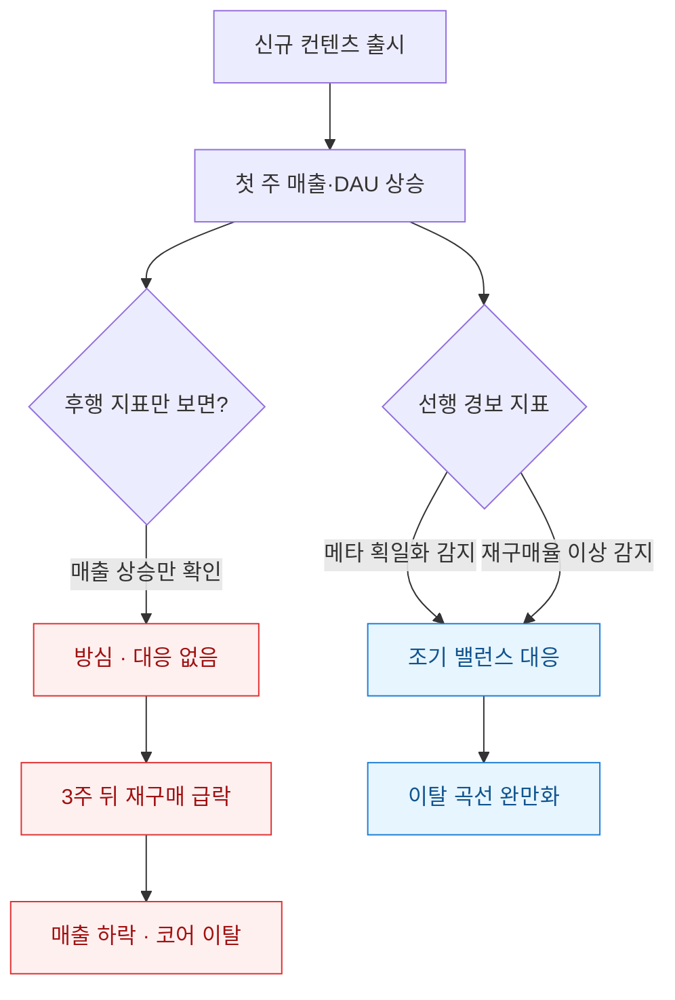
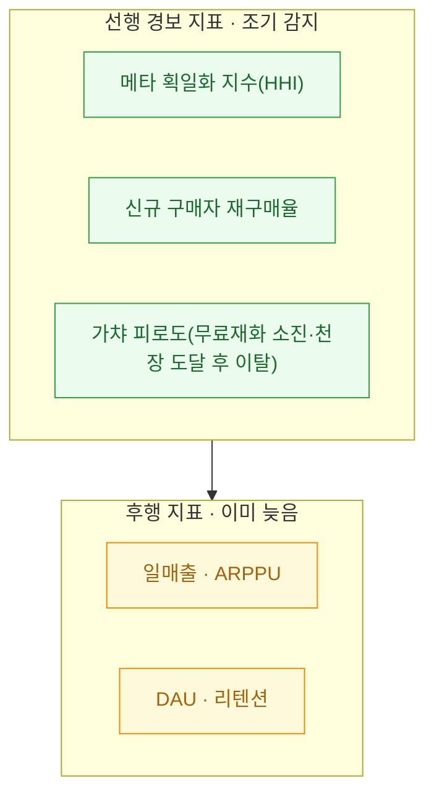
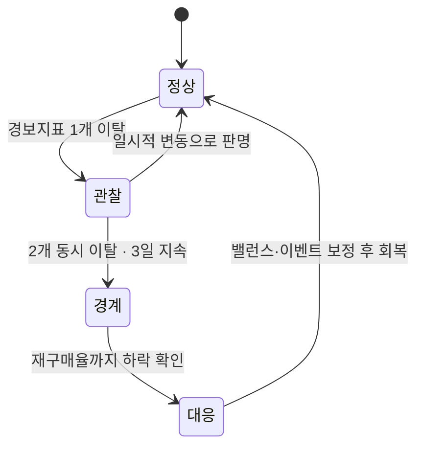

신규 컨텐츠를 냈을 때 가장 기분 좋은 순간은 출시 첫 주다. 매출 그래프가 튀고, 접속자가 몰리고, 슬랙에 축하 이모지가 쌓인다. 나도 처음엔 그 그래프만 봤다. 그런데 몇 번 겪고 나니 알게 됐다. **정작 위험한 신호는 매출이 오른 바로 그 직후에 조용히 시작된다.** 첫 주 매출이 좋을수록 방심하고, 3주 뒤 재구매(한 번 산 유저가 다시 결제하는 것)가 꺾이기 시작할 때는 이미 손 쓰기 늦은 경우가 많았다.

그래서 나는 "출시 성공/실패"를 첫 주 매출로 판단하는 걸 그만두고, **이탈이 표면화되기 전에 울리는 선행 경보 지표 세트**를 만들기로 했다. 이 글은 그 지표를 어떻게 골랐고 어떻게 계산했는지에 대한 기록이다. (특정 게임·회사와 무관한 일반화·합성 예시다.)



## 왜 매출이 오른 직후에 이탈이 시작되나?

신규 컨텐츠(특히 신규 캐릭터·장비·모드)는 게임의 **밸런스 균형을 흔든다.** 강력한 신규 요소가 나오면 유저들이 그쪽으로 몰리는데, 이게 두 방향으로 갈린다.

- **긍정 시나리오**: 신규 요소가 기존 선택지에 "하나 더" 얹혀서 조합의 다양성이 늘어난다.
- **부정 시나리오**: 신규 요소가 기존 선택지를 전부 밀어내고 **메타(주류 전략)가 획일화**된다. 모두가 같은 조합을 쓰게 되면 게임이 단조로워지고, 코어 유저부터 지루함을 느끼기 시작한다.

문제는 이 획일화가 **매출에는 오히려 단기 호재**라는 점이다. 강한 신규 요소를 얻으려 다들 결제하니까. 그래서 매출 그래프만 보면 부정 시나리오가 성공처럼 보인다. 나는 이 "달콤한 착시"에 몇 번 속았다.



ARPPU는 "결제한 유저 1명당 평균 결제액"이다. 이런 후행 지표는 결과가 다 나온 뒤에야 움직인다. 내가 원한 건 그 앞단에서 먼저 떨리는 바늘이었다.

## 어떤 지표가 '선행 경보'가 될 수 있나?

세 가지를 핵심으로 골랐다.

| 지표 | 무엇을 보나 | 경보 조건(예시) |
|---|---|---|
| 메타 획일화 지수 | 상위 조합/빌드의 점유율 집중도 | HHI가 출시 전 대비 급등 |
| 신규 구매자 재구매율 | 신규 컨텐츠 첫 구매자의 2차 결제 전환 | 직전 시즌 대비 하락 |
| 가챠 피로도 | 무료재화 소진 속도·천장 도달 후 접속 감소 | 천장 후 이탈률 상승 |

**메타 획일화 지수**로는 HHI(허핀달-허시먼 지수, 시장 집중도를 재는 지표)를 빌려 썼다. 원래 산업 독과점을 재는 지표인데, "상위 조합이 얼마나 소수에 쏠렸나"를 재는 데 그대로 들어맞는다. 각 조합의 사용 점유율을 제곱해 다 더하면, 한 조합이 100% 쓰이면 값이 최대, 여러 조합이 고루 쓰이면 값이 작다.

## 경보 지표를 어떻게 코드로 계산하나?

메타 획일화부터. 매치 로그에서 상위 조합의 점유율을 구해 HHI를 계산한다. (아래는 합성 데이터 기준 동작 예시다.)

```python
import pandas as pd

# 합성: 하루치 매치별 사용 조합 로그
df = pd.DataFrame({
    "match_id": range(1, 10001),
    "comp": (["A"]*4200 + ["B"]*1800 + ["C"]*1500
             + ["D"]*1200 + ["E"]*800 + ["F"]*500),
})

def meta_hhi(frame: pd.DataFrame) -> float:
    share = frame["comp"].value_counts(normalize=True)  # 조합별 점유율
    return float((share ** 2).sum() * 10000)  # 0~10000 스케일

print(round(meta_hhi(df), 1))  # 예: 2478.0 → 특정 조합 쏠림 경보
```

HHI가 출시 전 1500 근처였다가 출시 후 2500을 넘어가면, 나는 "한 조합이 메타를 먹었다"는 신호로 읽었다. 절대값보다 **출시 전후의 변화폭**이 중요하다.

다음은 재구매율. 신규 컨텐츠 첫 구매자가 며칠 안에 다시 결제하는 비율을 코호트(같은 시점에 묶인 유저 집단)로 본다.

```sql
-- 신규 컨텐츠 첫 구매자의 7일 내 재구매율
WITH first_buy AS (
  SELECT user_id, MIN(paid_at) AS first_at
  FROM payments
  WHERE item_tag = 'new_content_S12'
  GROUP BY user_id
)
SELECT
  COUNT(DISTINCT f.user_id)                         AS buyers,
  COUNT(DISTINCT p.user_id)                         AS repurchasers,
  ROUND(COUNT(DISTINCT p.user_id) * 100.0
        / COUNT(DISTINCT f.user_id), 1)             AS repurchase_rate
FROM first_buy f
LEFT JOIN payments p
  ON p.user_id = f.user_id
 AND p.paid_at BETWEEN f.first_at + INTERVAL '1 hour'
                   AND f.first_at + INTERVAL '7 day';
```

이 재구매율이 직전 시즌보다 눈에 띄게 낮으면, **"첫 결제로 끝나는 유저"가 늘고 있다**는 뜻이다. 신규 컨텐츠가 한 방 지르게는 했지만 지속적으로 붙잡지는 못한 것이다.

## 경보가 울리면 무엇을 봐야 하나?

지표 하나가 튀었다고 바로 밸런스 패치를 때리진 않는다. 나는 상태를 단계로 나눠서 대응 수위를 조절했다.



핵심은 **단일 지표를 믿지 않는 것**이다. 메타 획일화만 튀면 "강한 게 나왔나 보다"로 끝날 수 있다. 하지만 획일화 + 재구매율 하락 + 가챠 피로도 상승이 겹치면, 이건 매출 착시 뒤에서 코어 유저가 빠지고 있다는 강한 신호다. 이 조합을 봤을 때 조기에 밸런스를 손보거나 보상 이벤트를 넣으면, 이탈 곡선이 눈에 띄게 완만해졌다.

## 마무리

신규 컨텐츠의 성공은 첫 주 매출이 아니라 **3주 뒤에도 재구매가 유지되는가**로 판가름 났다. 후행 지표는 결과를 알려줄 뿐 막아주지 못한다. 매출이 오른 순간일수록 선행 경보 지표를 켜 두는 게, 내가 여러 번 손해 보고 나서야 배운 습관이다.

다음엔 이 경보 지표들을 실시간 대시보드로 묶고, 임계치를 넘으면 슬랙으로 알림이 오게 자동화한 이야기를 정리해 볼 생각이다. HHI 같은 집중도 지표는 게임뿐 아니라 상품 카테고리 쏠림, 유입 채널 편중을 볼 때도 그대로 쓸 수 있어서 두고두고 유용했다.
