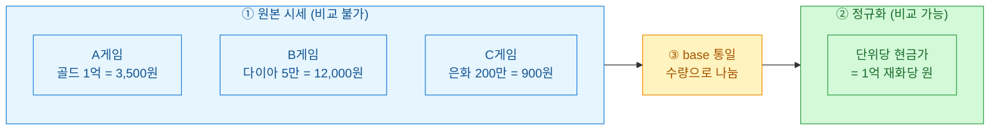
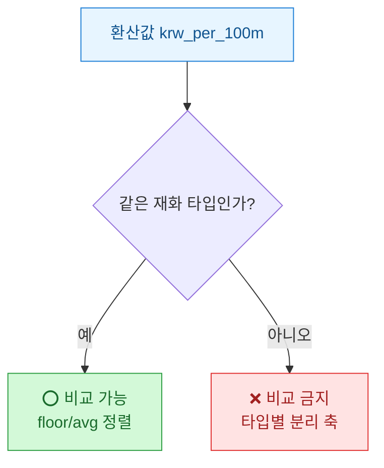

게임 재화 시세를 들여다볼 때마다 막히는 지점이 있었다. A게임은 "골드 1억에 3,500원", B게임은 "다이아 5만 개 묶음 12,000원". 숫자만 놓고 보면 도무지 뭐가 싼지 감이 안 온다. 단위도 묶음 크기도 다르니까. 오늘은 이 뒤죽박죽인 시세를 **단위당 현금가(price per unit)로** 정규화해서 한 줄에 세워 비교하는 집계 모델을 정리해 뒀다.

> ⚠️ 아래 데이터·가격은 전부 합성/더미 값이다. 실제 거래 시세나 투자 판단이 아니며, 특정 게임·거래소를 지칭하지 않는다.

## 왜 원본 시세는 그냥 비교하면 안 되나?

문제의 핵심은 세 가지가 뒤섞여 있다는 것이다. **재화 단위(unit)**가 다르고, 한 번에 파는 **묶음 크기(lot size)**가 다르고, 그래서 표시가격의 **기준점(base)**이 제각각이다.



정규화의 뼈대는 단순하다. **단위당 현금가 = 판매가 ÷ 재화 수량**. 여기에 자릿수가 커지니 "1억 재화당 원" 같은 공통 기준(base_unit)을 곱해 사람이 읽기 좋은 스케일로 맞춘다.

## 원천 데이터는 어떻게 두어야 하나?

거래 한 건을 그대로 적재하는 `listings` 테이블 하나면 충분하다. 핵심은 **수량과 가격을 절대 미리 합치지 말고 원자값 그대로 저장**하는 것. 환산은 조회 시점에 한다.

| 컬럼 | 의미 | 예시(더미) |
|---|---|---|
| `listing_id` | 거래 식별자 | 1001 |
| `game_code` | 게임 구분 | `AAA` |
| `currency_amt` | 재화 수량(개) | 100000000 |
| `price_krw` | 판매가(원) | 3500 |
| `listed_at` | 등록 시각 | 2026-07-10 |

```sql
-- 합성 더미 데이터
CREATE TABLE listings (
  listing_id  BIGINT,
  game_code   TEXT,
  currency_amt NUMERIC,   -- 재화 수량
  price_krw   NUMERIC,     -- 판매가(원)
  listed_at   DATE
);

INSERT INTO listings VALUES
  (1001, 'AAA', 100000000, 3500, '2026-07-10'),
  (1002, 'AAA', 250000000, 8400, '2026-07-11'),
  (1003, 'BBB',     50000, 12000, '2026-07-10'),
  (1004, 'CCC',   2000000,   900, '2026-07-12');
```

## 단위당 현금가는 어떻게 집계하나?

환산식을 SQL 한 줄로 박아 넣는다. `base_unit`을 1억(100000000)으로 두면 "1억 재화당 원" 지표가 나온다. 게임마다 재화 단위(개/원 기준)가 달라도 결과는 같은 축 위에 놓인다.

```sql
WITH normalized AS (
  SELECT
    game_code,
    currency_amt,
    price_krw,
    -- 단위당 현금가: 1억 재화당 원
    ROUND(price_krw / currency_amt * 100000000, 2) AS krw_per_100m,
    listed_at
  FROM listings
)
SELECT
  game_code,
  COUNT(*)                       AS n,
  ROUND(AVG(krw_per_100m), 1)    AS avg_price,
  MIN(krw_per_100m)              AS floor_price  -- 최저가(시세 바닥)
FROM normalized
GROUP BY game_code
ORDER BY avg_price;
```

결과를 표로 옮기면 비로소 "무엇이 싼가"가 보인다.

| game_code | 원본 표시가 | krw_per_100m(환산) | 해석 |
|---|---|---|---|
| CCC | 은화 200만=900원 | 45,000 | 가장 비쌈 |
| AAA | 골드 1억=3,500원 | 3,500 | 중간 |
| BBB | 다이아 5만=12,000원 | (별도 축) | 단위 규모가 달라 주의 |

여기서 바로 함정 하나가 튀어나온다.

## 서로 다른 재화를 같은 축에 세워도 되나?

안 된다. 정규화는 **같은 재화 종류 안에서만** 유효하다. B게임 다이아처럼 애초에 통용 규모가 작은 재화를 1억 기준으로 끌어올리면 숫자가 폭발해 오해를 부른다. 그래서 나는 환산 지표에 항상 `currency_type`을 함께 물려서, 비교는 **같은 타입끼리만** 하도록 가드를 건다.



또 하나, **최저가(floor)와 평균(avg)을 반드시 같이 봐야 한다.** 평균만 보면 소수의 대량 덤핑 매물이 시세를 왜곡한다. 실무에서는 최저 10% 매물을 잘라낸 절사평균이나 중앙값을 같이 뽑아 이상치에 둔감한 시세선을 만든다.

## 정리 — 이 모델이 주는 것

- **원자값 저장 → 조회 시 환산**: 수량과 가격을 미리 합치지 않아야 base_unit을 자유롭게 바꿔가며 볼 수 있다.
- **단위당 현금가**라는 공통 축 하나로 뒤죽박죽 시세가 한 줄에 선다.
- **타입 가드 + 최저가 병행**: 다른 재화를 억지로 비교하지 않고, 덤핑에 흔들리지 않는 시세선을 얻는다.

결국 데이터 모델링에서 배운 그대로다. 비교하려면 먼저 **같은 단위로 만들어라**. 게임 재화 시세도 예외가 아니었다.
