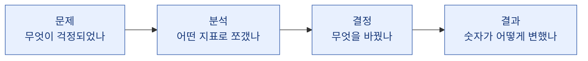
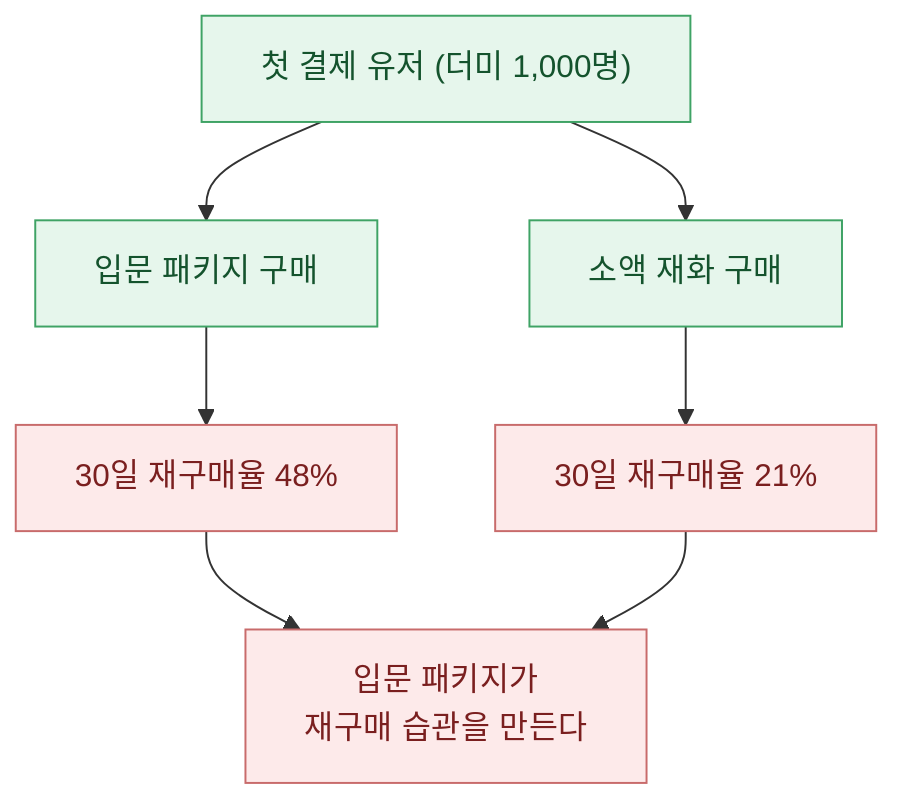
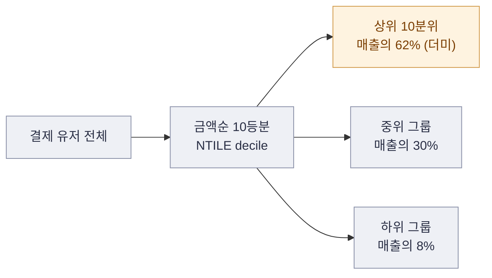
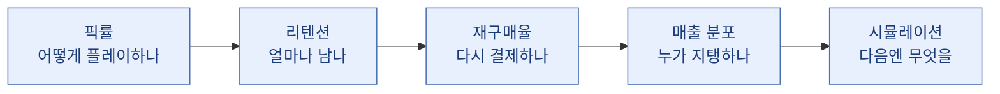

> 포트폴리오에서 면접관이 보는 건 "이 사람이 SQL을 짤 줄 아는가"가 아니라 "이 사람이 숫자를 보고 무엇을 바꿨는가"다.

나는 게임 데이터를 만지는 분석가 Hyeong이다. 포트폴리오를 몇 번 갈아엎으면서 뼈저리게 배운 게 하나 있다. 지표를 '나열'하면 아무도 안 읽는다. 지표를 '스토리'로 묶으면 그제서야 사람이 몸을 앞으로 기울인다. 오늘은 내가 실제로 즐겨 쓰는 다섯 개의 지표 스토리를, 어떤 문제에서 출발해 어떤 결정으로 끝났는지 서사 구조까지 통째로 풀어보려 한다.

먼저 못 박아두자. 아래 나오는 게임·회사·수치는 전부 합성 더미다. 실제 프로젝트에서 배운 '방법과 뼈대'만 일반화해서 옮겼다. 여러분도 포트폴리오를 쓸 땐 반드시 회사 실데이터를 지우고 더미로 재현해야 한다. 그게 프로다.

## 왜 지표 나열이 아니라 '스토리'여야 할까?

지표 하나는 그냥 숫자다. "리텐션 32%"는 정보가 아니라 파편이다. 면접관 머릿속에서 이 파편이 의미를 가지려면 세 가지가 붙어야 한다. 어떤 문제 때문에 이 숫자를 봤는지(문제), 어떻게 분석했는지(방법), 그래서 무엇을 바꿨는지(결정). 나는 이걸 '문제 → 분석 → 결정'의 3막 구조라고 부른다.

이 틀 하나면 어떤 지표든 '읽히는 이야기'가 된다. 이제 다섯 개를 이 틀에 하나씩 끼워 넣어보자.

## 픽률: 왜 특정 캐릭터만 안 뽑힐까?

첫 번째 스토리는 밸런스 이야기다. 대전형 게임이든 수집형 게임이든, 유저가 어떤 캐릭터를 얼마나 고르는지를 보는 지표가 픽률(선택률)이다. 계산은 단순하다. 특정 캐릭터를 고른 판 수를 전체 판 수로 나눈 값이다.

문제는 이렇게 시작한다. 신규 캐릭터를 냈는데 커뮤니티 반응은 뜨거운데 실제 픽률은 바닥이다. 왜일까? 나는 픽률을 하나의 숫자로 보지 않고 세 축으로 쪼갠다. 유저 티어별, 콘텐츠 모드별, 출시 후 경과일별. 이렇게 나누면 "고티어에서만 안 쓴다" 같은 진짜 문제가 드러난다.

| 구간(더미) | 캐릭터 A 픽률 | 캐릭터 B 픽률 | 해석 |
| --- | --- | --- | --- |
| 저티어 | 41% | 12% | A 쏠림, 초보 진입 캐릭터 |
| 중티어 | 33% | 18% | 완만해짐 |
| 고티어 | 9% | 27% | A가 상위권에서 버려짐 |

이 표를 보면 캐릭터 A는 '초보용', B는 '숙련용'으로 역할이 갈렸다는 걸 알 수 있다. 결정은 명확해진다. A를 무작정 너프하는 게 아니라, 고티어에서 A의 특정 스킬 계수만 손보고 나머지는 둔다. 픽률 스토리의 힘은 "밸런스가 깨졌다"는 막연한 감을 "어느 구간에서 왜 깨졌는가"라는 좌표로 바꾸는 데 있다.

## 재구매율: 한 번 산 유저가 왜 다시 안 살까?

두 번째는 과금 이야기다. 게임에서 첫 결제는 큰 벽이지만, 사실 매출의 진짜 엔진은 '두 번째 결제'다. 재구매율은 첫 결제를 한 유저 중 정해진 기간 안에 다시 결제한 비율이다.

문제는 이렇게 온다. 첫 결제 전환율은 나쁘지 않은데 매출이 안 자란다. 나는 재구매율을 첫 구매 상품 종류별로 쪼갠다. 입문 패키지를 산 사람과, 확률형 상품을 산 사람의 재구매 곡선은 완전히 다르기 때문이다.

이 그림이 말하는 건 하나다. 첫 상품이 무엇이었냐가 재구매를 좌우한다. 그렇다면 결정은 "입문 패키지를 더 눈에 띄게, 첫 결제 유도 지점에 배치하자"가 된다. 재구매율 스토리는 '결제한 사람 수'가 아니라 '결제 습관이 어디서 생기는가'를 보여준다는 점에서 마케팅과 곧장 연결된다.

## 리텐션: 유저는 정확히 며칠째에 떠날까?

세 번째는 잔존, 그러니까 리텐션 이야기다. 리텐션은 특정 날 가입한 유저 무리(코호트)가 N일 뒤에 얼마나 남아있는지를 보는 지표다. 흔히 D1(다음날), D7(일주일 뒤), D30(한 달 뒤) 잔존율을 본다.

여기서 초보와 프로가 갈린다. 초보는 "D1 리텐션 40%"라는 숫자 하나를 적는다. 프로는 가입 코호트별로 잔존 곡선을 그린다. 이걸 코호트 히트맵이라고 부른다. 가로는 가입 후 경과일, 세로는 가입 주차, 칸의 색은 잔존율이다. 이렇게 그리면 "특정 업데이트 이후 가입한 유저의 곡선만 뚝 떨어졌다" 같은 사건을 눈으로 잡아낼 수 있다.

| 가입 주차(더미) | D1 | D7 | D14 | D30 |
| --- | --- | --- | --- | --- |
| 1주차 | 42% | 21% | 15% | 9% |
| 2주차 | 44% | 22% | 16% | 10% |
| 3주차(신규 튜토리얼) | 51% | 28% | 20% | 13% |

3주차에 튜토리얼을 바꿨더니 D1이 아니라 D7 이후 곡선 전체가 위로 떴다. 이게 핵심 통찰이다. 초반 이탈이 아니라 '중기 이탈'을 튜토리얼이 막아준 것이다. 결정은 "이 튜토리얼 개편을 전체 유저로 확대"가 된다. 리텐션 스토리에서 면접관이 감탄하는 지점은 곡선의 '어느 구간'이 움직였는지를 읽어내는 눈이다.

## 매출 분포: 매출의 몇 퍼센트가 상위 유저에서 나올까?

네 번째는 매출 구조 이야기다. "이번 달 매출 얼마"는 재무 숫자지, 분석가의 숫자가 아니다. 분석가는 그 매출이 '누구에게서' 나오는지를 본다. 나는 결제 유저를 금액순으로 10등분한다. 이걸 SQL에서는 NTILE(10)이라는 윈도우 함수로 한 줄에 처리한다. 상위 10% 결제 유저가 전체 결제 매출의 몇 퍼센트를 차지하는지를 보는 것이다.

여기서 조심할 게 있다. 상위 편중 자체는 정상이다. 게임 매출은 원래 극단적으로 쏠린다. 문제는 그 쏠림이 '점점 심해질 때'다. 상위 의존도가 계속 오르면, 그 몇 명이 떠나는 순간 매출이 절벽처럼 꺾인다. 그래서 나는 이 분포를 매달 추적하며 '허리 구간(중위 결제층)'이 두꺼워지는지를 본다. 결정은 "고래(초고액 결제자) 이벤트가 아니라 중위층을 올리는 상품을 설계하자"로 이어진다. 매출 분포 스토리는 매출을 '금액'이 아니라 '건강 상태'로 읽게 해준다.

## 시뮬레이션: 이 이벤트를 하면 매출이 얼마나 오를까?

마지막은 예측 이야기다. 앞의 네 개가 '지나간 일을 해석'하는 지표라면, 시뮬레이션은 '앞으로의 일을 추정'하는 도구다. 게임 매출은 놀랍도록 단순한 뼈대로 분해된다.

예상 매출 = DAU(일 활성 유저) × PU%(활성 유저 중 결제 비율) × ARPPU(결제 유저 1인당 평균 결제액)

이 세 손잡이만 있으면 시나리오를 돌릴 수 있다. 이벤트로 DAU가 오를 것 같으면 DAU를 올려보고, 프로모션으로 결제 비율이 오를 것 같으면 PU%를 올려본다. 세 값을 보수적/기본/공격적으로 나눠 시나리오 표를 만든다.

| 시나리오(더미) | DAU | PU% | ARPPU | 예상 일매출 |
| --- | --- | --- | --- | --- |
| 보수적 | 50,000 | 3.0% | 12,000원 | 1,800만 원 |
| 기본 | 50,000 | 3.5% | 13,000원 | 2,275만 원 |
| 공격적 | 55,000 | 4.0% | 14,000원 | 3,080만 원 |

이 표의 진짜 가치는 정확한 예측이 아니다. 어차피 예측은 틀린다. 가치는 '어느 손잡이를 돌리는 게 가장 효율적인가'를 보여주는 데 있다. 위 더미에서는 DAU를 10% 올리는 것보다 PU%를 0.5%p 올리는 게 매출에 더 크게 먹혔다. 그러면 결정은 "신규 유입 광고보다 결제 전환 개선에 자원을 쓰자"가 된다. 시뮬레이션 스토리는 분석가가 '숫자를 읽는 사람'을 넘어 '자원 배분을 제안하는 사람'이라는 걸 증명한다.

## 다섯 스토리를 하나의 포트폴리오로 엮기

다섯 개를 따로 쓰면 지표 다섯 개다. 하지만 순서를 잡아 엮으면 하나의 '유저 여정'이 된다.

플레이 방식(픽률) → 잔존(리텐션) → 결제 습관(재구매율) → 매출 구조(분포) → 다음 액션(시뮬레이션). 이렇게 흐름을 만들면 포트폴리오를 읽는 사람은 다섯 개의 파편이 아니라 하나의 사고 과정을 보게 된다. 그게 "이 사람과 일하면 어떤 판단을 얻겠구나"라는 확신으로 바뀐다.

## 마무리

정리하면 이렇다. 지표는 계산이 아니라 결정을 위한 도구다. 포트폴리오에 지표를 넣을 땐 반드시 '어떤 문제에서 출발해, 어떻게 쪼갰고, 무엇을 바꿨는가'를 붙여라. 픽률은 밸런스 좌표를, 재구매율은 결제 습관의 발원지를, 리텐션은 곡선의 움직인 구간을, 매출 분포는 매출의 건강 상태를, 시뮬레이션은 자원 배분 제안을 증명한다.

그리고 마지막으로 한 번 더. 포트폴리오는 반드시 합성 더미로 재현하라. 실제 회사의 게임명·테이블·수치를 옮기는 순간, 그건 포트폴리오가 아니라 유출이다. 방법과 사고 과정만 가져와 더미로 다시 짜는 것, 그게 분석가의 직업윤리이자 실력이다.

## 참고자료

- [[game-metrics-7-definitions]]
- [[cohort-m1-retention-sql]]
- [[arpu-vs-arppu]]
- [[retention-curve-beyond-m1]]
- [[revenue-simulation-dau-pu-arppu]]
- [[game-data-sql-recipes-retention-ltv]]
- 합성 데이터 기반 게임 지표 SQL 레시피 모음: https://github.com/DBhyeong/game-data-recipes

<!-- 안전: 합성/더미 데이터, 회사·실데이터·PII 없음. -->
