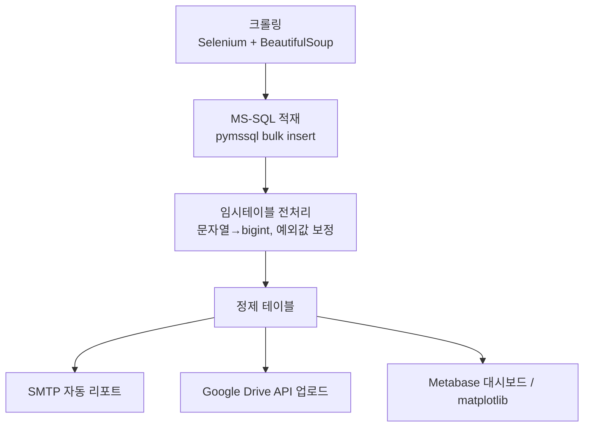
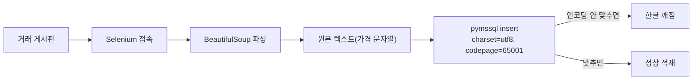
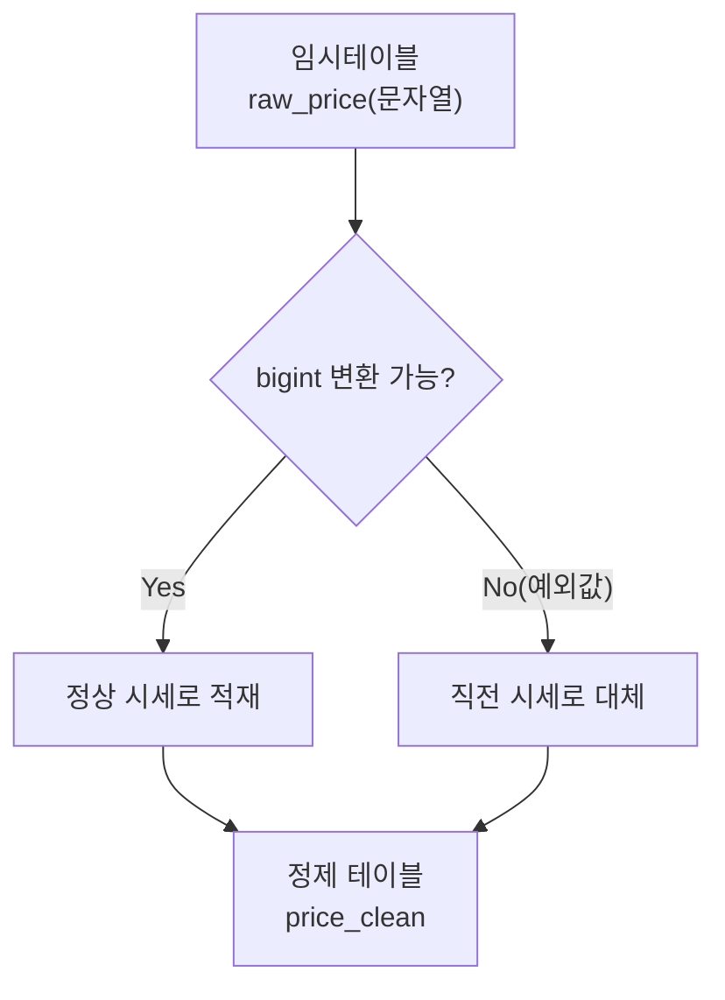

회사에서는 라이브 게임 지표를 들여다봤지만, 정작 손이 많이 간 건 사이드로 만든 작은 프로젝트였다. 게임 아이템 현금거래 시세를 매일 확인하는 게 귀찮아서 — 매번 게시판에 들어가 눈으로 훑고 엑셀에 옮기던 걸 — 자동으로 돌아가게 만들자고 시작한 게 이 파이프라인이다. 크롤러 하나 짜면 끝날 줄 알았는데, 막상 만들어보니 **수집은 전체 공정의 일부**에 불과했다. 정제, 적재, 배포, 시각화까지 다 물려야 사람 손 안 타고 돌아간다는 걸 그때 배웠다.

이 글은 그 다섯 단계를 하나로 엮은 **전체 아키텍처를 조망**하는 글이다. 각 단계의 세부(인코딩 트러블슈팅, 지표 설계 등)는 다른 글에서 따로 다룰 예정이라, 여기서는 "왜 이 순서로, 왜 이 도구로 엮었는가"에 집중한다.

(크롤링 대상 게시판의 robots.txt와 이용약관을 확인했고, 요청 사이에 텀을 둬 레이트리밋을 지켰다. 수집 항목에 개인 식별 정보는 없었다.)



## 다섯 단계를 굳이 하나로 엮은 이유는 뭘까?

처음엔 "크롤링 스크립트 하나, 시세 확인은 그때그때 SQL 켜서 보면 되지"라고 생각했다. 그런데 그렇게 하니 결국 매일 SQL을 켜는 사람이 나였다. 자동화의 의미가 없었다.

그래서 기준을 하나 세웠다. **사람이 개입하는 지점을 최소화한다.** 수집부터 시각화까지 배치 하나가 순서대로 돌고, 결과물은 두 갈래로 나눠 사람에게 온다.

- **밀어주는 채널(Push)**: 매일 아침 SMTP로 요약 리포트가 메일함에 와 있다. 확인하러 갈 필요가 없다.
- **당겨보는 채널(Pull)**: 특정 구간을 더 파고 싶을 때만 Metabase 대시보드를 연다.

이 둘을 나눠 설계한 게 이 파이프라인의 핵심 아이디어다. 평소엔 리포트만 훑고, 이상치가 보일 때만 대시보드로 들어간다.

## 크롤링한 값을 DB에 넣을 때 가장 먼저 걸린 벽은?

수집 자체는 크게 어렵지 않았다. **Selenium**(브라우저를 코드로 조작하는 도구)으로 거래 게시판에 접속하고, **BeautifulSoup**(HTML에서 원하는 값만 골라내는 파서)으로 시세 텍스트를 뽑았다. 문제는 그다음, 그 값을 **MS-SQL**에 밀어 넣는 순간부터였다.



한글이 섞인 게시글 제목·태그를 **bulk insert**(여러 행을 한 번에 밀어 넣는 방식)로 넣었더니 특정 글자만 깨져서 들어왔다. 처음엔 크롤링 파싱이 잘못된 줄 알고 파서 코드를 몇 시간 갈아엎었는데, 원인은 파싱이 아니라 DB 연결 옵션이었다. `pymssql` 연결에서 `charset`과 `codepage`를 명시적으로 맞춰주지 않으면 한글이 깨진다는 걸 삽질 끝에 알았다.

```python
import os
import pymssql

conn = pymssql.connect(
    server=os.environ["DB_SERVER"],
    user=os.environ["DB_USER"],
    password=os.environ["DB_PASSWORD"],  # 비밀번호는 .env로 관리
    database="market_watch",
    charset="utf8",
)
# 연결 문자열/드라이버 옵션에서 codepage=65001(UTF-8) 정렬을 맞춰야 한글이 안 깨진다
```

이 한 줄을 몰라서 반나절을 날렸다. 지금은 이 파이프라인을 새로 짤 때 제일 먼저 확인하는 옵션이 됐다.

## 적재만 하면 끝 아닌가? 왜 임시테이블 전처리가 필요했나?

크롤링한 시세는 문자열이다. "150만원", "가격문의", 빈 값처럼 숫자로 바로 못 쓰는 값이 섞여 들어온다. 이걸 그대로 집계하면 평균·추이 계산이 다 틀어진다. 그래서 원본을 바로 정제 테이블에 넣지 않고, **임시테이블**을 하나 거친다.



```sql
-- 개념 예시(합성). 실제 스키마 아님.
-- 문자열 → bigint 변환, 실패하면 직전 시세로 대체
INSERT INTO price_clean (item_id, price, price_date)
SELECT
    r.item_id,
    COALESCE(
        TRY_CAST(r.raw_price AS BIGINT),          -- 정상 변환
        LAG(p.price) OVER (
            PARTITION BY r.item_id ORDER BY r.price_date
        )                                          -- 예외값은 직전 시세로 대체
    ) AS price,
    r.price_date
FROM raw_price r
LEFT JOIN price_clean p ON p.item_id = r.item_id;
```

여기서 판단 하나가 들어간다. 변환 실패한 값을 **버릴지, 직전 값으로 채울지**다. 시세는 하루 단위 추이가 중요한 데이터라, 결측을 그대로 두면 그래프가 뚝뚝 끊긴다. 그래서 예외값은 직전 시세로 대체하기로 정했다. 이 판단은 도메인(시세 데이터의 성격)에 따라 달라지는 것이라, 데이터마다 다시 생각해야 한다.

## 정제된 데이터는 사람에게 어떻게 전달되나?

정제 테이블이 완성되면 여기서 끝내지 않는다. 같은 데이터를 **두 곳으로 동시에 흘려보낸다.**

- **SMTP 자동 리포트**: matplotlib으로 그린 요약 차트를 이미지로 붙여 메일로 발송한다. 매일 확인하러 갈 필요 없이, 이상 신호가 있으면 메일 제목만 봐도 감이 온다.
- **Google Drive API 업로드**: 같은 시점의 원본·정제 데이터를 파일로 올려둔다. 메일은 요약이라 세부가 빠지는데, Drive에 쌓아두면 나중에 특정 구간을 다시 열어 재계산할 수 있다.

```python
import os
import smtplib
from email.mime.multipart import MIMEMultipart

# 발신 계정·비밀번호는 .env / os.environ으로만 로드 (YOUR_API_KEY 형태로 치환)
smtp_user = os.environ["SMTP_USER"]
smtp_pass = os.environ["SMTP_PASSWORD"]

server = smtplib.SMTP_SSL("smtp.example.com", 465)
server.login(smtp_user, smtp_pass)
msg = MIMEMultipart()
msg["Subject"] = "[시세 리포트] 일간 요약"
# 본문에 matplotlib으로 그린 차트 이미지를 첨부
server.sendmail(smtp_user, os.environ["REPORT_TO"], msg.as_string())
```

리포트는 "밀어주는" 채널이라 매번 같은 형식으로 고정돼야 하고, Drive는 "쌓아두는" 채널이라 원본에 가까운 형태여야 한다. 둘의 역할이 다르다는 걸 처음엔 몰라서, 리포트에도 원본 수준 데이터를 다 욱여넣으려다 메일이 무거워져 실패한 적이 있다.

## 그런데 왜 대시보드까지 따로 필요했나?

리포트와 Drive만으로도 부족한 지점이 있다. **특정 기간·특정 아이템만 잘라서 보고 싶을 때**다. 메일은 고정된 형식이라 필터링이 안 되고, Drive 파일을 열어 매번 새로 집계하는 건 리포트를 만들기 전으로 돌아가는 것과 같다.

그래서 정제 테이블을 **Metabase**(쿼리 없이 필터·차트를 조작할 수 있는 대시보드 도구)에 연결해뒀다. 평소엔 안 열어보지만, 리포트에서 이상치를 발견한 날엔 Metabase로 들어가 기간·아이템을 좁혀가며 원인을 찾는다. matplotlib이 "고정된 스냅샷"을 만드는 도구라면, Metabase는 "그때그때 다시 자르는" 도구다. 이 둘은 대체 관계가 아니라 보완 관계였다.

## 정리 — 파이프라인은 단계 그 자체보다 연결이 핵심이다

- **수집(크롤링) → 적재(MS-SQL bulk insert) → 정제(임시테이블) → 배포(SMTP+Drive) → 시각화(Metabase/matplotlib)**, 다섯 단계가 순서대로 물려야 사람 손 없이 돌아간다.
- 한글 인코딩(`charset`/`codepage`)처럼 눈에 안 띄는 옵션 하나가 파이프라인 전체를 깨뜨릴 수 있다.
- 문자열→숫자 변환 실패 같은 예외값은 버리지 말고 **도메인에 맞는 대체 규칙**(직전 시세)을 정해야 한다.
- 리포트(Push)와 대시보드(Pull)는 경쟁 관계가 아니라, 평소용과 파고들 때용으로 역할이 다르다.

이 글은 전체 그림이라, 각 단계의 트러블슈팅(인코딩 함정, 예외값 처리 규칙을 정하는 기준 등)은 더 짧게 쪼개 다음 글들에서 다룰 예정이다. 전체 코드와 스키마 개념은 아래 저장소에 정리해뒀다.

- 현금시세 모니터링 파이프라인: [github.com/DBhyeong/game-data-analysis](https://github.com/DBhyeong/game-data-analysis)
