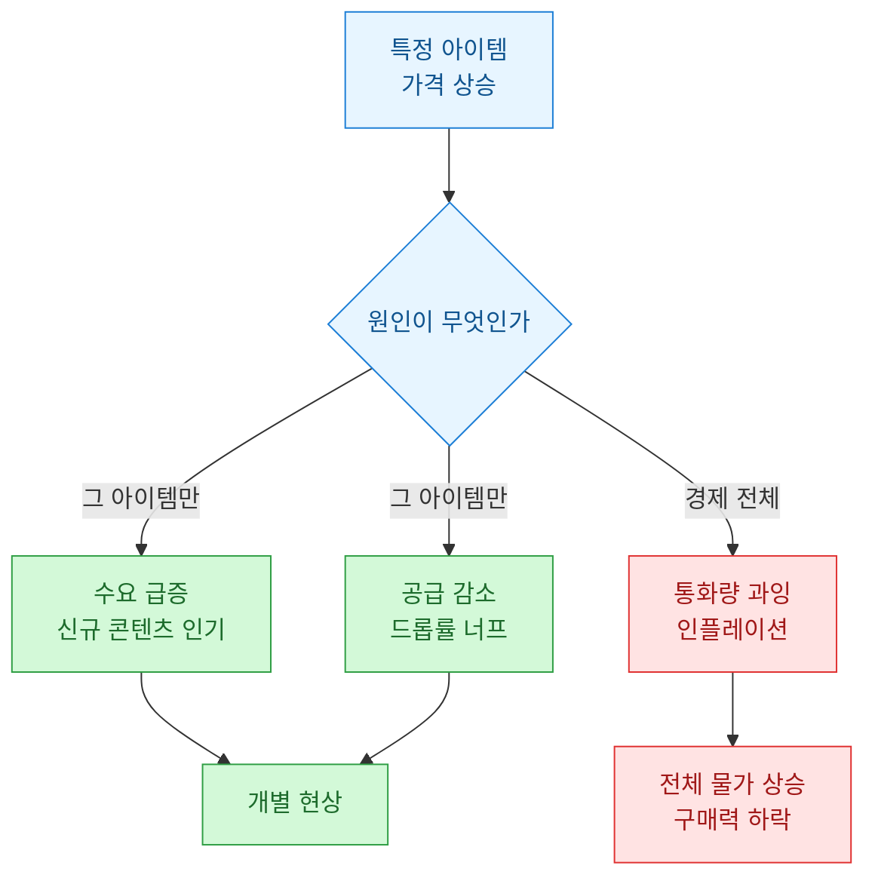
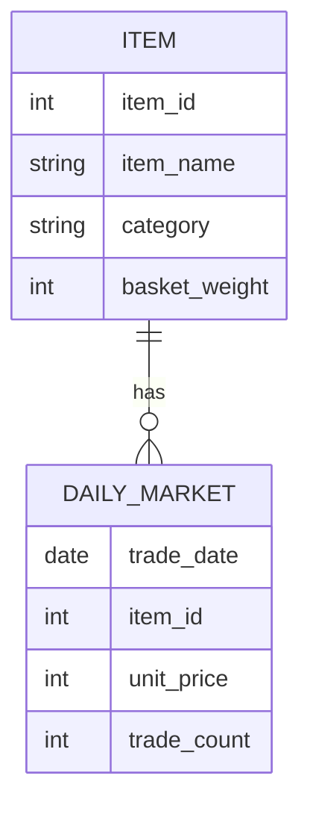
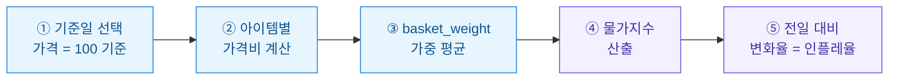
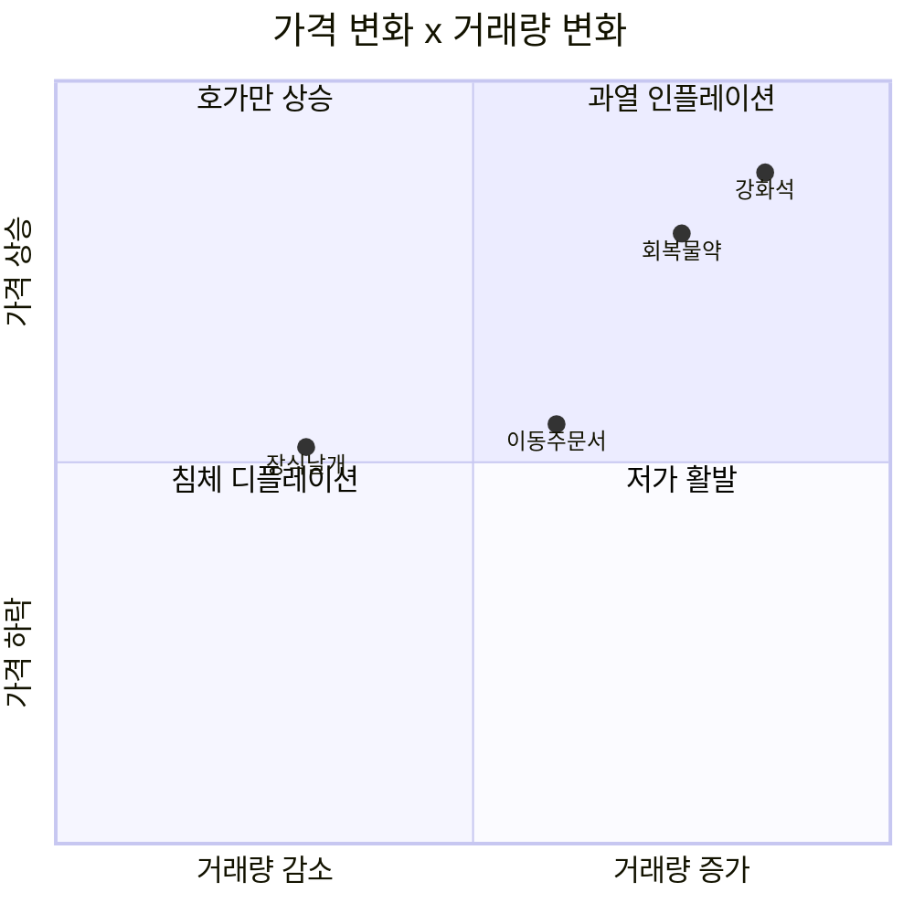
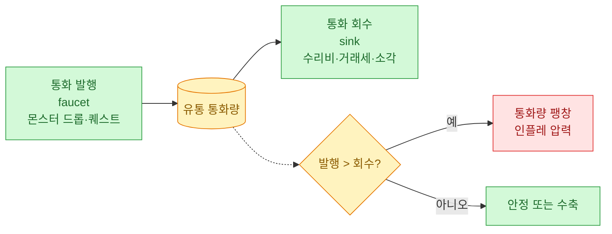
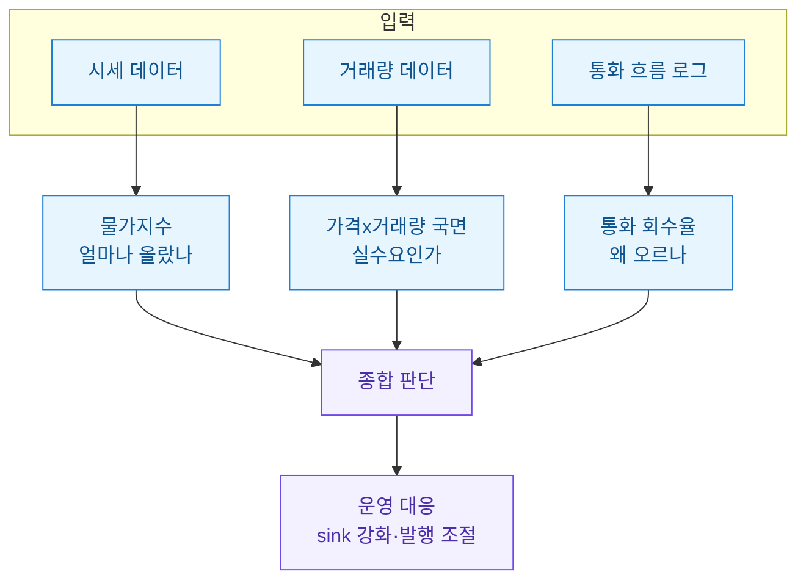

시세 데이터를 수집하고 정규화하고 이상치를 걸러내는 글은 예전에 여러 번 썼다. 그런데 어느 순간부터 궁금해진 건 "그래서 이 게임의 경제가 지금 팽창 중인가, 수축 중인가?"라는 질문이었다. 개별 아이템 가격이 올랐다는 건 알겠는데, 그게 그 아이템만의 인기인지 아니면 게임 전체에 돈이 너무 풀린 인플레이션인지 구분이 안 됐다.

이 글은 그 구분을 데이터로 해보려고 한 기록이다. 현실 경제학의 물가지수 개념을 게임 경제에 얹어서, 시세와 거래량을 함께 보는 지표를 만든다. 아래 모든 수치·표·데이터는 **합성(더미) 데이터**다. 실제 게임이나 실제 거래 데이터가 아니라 개념을 설명하려고 내가 만들어낸 값이다.

## 왜 시세만 봐서는 인플레이션을 못 읽나?

개별 아이템 가격 하나만 보면 착시가 생긴다. 아래 그림처럼 같은 "가격 상승"도 원인이 여러 개다.



핵심은 이렇다. 개별 아이템 가격은 "그 아이템 사정"과 "게임 전체 통화 사정"이 섞인 신호다. 인플레이션을 읽으려면 여러 아이템을 묶어 **바스켓(basket, 대표 상품 묶음)**으로 보고, 거기에 얼마나 거래되는지(거래량)를 곁들여야 한다. 현실에서 소비자물가지수(CPI)를 대표 품목 바구니로 계산하는 것과 같은 발상이다.

## 어떤 데이터가 있으면 지표를 만들 수 있나?

거창한 게 필요하지 않다. 일자별로 아이템마다 대표 시세(단위당 가격)와 거래건수만 있으면 시작할 수 있다. 합성 스키마는 이렇다.



`basket_weight`는 그 아이템이 경제에서 차지하는 비중이다. 모두가 쓰는 물약과 극소수만 쓰는 희귀 장식템을 같은 무게로 두면 지표가 왜곡되니까, 실제 거래 규모에 맞춰 가중치를 준다. 합성 데이터 예시는 다음과 같다.

| item_name | category | unit_price(1일) | unit_price(30일) | basket_weight |
|-----------|----------|-----------------|------------------|---------------|
| 회복물약   | 소비재    | 100             | 128              | 40            |
| 강화석     | 재료      | 500             | 690              | 30            |
| 이동주문서 | 소비재    | 80              | 92               | 20            |
| 장식날개   | 사치재    | 12000           | 12500            | 10            |

*(위 표는 전부 합성 데이터입니다.)* 생필품인 물약·강화석이 크게 오르고 사치재는 거의 안 올랐다. 이런 패턴이 "생활물가 중심 인플레이션"의 전형적 모습이다.

## 물가지수는 어떻게 계산하나?

기준일 가격을 100으로 놓고, 이후 날짜의 바스켓 가격을 기준 대비 비율로 환산한다. 가중치를 곱해서 합산하는 라스파이레스(Laspeyres) 방식이 이해하기 쉽다. 절차는 아래와 같다.



합성 데이터로 계산하는 파이썬 코드다.

```python
import pandas as pd

# 합성 데이터: 아이템 메타 + 기준일/관측일 가격
items = pd.DataFrame({
    "item_name":    ["회복물약", "강화석", "이동주문서", "장식날개"],
    "category":     ["소비재", "재료", "소비재", "사치재"],
    "price_base":   [100, 500, 80, 12000],   # 기준일(1일)
    "price_now":    [128, 690, 92, 12500],   # 관측일(30일)
    "basket_weight":[40, 30, 20, 10],
})

# ① 아이템별 가격비 (관측 / 기준)
items["price_ratio"] = items["price_now"] / items["price_base"]

# ② 가중 물가지수 = Σ(가격비 × 가중치) / Σ(가중치) × 100
w = items["basket_weight"]
price_index = (items["price_ratio"] * w).sum() / w.sum() * 100

print(f"물가지수: {price_index:.1f}")   # 기준=100
print(f"인플레이션율: {price_index - 100:.1f}%")
```

이 합성 데이터로 돌리면 물가지수가 약 128.6, 즉 한 달간 약 28.6% 물가가 오른 셈이다. 개별 아이템 하나만 봤을 때보다 "게임 전체가 얼마나 팽창했는가"를 한 숫자로 말할 수 있게 된다.

## 거래량은 왜 같이 봐야 하나?

가격만으로는 함정에 빠진다. 가격이 올랐어도 아무도 안 사면 그건 "호가만 높은 죽은 시장"일 수 있다. 반대로 가격이 그대로여도 거래가 폭증하면 곧 가격이 움직일 전조다. 그래서 가격 지수와 거래량을 2차원으로 놓고 국면을 나눈다.



*(좌표값은 합성 데이터입니다.)* 오른쪽 위(가격↑·거래량↑)는 진짜 수요가 밀어올리는 인플레이션 국면이고, 왼쪽 위(가격↑·거래량↓)는 실체 없는 호가 상승이라 조심해야 한다. 물약·강화석이 오른쪽 위에 몰려 있으니 이건 실수요 기반 인플레이션으로 해석할 근거가 된다.

## 통화가 얼마나 회수되는지도 신호가 되나?

인플레이션의 근본 원인은 대개 "게임에 돈은 계속 생기는데 빠져나가는 구멍(sink)이 부족한 것"이다. 몬스터가 떨구는 골드(faucet, 수도꼭지)와 수리비·세금·소각 아이템(sink, 배수구)의 균형을 보면 앞으로의 방향이 보인다.



회수율 지표는 간단하다. 하루에 회수된 통화를 발행된 통화로 나눈다. 이 값이 계속 1보다 작으면 통화가 쌓이기만 한다는 뜻이라 인플레이션 경고등이다.

```sql
-- 합성 스키마 기준: 일자별 통화 발행/회수 로그
SELECT
    log_date,
    faucet_gold,
    sink_gold,
    CAST(sink_gold AS FLOAT) / NULLIF(faucet_gold, 0) AS recovery_rate
FROM currency_flow_daily
ORDER BY log_date;
```

| log_date | faucet_gold | sink_gold | recovery_rate |
|----------|-------------|-----------|---------------|
| 07-01    | 1,000,000   | 720,000   | 0.72          |
| 07-10    | 1,050,000   | 690,000   | 0.66          |
| 07-20    | 1,120,000   | 650,000   | 0.58          |

*(합성 데이터입니다.)* 회수율이 0.72에서 0.58로 계속 내려간다. 물가지수 상승과 겹쳐 보면 "돈이 안 빠지니까 물가가 오른다"는 인과가 그림처럼 맞아떨어진다. 두 지표를 나란히 두면 우연이 아니라 구조적 신호라는 확신이 생긴다.

## 이 지표들을 어떻게 하나의 대시보드로 묶나?

지표 하나하나는 조각이고, 판단은 조합에서 나온다. 최종적으로 세 신호를 한 화면에서 본다.



물가지수로 "얼마나", 국면 분석으로 "진짜인가", 회수율로 "왜"를 답한다. 세 개가 같은 방향을 가리키면 그때 운영 판단(예: 소각 이벤트로 sink 강화)의 근거가 선다. 하나만 보고 움직이면 착시에 당한다.

## 정리

이 글에서 만든 건 결국 "게임판 물가 체온계" 세 개다.

- **물가지수**: 대표 아이템 바스켓을 가중 평균해 전체 물가가 얼마나 올랐는지 한 숫자로.
- **가격×거래량 국면**: 가격 상승이 실수요인지 호가 착시인지 사분면으로 구분.
- **통화 회수율**: faucet/sink 균형으로 인플레이션의 원인과 방향을 진단.

셋을 함께 보면 개별 아이템 가격에 휘둘리지 않고 경제 전체의 온도를 읽을 수 있다. 모든 수치는 개념 설명용 합성 데이터이며, 실제 적용 시엔 각 게임의 바스켓 구성과 통화 로그 스키마에 맞춰 가중치와 기준일을 다시 잡아야 한다.
