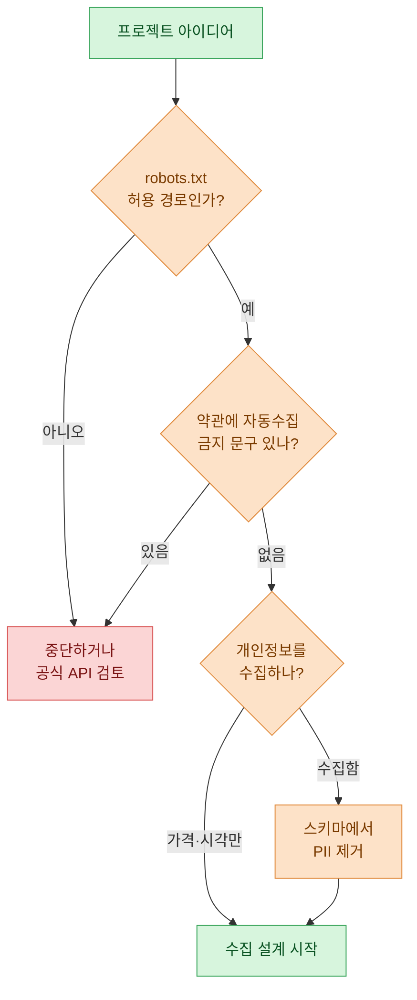
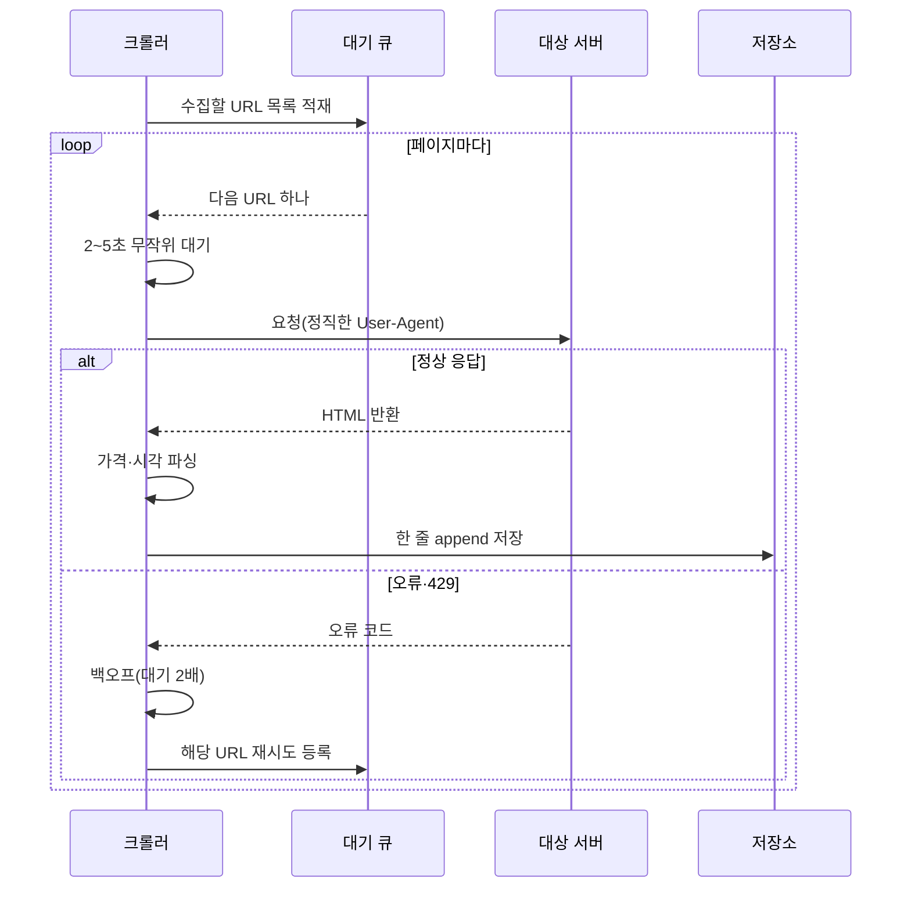

> "빠르게 긁는 크롤러는 누구나 만든다. 오래 살아남는 크롤러는 예의를 아는 크롤러다."

퇴근하고 나면 가끔 나만의 데이터 파이프라인을 하나씩 늘리는 재미로 산다. 이번에 손댄 건 아이템 거래 게시글의 시세를 매일 자동으로 모아 추세를 보는 사이드 프로젝트였다. 회사 실무 데이터는 절대 밖으로 가져오지 않으니, 여기 나오는 사이트·가격·아이템은 전부 합성 예시라는 걸 먼저 못박아 둔다.

시세 모니터링이라고 하면 거창해 보이지만, 결국 "게시글 목록을 열어서 가격 숫자를 긁고, 날짜와 함께 저장하고, 매일 반복한다"가 전부다. 문제는 그 '반복'을 어떻게 하느냐다. 무례하게 긁으면 하루 만에 차단당하고, 최악의 경우 약관 위반이 된다. 그래서 이 글은 기술보다 '태도'를 먼저 이야기한다.

## 크롤링을 시작하기 전에 뭘 먼저 확인해야 할까?

코드를 한 줄 쓰기 전에 나는 항상 세 가지를 본다. 이걸 건너뛰면 아무리 코드가 예뻐도 그 프로젝트는 시작부터 위험하다.

첫째, `robots.txt`. 사이트 루트에 `/robots.txt`를 붙여서 열어보면 "이 경로는 봇이 긁어도 되는지"에 대한 사이트의 공식 안내가 있다. 법적 효력이 절대적인 문서는 아니지만, 사이트 운영자가 명시적으로 "여기는 오지 마"라고 써둔 곳을 굳이 긁는 건 예의도 아니고 분쟁의 씨앗이다.

둘째, 이용약관(ToS). 많은 사이트가 약관에 "자동화된 수집 금지" 같은 문구를 둔다. 이걸 읽고, 내가 하려는 게 걸리는지 판단해야 한다.

셋째, 데이터의 성격. 개인정보(판매자 아이디, 연락처 등)는 아예 손대지 않는 게 원칙이다. 나는 '가격'과 '수집 시각'이라는 익명 숫자만 필요했다. 사람을 식별할 수 있는 값은 애초에 저장 스키마에서 뺐다.



이 순서도를 통과하지 못하면 나는 코드를 안 짠다. 통과해도 '공식 API가 있으면 그걸 먼저 쓴다'가 다음 원칙이다. API는 사이트가 "이렇게 가져가라"고 허락한 정문이니까.

## requests면 되는데 왜 Selenium을 쓸까?

크롤러 초보 시절 내가 저지른 실수는, 모든 걸 Selenium(브라우저를 통째로 띄우는 도구)으로 처리하려 한 거다. 브라우저를 실제로 켜니 무겁고 느리고 잘 깨졌다.

핵심 구분은 이렇다. 페이지의 가격 숫자가 처음 HTML에 이미 들어 있으면 `requests` + `BeautifulSoup`로 충분하다. 가볍고 빠르다. 반대로, 페이지를 열고 나서 자바스크립트가 한 번 더 돌아야 가격이 그려지는 구조라면(요즘 많다) 그제야 Selenium이 필요하다. 브라우저가 자바스크립트를 실행해 완성된 화면을 만들어주기 때문이다.

| 상황 | 도구 | 이유 |
| --- | --- | --- |
| HTML에 가격이 바로 보임 | requests + BeautifulSoup | 가볍고 빠름, 서버 부담 적음 |
| JS 실행 후 가격이 채워짐 | Selenium(headless) | 실제 브라우저가 렌더링 담당 |
| 무한 스크롤·로그인·클릭 필요 | Selenium | 사람의 상호작용을 재현 |
| 공식 API가 존재 | requests(API 호출) | 가장 안전·안정적, 1순위 |

나는 판단을 위해 먼저 `requests`로 페이지를 받아 원하는 가격 문자열이 그 안에 있는지 `Ctrl+F`하듯 찾아본다. 없으면 그때 Selenium으로 넘어간다. "Selenium을 언제 쓰나"의 답은 "requests로 안 될 때만"이다.

## 예의 있는 크롤러의 뼈대는 어떻게 생겼을까?

내가 지키는 예의는 딱 네 가지다. 요청 사이에 충분히 쉬고(레이트리밋), 실패하면 점점 더 오래 기다렸다 재시도하고(백오프), 나를 정직하게 밝히는 User-Agent를 달고, 같은 걸 두 번 안 긁게 캐시한다.

특히 레이트리밋이 핵심이다. 사람이 게시판을 넘길 때 초당 열 번씩 클릭하지 않는다. 그런데 코드는 그렇게 한다. 그래서 요청마다 몇 초씩 텀을 주고, 약간의 무작위성까지 섞어 사람처럼 자연스럽게 만든다. 이건 차단을 피하려는 꼼수가 아니라, 상대 서버에 부담을 주지 않으려는 배려다.



`429 Too Many Requests`가 뜨면 그건 서버가 "좀 천천히 와줘"라고 말하는 거다. 그럴 땐 대기 시간을 두 배로 늘리는 지수 백오프로 물러선다. 무시하고 계속 두드리면 IP가 막힌다.

## 실제 코드는 얼마나 단순할까?

거창할 것 없다. 아래는 개념을 보여주는 축약 예시다. 실제 선택자(selector)와 대상 URL은 각자 환경에 맞게 바꿔야 한다.

가벼운 버전, requests 방식부터 보자.

```python
import time, random, csv
from datetime import datetime
import requests
from bs4 import BeautifulSoup

HEADERS = {
    # 나를 정직하게 밝힌다: 봇임을 숨기지 않는다
    "User-Agent": "hyeong-price-monitor/1.0 (personal side project)"
}

def fetch(url, retries=3):
    delay = 2
    for attempt in range(retries):
        r = requests.get(url, headers=HEADERS, timeout=10)
        if r.status_code == 200:
            return r.text
        # 429나 5xx면 물러섰다가 다시
        time.sleep(delay)
        delay *= 2  # 지수 백오프
    return None

def parse_prices(html):
    soup = BeautifulSoup(html, "html.parser")
    rows = []
    for card in soup.select(".listing-card"):     # 예시 선택자
        price_text = card.select_one(".price").get_text(strip=True)
        price = int("".join(ch for ch in price_text if ch.isdigit()))
        rows.append(price)
    return rows

def run(urls, out="prices.csv"):
    with open(out, "a", newline="", encoding="utf-8") as f:
        w = csv.writer(f)
        for url in urls:
            html = fetch(url)
            if not html:
                continue
            for price in parse_prices(html):
                w.writerow([datetime.now().isoformat(), price])
            time.sleep(random.uniform(2, 5))       # 예의 있는 텀
```

여기서 가격을 저장할 때 판매자나 게시글 작성자 정보는 아예 뽑지 않았다. 필요 없으니까. 필요 없는 개인정보를 안 만지는 게 가장 확실한 안전장치다.

자바스크립트가 가격을 나중에 그리는 사이트라면, `fetch` 부분만 Selenium으로 갈아끼우면 된다. headless 모드로 브라우저를 띄우고, 가격 요소가 화면에 나타날 때까지 기다렸다가 완성된 HTML을 넘겨받는 구조다. 파싱과 저장, 레이트리밋 로직은 그대로 재사용한다. 이렇게 '수집 방식'과 '파싱·저장'을 분리해두면 사이트가 바뀌어도 갈아끼우기가 쉽다.

## 모은 데이터로 시세를 어떻게 볼까?

데이터가 쌓이면 이제 분석가의 시간이다. 나는 매일 append된 CSV를 날짜별로 묶어 아주 단순한 지표만 본다. 화려한 모델은 필요 없다. 중앙값(median), 상하위를 잘라낸 뒤의 평균, 그리고 날짜별 추세선이면 시세의 결은 대부분 드러난다.

특히 평균보다 중앙값을 먼저 본다. 거래 시세에는 터무니없이 비싼 매물이나 실수로 0을 하나 더 붙인 값이 섞이기 마련인데, 평균은 그런 이상치에 휘청거리지만 중앙값은 흔들리지 않는다. 아래는 전부 더미 숫자다.

| 수집일 | 매물 수 | 중앙값(원) | 최저(원) | 최고(원) |
| --- | --- | --- | --- | --- |
| 07-06 | 128 | 12,000 | 9,500 | 41,000 |
| 07-07 | 141 | 12,300 | 9,800 | 55,000 |
| 07-08 | 133 | 11,800 | 9,200 | 38,000 |
| 07-09 | 150 | 13,100 | 10,000 | 47,000 |

이 표만 봐도 "최고가는 튀지만 중앙값은 12,000원 근처에서 안정적"이라는 게 읽힌다. 최고가 열이 어떤 날 갑자기 치솟는 건 대개 실거래가 아니라 이상치라, 나는 상하위 몇 퍼센트를 잘라낸 절사평균을 함께 계산해 그 노이즈를 줄인다. 여기까지 오면 매물 목록이던 게 '추세를 말하는 시계열'로 바뀐다. 이걸 대시보드 도구에 연결하면 매일 아침 추세선을 눈으로 확인할 수 있다.

## 마무리

이번 사이드 프로젝트에서 내가 다시 확인한 교훈은, 크롤러의 품질은 파싱 실력이 아니라 '멈출 줄 아는 절제'에서 나온다는 거다. robots.txt를 먼저 읽고, 약관을 존중하고, 요청 사이에 충분히 쉬고, 개인정보는 애초에 만지지 않는다. 이 네 가지만 지켜도 크롤러는 오래 살아남고, 나도 마음이 편하다.

기술적으로는 requests로 될 일에 Selenium을 꺼내지 말 것, 수집과 파싱을 분리해 유지보수를 쉽게 할 것, 그리고 이상치에 강한 중앙값으로 시세를 볼 것. 이 세 가지가 이번에 정리된 나만의 체크리스트다. 다음엔 이 파이프라인에 알림을 붙여서 시세가 특정 구간을 벗어나면 나에게 신호를 주는 데까지 확장해볼 생각이다.

## 참고자료

- [[revenue-simulation-dau-pu-arppu]] — 수집한 시계열 지표를 시뮬레이션으로 확장하는 접근
- [[game-data-sql-recipes-retention-ltv]] — 모은 데이터를 SQL로 집계·분석하는 레시피
- 예제 코드 저장소: https://github.com/DBhyeong/game-data-recipes

<!-- 안전: 합성/더미 데이터, 회사·실데이터·PII 없음. -->
