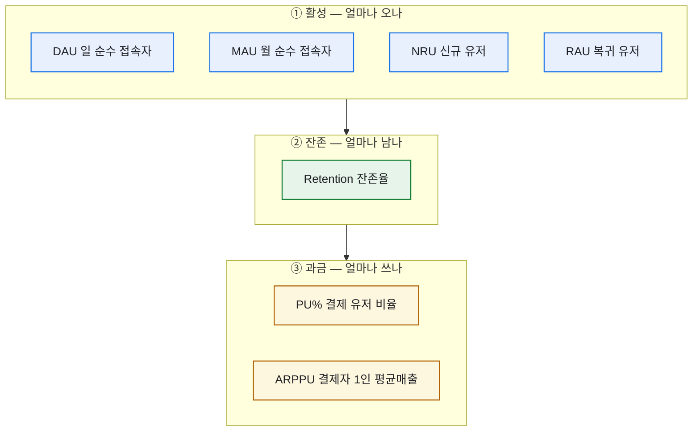
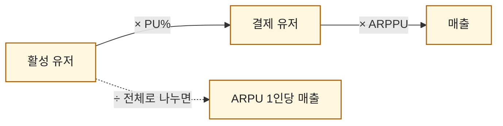

# 라이브 게임 핵심 지표 7종, 한 장으로 정의하기

> 라이브 게임 데이터를 만지던 시절, 매일 아침 제일 먼저 한 일은 지표판을 여는 거였다. 그런데 부끄럽게도 초반 몇 달은 **"DAU가 늘었는데 왜 매출은 그대로지?"** 같은 질문 앞에서 자꾸 말이 엉켰다. 지표를 '느낌'으로 알고 있었지 정의로 붙잡고 있지 않았던 거다. 그래서 어느 날 작정하고 일곱 개를 한 장에 눌러 담았다. 이 글은 그 한 장의 복원판이다. (숫자는 전부 합성 데이터고, 특정 게임·회사와 무관하다.)

## 이 일곱 개는 어떻게 묶이나?

먼저 관계부터 그려두면 머릿속이 한결 편하다. 일곱 지표는 사실 **세 계열**로 갈린다 — 얼마나 오나(활성), 얼마나 남나(잔존), 얼마나 쓰나(과금).



내가 헷갈렸던 이유가 여기서 풀렸다. **활성이 늘어도 그게 잔존과 과금으로 이어지지 않으면 매출은 안 움직인다.** 세 계열은 왼쪽에서 오른쪽으로 흐르는 깔때기 같은 거였다.

## 활성 지표 넷은 뭐가 다른가?

가장 많이 섞어 쓰는 게 이 넷이다. 핵심은 **'순수(unique)'** 라는 말 — 한 유저가 하루에 열 번 접속해도 DAU에는 1로만 잡힌다.

| 지표 | 뜻 | 합성 데이터 계산식(개념) |
|---|---|---|
| **DAU** | 그날 접속한 순수 유저 수 | `COUNT(DISTINCT user_id) WHERE 접속일 = 당일` |
| **MAU** | 그달 접속한 순수 유저 수 | `COUNT(DISTINCT user_id) WHERE 접속일 IN 당월` |
| **NRU** | 그날 처음 온 신규 유저 | `COUNT(*) WHERE 가입일 = 당일` |
| **RAU** | 이탈했다 돌아온 복귀 유저 | 최근 N일 미접속 후 당일 재접속한 유저 수 |

여기서 파생되는 게 하나 있다. DAU를 MAU로 나눈 **DAU/MAU 비율(스티키니스)** — 한 달에 온 사람 중 매일 오는 사람의 비중이다. 이게 높으면 '습관이 된 게임', 낮으면 '가끔 생각나면 들르는 게임'이다.

## 과금 지표는 왜 세 개나 필요한가?

매출 이야기를 할 때 나는 항상 **PU%와 ARPPU를 짝으로** 봤다. 하나만 보면 반드시 헛다리를 짚는다.



- **PU%** = 결제 유저 ÷ 활성 유저. "몇 명이 지갑을 여나."
- **ARPPU** = 매출 ÷ **결제 유저**. "지갑 연 사람이 얼마나 크게 쓰나."
- **ARPU** = 매출 ÷ **전체 유저**. PU%와 ARPPU를 한 숫자로 합친 것.

내가 겪은 전형적 착시가 이거였다. ARPU가 올라서 좋아했는데, 뜯어보니 PU%는 그대로고 **소수 고래 유저의 ARPPU만 튄** 경우. 매출의 건강함은 전혀 다른 이야기였다. 그래서 나는 늘 셋을 같이 적었다.

## 잔존(Retention)은 어디에 끼나?

리텐션은 활성과 과금 사이를 잇는 다리다. 보통 **M+1(가입 다음 달에도 접속했는지)** 을 먼저 본다.

```
Retention(M+1) = (이번 달 신규 중 다음 달에도 접속한 유저) ÷ (이번 달 신규 유저)
```

잔존이 낮으면 아무리 NRU를 밀어 넣어도 밑 빠진 독이다. 그래서 매출 시뮬레이션을 할 때도 리텐션을 반드시 변수로 넣는데, 그건 다음 글에서 이어가려 한다.

## 오늘의 한 장 요약

돌아보면 저 한 장을 만든 뒤로 유관부서와의 대화가 확 편해졌다. "DAU 늘었잖아요"에 "네, 근데 PU%랑 리텐션이 안 따라와서 매출은 제자리예요"라고 **같은 언어로** 답할 수 있게 됐으니까. 지표는 외우는 게 아니라, 이렇게 계열로 묶어 관계를 손에 쥐는 거더라.

*합성 데이터 기준의 개념 정리입니다. 실제 게임·회사의 수치나 내부 스키마와는 무관합니다.*
