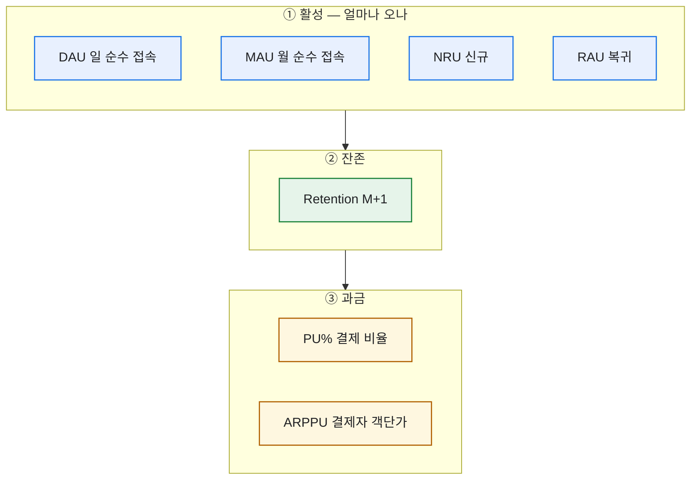
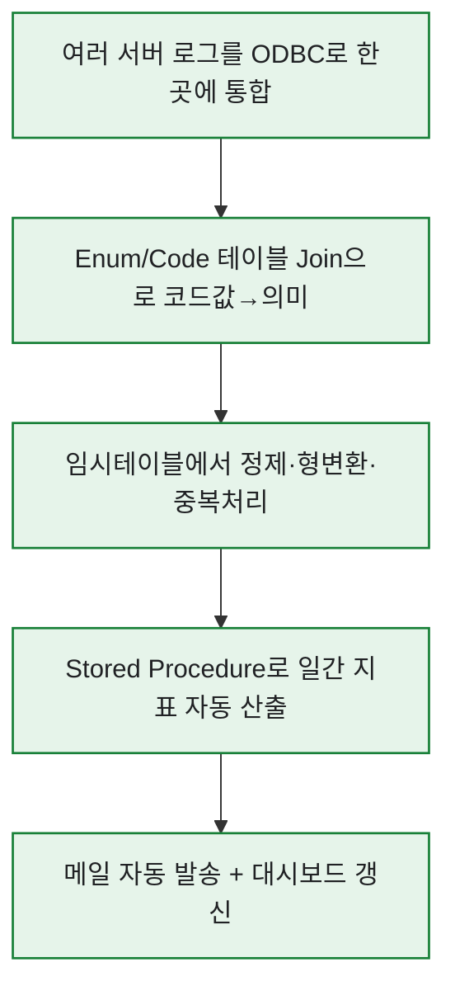

# 라이브 게임 핵심 지표 7종, 한 장으로 정의하기

> 라이브 게임의 운영 데이터를 맡던 시절, 매일 아침 제일 먼저 한 일은 전날 지표를 뽑는 Stored Procedure를 돌리는 거였다. 그런데 부끄럽게도 초반 몇 달은 **"DAU가 늘었는데 왜 매출은 그대로지?"** 같은 질문 앞에서 말이 자꾸 엉켰다. 지표를 '느낌'으로 알고 있었지 정의로 붙잡고 있지 않았던 거다. 그래서 작정하고, 그때 내가 실제로 매일 보던 일곱 개를 한 장에 눌러 담았다. 이 글은 그 한 장의 복원판이다. (게임명·내부 수치는 일반화한 합성 기준이다.)

## 지표를 보기 전에 — 나는 어떻게 가설을 세웠나?

숫자만 보면 안 된다는 걸 현장에서 배웠다. 나는 항상 **실제 플레이와 유저 반응(VOC)에서 가설을 먼저 세우고, 그걸 로그로 검증**하는 순서로 움직였다.


이 FLOW가 중요한 이유는, **지표는 가설을 검증하는 도구**이지 그 자체가 목적이 아니어서다. "요즘 특정 콘텐츠만 한다더라" 같은 VOC가 들어오면, 그걸 어떤 지표로 확인할지 정하고 로그를 팠다. 그 '어떤 지표'의 기본 재료가 아래 일곱 개다.

## 이 일곱 개는 어떻게 묶이나?

일곱 지표는 **세 계열**로 갈린다 — 얼마나 오나(활성), 얼마나 남나(잔존), 얼마나 쓰나(과금).



**활성이 늘어도 잔존과 과금으로 이어지지 않으면 매출은 안 움직인다.** 세 계열은 왼쪽에서 오른쪽으로 흐르는 깔때기다. 그래서 "DAU 늘었잖아요"는 그 자체로 절반의 이야기밖에 안 된다.

## 활성 지표 넷은 뭐가 다른가?

핵심은 **'순수(unique)'** — 한 유저가 하루 열 번 접속해도 DAU엔 1로만 잡힌다. 접속 '횟수'가 아니라 접속한 '사람 수'다.

| 지표 | 뜻 | 계산식(개념) |
|---|---|---|
| **DAU** | 그날 순수 접속자 | `COUNT(DISTINCT user_id) WHERE 접속일=당일` |
| **MAU** | 그달 순수 접속자 | `COUNT(DISTINCT user_id) WHERE 접속일 IN 당월` |
| **NRU** | 그날 신규 | `COUNT(*) WHERE 가입일=당일` |
| **RAU** | 복귀(재접속) | 최근 N일 미접속 후 당일 재접속 |

내가 매일 본 건 총량만이 아니라 **구성**이었다. 같은 DAU여도 NRU 비중이 크면 '신규로 겨우 버티는' 상태, RAU가 튀면 '컴백이 먹히는' 상태다. 그리고 DAU/MAU 비율(스티키니스)로 '습관이 된 게임인지'를 가늠했다.

## 과금 지표는 왜 셋이나?

매출을 말할 땐 **PU%와 ARPPU를 반드시 짝으로** 봤다. 하나만 보면 헛다리를 짚는다.

```
매출 = 활성유저 × PU%(결제 비율) × ARPPU(결제자 객단가)
ARPU = 매출 ÷ 전체 유저 = PU% × ARPPU
```

- **PU%** = 결제 유저 ÷ 활성 유저. 저변의 넓이.
- **ARPPU** = 매출 ÷ **결제 유저**. 객단가.
- **ARPU** = 매출 ÷ 전체. 둘을 합친 한 숫자.

실제로 겪은 착시가 이거였다. ARPU가 올라 좋아했는데, PU%는 그대로고 **소수 고래의 ARPPU만 튄** 경우. 그 고래가 이탈하면 매출이 절벽처럼 빠진다. 그래서 나는 결제 유저를 **금액 구간별로 쪼개** 쏠림까지 감시했다(이 구간별 접근은 뒤 글들의 핵심 무기가 된다).

## 잔존은 어디에 끼나?

리텐션은 활성과 과금을 잇는 다리다. 나는 **M+1(가입 다음 달 접속 여부)** 을, 그것도 최근 3개월 평균으로 봤다.

```
Retention(M+1) = (이번 달 신규 중 다음 달에도 접속한 유저) ÷ (이번 달 신규 유저)
```

잔존이 20%면 하루 3천 명을 유입해도 한 달 뒤 600명만 남는다. 잔존이 50%면 같은 유입으로 두 배 넘게 쌓인다. **유입보다 잔존이 게임 수명을 결정한다.** 그래서 매출 시뮬레이션에서도 이 M+1 리텐션을 반드시 변수로 넣었는데, 그건 다음 글에서 이어간다.

## 이 지표들을 매일 어떻게 자동으로 뽑았나?

정의를 잡았으면 그다음은 '매일 손 안 대고 나오게' 만드는 일이었다. 나는 이걸 세 겹으로 자동화했다.



- 서버가 여러 개로 흩어져 있어서, MariaDB·MySQL을 **ODBC로 MS-SQL에 연동**해 통합 지표를 만들었다.
- 로그는 코드값 범벅이라, **기획팀 Code 테이블(Enum)을 Join**해 사람이 읽는 지표로 바꿨다.
- 매일 도는 계산은 **Stored Procedure**로 묶어, 접속·과금·콘텐츠 지표를 손대지 않아도 나오게 했다.

그리고 여기서 끝이 아니었다. 유의미한 지표라고 유관부서가 판단하면, **BI팀과 협업해 지표 기획서를 쓰고 자동화로 배포**했다. 즉 내가 손으로 뽑던 분석이 팀의 상시 대시보드로 승격되는 흐름이었다. '지표를 정의한다'는 건 결국 이 자동화 파이프라인의 첫 단추를 끼우는 일이었다.

## 오늘의 한 장 요약

저 한 장을 만든 뒤로 사업PM·기획과의 대화가 확 편해졌다. "DAU 늘었잖아요"에 "네, 근데 PU%랑 리텐션이 안 따라와서 매출은 제자리예요"라고 **같은 언어로** 답할 수 있게 됐으니까. 지표는 외우는 게 아니라 계열로 묶어 관계를 손에 쥐는 거였고, 어떤 지표든 총량 한 숫자만 보면 반드시 속는다 — 구성과 분포를 같이 봐야 진실을 말하기 시작한다.

*실제 라이브 게임 운영 분석 경험을 바탕으로 하되, 게임명·내부 SP/스키마·실제 수치는 일반화한 합성 기준입니다.*
