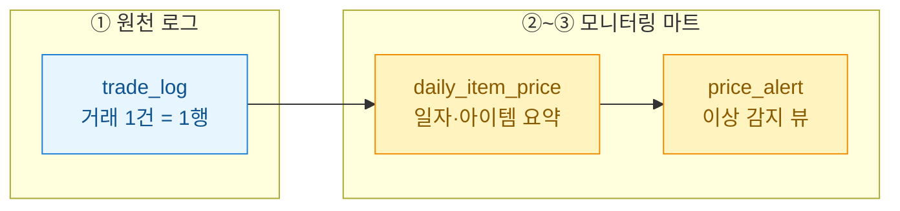
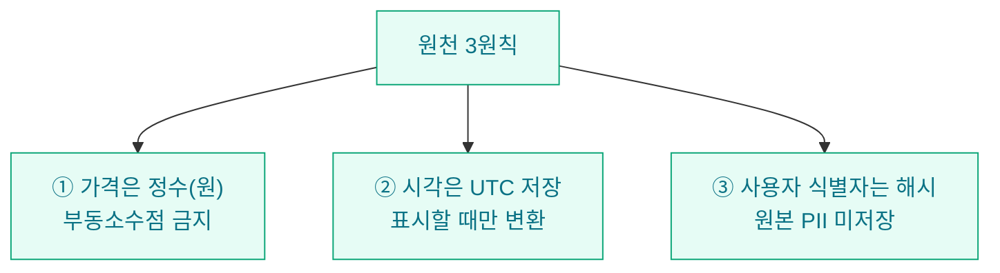

거래소가 붙은 게임을 들여다보다 보면 늘 같은 질문에 걸린다. "이 아이템, 어제보다 시세가 튀었나?" 이 한 줄짜리 질문에 답하려고 매번 원천 로그를 통째로 스캔하고 있었다. 그래서 모니터링 전용 마트(mart, 분석·조회에 최적화한 요약 테이블)를 따로 설계하기로 했다. 이 글은 그 설계 과정에서 내가 어디서 멈춰 고민했는지에 대한 기록이다.

> 이 글의 모든 데이터·스키마는 합성/더미이며, 특정 게임이나 서비스의 실제 구조가 아니다. 투자·거래 권유가 아니다.



## 왜 원천 로그 위에 마트를 따로 두나?

처음엔 거래 로그 하나로 다 해결하려 했다. 하지만 원천 로그와 모니터링 마트는 목적이 정반대다. 원천은 **한 건도 잃지 않는 것(completeness)**이 생명이고, 마트는 **빠르게 답하는 것(latency)**이 생명이다. 이 둘을 한 테이블에 욱여넣으면 둘 다 어중간해진다.

| 구분 | 원천 로그 | 모니터링 마트 |
| --- | --- | --- |
| 목적 | 감사·재현·정산 | 추세·이상 감지 |
| 입도(granularity) | 거래 1건 | 일자 × 아이템 |
| 갱신 | append-only(추가만) | 일 배치 재계산 |
| 보존 | 장기·불변 | 최근 N일 롤링 |
| 조회 패턴 | 특정 거래 추적 | 집계·대시보드 |

결론은 분리다. 원천은 그대로 쌓고, 그 위에 하루 한 번 요약을 얹는다.

## 원천 로그는 어디까지 남겨야 하나?

거래 1건을 표현하는 최소 컬럼을 정했다. 욕심내면 컬럼이 30개까지 늘어나는데, 모니터링에 실제로 쓰이는 건 소수였다.

```sql
-- 원천: 거래 1건 = 1행 (append-only, 합성 예시)
CREATE TABLE trade_log (
  trade_id     BIGINT       PRIMARY KEY,
  traded_at    TIMESTAMP    NOT NULL,   -- 체결 시각(UTC 저장 권장)
  item_id      INT          NOT NULL,
  unit_price   BIGINT       NOT NULL,   -- 개당 가격(원), 정수로 저장
  quantity     INT          NOT NULL,   -- 거래 수량
  server_id    SMALLINT     NOT NULL,   -- 서버/채널 분리
  buyer_hash   CHAR(16),                -- 익명화 해시(원본 ID 저장 금지)
  seller_hash  CHAR(16)
);
```

여기서 내가 못 박은 세 가지 원칙이 있다.



가격을 `FLOAT`으로 저장했다가 합계가 미묘하게 어긋나 하루를 날린 적이 있다. 그 뒤로 화폐는 무조건 정수(최소 단위)로 저장한다. 시각도 서버마다 로컬 타임존으로 들어오면 일자 경계가 흔들리니 UTC로 통일했다.

## 마트는 무엇을 하루 단위로 집계하나?

모니터링의 핵심 질문은 결국 "일자·아이템별로 시세가 어땠고 얼마나 거래됐나"다. 그래서 마트의 기본 입도를 **일자 × 아이템 × 서버**로 잡았다.

```sql
-- 마트: 일자·아이템 모니터링 요약 (일 배치로 재계산)
CREATE TABLE daily_item_price (
  stat_date     DATE     NOT NULL,
  item_id       INT      NOT NULL,
  server_id     SMALLINT NOT NULL,
  trade_cnt     INT      NOT NULL,   -- 거래 건수
  qty_sum       BIGINT   NOT NULL,   -- 거래 수량 합
  price_min     BIGINT,
  price_max     BIGINT,
  vwap          BIGINT,              -- 수량가중평균가
  price_median  BIGINT,              -- 튐 방지용 중앙값
  PRIMARY KEY (stat_date, item_id, server_id)
);

INSERT INTO daily_item_price
SELECT
  CAST(traded_at AS DATE)                       AS stat_date,
  item_id,
  server_id,
  COUNT(*)                                       AS trade_cnt,
  SUM(quantity)                                  AS qty_sum,
  MIN(unit_price)                                AS price_min,
  MAX(unit_price)                                AS price_max,
  SUM(unit_price * quantity) / SUM(quantity)     AS vwap,
  -- 중앙값은 DB별 함수 상이(PERCENTILE_CONT 등)
  CAST(PERCENTILE_CONT(0.5) WITHIN GROUP (ORDER BY unit_price) AS BIGINT) AS price_median
FROM trade_log
WHERE traded_at >= :from_ts AND traded_at < :to_ts
GROUP BY CAST(traded_at AS DATE), item_id, server_id;
```

여기서 가장 오래 고민한 건 "평균을 무엇으로 볼 것인가"였다. 단순 평균은 소량 고가 거래 한두 건에 쉽게 휘둘린다. 그래서 **수량가중평균가(VWAP)**를 기본 지표로 두고, 이상치에 강한 **중앙값(median)**을 함께 남겼다. 두 값의 간격이 벌어지면 그 자체가 "누군가 시세를 흔들고 있다"는 신호가 된다.

| 지표 | 강점 | 약점 | 언제 보나 |
| --- | --- | --- | --- |
| 단순 평균 | 계산 쉬움 | 이상치에 취약 | 잘 안 씀 |
| VWAP | 실거래 체감가 | 대량거래에 쏠림 | 기본 시세 |
| 중앙값 | 튐에 강함 | 물량 정보 없음 | 조작 감지 |

## 이상 신호는 어떻게 뽑아내나?

마트가 있으면 이상 감지는 짧은 쿼리로 끝난다. 전일 대비 시세가 급변했거나 거래량이 평소 대비 튄 아이템만 골라낸다.

```sql
-- 전일 대비 시세 급변 아이템 (합성 임계치: ±30%)
WITH d AS (
  SELECT stat_date, item_id, vwap,
         LAG(vwap) OVER (PARTITION BY item_id ORDER BY stat_date) AS prev_vwap
  FROM daily_item_price
  WHERE server_id = 1
)
SELECT item_id, stat_date, prev_vwap, vwap,
       ROUND((vwap - prev_vwap) * 100.0 / prev_vwap, 1) AS change_pct
FROM d
WHERE prev_vwap IS NOT NULL
  AND ABS(vwap - prev_vwap) * 1.0 / prev_vwap >= 0.30
ORDER BY ABS(change_pct) DESC;
```

`LAG`로 같은 아이템의 전일 값을 끌어와 변화율을 계산하는 방식이다. 원천 로그였다면 이 쿼리 한 번에 수백만 행을 훑어야 했지만, 마트에선 아이템당 하루 한 행이라 즉시 답이 나온다. 이게 마트를 따로 둔 값어치다.

## 되짚어보며

핵심은 세 가지로 압축된다. ① 원천과 마트를 목적에 따라 분리하고, ② 마트 입도를 일자·아이템·서버로 고정하며, ③ 시세는 단일 평균이 아니라 VWAP과 중앙값을 나란히 남겨 조작 신호까지 잡는다. 다음 편에서는 이 마트를 파티셔닝과 롤링 보존으로 어떻게 가볍게 유지하는지 다뤄볼 생각이다.
