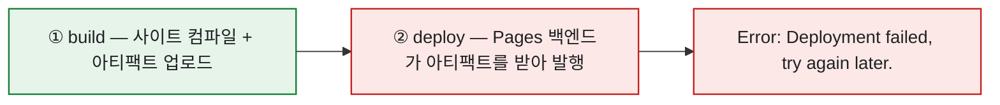
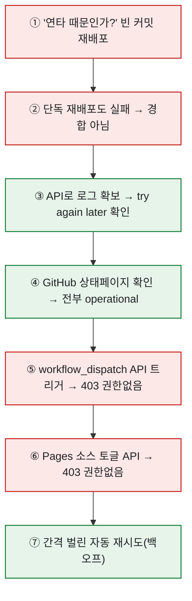

# GitHub Pages가 배포 실패로 멈췄을 때

> 블로그에 글을 왕창 올린 날이었다. 신나서 푸시했는데, 잠시 뒤 홈을 열어보니 새 글이 하나도 안 보였다. Actions를 열어보니 빨간 X. 로그 맨 아래엔 딱 한 줄 — `Error: Deployment failed, try again later.` 처음엔 '내가 뭘 잘못 넣었나' 했는데, 파고들수록 **내 잘못이 아니었다.** 이 글은 그날의 삽질과 복구를 그대로 남긴 기록이다. 같은 문구를 만난 누군가에게 지도가 되길 바라며.

## 대체 무슨 일이 있었나?

핵심부터. GitHub Pages 배포는 **두 단계**로 나뉜다. 그리고 내 경우 **앞은 멀쩡한데 뒤에서만 넘어졌다.**



로그를 보면 `build` 잡은 매번 성공했다. 아티팩트도 정상 업로드(`artifact_id` 발급됨). 그런데 `actions/deploy-pages`가 GitHub의 Pages 발행 백엔드에 "이거 발행해줘" 요청을 넣고 상태를 폴링하는 순간, 백엔드가 실패를 뱉었다.

```text
Creating Pages deployment with payload: ...
Created deployment for <sha>, ID: <sha>
Getting Pages deployment status...
Error: Deployment failed, try again later.
```

즉 **"내 저장소 안"이 아니라 GitHub 내부 발행 서비스가 처리를 못 한** 거였다. 빌드가 통과했다는 건 내 글·설정이 전부 정상이라는 뜻이니까.

## 내가 시도한 것들, 그리고 실패

여기서부터가 솔직한 삽질 기록이다. 순서대로 헛짚었다.



| 시도 | 기대 | 결과 |
|---|---|---|
| **빈 커밋으로 재배포** | 일시 오류면 다시 될 것 | ❌ 또 실패 |
| **연타 가설**(1분 간격 두 푸시 경합) | 천천히 하면 될 것 | ❌ **단독 배포도 실패** → 경합 아님 |
| **로그 직접 조회**(API) | 진짜 에러 확인 | ✅ `try again later` = GitHub 측 |
| **상태 페이지 확인** | 인시던트 있나 | ✅ 전부 operational(그래도 실제 배포는 실패) |
| **`workflow_dispatch`로 재트리거** | 커밋 안 쌓고 재실행 | ❌ 403(토큰에 actions 권한 없음) |
| **Pages 소스 토글(API)** | 설정 리셋 | ❌ 403(토큰에 pages 권한 없음) |

가장 크게 헛짚은 건 **"연타 때문"** 가설이었다. 짧은 시간에 여러 번 푸시해서 그런 줄 알았는데, **빈 커밋 하나짜리 단독 배포도 똑같이 실패**했다. 그 순간 경합설은 폐기됐다. 범인은 내 손이 아니라 GitHub 백엔드였다.

## 왜 이게 나는 걸까?

`Deployment failed, try again later`는 **GitHub Pages 발행 파이프라인의 일시적 실패**다. 알아두면 마음이 편해지는 사실 몇 가지.


- **상태 페이지가 초록불이어도** 특정 시간대·특정 저장소에서 배포 API가 간헐 실패할 수 있다.
- **유료로 올려도 안 없어진다.** Pages 사용 한도는 무료·유료가 같아서, 돈으로 해결되는 문제가 아니다.
- 짧은 간격 **연타는 오히려 독**이다. 시간당 배포 소프트 한도를 건드릴 수 있어서, 간격을 벌리는 게 맞다.
- 나만 겪은 게 아니었다. `actions/deploy-pages`의 이슈 #418, 커뮤니티 Discussion #200823에 같은 증상이 줄줄이 올라와 있었다.

## 커뮤니티가 찾아낸 복구법은?

혼자 끙끙대다 같은 증상의 해결 사례들을 찾았다. 공통 처방은 **"저장된 Pages 설정을 다시 적용해 내부 상태를 리셋"** 하는 것이었다. 두 갈래다.

**방법 A — 설정 화면에서 소스 토글 (가장 쉬움)**

`Settings → Pages → Source`를 반대로 바꿨다 되돌리면 Pages 내부 상태가 초기화된다.


⚠️ 반드시 **마지막은 원래 소스로** 끝내야 한다. Actions로 빌드하는 사이트를 branch로 두면 소스가 그대로 노출된다.

**방법 B — API로 설정 재적용 후 새 커밋 (gh CLI)**

브랜치 배포를 쓰는 저장소(일본어 블로그 nikkie-ftnext 사례)는 이렇게 풀었다고 한다. 저장된 설정을 그대로 다시 PUT하고, 브랜치에 새 커밋을 강제로 밀어 참조 커밋을 갱신하는 방식이다.

```bash
# ⚠️ 이건 '브랜치에서 배포' 저장소의 예시다
gh api -X PUT repos/OWNER/REPO/pages \
  -f build_type=legacy \
  -f 'source[branch]=gh-pages' \
  -f 'source[path]=/'
# 그다음 발행 워크플로를 다시 실행해 새 커밋 push
```

여기서 **중요한 함정** 하나. 위 명령은 **'브랜치에서 배포'** 저장소용이다. 내 사이트처럼 **'GitHub Actions'로 배포**하는 저장소가 저 `legacy / gh-pages`를 그대로 따라 하면 오히려 망가진다(gh-pages 브랜치가 없으니까). GitHub Actions 저장소라면 `-f build_type=workflow`로 재적용해야 맞다. 남의 해결법을 복붙하기 전에 **내 저장소가 어느 방식인지부터** 확인해야 한다는 걸 여기서 배웠다.

그리고 나한텐 이 두 방법 다 **권한 벽**이 있었다. 내가 자동화에 쓰던 토큰엔 Pages·Actions 설정을 바꿀 권한이 없어서 API가 403을 뱉었다. 결국 이 리셋은 **저장소 소유자가 직접**(UI 또는 본인 gh) 해야 하는 일이었다.

## 결국 어떻게 풀렸나?

토글 권한이 없으니, 내가 할 수 있는 건 **"간격을 벌려 계속 두드리기"** 뿐이었다. 그래서 8분 간격으로 빈 커밋을 밀어 재배포를 시도하는 백오프 루프를 걸어뒀다.


그리고 정말로, 처음 실패로부터 **약 35분쯤 지나자 재시도 중 하나가 그냥 통과**했다. 토글도, 별다른 조치도 없이. GitHub 백엔드가 스스로 회복된 것이다. 사이트가 살아나고 홈 최신글에 그날 올린 글들이 주르륵 떴을 때, 허무하면서도 안도했다.

## 오늘의 교훈

돌아보면 이 사건이 남긴 건 몇 줄로 정리된다.

- **콘텐츠는 안전하다.** 빌드가 통과했다면 글·설정은 멀쩡하고, 전부 git에 들어가 있으니 하나도 안 날아간다. 배포만 밀리는 거다.
- **연타 금지.** `try again later`엔 간격을 벌린 재시도가 정답이다. 급하게 두드릴수록 나아지지 않는다.
- **남의 해결법은 내 구성부터 확인하고.** 브랜치 배포용 명령과 Actions 배포용 명령은 다르다.
- **결국 생살여탈권은 GitHub에 있다.** 내가 아무리 자동화를 잘 짜둬도, 백엔드가 뻗으면 기다리는 수밖에 없다. 그걸 인정하고 나니 마음이 편해졌다.

무언가 안 되면 제일 먼저 '내가 뭘 잘못했지'를 의심하는 게 습관인데, 가끔은 정말 내 잘못이 아니다. 그럴 땐 로그를 끝까지 읽고, 상태를 확인하고, **차분히 기다리는 것**도 훌륭한 대응이더라.

*참고: `actions/deploy-pages` Issue #418, GitHub Community Discussion #200823, nikkie-ftnext 블로그의 복구 사례(브랜치 배포 케이스). 이 글은 제가 직접 겪은 장애를 기록한 것으로, 복구법은 저장소 구성에 따라 다를 수 있습니다.*
