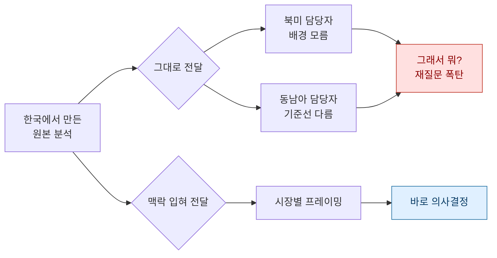
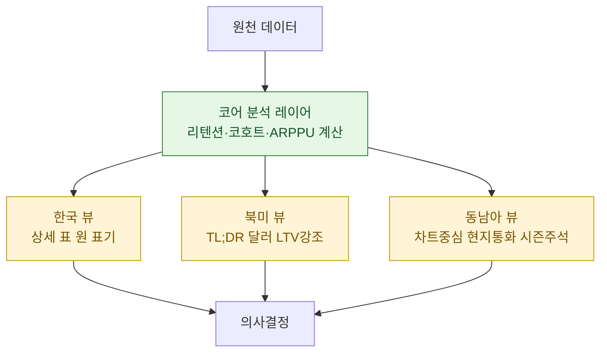

> "숫자는 하나인데, 그 숫자를 읽는 눈은 시장마다 다르더라."

한국 사무실에서 새벽 두 시에 뽑아 놓은 리텐션 코호트 하나가, 다음 날 북미 담당자한테는 "그래서 뭘 하라는 거냐"는 답장으로 돌아온 적이 있다. 나는 분명 완벽한 분석을 보냈다고 생각했는데. 오늘은 그때 이후로 내가 몸으로 배운, 같은 분석을 여러 시장 담당자에게 전달하는 글로벌 리포팅 노하우를 풀어보려 한다. (아래 모든 숫자와 예시는 전부 합성·더미다. 실제 게임이나 회사 데이터가 아니다.)

## 왜 "잘 만든 분석"이 국경을 넘으면 안 통할까?

처음엔 내 분석이 부족한 줄 알았다. 그런데 아니었다. 문제는 분석의 품질이 아니라 맥락(context)이었다.

한국 팀은 이미 배경을 다 안다. 이번 주에 무슨 이벤트가 있었는지, 왜 갑자기 신규 유저(NRU, New Registered User = 새로 가입한 사람 수)가 튀었는지 굳이 설명 안 해도 통한다. 그런데 북미나 동남아 담당자는 그 배경을 하나도 모른 채 표 하나만 딱 받는다. 그들에게 내 표는 "숫자 덩어리"일 뿐이다.

한 가지 더. 시장마다 "당연하게 여기는 기준선"이 다르다. 예를 들어 D1 리텐션(가입 다음 날 다시 돌아온 유저 비율)이 40퍼센트라고 하면, 어떤 시장 담당자는 "훌륭하다"고 하고 어떤 담당자는 "낮다"고 한다. 같은 40퍼센트인데.

결국 핵심은 이거다. 분석은 한 번 만들지만, 전달은 청중 수만큼 다시 만들어야 한다.

## 지역마다 뭐가 그렇게 다른가?

내가 겪은 차이를 표로 정리해 봤다. 물론 이건 일반화한 경향일 뿐, 사람마다 팀마다 다르다는 걸 전제로 본다.

| 구분 | 한국 본사 | 북미 유관부서 | 동남아 유관부서 |
| --- | --- | --- | --- |
| 원하는 포맷 | 상세 표 + 그래프 | 한 줄 결론 먼저(TL;DR) | 시각 자료 위주 |
| 지표 감도 | ARPPU에 민감 | LTV·회수기간 중시 | 픽률·참여율 중시 |
| 통화 표기 | 원 | 달러 | 현지 통화 + 달러 병기 |
| 시간대 | KST 기준 | 리포트에 타임존 명시 필요 | 명절·라마단 등 시즌성 큼 |
| 커뮤니케이션 톤 | 맥락 공유 전제 | 결론→근거 순서 | 배경 설명 넉넉히 |

여기서 내가 제일 많이 데인 게 두 개다. 하나는 통화, 하나는 시간대.

매출 시뮬레이션을 보낼 때 나는 습관적으로 원 단위로 뽑는다. 예상매출 = DAU × PU퍼센트 × ARPPU 라는 간단한 공식으로 예측선을 그리는데(DAU는 하루 접속자, PU퍼센트는 그중 결제 유저 비율, ARPPU는 결제 유저 1인당 평균 결제액), 이걸 그대로 북미에 보내면 담당자가 머릿속으로 환율 계산을 해야 한다. 그 순간 내 리포트는 "번역이 필요한 문서"가 된다. 그래서 지금은 시장별로 통화를 바꿔서 보낸다. 북미엔 달러로, 동남아엔 현지 통화와 달러를 나란히.

시간대는 더 사소해 보이지만 더 자주 사고를 낸다. "어제 매출"이라고 썼을 때 그 "어제"가 KST 기준인지 현지 기준인지 안 밝히면, 같은 날짜의 숫자가 두 개가 되어 버린다.

## 그럼 하나의 분석을 어떻게 여러 버전으로 쪼갤까?

내가 정착한 방식은 "코어(core)는 하나, 래퍼(wrapper)는 여럿"이다. 분석의 본체 즉 계산 로직과 원천 숫자는 절대 시장마다 다시 만들지 않는다. 그건 딱 한 번, 신뢰할 수 있게 만들어 둔다. 대신 그 위에 시장별 포장지만 갈아 끼운다.

이렇게 하면 좋은 점이 하나 있다. 나중에 "왜 북미랑 동남아 매출 숫자가 다르냐"는 질문이 와도, 코어는 같으니까 차이의 원인이 프레이밍(통화·기간·집계 범위)에 있다는 걸 바로 짚어줄 수 있다. 숫자 자체를 의심하는 소모적인 대화를 안 하게 된다.

실무적으로 나는 코어 계산을 저장 프로시저나 재사용 쿼리로 한 번 정의해 두고, 그 결과를 시장별 템플릿에 꽂는다. 조회 도구(예: 사내 BI 대시보드)에서는 같은 데이터셋에 필터만 바꿔 여러 탭을 만든다. 핵심은 "숫자를 만드는 곳"과 "숫자를 보여주는 곳"을 분리하는 것이다.

## 표 하나를 보낼 때 나는 어떤 순서로 쓰나?

북미 담당자가 나에게 가르쳐 준 습관이 있다. 결론을 맨 위에 놓아라. 나는 원래 "데이터→분석→결론" 순서로 쓰는 사람이었는데, 바쁜 해외 담당자에겐 이게 고문이었다. 지금은 이 4단 구조를 쓴다.

1. 한 줄 결론(TL;DR): "D7 리텐션이 지난달 대비 5퍼센트포인트 떨어졌다. 신규 유입 채널 품질 문제로 보인다."
2. 근거 숫자 한두 개: 표는 크게 말고, 결론을 뒷받침하는 딱 그 숫자만.
3. 맥락 주석: "이 기간에 동남아는 명절 시즌이라 픽률 지표가 평소와 다르게 튄다" 같은 배경.
4. 다음 액션 제안: "채널별로 쪼개 다시 뽑아볼까요?"

특히 3번 맥락 주석이 글로벌 리포팅의 핵심이라고 생각한다. 한국 팀엔 생략해도 되는 그 한 줄이, 해외 담당자에겐 오해를 막는 방패가 된다. 픽률(특정 캐릭터나 아이템이 선택된 비율)이 평소보다 높게 나왔을 때, 그게 진짜 인기 상승인지 아니면 시즌 이벤트 때문인지를 내가 미리 짚어주지 않으면, 상대는 잘못된 결론으로 달려간다.

## 오해를 미리 막는 체크리스트는?

시장별로 리포트를 보내기 직전에 내가 훑는 목록이다. 별거 아닌데 이거 덕분에 재질문이 확 줄었다.

| 점검 항목 | 확인 내용 |
| --- | --- |
| 통화 | 받는 시장 기준 통화로 바꿨나, 병기했나 |
| 시간대 | "어제/이번 주"의 기준 타임존을 명시했나 |
| 지표 정의 | D1·ARPPU 같은 약어를 한 줄 각주로 풀었나 |
| 기준선 | "이 수치가 높은지 낮은지" 비교 기준을 넣었나 |
| 시즌성 | 명절·라마단·연말 같은 시장별 이벤트를 반영했나 |
| PII·기밀 | 유저 개인정보나 내부 스키마명이 새지 않았나 |

마지막 줄은 특히 강조하고 싶다. 글로벌로 자료가 오가면 받는 사람이 많아지는 만큼, 개인정보나 내부 정보가 새 나갈 통로도 늘어난다. 그래서 나는 외부 공유용 리포트엔 유저 식별자나 내부 테이블 구조가 절대 안 들어가게 한 번 더 거른다. 공유할 땐 집계된 숫자와 비율만.

## 마무리

글로벌 리포팅을 하면서 내가 얻은 가장 큰 깨달음은, 분석가의 일이 "숫자를 만드는 것"에서 끝나지 않는다는 거였다. 오히려 그 숫자가 다른 문화, 다른 기준, 다른 시간대의 사람 머릿속에 정확히 안착하게 만드는 것까지가 내 일이더라.

코어는 하나로 단단하게. 포장지는 청중 수만큼 다르게. 그리고 한국에선 생략해도 되는 맥락 한 줄을, 국경을 넘길 땐 반드시 붙인다. 이 세 가지만 지켜도 "그래서 뭘 하라는 거냐"는 답장은 확실히 줄어든다. 오늘도 같은 숫자를 세 가지 언어의 마음으로 포장하며, 나는 조금씩 나은 전달자가 되어 간다.

## 참고자료

- [[game-metrics-7-definitions]] — 리텐션·ARPPU·픽률 등 핵심 지표 정의
- [[arpu-vs-arppu]] — ARPU와 ARPPU를 언제 각각 봐야 하는가
- [[retention-curve-beyond-m1]] — M1 이후 리텐션 곡선 읽는 법
- [[revenue-simulation-dau-pu-arppu]] — 예상매출 = DAU × PU% × ARPPU 시뮬레이션
- [[game-data-sql-recipes-retention-ltv]] — 리텐션·LTV SQL 레시피 모음
- 합성 데이터 레시피 저장소: https://github.com/DBhyeong/game-data-recipes

<!-- 안전: 합성/더미 데이터, 회사·실데이터·PII 없음. -->
