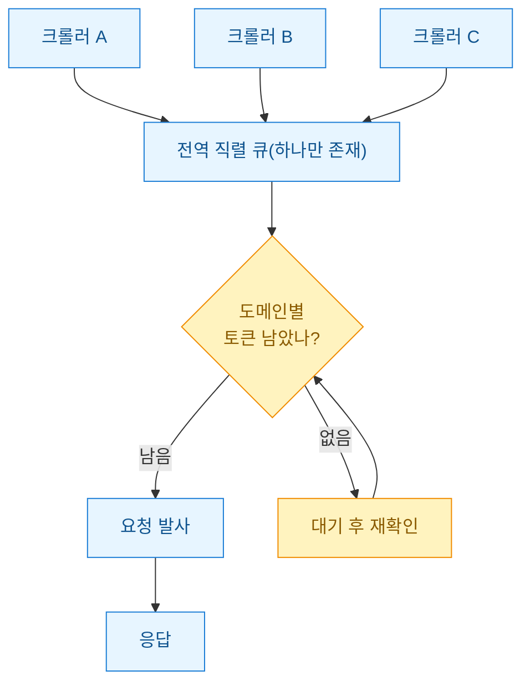
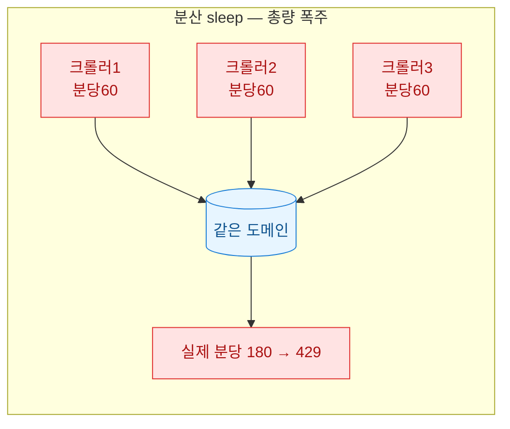
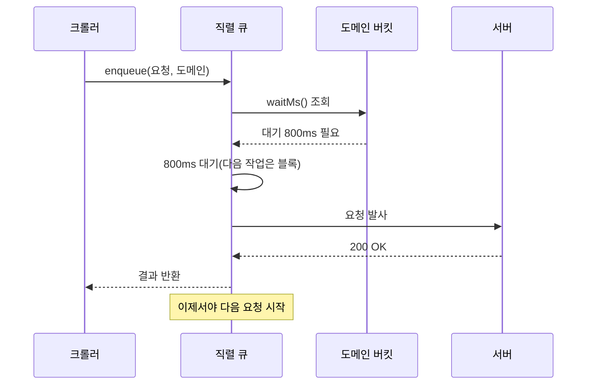

공개 데이터를 긁는 스크립트를 여러 개 돌리다 처음 429(Too Many Requests, 서버가 "너무 자주 왔다"며 거절하는 응답)를 만났을 때, 나는 스크립트마다 `sleep`을 하나씩 박아 해결한 줄 알았다. 그런데 크롤러가 세 개, 네 개로 늘어나자 다시 막혔다. 각 스크립트는 얌전히 자기 속도를 지켰지만 **같은 도메인에 동시에 붙는 총량**은 아무도 세지 않았기 때문이다. 이 글은 그때 다시 설계한 "전역 직렬 스로틀(throttle, 요청 속도를 조절하는 밸브)" 패턴을 정리한 것이다.

> 면책: 아래 예시는 공개 DART 또는 합성·더미 데이터를 가정한다. 특정 기업의 회계판단이나 투자권유가 아니며, 크롤링 전 반드시 각 사이트의 robots.txt·이용약관·명시된 레이트리밋을 확인해야 한다.

먼저 전체 그림부터. 여러 크롤러가 각자 요청을 던지지만 실제로 나가는 통로는 하나의 큐로 좁혀지고, 그 큐가 도메인별 한도를 보며 내보낸다.



## 왜 스크립트마다 sleep을 박으면 안 됐나?

처음 방식은 크롤러 안에 `time.sleep(1)`을 두는 것이었다. 크롤러 하나만 돌 때는 완벽했다. 문제는 **한도의 주체가 크롤러가 아니라 서버**라는 점이다. 서버는 "이 IP에서 분당 60건"을 세지, "네 스크립트가 몇 개인지"는 세지 않는다.

크롤러가 세 개면 각자 분당 60건씩, 합쳐서 분당 180건이 나간다. 개별로는 규칙을 지켰는데 총량은 3배가 된 것이다. 게다가 DART API와 일반 포털은 한도가 다르다. 하나는 분당 200건까지 너그럽고 다른 하나는 분당 30건에서 바로 막힌다. 도메인마다 다른 한도를, 여러 프로세스가 나눠 지키게 하려니 sleep 방식으로는 답이 없었다.



깨달은 원칙은 하나였다. **속도 제한은 요청을 내보내는 지점을 한 곳으로 모아야 지킬 수 있다.** 그 한 곳이 전역 직렬 큐다.

## 도메인마다 다른 한도를 어떻게 한 곳에서 지키나?

핵심 도구는 토큰버킷(token bucket)이다. 비유하면 **도메인별로 물통을 하나씩 두고, 초당 일정량씩 물을 채우는 것**이다. 요청 한 건은 물 한 모금을 마시는 행위다. 물이 없으면 찰 때까지 기다린다. 도메인마다 물통 크기(버스트 허용치)와 채우는 속도(분당 한도)를 다르게 주면, 관대한 API와 빡빡한 포털을 같은 코드로 다룰 수 있다.

```javascript
// 도메인별 토큰버킷 — 합성 예시(동작하는 최소 구조)
class TokenBucket {
  constructor(ratePerSec, burst) {
    this.rate = ratePerSec;   // 초당 채우는 토큰
    this.capacity = burst;    // 물통 최대치
    this.tokens = burst;
    this.last = Date.now();
  }
  _refill() {
    const now = Date.now();
    this.tokens = Math.min(
      this.capacity,
      this.tokens + ((now - this.last) / 1000) * this.rate
    );
    this.last = now;
  }
  // 토큰 1개가 찰 때까지 필요한 대기(ms). 0이면 바로 통과
  waitMs() {
    this._refill();
    if (this.tokens >= 1) { this.tokens -= 1; return 0; }
    return Math.ceil(((1 - this.tokens) / this.rate) * 1000);
  }
}

// 도메인마다 한도를 다르게
const buckets = {
  "opendart.fss.or.kr": new TokenBucket(200 / 60, 20), // 분당 200, 버스트 20
  "portal.example.go.kr": new TokenBucket(30 / 60, 5),  // 분당 30, 버스트 5
};
```

여기서 끝이 아니다. 버킷만 있으면 여러 크롤러가 **동시에** 물통을 들여다보다 같은 마지막 한 모금을 둘 다 마셔버린다(경쟁 상태). 그래서 물통을 확인하고 마시는 행위 자체를 한 줄로 세워야 한다. 그게 직렬 큐다.

## 하나의 직렬 큐로 어떻게 순서를 세우나?

나는 요청을 함수로 감싸 큐에 넣고, 큐는 **앞의 요청이 완전히 끝나기 전에는 다음을 시작하지 않도록** 프라미스 체인 하나로 이어 붙였다. 자바스크립트는 단일 스레드라 이 방식이 특히 깔끔했다. 시간순으로 보면 이렇게 흐른다.



큐 자체는 생각보다 짧다. 핵심은 `this.chain`을 계속 자기 자신 뒤에 붙여 **전역에서 단 하나의 실행 순서**를 만드는 것이다.

```javascript
class GlobalSerialThrottle {
  constructor(buckets) {
    this.buckets = buckets;
    this.chain = Promise.resolve(); // 전역 실행 순서, 단 하나
  }
  schedule(domain, task) {
    // 앞 작업 뒤에 이어 붙인다 → 자동으로 직렬
    const run = this.chain.then(async () => {
      const bucket = this.buckets[domain];
      let wait = bucket.waitMs();
      while (wait > 0) {                  // 토큰 찰 때까지
        await sleep(wait);
        wait = bucket.waitMs();
      }
      return task();                      // 실제 요청
    });
    // 실패해도 체인이 끊기지 않게 삼킨다
    this.chain = run.catch(() => {});
    return run;
  }
}
const sleep = (ms) => new Promise((r) => setTimeout(r, ms));
```

주의할 함정이 하나 있었다. `this.chain = run` 그대로 두면 요청 하나가 예외를 던졌을 때 체인 전체가 rejected 상태로 오염되어 이후 요청이 전부 죽는다. 그래서 체인에 물릴 때는 `.catch(() => {})`로 에러를 삼키고, 호출자에게 돌려주는 `run`은 원본 그대로 두어 각자 예외를 받게 분리했다. 이 한 줄을 놓쳐서 크롤링이 중간에 통째로 멈춘 적이 있다.

## 429가 오면 그다음은?

토큰버킷으로 총량을 지켜도 서버 사정으로 429나 503이 튈 수 있다. 이때는 **서버가 알려주는 대로 물러서는 것**이 정석이다. 응답 헤더의 `Retry-After`가 있으면 그 시간을 존중하고, 없으면 지수 백오프(실패할수록 대기를 2배씩 늘리기)에 약간의 무작위(지터)를 섞는다. 지터가 없으면 여러 요청이 정확히 같은 순간 재시도해 다시 몰린다.

```javascript
async function withRetry(fetchOnce, maxTry = 4) {
  for (let attempt = 0; ; attempt++) {
    const res = await fetchOnce();
    if (res.status !== 429 && res.status !== 503) return res;
    if (attempt >= maxTry) return res; // 포기하고 상위에서 처리
    const ra = Number(res.headers.get("retry-after"));
    const base = ra ? ra * 1000 : 2 ** attempt * 500;
    const jitter = Math.random() * 300; // 동시 재시도 분산
    await sleep(base + jitter);
  }
}
```

여기까지 붙이자 그림이 완성됐다. 평소엔 토큰버킷이 총량을 눌러 429 자체가 거의 안 뜨고, 그래도 뜨면 백오프가 받아낸다. 이중 안전장치다.

## 결국 무엇이 달라졌나?

교훈은 단순하다. **속도 제한의 단위는 "내 스크립트"가 아니라 "서버가 세는 대상(IP·도메인)"이다.** 그 단위에 맞춰 요청을 한 통로로 모으고, 통로 안에서 도메인별 물통과 백오프를 두면 크롤러를 몇 개로 늘려도 총량이 새지 않는다. 내 경우엔 sleep을 걷어내고 이 구조로 바꾼 뒤로 야간 배치에서 429 로그가 눈에 띄게 줄었다.

- **한 곳에 모으기**: 요청 발사 지점을 전역 직렬 큐 하나로.
- **도메인별로 다르게**: 토큰버킷의 rate·burst를 엔드포인트마다 따로.
- **거절엔 예의 있게**: `Retry-After` 우선, 지터 섞은 지수 백오프.

다음엔 이 스로틀을 여러 프로세스(다른 PC·컨테이너)까지 확장하는 문제를 다뤄볼 생각이다. 프로세스가 갈라지면 인메모리 큐로는 부족하고, Redis 같은 공유 저장소에 토큰을 두어야 한다. 그때는 원자적 감산(여러 프로세스가 동시에 물통을 마셔도 안 겹치게)이 새 숙제가 된다.
