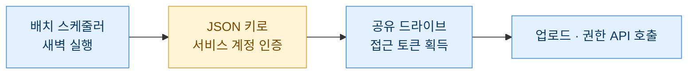
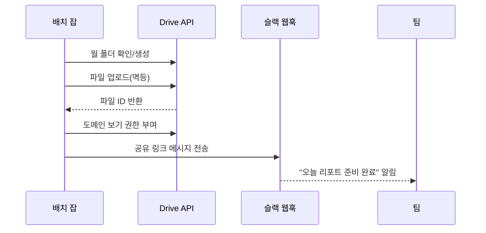

> "분석은 5분, 파일 올리고 링크 붙여넣는 건 15분." 매일 이 짓을 반복하다 문득, 올리는 일 자체를 코드에 맡기기로 했다.

아침마다 나는 같은 리듬을 탔다. 스케줄러가 밤사이 돌려놓은 리텐션 리포트를 열고, 차트 몇 장을 확인하고, 그걸 드라이브에 올린 다음, 팀 채널에 링크를 붙여넣는다. 분석 자체는 이미 자동화돼 있었는데, 정작 "결과를 남들이 볼 수 있게 놓아두는" 마지막 한 걸음이 늘 수동이었다. 손이 가는 일은 빠지는 날이 생기고, 빠지면 "오늘 리포트 어디 있어요?"라는 메시지가 날아온다. 그래서 이 마지막 구간을 Google Drive API로 아예 없애버린 이야기를 적어둔다.

## 왜 하필 드라이브 API였나?

선택지는 여러 개였다. 사내 위키에 붙이거나, 슬랙에 파일을 직접 던지거나, 사내 스토리지를 쓰거나. 그런데 우리 팀은 이미 드라이브를 "공용 캐비닛"처럼 쓰고 있었다. 사람들이 익숙한 곳에 결과가 쌓여야 실제로 열어본다. 새 장소를 만들면 아무도 안 간다. 이게 첫 번째 이유다.

두 번째는 자동화 친화성이다. 리포트는 매일 다른 파일명으로 생기고(예: `retention_2026-07-10.xlsx`), 월별 폴더로 정리돼야 하고, 팀 전체에 "보기" 권한이 걸려야 한다. 이 세 가지 — 업로드, 폴더 배치, 권한 부여 — 를 사람 손 대신 코드로 처리하려면 프로그래밍 가능한 API가 필요했다.

| 방식 | 팀 접근성 | 자동화 | 폴더/권한 제어 |
| --- | --- | --- | --- |
| 손으로 드라이브 업로드 | 좋음 | 없음 | 수동 |
| 슬랙에 파일 직접 첨부 | 보통(검색 약함) | 가능 | 약함 |
| Drive API 자동 업로드 | 좋음 | 완전 | 세밀함 |

세 번째로, 나는 이미 다른 산출물에서 "매일 정해진 시각에 저장 프로시저를 돌리고 결과를 엑셀로 떨구는" 파이프라인을 운영하고 있었다. 그 파이프라인의 마지막 노드에 업로드 스텝 하나만 이어붙이면 되는 구조라, 새로 뭘 짓는 게 아니라 기존 흐름을 연장하는 셈이었다.

## 인증은 어떻게 통과하나 — 서비스 계정 이야기

자동화에서 제일 먼저 막히는 지점이 인증이다. 사람이 매번 브라우저에서 로그인 버튼을 누르는 OAuth는 배치 작업에 안 맞는다. 새벽 3시에 아무도 버튼을 눌러줄 수 없기 때문이다.

그래서 쓴 게 서비스 계정(service account)이다. 사람이 아니라 "프로그램 전용 로봇 계정"이라고 생각하면 쉽다. 구글 클라우드 콘솔에서 서비스 계정을 만들면 JSON 키 파일을 하나 주는데, 이걸 프로그램이 읽어서 신분증처럼 제시한다. 사람 개입이 0인 게 핵심이다.

```python
from google.oauth2 import service_account
from googleapiclient.discovery import build

SCOPES = ["https://www.googleapis.com/auth/drive"]

def get_drive_service(key_path: str):
    creds = service_account.Credentials.from_service_account_file(
        key_path, scopes=SCOPES
    )
    return build("drive", "v3", credentials=creds)
```

여기서 내가 데인 함정 하나. 서비스 계정은 자기만의 드라이브 저장 공간이 사실상 없다. 그래서 개인 드라이브에 그냥 올리면 "용량 초과" 같은 엉뚱한 에러를 만난다. 해결책은 팀 공유 드라이브(Shared Drive)를 만들고 거기에 서비스 계정을 멤버로 초대하는 것이다. 그러면 파일 소유권이 팀(공유 드라이브)에 귀속돼서 나 개인이 퇴사하거나 계정이 바뀌어도 리포트가 사라지지 않는다. 이건 "봇이 만든 자료의 주인은 팀이어야 한다"는 원칙과도 맞아떨어진다.



## 매일 다른 파일을 어디에 어떻게 올리나?

업로드 자체는 의외로 짧다. `files().create()`에 파일 본체(media)와 이름·부모 폴더 같은 메타데이터를 얹어 호출하면 끝이다. 다만 실전에선 세 가지를 더 신경 썼다.

첫째, 월별 폴더 자동 배치. 리포트가 한 폴더에 수백 개 쌓이면 못 찾는다. 그래서 `2026-07` 같은 월 폴더를 찾고, 없으면 만들고, 그 안에 넣도록 했다.

둘째, 멱등성(idempotency). 배치가 재시도되면 같은 리포트가 두 번 올라갈 수 있다. 나는 업로드 전에 "같은 이름 파일이 그 폴더에 이미 있나?"를 조회해서, 있으면 새로 만들지 않고 내용만 갱신(update)하도록 했다. 이러면 몇 번을 돌려도 파일은 딱 하나만 남는다.

셋째, MIME 타입. 엑셀을 그냥 올리면 드라이브 파일로 남고, 구글 시트로 자동 변환하고 싶으면 변환 MIME을 지정해야 한다. 나는 원본 보존이 중요해 변환 없이 올리는 쪽을 택했다.

```python
from googleapiclient.http import MediaFileUpload

def find_or_create_folder(svc, name, parent_id, drive_id):
    q = (f"name='{name}' and '{parent_id}' in parents "
         "and mimeType='application/vnd.google-apps.folder' and trashed=false")
    res = svc.files().list(
        q=q, corpora="drive", driveId=drive_id,
        includeItemsFromAllDrives=True, supportsAllDrives=True,
        fields="files(id)").execute()
    hits = res.get("files", [])
    if hits:
        return hits[0]["id"]
    meta = {"name": name, "parents": [parent_id],
            "mimeType": "application/vnd.google-apps.folder"}
    return svc.files().create(body=meta, supportsAllDrives=True,
                              fields="id").execute()["id"]

def upload_or_update(svc, local_path, filename, folder_id, drive_id):
    q = f"name='{filename}' and '{folder_id}' in parents and trashed=false"
    existing = svc.files().list(
        q=q, driveId=drive_id, corpora="drive",
        includeItemsFromAllDrives=True, supportsAllDrives=True,
        fields="files(id)").execute().get("files", [])
    media = MediaFileUpload(local_path, resumable=True)
    if existing:  # 멱등: 이미 있으면 갱신
        return svc.files().update(fileId=existing[0]["id"], media_body=media,
                                  supportsAllDrives=True, fields="id").execute()
    meta = {"name": filename, "parents": [folder_id]}
    return svc.files().create(body=meta, media_body=media,
                              supportsAllDrives=True, fields="id").execute()
```

`supportsAllDrives=True`를 빼먹으면 공유 드라이브에서 파일이 안 보이는 유령 현상을 겪는다. 이 플래그는 공유 드라이브 작업의 필수 통행증이라고 외워두면 편하다.

## 팀이 "바로" 보게 만드는 공유 링크

올리는 것만으로는 절반이다. 권한이 안 걸려 있으면 링크를 받은 동료가 "접근 요청" 버튼만 보게 된다. 그 순간 자동화의 의미가 없어진다. 그래서 업로드 직후 권한을 부여한다.

권한 부여는 두 갈래다. 회사 도메인 전체에 "보기"를 주는 방식(가장 깔끔)과, 링크만 있으면 누구나 보는 방식(외부 공유가 필요할 때). 사내 자료라면 도메인 한정이 안전하다.

```python
def share_with_domain(svc, file_id, domain):
    perm = {"type": "domain", "role": "reader", "domain": domain}
    svc.permissions().create(fileId=file_id, body=perm,
                             supportsAllDrives=True, fields="id").execute()
```

여기서 하나 강조하고 싶은 게 있다. 나는 처음에 "링크 있으면 누구나(anyone with link)"로 열어뒀다가, 리포트에 민감 지표가 담길 수 있다는 걸 깨닫고 도메인 한정으로 바꿨다. 자동화는 편하지만, 편한 만큼 실수도 자동으로 퍼진다. 공유 범위는 항상 가장 좁게 시작해서 필요할 때만 넓히는 습관을 들였다.



## 마지막 한 뼘 — 알림까지 붙여야 진짜 끝

파일이 올라가고 권한까지 걸렸어도, 사람들이 그걸 모르면 소용없다. 그래서 파이프라인 맨 끝에 슬랙 웹훅 알림을 붙였다. 메시지에는 리포트 제목, 날짜, 그리고 방금 만든 공유 링크를 넣는다. 이제 팀은 아무 데도 안 들어가고 채널만 봐도 "오늘 자 리텐션 리포트: (링크)"를 받는다.

돌아보면 이 자동화가 준 가장 큰 선물은 시간 절약이 아니라 일관성이었다. 사람이 하면 바쁜 날엔 빠지고, 파일명 규칙도 조금씩 어긋난다. 코드가 하면 매일 같은 시각, 같은 폴더, 같은 이름 규칙, 같은 권한으로 결과가 놓인다. 팀이 "언제 어디에 뭐가 있을지" 예측할 수 있게 되는 것, 그게 분석가가 만드는 신뢰의 절반이라고 나는 믿는다.

## 마무리

정리하면 흐름은 단순하다. 서비스 계정으로 사람 없이 인증하고, 공유 드라이브에 월별 폴더를 만들어 멱등하게 업로드하고, 도메인 한정 보기 권한을 걸고, 슬랙으로 링크를 알린다. 각 조각은 API 호출 한두 줄이지만, 이어붙이면 "분석 후 매일 15분씩 하던 손일"이 0분이 된다.

다음 과제는 두 가지다. 하나는 업로드 실패 시 재시도·백오프를 더 견고하게 다듬는 것(구글 API는 가끔 일시적 오류를 던진다), 다른 하나는 리포트 본문의 핵심 수치 몇 개를 알림 메시지에 요약으로 함께 실어 "링크를 안 열어도 오늘 상태를 아는" 단계까지 가는 것이다. 자동화는 늘 "사람이 덜 움직이는 방향"으로 한 뼘씩 자란다.

## 참고자료

- [[game-metrics-7-definitions]]
- [[cohort-m1-retention-sql]]
- [[retention-curve-beyond-m1]]
- [[game-data-sql-recipes-retention-ltv]]
- 예제 레시피 저장소: https://github.com/DBhyeong/game-data-recipes

<!-- 안전: 합성/더미 데이터, 회사·실데이터·PII 없음. -->
