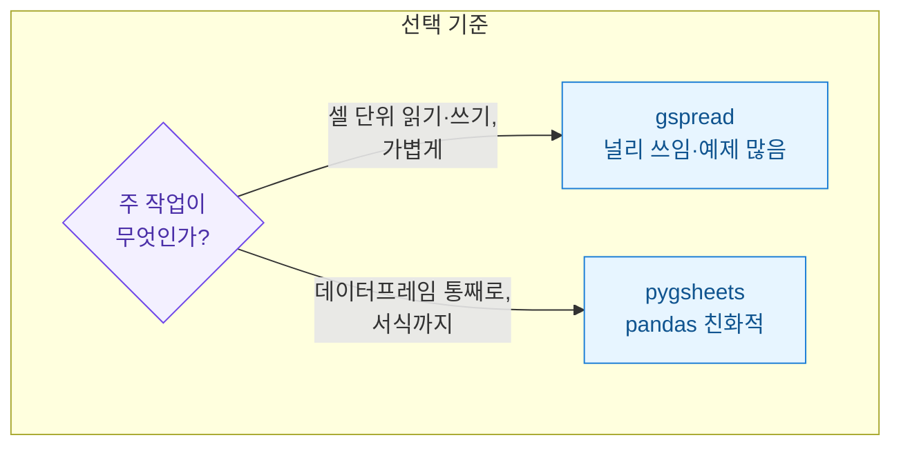
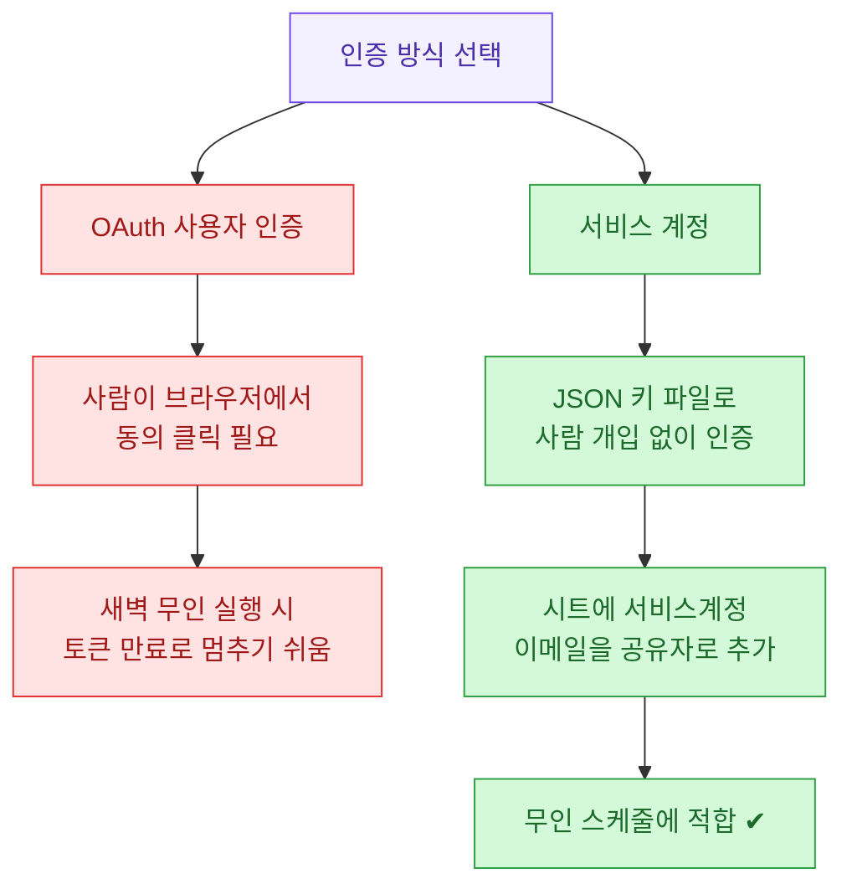
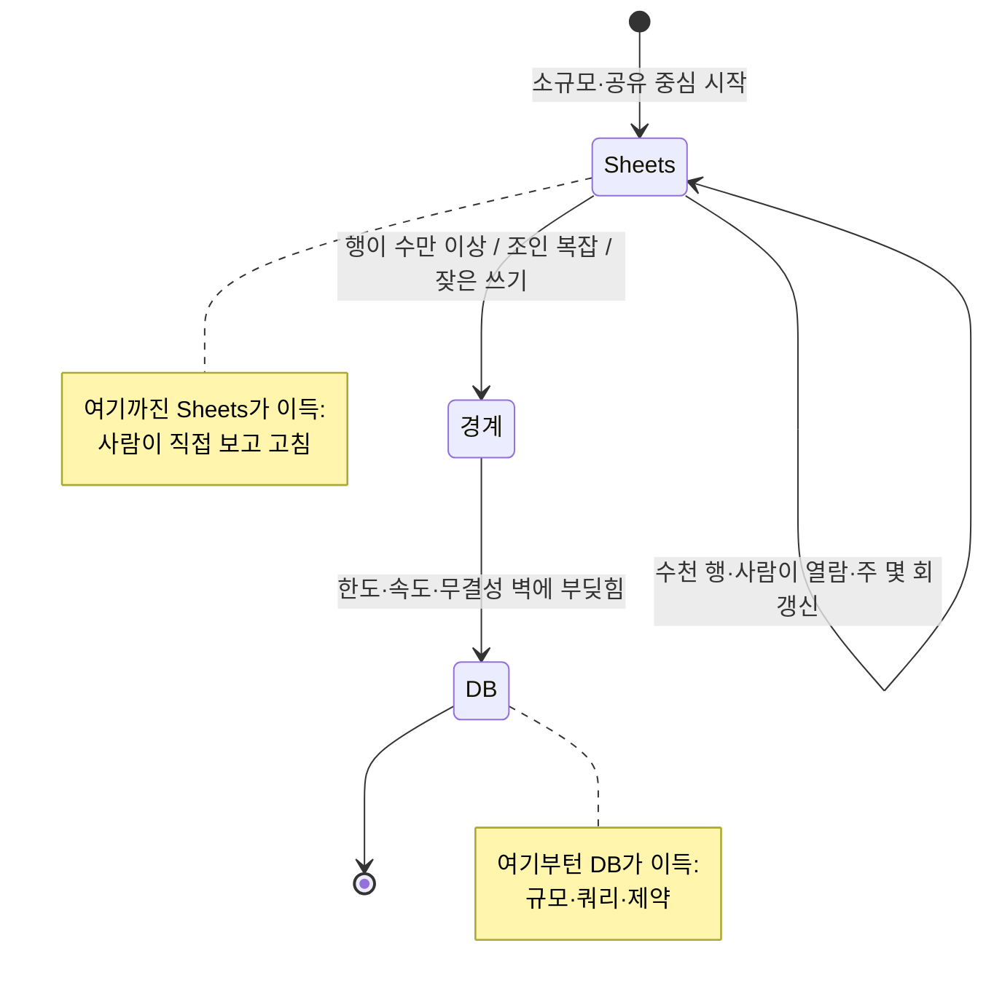
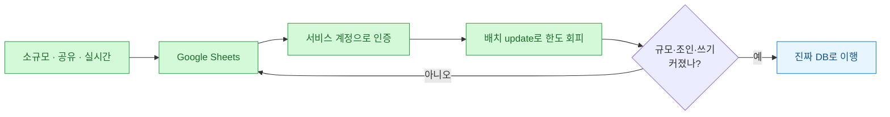

DB 하나 세우기엔 과하고, CSV를 메일로 주고받기엔 촌스럽다. 이 애매한 구간에서 나는 Google Sheets를 "가벼운 DB"처럼 쓰곤 한다. 정확히는 DB가 아니지만, 팀원 몇 명이 실시간으로 같은 표를 보고 파이썬은 그걸 자동으로 채워주는 구조가 필요할 때 이만큼 손쉬운 게 없다.

이 글은 그 경험을 정리한 튜토리얼이다. 나오는 모든 표·수치·시트 내용은 **합성(더미) 데이터**이고, 실제 업무 데이터나 계정은 하나도 등장하지 않는다.

## 그래서 Sheets를 DB처럼 쓴다는 게 뭔가?

먼저 전체 그림부터. 파이썬 스크립트가 데이터를 만들고, 그걸 Sheets에 밀어 넣으면, 사람들은 익숙한 스프레드시트 UI로 그 결과를 본다.


핵심은 화살표가 **양방향**이라는 점이다. 스크립트가 쓰기만 하는 게 아니라, 사람이 셀에 직접 적어 넣은 값(예: 담당자 메모, 검수 완료 체크)을 다시 읽어올 수도 있다. 이 "사람이 표를 직접 만질 수 있다"는 게 진짜 DB에는 없는, Sheets만의 매력이다.

## 진짜 DB랑 뭐가 다른가?

혼동을 막기 위해 처음부터 선을 긋고 가자. Sheets는 DB가 "아니다". 비슷한 일을 할 수 있을 뿐이다.

| 항목 | Google Sheets | 진짜 DB(MSSQL/Postgres 등) |
| --- | --- | --- |
| 사람이 직접 열람·수정 | 매우 쉬움(브라우저) | 별도 툴 필요 |
| 동시 편집 | 실시간 지원 | 트랜잭션으로 처리 |
| 데이터 규모 | 수천 행까지 쾌적 | 수백만 행 이상 |
| 쿼리 | 함수·필터 수준 | SQL 전체 |
| 무결성 제약 | 거의 없음 | 타입·키·제약 강력 |
| API 호출 한도 | 분당 제한 있음 | 사실상 자유 |

정리하면 이렇다. **소규모 · 사람이 봐야 함 · 실시간 공유**가 겹치는 구간이 Sheets의 자리다. 여기서 하나라도 크게 벗어나면(행이 수만 개, 복잡한 조인, 초당 수십 번 쓰기) DB로 가야 한다. 판단 기준은 글 마지막에 다시 정리한다.

## 두 라이브러리, gspread와 pygsheets 중 뭘 쓰나?

파이썬에서 Sheets를 다루는 대표 라이브러리는 둘이다.



거칠게 말하면, **gspread**는 셀·행 단위로 소소하게 주고받을 때 편하고 자료가 많다. **pygsheets**는 `pandas.DataFrame`을 통째로 시트에 붓거나 반대로 통째로 읽어올 때, 그리고 셀 서식까지 코드로 다룰 때 손이 덜 간다. 나는 보통 gspread로 시작하고, "데이터프레임을 그대로 올려야겠다" 싶어지면 pygsheets를 더한다.

## 인증은 어떻게 붙나? (서비스 계정이 정답인 이유)

여기가 처음 쓰는 사람이 가장 많이 막히는 부분이다. Sheets API를 쓰려면 구글에게 "이 스크립트가 이 시트를 만질 자격이 있다"고 증명해야 한다. 방법은 둘인데, 무인 자동화에서는 사실상 하나로 정해진다.



**서비스 계정(service account)**은 사람이 아니라 프로그램용 계정이다. 클라우드 콘솔에서 만들면 JSON 키 파일을 하나 내려받는데, 이걸로 인증하면 브라우저 동의 절차가 필요 없다. 스케줄러가 새벽 3시에 스크립트를 돌려도 사람 손이 안 든다.

딱 하나 잊기 쉬운 단계가 있다. 서비스 계정에는 고유한 이메일 주소(예: `bot@프로젝트.iam.gserviceaccount.com` 형태)가 있는데, **그 이메일을 대상 시트의 공유자로 추가**해줘야 한다. 안 그러면 "권한 없음" 에러가 난다. 사람에게 시트를 공유하듯, 봇에게도 공유해준다고 생각하면 된다.

키 파일은 코드에 박지 말고 파일 경로나 환경변수로 두는 게 안전하다.

```python
# 합성 예시: 서비스 계정으로 gspread 인증
import gspread

# key.json 은 클라우드 콘솔에서 발급한 서비스 계정 키 (더미 경로)
gc = gspread.service_account(filename="secrets/key.json")

# 서비스 계정 이메일을 미리 '공유자'로 추가해 둔 시트를 연다
sh = gc.open("dummy-metrics-board")   # 시트 제목으로 열기
ws = sh.worksheet("daily")            # '탭' 하나 선택
```

## 실제로 데이터를 어떻게 쓰고 읽나?

이제 본론. 매일 집계한 지표를 시트에 밀어 넣는 흐름을 합성 데이터로 만들어 보자. 아래 값은 전부 지어낸 더미다.

```python
import gspread

gc = gspread.service_account(filename="secrets/key.json")
ws = gc.open("dummy-metrics-board").worksheet("daily")

# 합성 데이터: 날짜별 방문/가입 (실제 데이터 아님)
rows = [
    ["date", "visits", "signups"],   # 헤더
    ["2026-07-11", 1240, 37],
    ["2026-07-12", 1180, 29],
    ["2026-07-13", 1355, 44],
]

# 시트를 비우고 한 번에 덮어쓰기 (A1부터)
ws.clear()
ws.update("A1", rows)
print("업로드 완료:", len(rows) - 1, "행")
```

포인트는 한 셀씩 `update_cell()`로 찍지 않고 **2차원 리스트를 한 번에** `update()`로 보낸다는 것이다. Sheets API는 호출 횟수에 분당 한도가 있어서, 100개 셀을 100번 호출하면 금방 한도에 걸린다. 묶어서 한 번에 보내는 게 정석이다(이 얘기는 다음 섹션에서).

읽어오는 것도 간단하다.

```python
# 시트 전체를 딕셔너리 리스트로 읽기 (헤더를 키로)
records = ws.get_all_records()
# [{'date': '2026-07-11', 'visits': 1240, 'signups': 37}, ...]

for r in records:
    rate = r["signups"] / r["visits"] * 100
    print(f"{r['date']}  전환율 {rate:.1f}%")
```

pygsheets를 쓰면 데이터프레임 왕복이 더 매끈하다.

```python
import pygsheets
import pandas as pd

gc = pygsheets.authorize(service_file="secrets/key.json")
wks = gc.open("dummy-metrics-board").worksheet_by_title("daily")

# DataFrame -> 시트 (A1부터 통째로)
df = pd.DataFrame({
    "date": ["2026-07-11", "2026-07-12", "2026-07-13"],
    "visits": [1240, 1180, 1355],
    "signups": [37, 29, 44],
})
wks.set_dataframe(df, start="A1")

# 시트 -> DataFrame (다시 읽기)
back = wks.get_as_df()
```

## 왜 API 한도에서 자꾸 막히나?

Sheets를 DB처럼 쓰다 가장 먼저 부딪히는 벽이 **호출 한도(rate limit)**다. 원인과 대응을 표로 정리한다.

| 증상 | 원인 | 대응 |
| --- | --- | --- |
| 429 에러(Quota exceeded) | 짧은 시간에 너무 많은 호출 | 셀 단위 대신 배치 `update()`로 묶기 |
| 큰 표 업로드가 느림 | 행마다 append 반복 | 2차원 리스트 한 번에 전송 |
| 간헐적 실패 | 순간 트래픽 몰림 | 재시도 + 대기(백오프) |

가장 흔한 실수는 반복문 안에서 셀을 하나씩 쓰는 것이다. 아래처럼 바꾸는 것만으로 호출 수가 극적으로 줄어든다.

```python
import time

def write_with_retry(ws, values, cell="A1", tries=3):
    """배치 쓰기 + 간단한 재시도(합성 예시)."""
    for i in range(tries):
        try:
            ws.update(cell, values)   # 통째로 한 번
            return True
        except gspread.exceptions.APIError:
            wait = 2 ** i             # 1초, 2초, 4초 ...
            print(f"재시도 대기 {wait}s")
            time.sleep(wait)
    return False
```

`2 ** i`로 대기 시간을 점점 늘리는 걸 **지수 백오프(exponential backoff)**라고 한다. 순간적으로 몰린 트래픽이 가라앉을 시간을 벌어주는 흔한 패턴이다.

## 언제 진짜 DB로 넘어가야 하나?

Sheets는 편하지만 분명한 천장이 있다. 아래 신호가 보이면 미련 없이 DB로 옮길 때다.



내가 쓰는 판단 기준은 세 가지다.

- **규모**: 행이 수만을 넘어가고 계속 는다 → DB. 시트는 수천 행까지가 쾌적하다.
- **쿼리 복잡도**: 여러 표를 조인하고 조건이 얽힌다 → SQL이 필요하다 → DB.
- **쓰기 빈도·무결성**: 초 단위로 자주 쓰거나, 타입·중복을 엄격히 막아야 한다 → DB.

반대로 이 셋이 모두 여유롭고 "사람이 표를 직접 봐야 한다"가 중요하면, 굳이 DB를 세울 이유가 없다. 도구는 문제에 맞춰 고르는 것이지, 멋있어서 고르는 게 아니다.

## 한 장 요약



핵심 세 줄로 닫는다.

- Google Sheets는 **소규모·사람이 봐야 함·실시간 공유**가 겹칠 때만 DB 대용으로 값어치가 있다.
- 무인 자동화의 인증은 **서비스 계정 + 시트에 봇 이메일 공유**가 정석이고, 쓰기는 **배치로 묶어** 한도를 피한다.
- 규모·쿼리·쓰기 빈도가 커지는 신호가 보이면, 미련 없이 **진짜 DB로** 넘어가는 게 결국 편하다.
