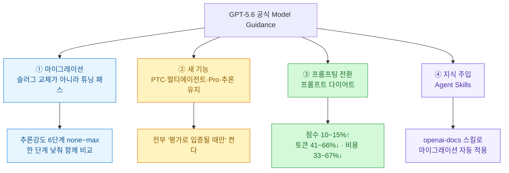
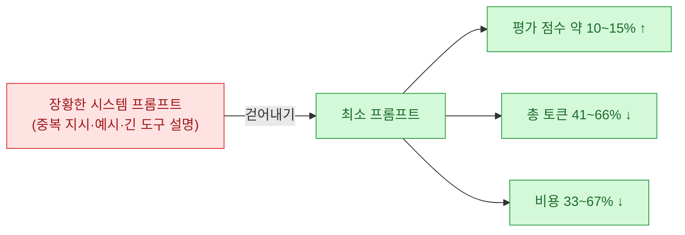
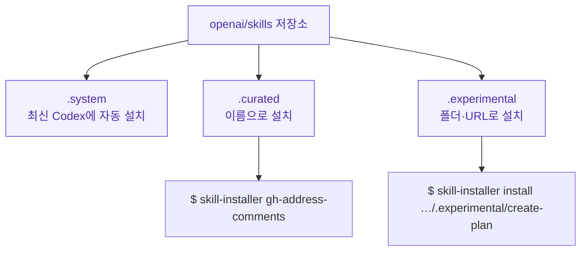

나는 프롬프트를 어떻게 쓰느냐에 유독 관심이 많다. 그래서 [[prompting-guide-goal-context-output-boundaries-chat-work-codex|프롬프팅 가이드(GOCB)]]도 따로 정리해 뒀고, [[the-coming-loop-armin-ronacher-harness-critique|하네스에 쌓이는 지시문]] 얘기에도 오래 밑줄을 그었다. 그런데 이번에 OpenAI가 낸 **GPT-5.6 공식 활용 가이드(Model Guidance)**를 읽으면서, 그동안 내가 애써 '쌓아 온' 프롬프트 습관을 정면으로 뒤집는 문장을 만났다 — **"이제 프롬프트는 쌓는 게 아니라 걷어내는 것"**이라는.

이 글은 그 가이드를 실무자 관점에서 뜯은 정리다. GPT-5.5나 5.4 기반으로 뭔가 굴리고 있다면 반드시 짚어야 할 대목만 골랐고, 뒤에 OpenAI의 **Agent Skills(`openai/skills`)** 저장소를 곁들여 "그럼 지식은 어디로 가나"까지 이었다. (소재는 OpenAI 공식 Model Guidance 원문과, 이를 국내에 정리한 박정환(9bow)님의 PyTorch KR 소개글에서 가져왔다.)

## 한눈에 보기 — 가이드는 무엇을 말하나?



관통하는 정서는 하나다. **모델이 똑똑해질수록, 개발자가 할 일은 지시문을 더 쌓는 게 아니라 덜어내는 쪽으로 옮겨간다.** 그리고 덜어낸 자리에 도메인 지식은 '스킬'이라는 재사용 가능한 형태로 주입한다. 하나씩 보자.

## 마이그레이션은 왜 '슬러그 교체'가 아니라 '튜닝 패스'인가?

가이드에서 가장 반복되는 경고가 이거다 — **모델 이름(slug)만 `gpt-5.6`으로 바꾸고 끝내지 마라.** GPT-5.6은 대체로 **더 적은 토큰으로 같은 수준 이상의 품질**을 내기 때문에, 기존 추론 설정을 그대로 옮기면 그 토큰 효율 이득을 못 누린다. 그래서 "마이그레이션을 튜닝 패스(tuning pass)로 취급하라"고 못박는다.

구체적으로는 **추론 강도(reasoning effort)를 재조정**하는 게 핵심이다. GPT-5.6은 여섯 단계를 지원한다.


원칙은 이렇게 제시된다.

- 5.5/5.4에서 옮겨온다면 **현재 강도를 기준선으로 두고, 한 단계 낮춘 설정을 함께 비교**한다.
- `none`을 쓰고 있으면 지연 기준선으로 유지하되, 추론·도구 사용이 이득이면 `low`도 테스트.
- 균형 시작점은 `medium`, 지연에 민감하면 `low`.
- `high`·`xhigh`는 **추론을 늘렸을 때 측정 가능한 품질 향상이 있을 때만**.
- `max`는 이번에 `xhigh` 위로 새로 추가된 최상위 단계로, **가장 어려운 품질 우선 작업에만** 예약하고 `xhigh`와 비교해 최적점을 찾는다.

> ⚠️ 오해 주의. `max`가 "항상 제일 좋은 설정"은 아니다. 가이드는 시종일관 **"높은 강도가 늘 최선은 아니다 — 대표 작업에서 비교해 최적점을 찾아라"**고 말한다. 강도를 무작정 올리는 건 비용·지연만 키울 수 있다.

## Sol·Terra·Luna — 셋 중 뭘 써야 하나?

GPT-5.6은 용도별 세 모델로 나뉘고, `gpt-5.6` 별칭(alias)은 플래그십인 `gpt-5.6-sol`로 라우팅된다.

| 모델 | 포지셔닝 | 권장 용도 |
|---|---|---|
| `gpt-5.6-sol` | 플래그십 성능 | 최고 품질이 필요한 복잡한 작업 |
| `gpt-5.6-terra` | 낮은 가격에 강력한 성능 | 지능·비용 균형이 필요한 작업 |
| `gpt-5.6-luna` | 효율 중심 | 대용량·고빈도 워크로드 |

그리고 전제 조건 하나 — 추론·도구 호출·멀티턴 워크플로우는 **Responses API**를 쓰라고 권한다. 아직 Chat Completions API라면, 이번 마이그레이션을 계기로 함께 넘어가는 게 아래 신기능(Pro 모드·추론 유지 등)을 쓰기 위한 전제다.

## GPT-5.6이 새로 얹은 것들은?

새 기능이 꽤 많은데, 공통점이 하나 있다 — **전부 "평가로 이득이 확인될 때만 켜라"**는 단서가 붙는다.

| 기능 | 한 줄 요약 |
|---|---|
| **Programmatic Tool Calling(PTC)** | 모델이 JS를 짜서 여러 도구를 호출·중간결과 처리 → 정형화된 도구 과다 워크플로우용. ZDR 호환, 추가 컨테이너 비용 없음 |
| **멀티 에이전트(베타)** | 한 인스턴스가 서브에이전트를 병렬 조율·종합(Codex 울트라 모드와 유사). Responses API 베타 |
| **명시적 프롬프트 캐싱** | 재사용 접두 문맥을 직접 지정해 캐싱. ⚠️캐시 쓰기는 비캐시 입력의 **1.25배**, 읽기는 할인 |
| **추론 유지(Persisted Reasoning)** | 이전 턴 추론을 다음 턴에 재사용 → 멀티턴 품질·캐시 효율↑. `reasoning.context`로 제어 |
| **max 추론 강도** | `xhigh` 위 최상위 단계 신설 |
| **Pro 모드** | `reasoning.mode: "pro"` — 한 요청에 더 많은 작업을 들여 단일 최종 답변 |
| **의도 이해** | 모든 단계를 지정 안 해도 근본 목표·작업 수준을 더 잘 추론 |
| **원본 이미지 해상도 유지** | `original`/`auto`로 보낸 이미지를 리사이즈 없이 보존 |

추론 유지는 특히 실무에서 손이 가는 부분이라 조금 더 적어 둔다. 작업의 목표·가정·우선순위가 턴 사이에 **안정적으로 유지되면 `all_turns`**, 이전 추론이 더는 유효하지 않으면 `current_turn`, 잘 모르겠으면 생략하거나 `auto`로 두고 응답의 `reasoning.context` 필드로 실제 모드를 확인한다. `all_turns`에선 `previous_response_id`로 대화를 이어야 이전 추론이 모델에 전달되고, `store: false`나 ZDR 환경이면 `include: ["reasoning.encrypted_content"]`로 암호화 추론을 되돌려 보내야 한다.

## 실시간 안전 분류기 — 왜 정상 작업이 느려지거나 막힐 수 있나?

GPT-5.6엔 출력 생성 중 **실시간으로 도는 사이버·생물학 오용 분류기**가 들어 있다. 이 때문에 두 가지가 생긴다. ⑴ 일부 요청이 차단·거부되고, ⑵ 분류기가 출력을 **동기적으로 검토하는 동안 생성이 몇 초 멈춰** 응답이 길어질 수 있다. 특히 방어와 공격이 초기에 비슷해 보이는 **이중 용도(dual-use)** 영역에선 정당한 작업에도 개입할 수 있다고 명시한다(코드 리뷰·취약점 연구·패치·디버깅·보안 교육 같은 정당한 작업 접근은 유지한다고 밝힘).

> 실무 팁. 개별 최종 사용자를 대상으로 하는 앱이라면 요청마다 **안정적·프라이버시 보존형 `safety_identifier`**를 함께 보내라고 권한다. 이건 사용자 식별이 아니라 남용 패턴을 요청 단위로 안정적으로 잇기 위한 것이다.

## 왜 '프롬프트 다이어트'가 이겼나?

여기가 이 가이드의 진짜 하이라이트다. OpenAI 내부 평가에서, **길고 명시적인 시스템 프롬프트를 최소 프롬프트로 교체했더니** 이런 결과가 나왔다고 한다.



왜 이럴까. 가이드의 설명이 설득력 있다 — **무거운 프롬프트는 모델의 불필요한 탐색·반복 검증·컨텍스트 누적을 부추긴다.** 게다가 하네스에 오래 쌓인 지시문 상당수는 이미 **모델의 기본 동작**이 됐기 때문에, 다시 말해 줄 필요가 없다. 그래서 결론은 **"모델이 자연스럽게 하지 않는 동작에만 집중하는 것이 가장 큰 이득"**이라는 것.

실행 지침은 이렇게 요약된다.

- **이미 작동하는** 프롬프트·도구에서 출발해, 지시문·예시·도구를 **한 그룹씩 제거하고 같은 평가를 다시 돌린다.**
- 각 지시는 **한 번만** 말한다.
- 작업에 관련된 도구만 노출하고, 도구 설명은 간결·정확하게. (큰 도구 집합·장황한 정의는 시작 컨텍스트를 늘리고 도구 선택 일관성을 떨어뜨린다.)
- 예시·스타일 지침은 **제품 요구사항이거나 측정된 격차를 메울 때만** 남긴다. "X가 아니라 Y" 같은 패턴은 피한다.

> 내가 뜨끔한 대목. 나도 [[claude-md-context-optimization|CLAUDE.md]]에 규칙을 자꾸 쌓는 편인데, "쌓인 지시문 대부분은 이미 기본 동작이 됐다"는 말이 뼈아팠다. 프롬프트는 자산이 아니라 **관리 비용**이라는 관점 전환이다.

## '간결하게 답하라'는 왜 함정이 되나?

GPT-5.6은 기본적으로 5.5보다 답이 짧다(서두·추측성 분기·중복이 줄었다). 그래서 여기에 대고 **"간결하게 답하라", "짧게 유지하라" 같은 일반적 지시를 얹으면 역효과**가 난다. 이미 압축 성향인 모델이 그 지시를 **작업 우선순위 변경**으로 받아들여, 요청한 완전한 산출물 대신 **더 짧은 대체물**을 내놓는 게 낫다고 판단할 수 있기 때문이다.

가이드의 처방은 **간결함 지시를 '우선순위 지시'로 교체**하는 것이다.

```text
Lead with the conclusion. Include the evidence needed to support it, any material
caveat, and the next action. Omit secondary detail and repetition.

Keep all required facts, decisions, caveats, and next steps. Trim introductions,
repetition, generic reassurance, and optional background first.
```

같은 원리가 자율성·톤에도 적용된다. GPT-5.6은 **능동적·끈질기게** 움직일 수 있어서, 각 요청이 어디까지 허용하는지를 명시해야 한다. 그런데 여기서 반대의 함정이 또 있다 — **"먼저 물어봐라", "바꾸지 마라"를 프롬프트 곳곳에 반복하면, 안전하고 당연한 작업에서도 불필요한 승인 확인을 유발**한다. 그래서 권한 경계는 **한 곳에, 한 번만** 적는다.

```text
For requests to answer, explain, review, diagnose, or plan, inspect the relevant
materials and report the result. Do not implement changes unless the request also
asks for them.

For requests to change, build, or fix, make the requested in-scope local changes
and run relevant non-destructive validation without asking first.

Require confirmation for external writes, destructive actions, purchases, or a
material expansion of scope.
```

## Pro 모드와 PTC — 언제 켜야 하나?

둘 다 강력하지만, 가이드는 **"모드가 아니라 작업을 위해 프롬프트하라"**고 선을 긋는다.

- **Pro 모드**: `reasoning.mode: "pro"`로 켠다. 5.5 시절 별도 Pro *모델*이 있던 것과 달리, **선택한 모델을 유지한 채 모드만 바꾼다**(`reasoning.effort`는 독립, 생략 시 표준·Pro 모두 medium 기본). 투입 토큰이 사용량에 합산돼 표준 요금으로 과금된다. **미미한 품질 개선이 결과를 실제로 좌우하고 작업이 충분히 어려울 때만**(복잡한 최적화·고부가 코딩/리뷰·명확한 기준의 심층 분석) 쓴다. "Pro 모드 써라", "더 열심히 생각해라"를 프롬프트에 넣을 필요 없이, 표준 모드와 **같은 결과 중심 프롬프트**를 그대로 쓰면 된다.
- **PTC(Programmatic Tool Calling)**: 필터링·조인·랭킹·중복제거·집계·검증처럼 **경계가 명확하고(bounded) 예측 가능한** 처리에 적합. ⚠️호출이 많거나 병렬·의존적이라는 사실만으로는 정당화되지 않는다 — 한 번으로 충분하거나, 중간 출력이 이미 작거나, 매 결과가 다음 결정을 바꾸거나, 승인이 필요하거나, 인용·네이티브 산출물을 보존해야 하면 **일반 도구 호출을 유지**한다. 라우팅은 작업별로 명시해야 하며, 가이드가 준 템플릿이 이거다.

```text
<tool_orchestration>
Use Programmatic Tool Calling for [bounded stage] using only [eligible tools].
Run independent calls concurrently when safe. Use only documented tool input
and output fields.

Process and reduce the intermediate results, then emit exactly [output schema],
including the evidence needed for the final answer.

Stop when [condition] is met. Retry transient failures at most [R] times.
Do not repeat completed calls or perform side-effecting actions. If a required
result is still missing, return a clear structured failure.

Use direct tool calls for [semantic judgment, approval, or final validation].
</tool_orchestration>
```

공통 원칙은 하나다 — **평가는 프로그램 결과가 아니라 '최종 사용자에게 보이는 답변'을 대상으로** 한다. 호출·턴·토큰이 줄어드는 건, 그 답변이 여전히 요구 품질을 충족할 때만 개선이다.

## 그럼 지식은 어디로 가나? — openai/skills와 '스킬로 주입'

프롬프트를 걷어내면, 도메인 지식은 어디에 둘까. 가이드가 슬쩍 보여준 답이 **스킬(skill)**이다. GPT-5.6 마이그레이션조차 **OpenAI Docs 스킬**을 설치하면 한 줄로 프로젝트 전체에 적용된다.

```text
$ openai-docs migrate this project to the GPT-5.6 model family
```

이 스킬이 사는 곳이 [`openai/skills`](https://github.com/openai/skills) 저장소다. **Agent Skills**는 "AI 에이전트가 발견해서 특정 작업을 수행하는 데 쓰는 **지시문·스크립트·리소스 묶음 폴더**"로, 표어가 *"Write once, use everywhere"*다. 구조도 명료하다.



> ⚠️ **중요한 최신 상태(원문 소개글엔 없음)**. `openai/skills` 저장소는 **현재 deprecated(2026-06-22)** 상태이고, OpenAI는 사용자를 **[`openai/plugins`](https://github.com/openai/plugins) 저장소 + "Build plugins" 가이드**(스킬 전용 플러그인 만들기)로 안내한다. 즉 "openai/skills에서 받아 쓰라"는 문장은 지금 시점엔 **`openai/plugins` 쪽으로 갱신**해서 읽어야 한다. 개념(Agent Skills)과 오픈 표준([agentskills.io](https://agentskills.io/))은 그대로 살아 있다.

여기서 내가 반가웠던 건, 이게 내가 매일 쓰는 **Claude(앤트로픽)의 스킬**과 판박이라는 점이다. 나도 윤문 스킬·문서추출 스킬 같은 걸 폴더로 설치해 쓰는데 — 결국 두 진영 모두 **"긴 프롬프트를 매번 붙여넣지 말고, 도메인 지식을 설치 가능한 스킬로 빼자"**는 같은 방향으로 가고 있다. 프롬프트는 가볍게, 지식은 모듈로.

## 내 생각 — '프롬프트 엔지니어링'에서 '프롬프트 다이어트'로

이 가이드를 덮고 남은 한 줄은 이거다. **모델이 똑똑해질수록 잘 쓰는 법은 더 많이 시키는 게 아니라, 덜 시키고 대신 정확히 시키는 것.** 최소 프롬프트로 점수는 오르고 토큰·비용은 줄었다는 내부 수치, 간결함 지시가 오히려 산출물을 망칠 수 있다는 경고, 반복 금지 지시가 승인 폭주를 부른다는 관찰 — 전부 같은 방향을 가리킨다. 프롬프트에 쌓인 관성적 지시문이 이제는 **비용이자 성능 저하 요인**이 됐다는 것이다.

그리고 화려한 신기능(Pro·PTC·멀티에이전트)엔 예외 없이 *"평가로 입증될 때만"*이라는 단서가 붙는다. 결국 **대표 작업으로 만든 평가 세트를 갖추고 설정 변경 효과를 재는 습관**이, 신기능보다 먼저 갖춰야 할 기본기다. 이건 [[the-coming-loop-armin-ronacher-harness-critique|하네스에 쌓이는 지시문]]과 [[fable5-from-instructing-agents-to-designing-loops|지시에서 목표로]]에서 내가 계속 밑줄 그어 온 얘기와 정확히 같은 자리에서 만난다. 나부터 내 CLAUDE.md와 시스템 프롬프트를 한 번 **감량**해 보고, 그 전후를 평가로 재 봐야겠다.

## 참고자료

- OpenAI 공식: [Model guidance — Using GPT-5.6](https://platform.openai.com/docs/guides/latest-model) · [Programmatic Tool Calling 가이드](https://platform.openai.com/docs/guides/programmatic-tool-calling) · [reasoning mode / pro mode](https://platform.openai.com/docs/guides/reasoning)
- Agent Skills: [openai/skills (GitHub, ⚠️deprecated)](https://github.com/openai/skills) → [openai/plugins](https://github.com/openai/plugins) · [Agent Skills 오픈 표준](https://agentskills.io/)
- 국내 정리: 박정환(9bow), [OpenAI GPT-5.6 공식 활용 가이드 정리](https://discuss.pytorch.kr/) (PyTorch KR · 읽을거리&정보공유)
- 관련(내 글): [[prompting-guide-goal-context-output-boundaries-chat-work-codex|프롬프팅 가이드 GOCB]] · [[claude-md-context-optimization|CLAUDE.md 컨텍스트 최적화]] · [[the-coming-loop-armin-ronacher-harness-critique|루프의 통제]] · [[fable5-from-instructing-agents-to-designing-loops|지시에서 목표로]]

<!-- 안전: 회사 실데이터·고객/제3자 PII·API키/쿠키/토큰 없음. OpenAI 공식 Model Guidance 원문 + 공개 저장소(openai/skills) + 국내 소개글(박정환/PyTorch KR)을 요약·논평하고 1차 출처 링크. openai/skills deprecation 등 최신 상태는 직접 확인해 ⚠️로 표기. -->
