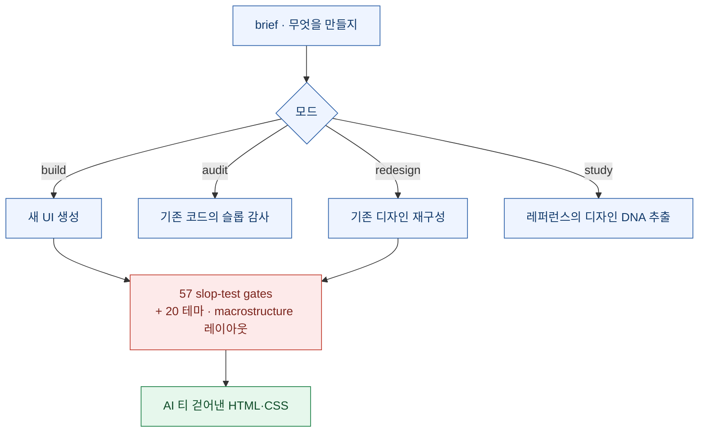
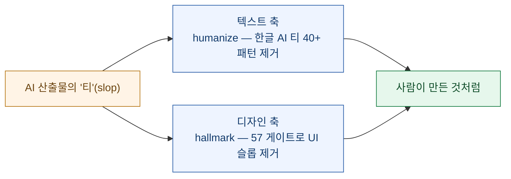

AI에게 웹페이지를 만들라고 하면 결과가 이상하게 **다 비슷하게** 생겼다. 크림색(#F4F1EA) 배경에 세리프 제목과 테라코타 포인트, Inter나 Space Grotesk, 이모지 섹션 마커, 어디나 `rounded-lg`, 둥근 카드에 강조 바. 한 번 보면 "아, AI가 만들었네" 싶은 그 인상 — 이걸 요즘 **AI 슬롭(slop)**이라 부른다.

며칠 전 아티팩트를 하나 만들면서, 내가 따르는 디자인 지침에도 "이런 클리셰를 피하라"는 항목이 통째로 있는 걸 새삼 봤다. 그 참에 PyTorch KR 경로로 [**hallmark**](https://github.com/Nutlope/hallmark)을 만났다. 딱 그 문제를 스킬로 묶은 도구다. 늘 하던 대로 1차 출처로 검증했다.

> ⚠️ 소개와 [공식 저장소](https://github.com/Nutlope/hallmark)·README를 대조한 정리다. "57개 게이트가 정말 슬롭을 걷어내는가"의 실효는 실사용 검증 몫으로 남긴다.

## 먼저 — 무엇이고, 사실인가? (검증)

| 항목 | 검증 결과 |
|---|---|
| 정체 | ✅ *"Anti-AI-slop **design skill** for Claude Code, Cursor, and Codex"* — 앱이 아니라 **에이전트용 스킬** |
| 제작 | ✅ **Together AI**(Nutlope = Hassan El Mghari, roomGPT·llamacoder 등으로 알려진 인물) |
| 저장소·인기 | ✅ `Nutlope/hallmark` (CSS), 2026-04-27 생성, **★16,447 · 포크 828 · 오픈 이슈 31** (2026-07-24) |
| 라이선스 | ✅ **MIT** |
| 핵심 메커니즘 | ✅ *"57 slop-test gates"* · 20개 테마 · macrostructure 기반 레이아웃 선택 |
| 4가지 모드 | ✅ build(새로 만들기)·audit(감사)·redesign(재설계)·study(디자인 DNA 추출) |
| 설치 | ✅ `npx skills add nutlope/hallmark` (또는 SKILL.md 수동 복사) |

기능·제작사·라이선스·인기 모두 사실이다. 다만 이것도 3개월 된 저장소가 별 1.6만이라 **화제성이 크다** — 별 수는 관심의 지표지 품질 보증이 아니라는 건 늘 같은 유보다.

## hallmark은 어떻게 '티'를 걷어내나

핵심은 자유 생성이 아니라 **게이트 통과**다. 요청(brief)을 받아 UI를 만들되, 57개의 슬롭 테스트를 통과해야 내보낸다.

`study` 모드가 특히 눈에 띈다 — 흉내 낼 레퍼런스를 주면 그 **디자인 DNA를 추출**해 새 작업에 이식한다. 무작정 예쁘게가 아니라 "이 브랜드의 규칙"을 구조화한다는 발상이다.

## 🧭 내 볼트 연결 — 슬롭과 싸우는 두 축

이 도구가 남 얘기 같지 않은 건, 내 콘텐츠 파이프라인이 이미 **AI 티와 싸우고 있기 때문**이다. 다만 축이 다르다.

- **텍스트 쪽**은 이미 쓰고 있다. 블로그 발행 전 한글 AI 티(번역투·기계적 병렬·이모지 남발 등 40+ 패턴)를 걷어내는 윤문 스킬이 그것이다. **hallmark은 그 디자인 판**이다 — 같은 철학, 다른 매체.
- **디자인 쪽**은 지금까지 지침을 **손으로** 따랐다. 아티팩트를 만들 때마다 "크림+세리프+테라코타 피하기, Inter/Space Grotesk 남용 금지, 이모지 마커 금지"를 사람이 체크했다. hallmark의 "57 게이트"는 **그 체크리스트를 자동화한 셈**이다.
- 그래서 내 관심은 이거다 — hallmark의 게이트가 실제로 얼마나 잡아내는지, 그리고 그 규칙이 **한글·한국 웹 맥락**에도 통하는지(폰트·자간·정렬 규칙은 문화마다 다르다). 텍스트 윤문에서 배운 교훈은 "영어 안티슬롭 규칙을 그대로 한글에 옮기면 어색해진다"였으니, 디자인도 같은 함정이 있을 법하다.

한 줄 요약: **AI가 '값싸게 그럴듯한 것'을 무한 생성하는 시대에, 진짜 경쟁은 그 결과에서 'AI 티'를 걷어내는 쪽으로 옮겨간다.** hallmark은 디자인에서 그 싸움을 스킬로 묶었고, 나는 텍스트에서 이미 그 싸움을 하고 있다. 다음 숙제는 이걸 실제 페이지에 붙여 게이트가 무엇을 잡는지 눈으로 재보는 것.

---

*출처: [Nutlope/hallmark](https://github.com/Nutlope/hallmark) (Together AI, MIT). 별·라이선스·기능은 2026-07-24 GitHub API·README 실측. 정체는 "design skill", 앱 아님.*
