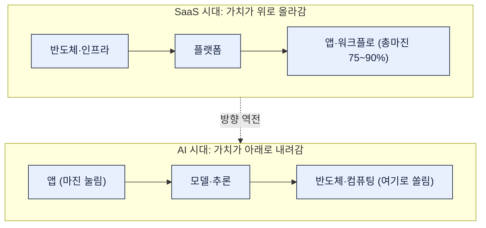
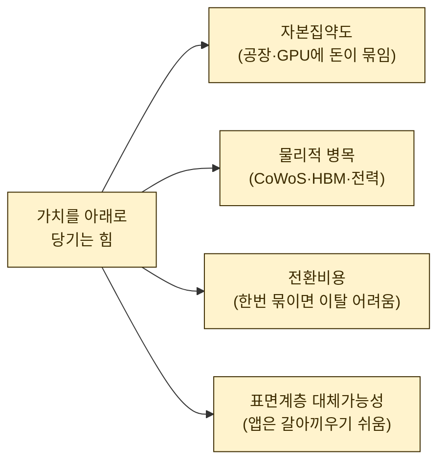
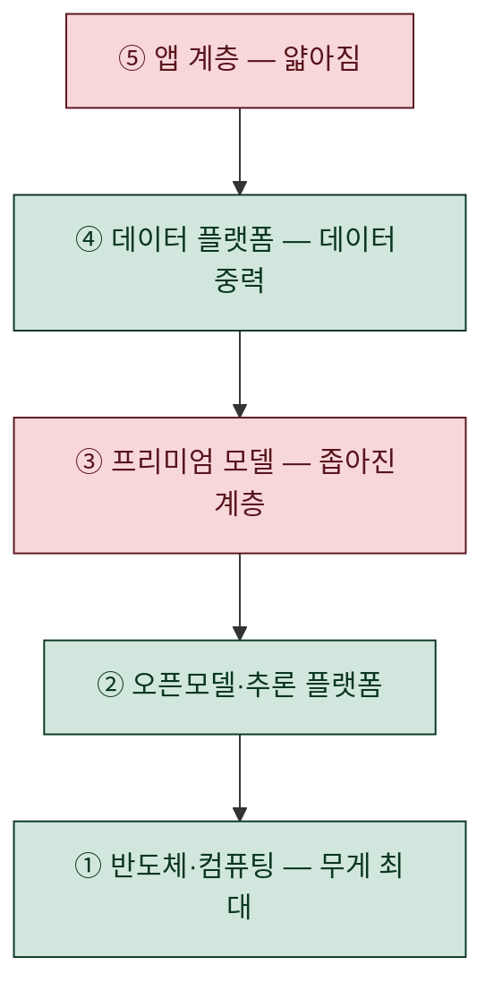
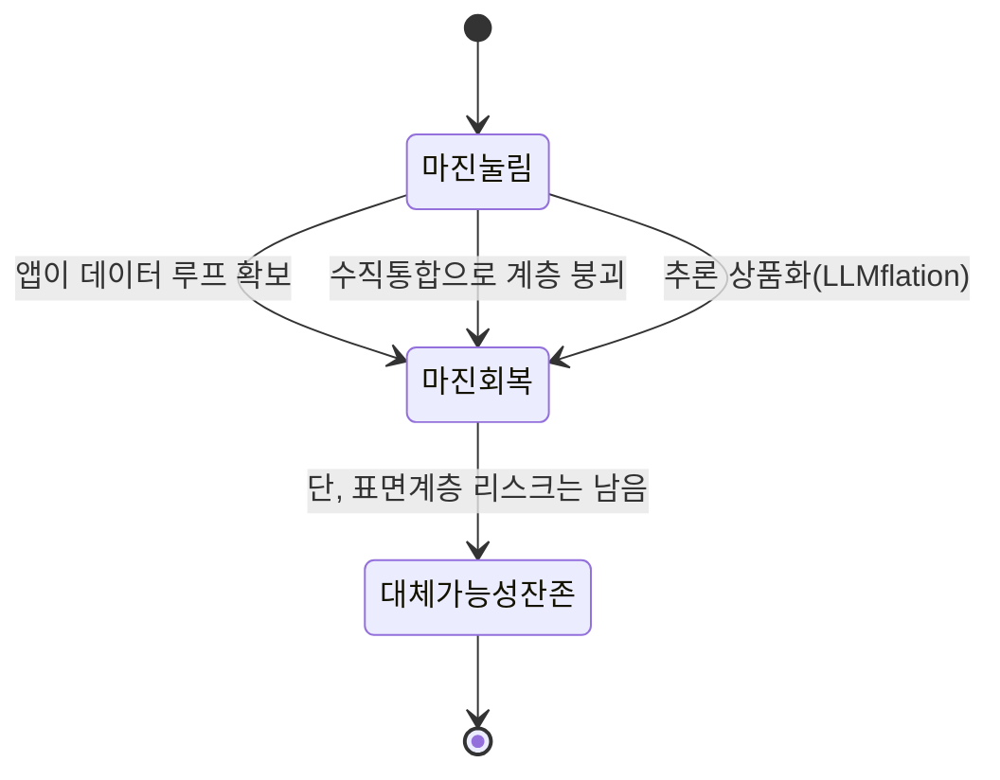

Wing VC의 크리스 제올리(Chris Zeoli)가 쓴 'Software Ate the World. Now Hardware Is Eating Software'(2026-06-24)를 읽고 한참을 멍하니 앉아 있었다. 제목이 마크 안드레센의 그 유명한 문장("소프트웨어가 세상을 먹는다")을 비틀어 놓은 건데, 논지가 내 일상 작업까지 정확히 찔러서다.

나는 회계사도 아니고 벤처 투자자도 아니다. 데이터 분석가이자 디지털 마케터로서 매일 자동화 스크립트와 작은 앱을 만든다. 그래서 이 글을 '누가 돈 버나' 같은 투자 얘기가 아니라, **"내가 만드는 것들은 이 구조 어디쯤에 있고, 무게에 쓸려 내려가지 않을 방어력이 있나"** 하는 질문으로 읽었다. 먼저 전체 논지를 한눈에 깔아둔다.

## 왜 가치의 방향이 갑자기 뒤집힌다는 걸까?

SaaS 시대엔 가치가 스택 위로 올라갔다. 서버·데이터베이스 같은 아래 계층은 상품화되고, 돈은 사용자가 실제로 만지는 앱·인터페이스·워크플로에 쌓였다. 그래서 잘나가는 SaaS는 총마진(매출에서 원가를 뺀 비율) 75~90%를 찍었다. 한 번 만들어 두면 유저가 늘어도 추가 원가가 거의 안 들었기 때문이다.

AI는 이 방향을 뒤집는다는 게 제올리의 핵심이다. 이유는 한 단어, **추론(inference, 학습이 끝난 모델이 실제 답을 뽑아내는 연산)**이 '가변 매출원가'가 됐다는 것. 유저가 버튼을 한 번 누를 때마다 GPU가 돌고 돈이 나간다. 그가 든 비유가 인상적이었다. **"가치는 질량처럼, 쉽게 못 움직이는 곳에 쌓인다."** 무엇이 가치를 아래로 끌어당기나를 그는 네 가지로 정리했다.

가장 뜨끔했던 건 마지막 ④번이다. 내가 만드는 대시보드나 자동화 앱은 대체하기 쉬운 '표면 계층'에 가깝다. 아래 세 계층(반도체·모델·데이터)은 무거워서 안 움직이는데, 표면은 가볍다. 가벼운 건 가치도 잘 안 고인다는 얘기다.

## 5계층을 훑으면 무게중심이 어디 있나?

제올리는 스택을 다섯 계층으로 갈라 봤다. 미리 밝혀둘 것 — **아래 수치는 Wing 자체 분석과 기업 공시가 섞여 있고, 상당수가 추정이거나 기준이 제각각이다. 절대적 숫자가 아니라 방향성으로만 보라고 원문도 못 박았다.** 나도 그렇게 옮긴다.

**① 반도체·컴퓨팅.** NVIDIA 데이터센터 매출이 752억 달러(전년 대비 +92%), 총마진 약 75%, AI 가속기 시장 점유율 약 80%(Wing 분석·공시 혼합). 4대 하이퍼스케일러의 2026년 1분기 설비투자가 약 1,310억 달러 → 연 5,250억 달러 페이스인데 가이던스는 6,000억 달러를 가리키고, Goldman은 2025~30년 누적 5.3조 달러를 추정했다. 진짜 병목은 돈이 아니라 물리다. CoWoS(첨단 패키징)는 사실상 매진이고 NVIDIA가 2027년까지 과반을 예약했다. HBM(고대역폭 메모리) 수요는 2025년 +130%, 2026년 +70% 전망이고 DRAM 계약가가 1분기 +90%(전분기 대비), AI가 고급 DRAM의 약 70%를 흡수한다. 이 대목은 내가 어제 정리한 [[ai-llm-it-news-2026-07-17]] 다이제스트의 반도체 슈퍼사이클(TSMC 402억 달러, ASML 상향, 메모리 대란)과 정확히 맞물린다. 뉴스 한 줄이 이 구조도 안에서 제자리를 찾는 느낌이었다.

**② 오픈모델·추론.** 공개 모델과 폐쇄 모델의 실력 격차(Chatbot Arena 기준)가 2024년 1월 8.04%에서 2025년 2월 1.70%로 좁혀졌고, HuggingFace엔 220만 개 모델이 올라와 있으며 Qwen이 Llama를 앞질렀다. 여기서 제올리의 통찰이 날카롭다. **가치는 모델 자체가 아니라 '추론 플랫폼'으로 간다.** Fireworks AI가 3년 만에 연 8억 달러(+4배), Baseten이 약 6억 달러(+5배). 그의 비유 — "Linux가 돈을 번 게 아니라 Red Hat과 클라우드가 벌었다." 오픈 모델로 추론하면 최전선 API 대비 90% 넘게 비용을 아낄 수 있으니, 모델은 공짜여도 '돌려주는 인프라'에 돈이 고인다.

**③ 프리미엄 모델.** Anthropic이 연환산 약 470억 달러(2024년 말 10억 → 2026년 5월), 연말 1,000억 달러 전망. OpenAI는 300억 → 연말 600억 달러 전망(추정치). 다만 좁아진 계층이고, 방어선은 '최전선 성능 + 기업 유통망'이라는 게 요지다.

**④ 데이터 플랫폼.** Databricks 연 69억 달러(+80%), AI 제품 비중 26%, 밸류 1,700억 달러. Palantir 연 65억 달러(+85%), 미국 상업 부문 +133%, Rule of 40이 145%, 시총 3,500억 달러로 매출의 약 50배. 핵심 개념은 **데이터 중력** — 데이터가 쌓인 곳으로 연산과 앱이 끌려온다.

**⑤ 얇아지는 앱.** 여기가 내 자리다. AI 네이티브 앱의 총마진은 50~60%로, SaaS의 75~90%보다 확연히 낮다. 이유는 추론비가 매출의 약 23%(ICONIQ 2026 기준)를 먹는데 **규모가 커져도 이 비율이 안 줄어든다**는 것. 극단적인 '래퍼'(남의 모델을 얇게 감싼 앱)는 25%까지 나간다. 밸류에이션도 양극화됐다.

| 계층 | 대략적 밸류 배수(매출 대비, 추정) |
|---|---|
| 기반 모델 | 25~50배 |
| AI 네이티브 앱 | 25~30배 |
| SaaS 중앙값 | 6.7배 (2021년 18.6배에서 하락) |
| AI 래퍼 | 5~8배 |

## 그럼 이 논지가 틀릴 수도 있나?

좋은 분석은 자기가 틀릴 조건을 먼저 말한다. 제올리도 "내가 틀리는 경우"를 못 박았고, 나는 이게 오히려 실무에 쓸 체크리스트라고 봤다.

앱이 자체 데이터 루프(쓸수록 데이터가 쌓여 앱이 좋아지는 순환)를 갖거나, 수직 통합으로 아래 계층을 흡수하거나, 추론값이 상품화되면(이른바 LLMflation — 같은 지능 단가가 연 10배, 중앙 가격은 연 200배씩 떨어진다는 관측) 위쪽 마진이 회복될 수 있다. 다만 그래도 표면 계층의 '갈아끼우기 쉬움'은 남는다는 단서를 달았다.

## 그래서 내 작업엔 뭐가 남나?

읽고 나서 내 자동화·대시보드들을 이 잣대로 다시 봤다. 세 가지 질문이 남았다.

- **내가 만드는 건 어느 계층인가?** 대부분 ⑤ 표면 계층이다. 인정하고 시작해야 한다.
- **방어력이 있나?** 세 개를 붙일 수 있다 — 남의 데이터가 아니라 **내 데이터 루프**를 쌓는가, 단발 리포트가 아니라 **기록 시스템(system of record)**이 되는가, 사용료가 아니라 **성과 기반 가격**으로 값을 매기는가.
- **추론비를 매출의 몇 %로 관리하나?** 규모가 커져도 안 줄어드는 항목이라, 처음부터 이걸 재무 지표처럼 봐야 한다.

가장 크게 남은 한 줄. **가벼운 표면에서 값을 벌려면, 가볍지 않은 무언가(데이터·기록·성과)를 붙여 무게를 만들어야 한다.** 질량이 없으면 가치가 안 고인다는 제올리의 비유가, 벤처 규모가 아니라 내 작은 앱 하나에도 그대로 적용됐다.

> ⚠️ 이 글은 산업 구조를 관찰한 메모지 투자 권유나 재무 판단이 아니다. 인용 수치는 대부분 벤더·기관의 추정이거나 자체 측정이고 기준이 제각각이라, 절대값이 아니라 방향성으로만 읽었다.

다음엔 내 자동화 하나를 골라 '추론비 비중'과 '데이터 루프 유무'를 실제로 측정해 보려 한다. 어제의 [[ai-llm-it-news-2026-07-17]]가 뉴스였다면, 이건 그 뉴스를 걸어둘 뼈대였다.
