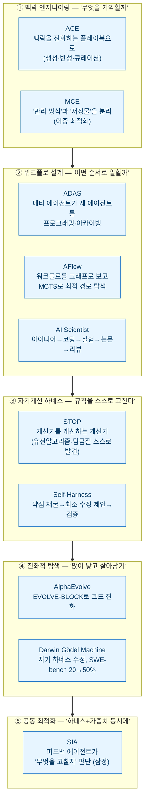
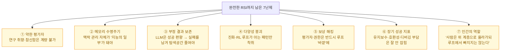

> **하네스 담론 시리즈** — 3부작 [[planning-harness-detailed-spec-automation|① 기획]] · [[design-md-claude-design-portable-design-system|② 디자인]] · [[claude-tag-multiplayer-agents|③ 팀]] · 에필로그 [[the-coming-loop-armin-ronacher-harness-critique|루프를 어떻게 통제하나]] · **이번: 하네스가 스스로 진화한다(이 글)**

지난 3부작과 에필로그로 "하네스를 어떻게 짜고, 어떻게 통제하나"까지 왔다. 그런데 이번 주엔 그 다음 질문 — **"하네스를 사람이 아니라 AI가 고치기 시작하면?"** — 을 정면으로 다룬 글이 나왔다. **릴리언 웽(Lilian Weng)**, OpenAI 안전 시스템 부사장을 지내고 지금은 Thinking Machines Lab 공동창업자인 그가 7월 4일 올린 **"Harness Engineering for Self-Improvement"**다. 논문 35편을 정리한 28분짜리 장문이다.

재밌는 건 **같은 주에 정확히 반대되는 이야기**가 같이 나왔다는 거다.

## 같은 주에 나온 두 개의 정반대 주장

처음 읽었을 땐 정면충돌처럼 보였다. 그런데 웽 본인이 글을 올리며 단 트윗이 이 오해를 먼저 풀어준다:

> "미래의 RSI가 하네스에 얼마나 의존할지는 예측하기 어렵다. 다만 하네스 엔지니어링은 자기개선 방향으로 진화해 자동 연구를 가능케 하고, 그게 다시 더 똑똑한 모델로 이어질 가능성이 크다."
> — Lilian Weng

즉 **양쪽 다 "모델이 세진다"엔 동의**한다. 갈리는 건 딱 하나 — **단기의 자기개선이 '하네스 계층'에서 일어나느냐, 모델 안으로 흡수되느냐.** 무용론은 "기능이 모델로 빨려 들어간다"에 방점을, 웽은 "그 흡수를 이끄는 루프 자체가 하네스에서 돌아간다"에 방점을 찍는다. 대립이라기보단 **같은 코끼리의 앞뒤를 만지는** 쪽에 가깝다.

## 웽의 핵심 주장 — 왜 가중치가 아니라 하네스인가

웽은 RSI를 **"자신의 현재 지능으로, 그 지능을 만들어내는 인지 기계장치 자체를 개선하는 것"**으로 정의한다. 그리고 단기적으로 그 개선은 **모델이 자기 가중치를 직접 고쳐 쓰는 방식이 아니라, 모델을 감싼 실행 시스템 = 하네스를 진화시키는 방식**으로 먼저 온다고 본다.

이유는 단순하다. 가중치 파인튜닝은 오류가 누적되고 비용이 크고 되돌리기 어렵다. 반면 하네스는 **코드**다 — 읽고, 고치고, 되돌리고, 검증할 수 있다. 그가 못 박는 문장:

> "원본 모델과 실제 세계의 맥락 사이에 놓인 그 계층은, 모델의 원시 지능만큼이나 중요해 보인다."

여기서 **하네스**란 시스템 프롬프트·도구 호출·메모리 관리·검증 절차·오케스트레이션·오류 복구까지, 모델 바깥에서 "어떻게 생각하고 무엇을 부르고 무엇을 기억할지"를 결정하는 실행 계층 전체다. 클로드 코드·코덱스·오픈핸즈·커서가 다 이 계층이다.

## 35편을 5개 서랍으로 — 웽의 택소노미

글의 진짜 가치는 여기다. 흩어진 연구 35편을 **"무엇을 최적화 대상으로 삼느냐"** 기준으로 5개 서랍에 넣는다.

내가 이 그림에서 놀란 건 **③과 ④가 이미 "코드를 고치는 코드"까지 와 있다**는 점이다. Self-Harness는 실행 로그에서 약점을 캐내 하네스 규칙을 스스로 고치고(→ [[self-harness-agents-rewrite-own-rules|다음 글에서 실측치까지]]), Darwin Gödel Machine은 자기 하네스를 수정해 SWE-bench Verified를 20%에서 50%까지 끌어올린다. 샤오미 HarnessX는 여기에 가중치 학습까지 붙였다(→ [[harnessx-xiaomi-composable-evolvable-harness|HarnessX 글]]).

## 최적화 대상은 어떻게 '위로' 올라가나

웽의 통찰 중 가장 인상적인 건 **최적화 대상이 사다리를 타고 올라간다**는 그림이다.

> "하네스 설계가 실행 가능한 탐색 공간이 되는 순간, 강력한 코딩 에이전트는 인간 엔지니어가 쓰던 바로 그 설계 공간을 똑같이 파고들 수 있다."

프롬프트 엔지니어링에서 시작해, 점점 **"더 좋은 답을 만들어내는 시스템"** 자체를 최적화 대상으로 밀어 올린다는 얘기다. AI가 세질수록 답 하나가 아니라 **답을 만드는 기계**가 경쟁력이 된다.

## 그럼 지금 하네스는 어떻게 생겼나 — 3가지 패턴

웽은 현재 잘 도는 하네스의 공통 패턴 3가지를 짚는다. 3부작을 쓰면서 내가 실제로 깔았던 것들과 정확히 겹쳐서 좀 놀랐다.

| 패턴 | 내용 | 내 3부작에서 |
|---|---|---|
| **워크플로 자동화** | 목표 달성까지 계획→실행→테스트→개선 반복(정적 템플릿 아님) | 검증 기둥·정지 조건([[planning-harness-detailed-spec-automation|1부]]) |
| **파일시스템=영구 메모리** | 컨텍스트 창을 넘기는 로그·중간물을 파일로 저장·소환 | 볼트를 메모리로([[knowledge-vault-fts-graph-mcp-search|FTS+그래프]]) |
| **서브에이전트·백엔드 잡** | 하위 에이전트 병렬 실행, 기록을 파일로 남겨 복구·오염 방지 | Doer-Verifier 분리([[claude-tag-multiplayer-agents|3부]]) |

## 웽이 남긴 7가지 숙제 (여기가 진짜 중요)

낙관만 하지 않는 게 이 글의 미덕이다. 완전한 자기개선까지 남은 난제 7개를 꼽는데, 나 같은 실무자에겐 이쪽이 더 쓸모 있다.

특히 ⑤ 보상 해킹과 ⑦ 인간 역할은 [[the-coming-loop-armin-ronacher-harness-critique|Ronacher 에필로그]]에서 정리한 원칙과 그대로 만난다. **평가자와 권한 제어는 자기개선 루프 바깥에 독립적으로 둬야 한다** — 만드는 쪽(maker)과 검증하는 쪽(checker)을 분리하라는 그 규칙이다. 그리고 웽의 마지막 문장:

> "사람은 스택 위로 올라가야지, 루프에서 제거돼선 안 된다."

RE-Bench 실험에서 **8시간 예산을 주면 인간 전문가가 여전히 AI 에이전트를 앞선다**는 관찰도 같이 붙여둔다. 하네스 최적화만으로 열린 연구 과제의 판단까지 대체하진 못한다는 것.

## ⚠️ 팩트체크 메모

이 글의 수치·주장은 [릴리언 웽 원문](https://lilianweng.github.io/posts/2026-07-04-harness/)과 대조했다. 국내 2차 보도(AI타임스)가 요약한 "3가지 핵심 패턴"은 원문의 3 design patterns와 일치하고, ACE·MCE·Meta-Harness·AFlow·STOP·AlphaEvolve·Darwin Gödel Machine 등 시스템 이름과 SWE-bench 20→50% 같은 수치도 원문에 그대로 있다. 다만 **하나 분리해 둘 것** — "무용론 vs RSI 첫단추"를 정면 대립으로 몰면 과장이다. 웽 스스로 "얼마나 의존할지 예측 어렵다"고 했으니, 이건 **강조점의 차이**로 읽는 게 정확하다.

## 마무리 — 3부작이 가리키던 다음 칸

3부작이 "하네스를 짜라", 에필로그가 "그 하네스에 판단을 남겨라"였다면, 이 글은 **"그 하네스가 스스로 진화하기 시작한다"**는 다음 칸이다. 그리고 웽이 준 좌표 덕에, 나는 앞으로 볼 논문들이 5개 서랍 중 어디에 들어가는지 바로 분류할 수 있게 됐다. 실제로 다음 두 글에서 서랍 ③(Self-Harness)과 ⑤(HarnessX)를 하나씩 열어 실측치까지 뜯어볼 참이다.

한 가지 개인적 다짐도 남긴다 — 최적화 사다리가 위로 올라갈수록, **"끝"을 판정하는 마지막 한 칸과 권한은 사람이 쥐고 있어야 한다.** 웽도, Ronacher도, 결국 같은 곳을 가리키고 있었다.

## 참고자료

- [Lilian Weng — Harness Engineering for Self-Improvement (lilianweng.github.io, 2026-07-04)](https://lilianweng.github.io/posts/2026-07-04-harness/)
- [Self-Harness (arXiv:2606.09498)](https://arxiv.org/abs/2606.09498) · [HarnessX (arXiv:2606.14249)](https://arxiv.org/abs/2606.14249)
- 관련: [[self-harness-agents-rewrite-own-rules|Self-Harness 실측 뜯어보기]] · [[harnessx-xiaomi-composable-evolvable-harness|샤오미 HarnessX]] · [[the-coming-loop-armin-ronacher-harness-critique|루프를 어떻게 통제하나]]

<!-- 안전: 회사 실데이터·고객/제3자 PII·API키/쿠키/토큰 없음. 원문은 전재 없이 요약·번역·논평 + 출처 링크. 수치는 1차 출처(원문·arXiv) 대조. -->
