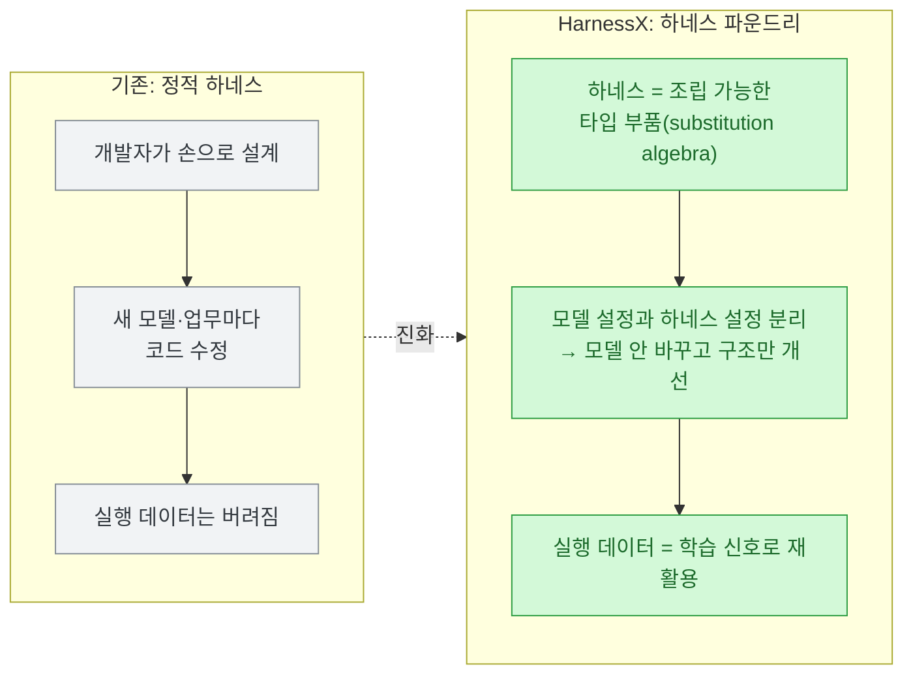
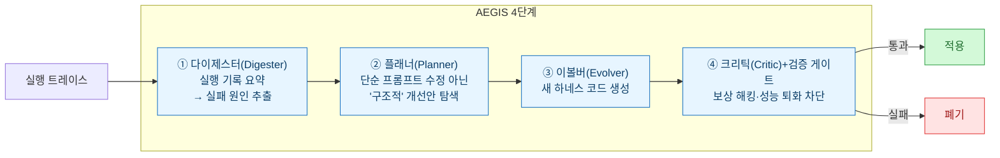
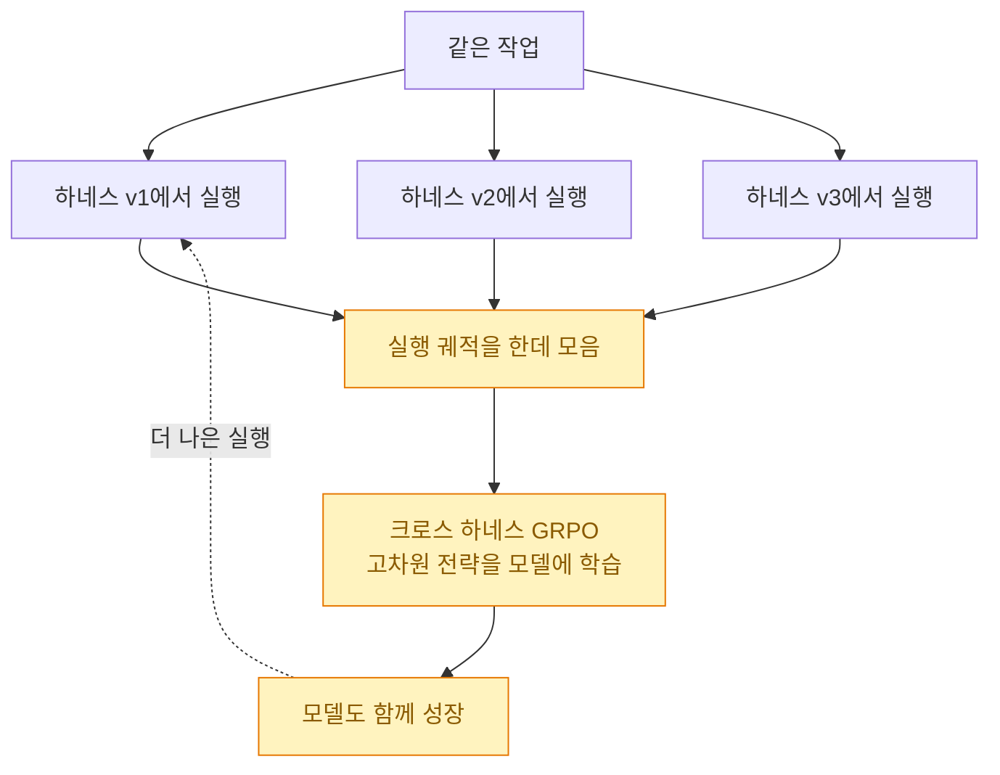

> **하네스가 스스로 진화한다** 시리즈 — [[harness-engineering-for-self-improvement-lilian-weng|① 릴리언 웽 개관]] · [[self-harness-agents-rewrite-own-rules|② Self-Harness]] · **③ 샤오미 HarnessX(이 글)**

앞 글 [[self-harness-agents-rewrite-own-rules|Self-Harness]]는 **모델은 그대로 두고 하네스만** 진화시켰다. 이번 **샤오미 HarnessX**(arXiv:2606.14249)는 한 발 더 간다 — **하네스와 모델을 함께(공진화) 진화**시킨다. 릴리언 웽 지도로 치면 서랍 ③(자기개선 하네스)과 ⑤(공동 최적화)에 양다리를 걸친 논문이다.

## 발상의 전환 — 하네스를 '객체'로 본다

기존 하네스는 대개 개발자가 손으로 짠 **정적 구조**다. 새 모델이나 새 업무가 오면 코드를 뜯어고쳐야 하고, 에이전트가 실제로 일하며 쏟아낸 실행 데이터는 대부분 그냥 버려진다. HarnessX는 이걸 뒤집어 **하네스를 독립적으로 수정·교체·진화시킬 수 있는 타입 객체**로 취급한다. 이게 논문이 말하는 **통합 하네스 파운드리(Unified Harness Foundry)**다.

## AEGIS — 하네스 코드를 진화시키는 4단계 엔진

핵심 엔진은 **AEGIS**. 실행 로그(trace)를 분석해 실패 원인을 찾고, 새 구조를 설계하고, **실제 코드 수준의 수정**을 만든 뒤, 성능을 훼손하지 않는지 검증해 적용한다. 재밌는 건 이 과정을 **강화학습(RL)의 언어로 매핑**했다는 점 — 하네스 진화에서 튀어나오는 문제들(보상 해킹·파국적 망각·과소 탐색)을 RL의 알려진 병리로 보고, 4단계 파이프라인 + 결정론적 게이트로 막는다.

Self-Harness의 3단계(약점 채굴→제안→검증)와 뼈대는 같은데, HarnessX는 **플래너가 "구조적" 변경을 노리고, 크리틱을 RL 병리 방어로 명시화**한 게 차이다.

## 진짜 새로운 것 — 공진화와 '크로스 하네스 GRPO'

여기가 이 논문의 심장이다. **하네스만 개선하면 결국 모델 능력의 천장에 부딪히고, 모델만 학습시키면 하네스가 그걸 못 살린다.** HarnessX는 하네스 진화 과정에서 나온 실행 데이터를 **강화학습 신호로 재활용**해 모델까지 같이 키운다.

이때 쓰는 게 추론 모델 학습에 쓰이는 **GRPO(Group Relative Policy Optimization)**를 확장한 **크로스 하네스 GRPO**다. 같은 작업을 **서로 다른 하네스 버전**에서 굴려 나온 실행 데이터를 한데 모아 학습시킨다. 그러면 모델이 단순 프롬프트 변화가 아니라 **새 API 활용법·예산 관리 전략 같은 고차원 행동 패턴**을 내재화한다.

## 결과 — 5개 벤치마크, 소형 모델일수록 크게 오른다 (실측)

소프트웨어 엔지니어링·웹 탐색·고객 서비스 대화·다단계 추론·체화형 계획 5개 벤치마크에서 검증했다. 실험 모델은 **클로드 소네트 4.6·GPT-5.4·큐원3.5-9B**, 하네스를 고치는 **메타 에이전트는 클로드 오퍼스 4.6**. 아래 수치는 [arXiv 원문](https://arxiv.org/abs/2606.14249) 대조로 확인했다.

| 항목 | 수치 |
|---|---|
| 전체 15개 (모델×벤치) 조합 중 향상 | **14개** |
| 평균 향상 폭 | **+14.5%** |
| 최대 (큐원3.5-9B, ALFWorld 체화형 계획) | **+44.0%** |
| 큐원3.5-9B, SWE-bench Verified | **+18.2%** |
| 공진화(크로스 하네스 GRPO) 추가 이득 | **평균 +4.7%** |

**소형·오픈웨이트 모델에서 효과가 두드러진다**는 게 실무적으로 큰 함의다 — 값비싼 초대형 모델 없이도, 하네스 진화로 작은 모델의 실전 성능을 상당히 끌어올릴 수 있다는 뜻이니까.

## 실제로 뭘 고쳤나 — 두 사례

수치보다 이 사례들이 더 설득력 있었다. **에이전트가 막힌 지점을 하네스가 코드로 우회**한다.

- **GAIA (위키피디아 수집)**: 브라우저 도구의 시간 초과로 반복 실패하자, HarnessX가 이를 분석해 **브라우저를 우회하고 미디어위키(MediaWiki) API를 직접 호출하는 새 도구를 자동 생성**했다.
- **WebShop (상품 구매)**: 에이전트가 결정을 못 내리고 페이지 이동만 반복하자, **반복 행동을 감지해 경고를 주는 새 프로세서**를 추가해 풀었다.

## ⚠️ 한계 — 메타 에이전트는 여전히 '비싼 클로즈드 모델'

과장 방지용으로 논문이 인정한 한계를 분리해 둔다.

- 하네스 코드를 자동 수정하는 **메타 에이전트 역할엔 아직 클로드 오퍼스 급 고성능 폐쇄형 모델이 필요**하다. 즉 "작은 모델을 키운다"면서 **정작 개선기는 큰 모델**이다.
- 기본 모델 능력이 지나치게 낮으면, 하네스를 아무리 고쳐도 **향상에 천장**이 있다. 릴리언 웽의 "재귀 구조만으론 부족하다 — 기본 모델이 충분히 유능해야 한다"와 정확히 같은 지적이다.

## 마무리 — 두 논문을 겹쳐 보면

Self-Harness와 HarnessX를 나란히 두면 **자기개선 하네스의 스펙트럼**이 보인다.

| | Self-Harness | 샤오미 HarnessX |
|---|---|---|
| 개선 대상 | 하네스만 | 하네스 **+ 모델(공진화)** |
| 엔진 | 약점채굴→제안→검증 | AEGIS 4단계(+RL 병리 방어) |
| 모델 학습 | 없음 | 크로스 하네스 GRPO |
| 강한 곳 | 측정 가능한 도메인 | 소형·오픈웨이트 모델 |
| 공통 한계 | 정확한 평가 전제 | 개선기는 큰 모델 필요 |

3편을 다 쓰고 나니, [[harness-engineering-for-self-improvement-lilian-weng|릴리언 웽의 5개 서랍]]이 왜 유용한지 체감된다. 앞으로 이런 논문이 또 나오면, 나는 "하네스만이냐, 공진화냐 / 평가는 뭐로 하냐 / 개선기는 뭐냐"만 물어도 바로 자리를 잡을 수 있다. 그게 좋은 지도의 힘이다.

## 참고자료

- [HarnessX: A Composable, Adaptive, and Evolvable Agent Harness Foundry (arXiv:2606.14249)](https://arxiv.org/abs/2606.14249) · [HuggingFace Papers](https://huggingface.co/papers/2606.14249)
- 관련: [[harness-engineering-for-self-improvement-lilian-weng|릴리언 웽 개관]] · [[self-harness-agents-rewrite-own-rules|Self-Harness]] · [[the-coming-loop-armin-ronacher-harness-critique|루프를 어떻게 통제하나]]

<!-- 안전: 회사 실데이터·고객/제3자 PII·API키/쿠키/토큰 없음. arXiv 원문 요약·논평 + 출처 링크. 수치는 1차 출처 대조. -->
