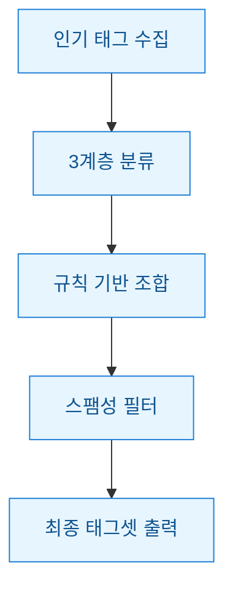
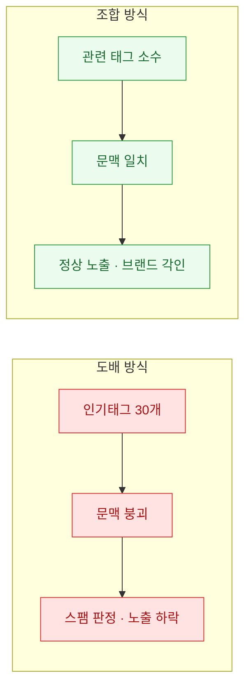
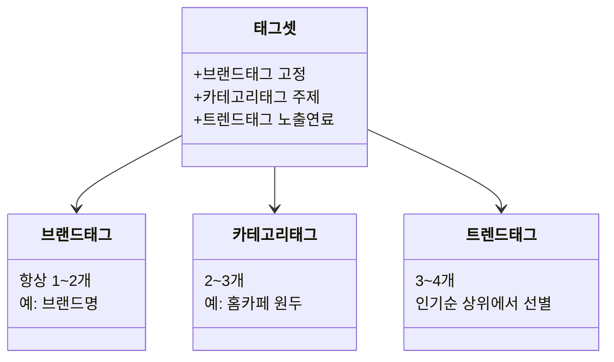
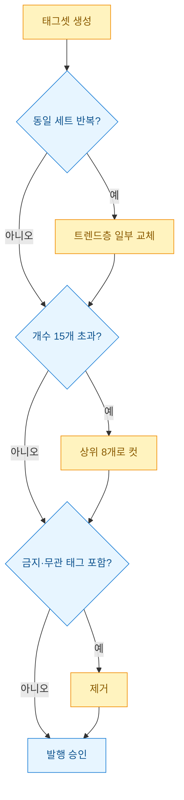

해시태그는 대충 인기 있는 걸로 채우면 된다고 생각했다. 처음엔 그랬다. 조회수 높은 태그 30개를 크롤링해서 게시물마다 그대로 복붙했다. 결과는 참담했다. 노출은 오히려 줄었고 어떤 계정은 태그가 아예 먹통이 되기도 했다. 알고 보니 플랫폼은 "인기 태그를 무차별로 도배하는 계정"을 스팸으로 본다. 상위노출은 태그 개수 싸움이 아니라 **태그 조합의 문맥(맥락)** 싸움이었다.

그래서 브랜드 키워드를 자연스럽게 인기 태그 흐름에 얹는 규칙을 직접 설계했다. 아래가 전체 과정이다.



## 왜 인기 태그만 도배하면 오히려 노출이 죽었나?

플랫폼 입장에서 태그는 "이 글이 무슨 주제인지"를 판단하는 신호다. 그런데 관련 없는 인기 태그(예: 뷰티 글에 #맛집 #여행 #일상)를 붙이면 신호가 뒤섞인다. 알고리즘은 이걸 **태그 스터핑(tag stuffing, 노출만 노린 무관 태그 채우기)** 으로 읽는다.



내가 겪은 건 명확했다. 태그 20개짜리 게시물보다 문맥 맞는 8개짜리가 노출이 잘 나왔다. 개수를 줄이니 오히려 살아났다.

## 태그를 왜 3계층으로 나눴나?

무작정 섞으면 규칙이 안 선다. 그래서 태그를 역할별로 세 층으로 나눴다. 브랜드 태그는 항상 들어가야 하는 고정값, 카테고리 태그는 글 주제를 잡아주는 뼈대, 트렌드 태그는 그날그날 노출을 태우는 연료다.



핵심은 **트렌드 태그는 반드시 카테고리와 의미가 겹치는 것만** 고른다는 규칙이다. 인기 순위 100개를 다 쓰는 게 아니라 카테고리와 연관 있는 것만 통과시킨다.

## 조합 규칙을 어떻게 코드로 짰나?

로직은 단순하다. 세 계층에서 정해진 개수만큼 뽑되 트렌드 태그는 카테고리 키워드와 겹치는지 검사해서 필터링한다. 아래는 동작하는 합성 예시다.

```python
import random

def build_hashtags(brand, category_tags, trend_pool, max_total=8):
    # 트렌드 풀에서 카테고리와 문맥이 겹치는 것만 통과
    related = [
        t for t in trend_pool
        if any(c[:2] in t or t[:2] in c for c in category_tags)
    ]
    tags = []
    tags += brand[:2]                 # 브랜드: 고정 1~2개
    tags += category_tags[:3]         # 카테고리: 주제 뼈대
    remain = max_total - len(tags)
    tags += random.sample(related, min(remain, len(related)))
    # 중복 제거 + 순서 유지
    seen, result = set(), []
    for t in tags:
        if t not in seen:
            seen.add(t); result.append(t)
    return result[:max_total]

brand = ["#원두공방"]
category = ["#홈카페", "#드립커피", "#원두추천"]
trend = ["#커피스타그램", "#홈카페추천", "#맛집", "#여행에모여", "#카페투어"]

print(build_hashtags(brand, category, trend))
# ['#원두공방', '#홈카페', '#드립커피', '#원두추천', '#커피스타그램', '#홈카페추천', '#카페투어']
```

`#맛집` `#여행에모여` 처럼 문맥 안 맞는 인기 태그는 related 필터에서 자동으로 걸러진다. 매번 무작위 표본을 쓰니 게시물마다 태그가 조금씩 달라진다. 이게 다음 절의 스팸 회피와 직결된다.

## 스팸 판정을 어떻게 피했나?

같은 태그 세트를 매 게시물에 복붙하는 게 가장 위험하다. 플랫폼은 **동일 태그 반복 게시**를 봇(자동화 계정)의 대표 신호로 본다. 그래서 회피 규칙을 세 가지 넣었다.



규칙을 정리하면 이렇다. ① 트렌드층은 매번 무작위 표본으로 바꿔 완전 동일 세트를 피한다. ② 총개수를 8~10개로 묶어 도배 신호를 안 준다. ③ 브랜드·카테고리와 무관한 태그는 문맥 검사로 자동 배제한다.

## 무엇이 남았나

한 달 돌려보니 배운 건 하나다. 해시태그 자동화의 목표는 "인기 태그를 많이 붙이기"가 아니라 **"브랜드 태그가 자연스러워 보이는 문맥을 만들기"** 였다. 트렌드는 연료일 뿐 뼈대는 언제나 카테고리와 브랜드다.

다음엔 게시물 성과(저장·도달)를 태그 조합별로 로그에 쌓아서 어떤 조합이 실제로 노출을 태웠는지 역추적하는 파이프라인을 붙일 생각이다. 지금은 규칙이 감(感)에 기대고 있는데 이걸 데이터로 교체하는 게 숙제다.

> 자동화라도 결국 사람이 붙인 것처럼 보여야 산다. 규칙의 목적은 도배가 아니라 위장이 아닌 자연스러움이다.
