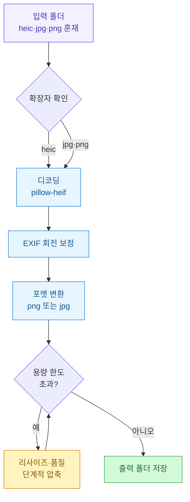
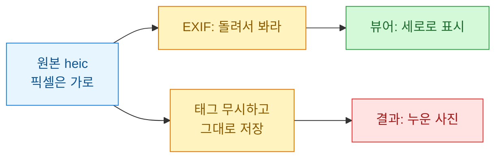
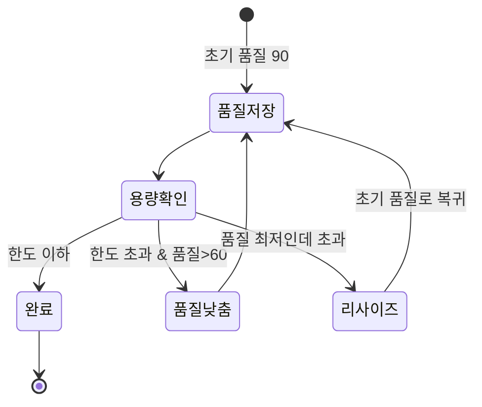
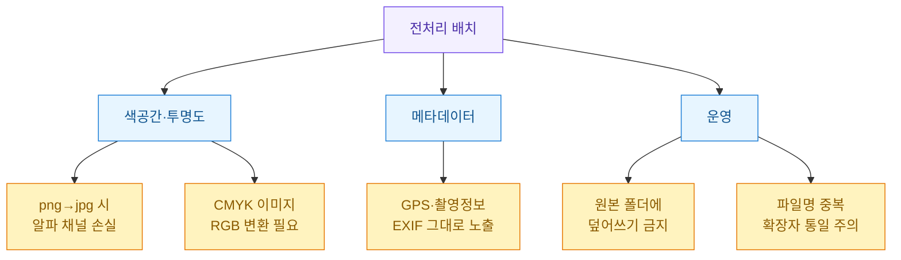
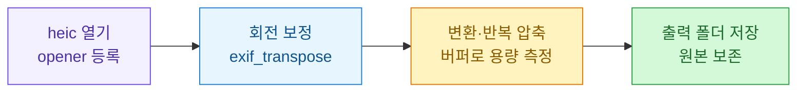

업로드 버튼을 눌렀는데 "지원하지 않는 형식입니다" 혹은 "파일이 너무 큽니다"라는 메시지를 보는 건 늘 마지막 순간이다. 아이폰으로 찍은 사진은 heic로 저장되는데, 상당수의 SNS·블로그 업로더는 이 포맷을 그대로 받지 못하거나 용량 한도에 걸린다. 매번 손으로 변환기 사이트에 올리고 다시 압축하는 게 지겨워서, 폴더째로 던지면 알아서 png/jpg로 바꾸고 정해진 용량 아래로 맞춰주는 배치 스크립트를 만들었다. 이 글에 정리해 둔다.

> ⚠️ 이 글의 모든 파일명·수치·경로는 **합성(더미) 데이터**다. 특정 회사·서비스·실제 계정과 무관하며, 기법은 공개 지식으로 일반화해 설명한다.

## 전체 흐름은 어떻게 되나?

먼저 전체 그림부터. 입력 폴더의 이미지를 하나씩 읽어서 → 회전 보정 → 포맷 변환 → 용량이 한도를 넘으면 반복 압축 → 출력 폴더에 저장한다.



핵심은 두 가지다. 첫째, **heic 디코딩**을 파이썬에서 처리하는 것. 둘째, 용량을 **한 번에 맞추려 하지 말고** 목표 아래로 떨어질 때까지 조금씩 조여가는 것. 뒤에서 하나씩 본다.

## 왜 heic는 그냥 못 여나?

heic는 애플이 쓰는 컨테이너 포맷(HEIF)으로, 내부는 HEVC 코덱으로 압축돼 있다. 같은 화질을 jpg의 절반 용량으로 담는 대신, 디코딩에 별도 라이브러리가 필요하다. Pillow만으로는 못 열고, `pillow-heif`를 등록해줘야 Pillow가 heic를 일반 이미지처럼 다룰 수 있다.

```python
from PIL import Image
import pillow_heif

# 이 한 줄이 Pillow에 heic 디코더를 등록한다
pillow_heif.register_heif_opener()

img = Image.open("sample_0001.heic")  # 합성 예시 파일명
print(img.size, img.mode)  # 예: (4032, 3024) RGB
```

`register_heif_opener()`를 호출하고 나면 `Image.open`이 heic도 받아준다. 포맷별로 분기 코드를 짤 필요 없이, 이후 로직은 jpg·png와 완전히 동일하게 흘러간다. 이게 이 방식의 가장 큰 장점이다.

라이브러리 역할을 표로 정리하면 이렇다.

| 라이브러리 | 역할 | 없으면 생기는 문제 |
|---|---|---|
| Pillow | 이미지 읽기·리사이즈·저장 | 이미지 처리 자체 불가 |
| pillow-heif | heic 디코딩 opener 등록 | heic 파일이 열리지 않음 |
| (표준) os·pathlib | 폴더 순회·경로 처리 | 배치 처리 불편 |

## 사진이 옆으로 눕는 문제는 왜 생기나?

변환하고 나니 멀쩡하던 세로 사진이 옆으로 누워버리는 일이 있다. 원인은 **EXIF Orientation 태그**다. 카메라는 센서를 물리적으로 회전시키지 않고, "이 사진은 90도 돌려서 봐라"라는 메타데이터만 파일에 적어둔다. 뷰어는 이 값을 읽어 알아서 돌려 보여주지만, 픽셀을 그대로 저장하면 태그가 사라지면서 원래 방향(누운 상태)이 드러난다.



해결은 간단하다. Pillow의 `ImageOps.exif_transpose`가 EXIF 값을 읽어 픽셀을 실제로 회전시켜준다. 저장 전에 한 번 통과시키면 방향이 고정된다.

```python
from PIL import ImageOps

def fix_orientation(img):
    # EXIF Orientation을 실제 픽셀 회전으로 반영
    return ImageOps.exif_transpose(img)
```

이 한 줄을 빠뜨리면 결과물의 일부가 눕는데, 원인을 모르면 한참 헤맨다. 변환 파이프라인에서는 거의 항상 넣어두는 게 안전하다.

## 용량은 어떻게 3MB 아래로 맞추나?

가장 까다로운 부분이다. "품질 85로 저장하면 대충 맞겠지" 식으로 고정값을 쓰면, 사진에 따라 어떤 건 5MB가 되고 어떤 건 1MB가 된다. 사진의 복잡도(디테일이 많을수록 압축이 덜 된다)가 제각각이라 한 방에 맞추기 어렵다.

그래서 **목표 용량 아래로 떨어질 때까지 조금씩 조이는** 반복 전략을 쓴다. 순서는 이렇다.



먼저 품질을 낮춰가며 시도하고, 품질을 최저(예: 60)까지 낮춰도 안 되면 이미지 자체를 줄인다(리사이즈). 그리고 다시 초기 품질로 압축을 시도한다. 이 두 축(품질↓, 크기↓)을 번갈아 쓰면 대부분의 사진이 목표 아래로 들어온다.

jpg 기준 구현은 이렇다. 메모리 버퍼(`BytesIO`)에 저장해 용량을 재보고, 통과한 결과만 실제 파일로 쓴다.

```python
import io
from PIL import Image

def compress_to_limit(img, limit_bytes, out_path,
                      q_start=90, q_min=60, q_step=10):
    """jpg로 저장하되 limit_bytes 이하가 되도록 품질·크기를 조인다."""
    work = img.convert("RGB")  # jpg는 알파 미지원 → RGB로
    quality = q_start

    while True:
        buf = io.BytesIO()
        work.save(buf, format="JPEG", quality=quality, optimize=True)
        size = buf.tell()

        if size <= limit_bytes:
            with open(out_path, "wb") as f:
                f.write(buf.getvalue())
            return {"quality": quality, "size": size, "wh": work.size}

        if quality > q_min:
            quality -= q_step          # 1) 품질 먼저 낮춘다
        else:
            # 2) 품질 한계 → 가로세로를 85%로 줄이고 품질 리셋
            w, h = work.size
            work = work.resize((int(w * 0.85), int(h * 0.85)))
            quality = q_start
            if min(work.size) < 400:   # 안전장치: 너무 작아지면 중단
                with open(out_path, "wb") as f:
                    f.write(buf.getvalue())
                return {"quality": quality, "size": size,
                        "wh": work.size, "warn": "한도 미달성"}
```

포인트 세 가지.

- **버퍼에 먼저 저장**해 용량을 측정한다. 디스크에 썼다 지웠다 하지 않아 빠르다.
- `optimize=True`는 허프만 테이블을 최적화해 같은 품질에서 몇 % 더 줄여준다. 공짜 절감이라 늘 켠다.
- 무한 루프를 막는 **안전장치**(최소 변 400px)를 둔다. 극단적으로 압축이 안 되는 이미지에서 스크립트가 멈추는 걸 방지한다.

png로 내보내야 한다면(투명 배경 유지 등) 이야기가 조금 다르다. png는 무손실이라 `quality`가 없다. 대신 색상 수를 줄이는 `quantize`(팔레트화)나 리사이즈로 용량을 낮춘다. 사진은 jpg, 로고·투명 이미지는 png로 갈라 쓰는 게 보통 합리적이다.

## 폴더째로 돌리는 배치는 어떻게 짜나?

이제 조각을 합쳐 폴더 전체를 처리한다. 입력 폴더를 순회하며 이미지 확장자만 골라 앞의 함수들을 순서대로 태운다.

```python
from pathlib import Path
import pillow_heif
from PIL import Image, ImageOps

pillow_heif.register_heif_opener()

IMG_EXT = {".heic", ".jpg", ".jpeg", ".png"}
LIMIT = 3 * 1024 * 1024  # 3MB (합성 기준값)

def process_folder(src_dir, dst_dir):
    src, dst = Path(src_dir), Path(dst_dir)
    dst.mkdir(parents=True, exist_ok=True)
    report = []

    for p in sorted(src.iterdir()):
        if p.suffix.lower() not in IMG_EXT:
            continue
        img = Image.open(p)
        img = ImageOps.exif_transpose(img)      # 회전 보정
        out_path = dst / (p.stem + ".jpg")       # 통일해서 jpg로
        info = compress_to_limit(img, LIMIT, out_path)
        report.append((p.name, info))
        print(f"{p.name} -> q{info['quality']} "
              f"{info['size']//1024}KB {info['wh']}")
    return report

# 실행 예시 (합성 경로)
# process_folder("input_photos", "output_upload")
```

처리 결과 로그는 이런 식으로 남는다(합성 데이터).

| 원본 파일 | 최종 품질 | 결과 용량 | 최종 해상도 |
|---|---|---|---|
| sample_0001.heic | 90 | 1,840 KB | 4032×3024 |
| sample_0002.heic | 70 | 2,910 KB | 4032×3024 |
| sample_0003.heic | 90 | 1,120 KB | 3428×2571 |
| sample_0004.jpg | 80 | 2,450 KB | 4032×3024 |

두 번째 파일은 디테일이 많아 품질을 70까지 낮춰 겨우 한도에 들었고, 세 번째는 리사이즈까지 가서 해상도가 줄었다. 같은 3MB 한도라도 사진마다 도달 경로가 다르다는 게 표에서 보인다.

## 실무에서 빠지기 쉬운 함정은?

몇 번 굴려보며 부딪힌 것들을 정리해둔다.



- **투명도 손실**: png에 투명 배경이 있는데 jpg로 바꾸면 투명 영역이 검게 채워진다. 투명이 필요하면 png 경로를 따로 둔다.
- **CMYK 이미지**: 인쇄용 소스는 CMYK일 수 있는데, 웹 업로드 전 `convert("RGB")`로 바꿔야 색이 안 틀어진다. 위 코드에 이미 반영돼 있다.
- **EXIF 개인정보**: 사진에는 GPS 좌표·촬영 시각이 EXIF로 박혀 있을 수 있다. 공개 업로드 전이라면 저장 시 EXIF를 빼거나 필요한 것만 남기는 편이 안전하다. jpg 저장에서 `exif` 인자를 넘기지 않으면 기본적으로 대부분 빠진다.
- **원본 보호**: 절대 입력 폴더에 덮어쓰지 않는다. 출력 폴더를 분리해 원본을 지킨다. 압축은 되돌릴 수 없다.

## 정리

한 줄로 요약하면, heic 디코더를 등록하고(`pillow-heif`) 회전을 보정한 뒤(`exif_transpose`) 목표 용량 아래로 품질·크기를 반복해 조이는(`BytesIO` 측정 루프) 것이 전부다.



업로드 직전에 매번 손으로 하던 일을 폴더 하나 던지는 것으로 줄였다. 작은 스크립트지만, 반복 작업의 마지막 마찰을 없애주는 종류의 자동화라 체감 효율이 꽤 크다.
