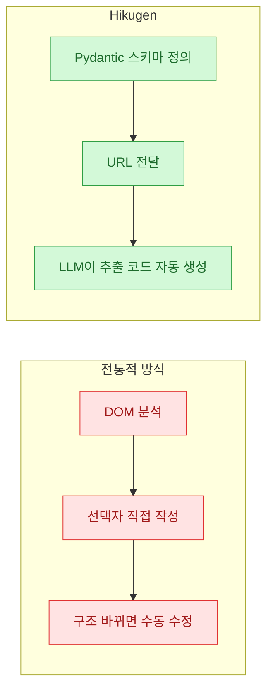
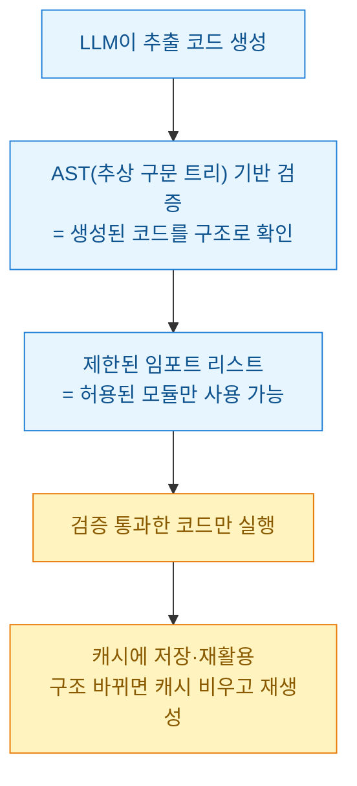

앞 글([[bigset-sentence-to-verified-dataset-agent|BigSet]])이 "문장 하나로 검증된 데이터셋"이었다면, **Hikugen**(`github.com/goncharom/hikugen`, 긱뉴스 박정환 님 소개)은 한 단계 아래 결의 도구다 — **스키마만 주면 스크래퍼 '코드'를 LLM이 짜준다.** 스크래핑을 해 본 사람이면 이 지점이 왜 매력적인지 바로 안다. 정리해 둔다.

## 뭐가 다른가 — '내가 짜던 파싱 로직'을 없앤다

전통적 스크래핑(BeautifulSoup·lxml·Selenium)은 개발자가 **DOM을 이해하고, 선택자(selector)를 직접 쓰고, 사이트 구조가 바뀌면 손으로 고쳐야** 한다. Hikugen은 그 층을 걷어낸다.



원하는 데이터 구조를 **Pydantic 스키마**로 정의하고 URL만 주면, LLM이 웹페이지 구조를 스스로 파악해 **그 스키마에 맞게 데이터를 뽑는 파이썬 코드**를 만들어 준다. 사람이 선택자나 파싱 로직을 쓸 필요가 없다. 기존보다 **추상화 수준이 높고 유지보수에 유리**하다는 게 핵심 주장이다.

> 트레이드오프도 분명하다. LLM을 쓰니 **성능·비용 면에선 전통 방식보다 무거울 수 있고**, LLM 호출용 **OpenRouter API 키**가 필요하다.

## 안전장치는 뭔가 — 생성된 코드를 그냥 믿지 않는다

내가 제일 눈여겨본 대목. LLM이 코드를 짜준다고 하면 바로 드는 걱정이 "그 코드 실행해도 안전한가?"인데, Hikugen은 여기에 두 겹을 뒀다.



생성 코드는 내부적으로 **AST(추상 구문 트리)로 검증**되고, **제한된 임포트 리스트**로 보안을 확보한다. 게다가 **캐시**가 내장돼, 한 번 만든 추출 코드를 저장·재활용해 성능과 비용을 아낀다. 페이지 구조가 바뀌면 캐시를 비우고 새로 생성하면 된다. "LLM으로 코드 생성"의 실무 리스크(불안정·비용·보안)를 **검증 + 캐시**로 눌렀다는 점이 설계의 포인트다.

## 어떻게 쓰나 — HikuExtractor

PyPI로 간단히 깐다.

```bash
uv add hikugen
```

핵심 클래스는 `HikuExtractor`. 추출할 구조를 `pydantic.BaseModel`로 정의하고 URL만 넘기면 나머지는 알아서 처리한다.

```python
from hikugen import HikuExtractor
from pydantic import BaseModel, Field
from typing import List

class Article(BaseModel):
    title: str = Field(description="Article title")
    author: str = Field(description="Author name")
    published_date: str = Field(description="Publication date")
    content: str = Field(description="Article body content")

class ArticlePage(BaseModel):
    articles: List[Article] = Field(description="List of articles on the page")

extractor = HikuExtractor(
    api_key="your-openrouter-api-key",
    model="google/gemini-2.5-flash"  # optional
)

result = extractor.extract(
    url="https://example.com/articles",
    schema=ArticlePage,
    cache_key="articles-page"  # optional
)

for article in result.articles:
    print(f"{article.title} by {article.author}")
```

스키마 정의만으로 원하는 데이터를 뽑는다는 게 강점이다. 스키마의 `Field(description=...)`가 사실상 **LLM에게 주는 지시문** 역할을 한다는 점도 깔끔하다.

## 이미 받아둔 HTML도, 캐시 관리도

두 가지 실무 편의를 더 챙겼다.

**① API 호출 없이 로컬 HTML에서 추출** — 이미 수집한 HTML이 있으면 `extract_from_html()`에 같은 스키마와 HTML 문자열을 주면 된다. 백엔드 파이프라인에서 **API 호출 없이 빠르게** 처리할 때 유용하다.

**② 캐시 초기화** — 구조가 자주 바뀌거나 테스트로 반복 추출할 땐 캐시를 비운다.

```python
# 특정 키에 대한 캐시 삭제
count = extractor.clear_cache_for_key("https://example.com/articles")
print(f"Deleted {count} cache entries")

# 전체 캐시 삭제
total = extractor.clear_all_cache()
print(f"Deleted {total} total cache entries")
```

반복 작업의 성능 개선뿐 아니라, 개발 초기 테스트에서도 항상 최신 구조를 반영하도록 조정할 수 있다.

## BigSet과 뭐가 다른가?

오늘 같이 정리한 [[bigset-sentence-to-verified-dataset-agent|BigSet]]과 결이 겹쳐 보이지만, 층이 다르다.

| 구분 | **Hikugen** | **BigSet** |
|---|---|---|
| 입력 | Pydantic 스키마 + URL | 평범한 문장 한 줄 |
| 하는 일 | 그 페이지 추출 **코드**를 LLM이 생성 | 개체를 **웹에서 찾아** 조사·검증·표 생성 |
| 범위 | 내가 지정한 페이지(단일 구조) | 여러 소스를 가로지르는 데이터셋 |
| 갱신 | 캐시 재활용(수동 재생성) | 주기 갱신 내장(cron 유사) |
| 라이선스 | **MIT**(상업 사용 제한 없음) | **AGPL-3.0**(네트워크 서비스도 소스공개) |
| 성격 | 라이브러리(파이프라인 부품) | 엔드투엔드 에이전트 앱 |

거칠게 나누면 **Hikugen은 '스크래퍼를 대신 짜주는 라이브러리', BigSet은 '데이터셋을 대신 만들어주는 에이전트'**다. 내 파이프라인에 부품으로 끼우기 좋은 건 라이선스(MIT)나 성격상 Hikugen 쪽이고, 넓게 흩어진 데이터를 한 방에 긁어 표로 받고 싶으면 BigSet이다.

## 라이선스 — MIT

Hikugen은 **MIT 라이선스**로 공개돼 상업적 사용에 제한이 없다. AGPL인 BigSet과 대비되는 지점이라, **사내 파이프라인 부품**으로 얹기엔 부담이 훨씬 적다(그래도 [[never-publish-company-work|회사 실무 코드·데이터 공개 금지]] 원칙은 별개로 지킨다).

## 내 메모

스크래핑에서 제일 지겨운 게 **"구조 바뀌면 선택자 다시 짜기"**였다. Hikugen은 그 유지보수 비용을 LLM+캐시로 옮겼다. 대신 비용·지연이 붙으니, 나라면 **구조가 자주 바뀌는 소스엔 Hikugen, 안정적 대량 반복엔 캐시된 코드(또는 전통 파서)**로 섞어 쓰겠다. 마침 [[doc-extraction-toolkit|문서 추출 툴킷]]과 색인 파이프라인을 굴리는 입장에서, "스키마를 지시문처럼 쓰고 생성 코드를 AST로 검증"하는 발상은 그대로 훔쳐올 만하다.

---

*출처: Hikugen — `github.com/goncharom/hikugen`. 한국어 소개는 긱뉴스(news.hada.io) 박정환(9bow) 님 글 참조. 코드 예제·API·스택은 공개 문서(README) 기준으로 옮긴 것이며, 성능·비용은 사용 모델·페이지에 따라 달라진다.*
