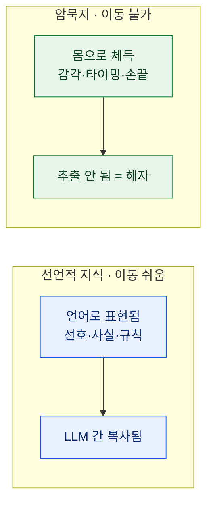
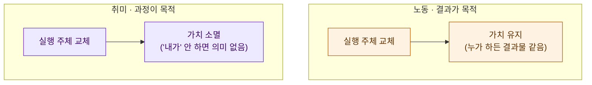
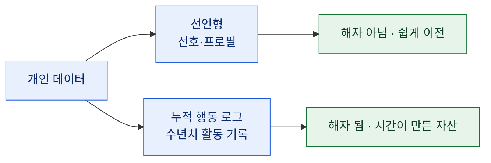
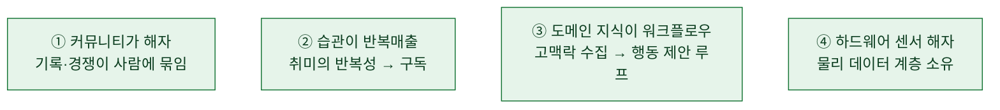

# 취미가 '도메인 지식'이 된다는 말에 대하여

> 며칠 전 **'취미자본'**이라는 에세이를 읽었다. 요지는 이랬다 — AI가 지식노동을 외주화하는 시대엔, **언어로 옮겨지지 않는 체득형 취미**가 새로운 도메인 지식이자 해자가 된다. 데이터와 마케팅으로 먹고사는 나로선 반쯤 세게 끄덕였고, 반쯤 갸웃했다. 남의 글을 그대로 옮기는 건 의미가 없으니, **내 반론과 보론**만 적는다. (원문 각주의 일부 수치는 교차검증이 안 돼, 여기선 아이디어에만 반응한다. 자세한 건 아래 *덧붙임* 참고.)

## 원문의 요지는 뭐였나?

거칠게 줄이면 네 문장이다.

1. AI가 1차 지식을 자동 수집·요약하면서 **지식노동의 값이 떨어진다.**
2. 하지만 LLM은 **도메인 지식**을 모른다 — 그 위에 올라탄 에이전트가 진짜 일을 한다.
3. 그 도메인 지식의 정수는 **암묵지(tacit knowledge)** — 언어화가 안 돼 추출·복제가 안 된다.
4. 그래서 **몸으로 체득하는 취미**가 뜨는 도메인이고, 그 **진입장벽을 낮추는 데 사업 기회**가 있다.

핵심은 **선언적 지식 vs 암묵지**의 구분이었다. 커피로 치면 "나는 산미 있는 커피를 좋아한다"는 **말로 옮겨지니** LLM 사이를 쉽게 건너가지만, "물을 부었을 때 원두가 부풀어 오르는 정도를 보고 다음 물줄기를 조절하는 감각"은 **말이 안 되니** 추출이 불가능하다는 것.

## 어디에 동의하나 — 암묵지는 해자가 맞다

이 부분은 세게 끄덕였다. 내가 자동화나 데이터 파이프라인을 짤 때도, 진짜 값어치는 코드에 있지 않았다. **"이 데이터는 이래서 못 믿는다", "이 지표는 이 맥락에선 거짓말한다"** 같은, 문서에 안 적히는 감각에 있었다. 그게 남과 나를 가른다.

노동과 취미의 결정적 차이도 날카로웠다. **노동은 결과가 목적이라 실행 주체를 바꿔도 가치가 남지만, 취미는 '내가 직접 한다'는 과정 자체가 목적이라 주체를 바꾸는 순간 가치가 증발한다.** 로봇이 대신 등산을 완주해줘도 의미가 없다는 것. 그래서 휴머노이드는 취미를 **대체**하는 게 아니라, 노동을 가져가고 **취미 시간을 돌려주는** 존재라는 정리는 깔끔했다.

## 어디서 갸웃했나 — '개인 데이터는 해자가 아니다'

원문은 **"개인 맥락 데이터는 해자가 아니다"**라고 잘라 말했다. LLM을 갈아탈 때 "내 정보 내놔" 하면 쉽게 추출·이전되니까. 데이터 다루는 입장에서, 이건 **절반만 맞다**고 봤다.

맞는 절반: **선언적 개인 데이터**(선호·프로필·설정)는 확실히 쉽게 넘어간다. 여기엔 동의한다.

갸웃한 절반: **행동 로그**는 다르다. 몇 년치 누적된 활동 기록 — 언제, 얼마나, 어떤 패턴으로 — 은 한 번 요청해서 뽑아낼 수 있는 게 아니다. 그건 **시간이 만든 자산**이고, 신규 서비스가 "GPT한테 물어봐서" 복제할 수 있는 게 아니다. 즉 개인 데이터라도 **선언(가벼움) vs 누적 로그(무거움)**로 갈린다. 원문의 암묵지 논리를 데이터에 그대로 옮기면, **행동 로그야말로 데이터판 암묵지**다.

## 데이터쟁이의 보론 — 취미 비즈니스의 세 축

원문은 취미가 세 방식으로 사업이 된다고 했다. 커뮤니티 해자, 습관 반복매출, 도메인 AI 워크플로우. 사례 해석엔 동의하는데, **여기선 정성적으로만** 옮긴다(수치는 덜어냈다 — 이유는 아래).

- **커뮤니티(예: 러닝 기록 플랫폼)** — 사람들은 다른 앱으로 훈련하고 길을 찾아도, 결국 "같이 뛰는 사람들이 모인 곳"에 기록을 올린다. 해자는 기능이 아니라 **커뮤니티에 묶인 데이터**다.
- **습관(예: 온라인 체스)** — 취미의 반복성이 월 구독으로 이어진다. 다만 최상위 실력 전수는 여전히 인간 코치의 몫 — 이게 원문이 인용한 "hard to master"의 숙련 피라미드가 유지되는 이유다(= 암묵지 논리의 반복).
- **도메인 워크플로우(예: 골프 진단 앱)** — 측정에 그치지 않고 **근본 원인 진단 → 개선 추적 루프**를 돈다. "고맥락 정보 수집 → 행동 워크플로우"가 물리 취미에서 구현된 형태.
- **하드웨어(예: 웨어러블)** — AI가 소프트웨어 계층을 상품화할수록, **센서라는 물리 데이터 계층**을 소유한 쪽이 구조적으로 보호받는다.

## 그래서 내 결론은?

원문의 한 문장이 오래 남았다. **"취향은 선호이고, 취미는 활동이다."** AI가 생산의 하방을 없애 누구나 그럴듯한 걸 내놓는 시대엔, 차이를 가르는 건 취향이고, **좋은 취향은 직접 몸으로 겪은 취미에서 나온다.**

데이터쟁이로서 덧붙이면 — 나는 여기에 **"누적"**을 더하고 싶다. 취미든 데이터든, 해자는 **시간을 들여야만 쌓이는 것**에서 나온다. 한 번에 뽑히는 건 이미 해자가 아니다. 남이 5분 만에 복제 못 하는 걸 갖고 있느냐. 그게 암묵지든, 몇 년치 행동 로그든, 손끝의 감각이든.

> AI는 '아는 것'을 흔하게 만들었다. 그래서 이제 값이 나가는 건 **몸으로 겪어야만 얻는 것**, 그리고 **시간이 지나야만 쌓이는 것**이더라. 취미는 그 둘을 동시에 요구한다.

---

## 덧붙임 — 이 글의 태도

이 글은 '취미자본'이라는 **타인의 에세이를 읽고 쓴 내 반응**이다. 원문의 논지(암묵지 = 해자, 취미 = 뜨는 도메인 지식)를 인용하되 **그대로 옮기지 않았고**, 내 반론(개인 데이터의 이분법)과 보론(누적의 강조)을 얹었다. 원문 각주에는 여러 연구·기업 수치가 인용돼 있었는데, 그중 일부(특정 플랫폼의 평가액·전환율 등)는 내가 **교차검증에 실패**해 이 글에선 **수치를 빼고 정성적으로만** 다뤘다. 숫자를 인용하려면 원 출처를 직접 확인하는 게 맞다는 원칙 때문이다.
