처음 이 소식을 봤을 때는 조금 웃겼다. HTTP에 `QUERY`라는 메서드가 새로 생겼다니, 이름만 보면 너무 당연한 말을 뒤늦게 표준으로 만든 느낌이었다. 그런데 RFC 10008을 읽어 보니, 이건 "새 기능"이라기보다 **우리가 오래 우회하던 빈칸에 이름을 붙인 일**에 가까웠다.

나는 API를 만들 때 검색 조건이 길어지는 순간을 자주 만난다. 처음엔 `GET /users?role=admin` 정도라 괜찮다. 그런데 필터가 늘고, 배열이 들어가고, 날짜 범위가 붙고, 정렬 조건이 2개가 되고, 중첩 조건이 생기면 URL이 어느 순간 사람이 읽는 주소가 아니라 압축된 암호문처럼 변한다.

그래서 개발자들은 종종 POST로 검색한다. 몸체(body)에 JSON을 넣으면 편하니까. 문제는 POST가 원래 "읽기 전용 검색"이라는 뜻을 갖고 있지 않다는 점이다. **QUERY는 바로 이 지점, GET은 좁고 POST는 의미가 무거운 지점에 들어온다.**

## 전체 그림은 어떻게 생겼나?

먼저 전체 구조를 이렇게 잡았다.

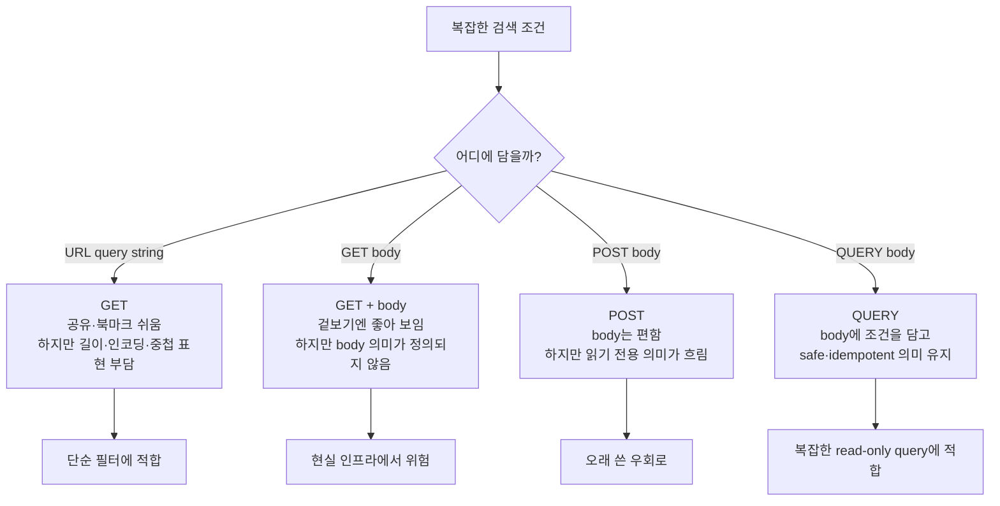

여기서 **safe**는 "클라이언트가 서버 상태 변경을 요청하지 않는다"는 뜻이고, **idempotent**는 "같은 요청을 여러 번 보내도 의도한 효과가 같다"는 뜻이다. 쉽게 말하면 실패했을 때 다시 보내도 비교적 안심할 수 있는 요청이다.

`QUERY`는 이 두 의미를 유지하면서도, 검색 조건은 URL이 아니라 request body에 넣을 수 있게 해 준다.

## GET 쿼리 파라미터는 어디서 막히나?

처음에는 GET이면 충분하다. 간단한 목록 필터는 URL이 더 낫다.

```http
GET /api/users?role=admin&status=active&sort=-createdAt HTTP/1.1
Host: example.com
```

이 방식은 장점이 분명하다.

| 장점 | 설명 |
|---|---|
| 공유 가능 | URL 하나를 복사하면 같은 필터 화면을 열 수 있다 |
| 북마크 가능 | 브라우저 주소 자체가 상태를 담는다 |
| 캐시 친화적 | 기존 캐시와 프록시가 GET을 잘 이해한다 |
| 디버깅 쉬움 | 주소만 봐도 어느 정도 요청이 보인다 |

그런데 조건이 복잡해지면 반대로 그 장점들이 부담이 된다.

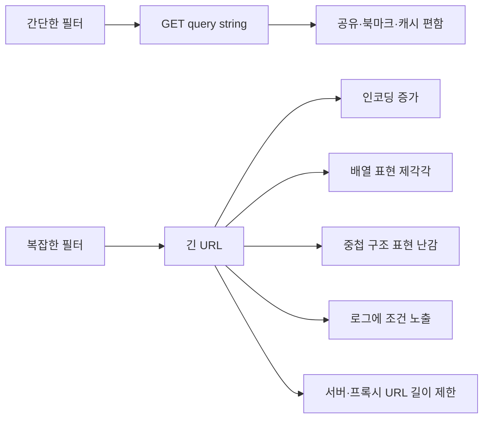

예를 들어 배열 하나만 해도 팀마다 표현이 다르다.

```text
?roles=admin&roles=reporter
?roles[]=admin&roles[]=reporter
?roles[0]=admin&roles[1]=reporter
```

여기에 중첩 조건까지 들어가면 더 애매해진다.

```json
{
  "where": {
    "role": ["admin", "reporter"],
    "createdAt": {
      "from": "2026-01-01",
      "to": "2026-06-30"
    }
  },
  "sort": [
    { "field": "createdAt", "direction": "desc" },
    { "field": "name", "direction": "asc" }
  ]
}
```

이걸 URL에 우겨 넣을 수는 있다. 하지만 그 순간부터는 API라기보다 문자열 인코딩 퍼즐이 된다.

## 그러면 GET body를 쓰면 안 되나?

나도 예전에는 이 생각을 했다. "GET이 읽기 요청이면, 그냥 GET에 JSON body를 넣으면 되는 것 아닌가?"

겉으로는 그럴듯하다.

```http
GET /api/users/search HTTP/1.1
Host: example.com
Content-Type: application/json

{
  "roles": ["admin", "reporter"],
  "status": "active"
}
```

문제는 표준과 현실 사이에 있다. RFC 10008의 정리표에서 GET의 content(body)는 **정의된 의미가 없다**고 나온다. 금지라기보다는 "이 body를 어떻게 해석해야 하는지 HTTP 차원에서 약속하지 않았다"에 가깝다.

그 결과는 현실에서 이렇게 갈린다.

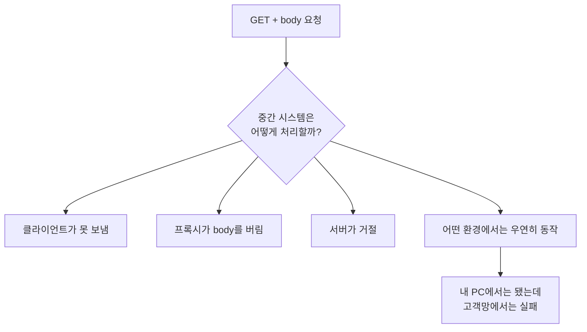

이게 제일 위험하다. "명확히 안 된다"보다 "어디서는 된다"가 더 무섭다. 사내망, 보안 장비, API Gateway, 브라우저 fetch 구현, 프록시가 섞이면 GET body는 재현성이 떨어진다. 그래서 나는 이 방식을 공개 API의 기본 설계로 쓰고 싶지 않다.

## POST로 검색하는 우회는 왜 찜찜했나?

그래서 지금까지 많이 쓰던 우회가 POST였다. 요청 body에 JSON을 담을 수 있고, 거의 모든 인프라가 POST body는 잘 처리한다.

```http
POST /api/users/search HTTP/1.1
Host: example.com
Content-Type: application/json

{
  "roles": ["admin", "reporter"],
  "status": "active",
  "sort": "-createdAt"
}
```

실무적으로는 편하다. 나도 이 방식에 익숙하다. 검색 조건이 커질수록 POST는 자연스러운 선택처럼 보인다.

그런데 의미가 어긋난다.

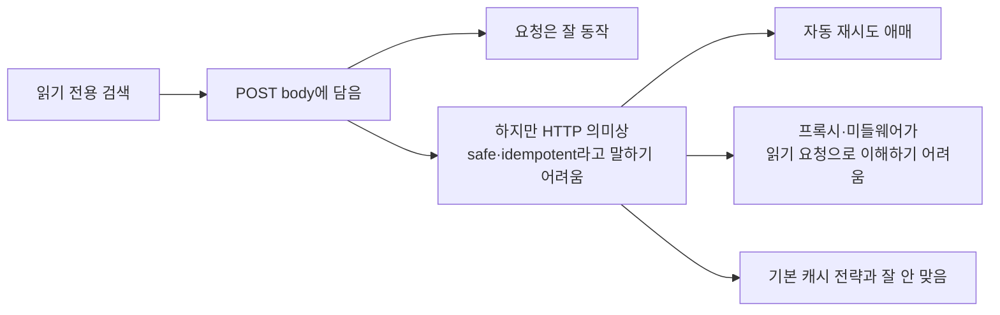

특히 자동 재시도에서 찝찝하다. GET은 원칙상 읽기 요청이라 네트워크 실패 후 다시 보내도 된다. 물론 서버 구현이 올바르다는 전제가 있다. 반면 POST는 서버 상태를 바꿀 수 있는 요청으로 취급된다. 그러면 중간 도구는 이 요청이 "검색"인지 "생성"인지 알 수 없다.

결국 POST 검색 API는 이렇게 말하는 셈이다.

```text
몸은 검색인데,
메서드 이름표는 처리/생성 쪽에 가깝다.
```

여기서 QUERY가 필요해진다.

## QUERY는 정확히 무엇을 해결하나?

QUERY는 대략 이렇게 생겼다.

```http
QUERY /api/users/search HTTP/1.1
Host: example.com
Content-Type: application/json
Accept: application/json

{
  "roles": ["admin", "reporter"],
  "status": "active",
  "sort": "-createdAt"
}
```

모양만 보면 POST와 비슷하다. 하지만 의미는 다르다.

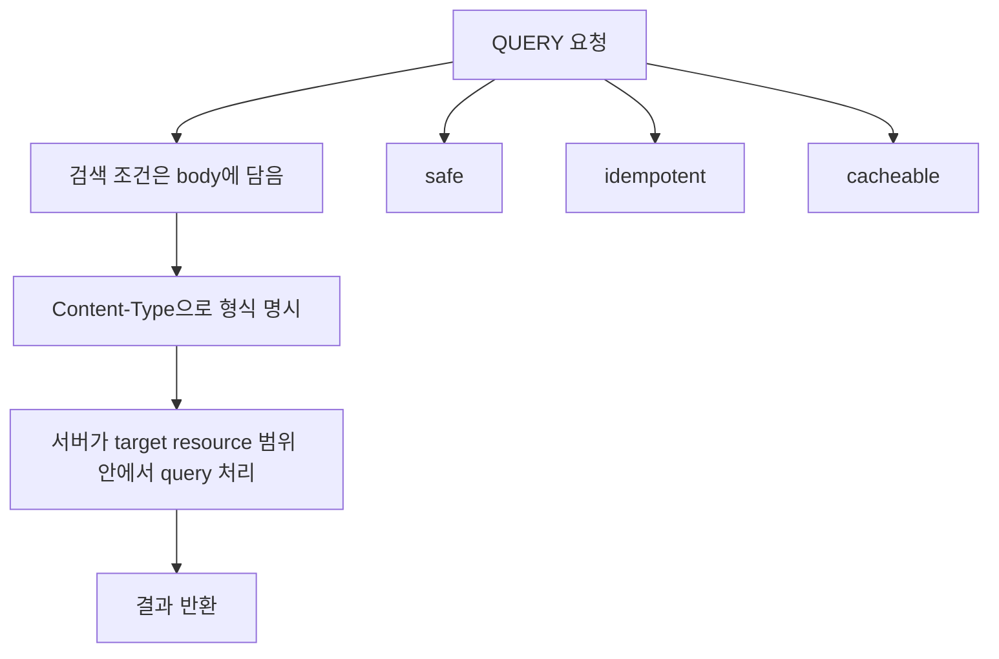

RFC 10008 기준으로 핵심은 이렇다.

| 항목 | GET | QUERY | POST |
|---|---|---|---|
| 읽기 전용 의미 | 있음 | 있음 | 보장되지 않음 |
| idempotent 의미 | 있음 | 있음 | 보장되지 않음 |
| 요청 body | 의미 없음에 가까움 | 기대됨 | 기대됨 |
| 캐시 가능성 | 높음 | 가능하지만 body까지 키에 반영 필요 | 제한적 |
| 공유/북마크 | 쉬움 | 그냥은 어려움 | 어려움 |

내 식으로 줄이면 이렇다.

```text
GET    = URL로 표현 가능한 읽기
POST   = body가 필요한 처리
QUERY  = body가 필요한 읽기
```

이 한 줄 때문에 QUERY가 생겼다고 봐도 된다.

## Content-Type은 왜 더 중요해지나?

QUERY에서는 body가 쿼리 그 자체다. 그래서 `Content-Type`이 빠지면 서버는 이 body를 어떻게 해석해야 할지 알 수 없다.

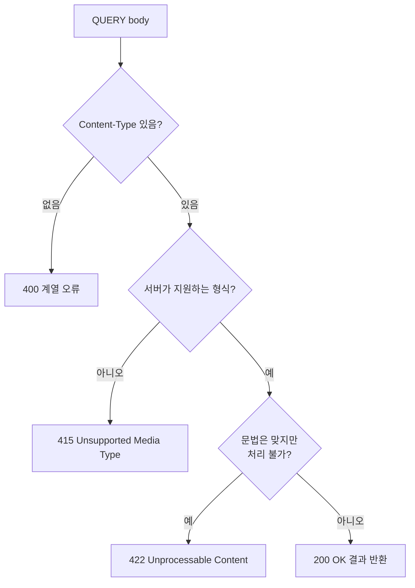

예를 들어 서버가 JSONPath나 SQL 같은 쿼리 형식을 지원한다고 해 보자. 클라이언트는 "나는 이런 형식으로 쿼리를 보낸다"를 명시해야 한다.

```http
QUERY /contacts HTTP/1.1
Host: example.com
Content-Type: application/json
Accept: application/json

{
  "where": {
    "company": "acme"
  }
}
```

서버는 지원하는 QUERY 형식을 알려 줄 수도 있다. 이때 쓰는 헤더가 `Accept-Query`다.

```http
OPTIONS /contacts HTTP/1.1
Host: example.com

HTTP/1.1 204 No Content
Allow: GET, QUERY, OPTIONS
Accept-Query: application/json, application/sql;charset="UTF-8"
```

이 헤더가 좋았던 이유는 명확하다. 클라이언트가 무작정 QUERY를 던지는 대신, "이 리소스는 어떤 쿼리 body 형식을 받는가"를 확인할 수 있다.

## 캐시는 쉬워졌나, 어려워졌나?

둘 다다. QUERY 응답은 캐시 가능하다. 하지만 GET보다 어렵다.

GET 캐시는 보통 URI를 중심으로 생각하면 된다.

```text
GET /api/users?role=admin
```

QUERY는 URI만 보면 부족하다. 같은 `/api/users/search`라도 body가 다르면 완전히 다른 검색이다.

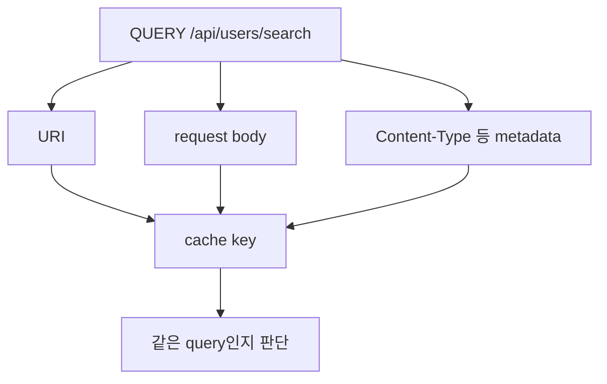

즉 캐시 키는 최소한 이런 것들을 봐야 한다.

| 캐시 키에 들어가야 하는 것 | 이유 |
|---|---|
| target URI | 어느 리소스 범위에서 검색하는지 |
| request body | 실제 검색 조건 |
| Content-Type 같은 메타데이터 | 같은 문자열이라도 해석 형식이 다를 수 있음 |
| 필요한 경우 Accept | 응답 표현 형식이 달라질 수 있음 |

여기서 실수하면 위험하다. body를 캐시 키에 넣지 않으면 A 검색 결과가 B 검색 요청에 반환될 수 있다. 그래서 QUERY 캐시는 가능하지만, 대충 구현하면 안 된다.

## 공유 링크와 북마크는 어떻게 하나?

여기가 실무적으로 가장 중요했다. QUERY는 body에 조건을 담기 때문에, 브라우저 주소창 URL 하나만으로 같은 검색을 재현하기 어렵다.

그래서 사용자가 필터 결과를 공유해야 하는 화면이라면 아직 GET이 낫다.

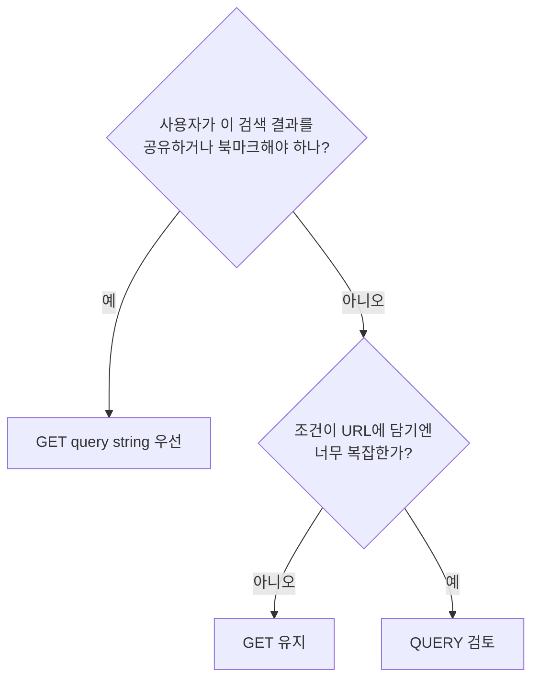

RFC 10008은 이 문제를 모르지 않는다. 서버가 QUERY 결과나 QUERY 자체를 나중에 GET으로 접근할 수 있는 URI로 연결할 수 있게 `Location`이나 `Content-Location`을 설명한다.

내가 이해한 차이는 이렇다.

| 헤더 | 의미 |
|---|---|
| `Content-Location` | 방금 받은 결과를 GET으로 다시 가져올 수 있는 URI를 알려줌 |
| `Location` | 방금 보낸 QUERY와 동등한 리소스 URI를 알려줌 |
| `303 See Other` | 결과나 저장된 쿼리를 GET URI로 보라고 리다이렉트 |

실무적으로는 이런 식의 설계가 가능하다.

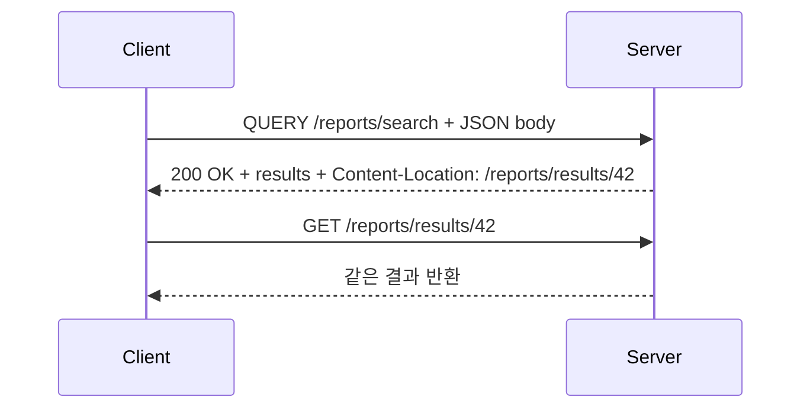

이렇게 하면 처음에는 QUERY로 복잡한 조건을 보내고, 이후에는 GET 가능한 URI를 공유할 수 있다. 다만 이건 서버가 별도 URI를 발급하고 관리해 줘야 한다.

## CORS와 지원 상황은 왜 조심해야 하나?

QUERY는 2026년 6월 RFC로 나온 새 메서드다. 표준이 됐다고 해서 오늘 바로 모든 브라우저, 프록시, 방화벽, API Gateway, 서버 프레임워크가 자연스럽게 받는다는 뜻은 아니다.

특히 브라우저에서 cross-origin 요청을 보낼 때는 CORS preflight가 필요하다. QUERY가 CORS safelisted method가 아니기 때문이다.

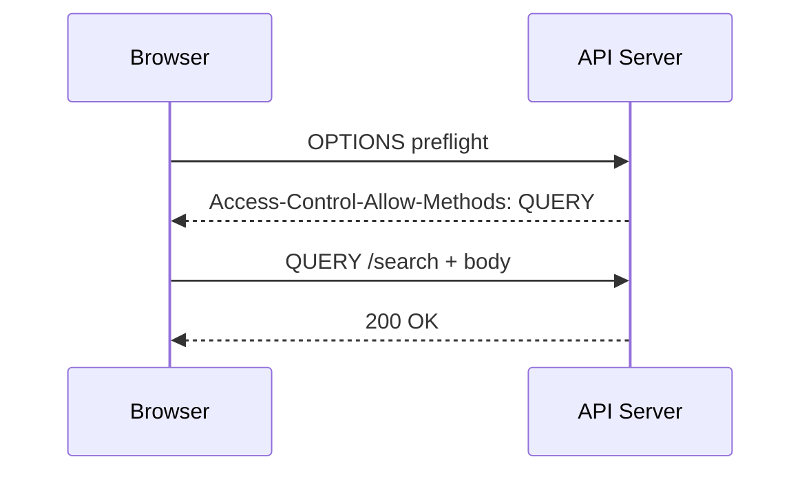

그래서 지금 당장 적용하려면 먼저 확인할 것이 많다.

| 확인할 것 | 왜 필요한가 |
|---|---|
| 클라이언트 라이브러리 | 임의 HTTP 메서드 전송을 지원하는지 |
| 서버 프레임워크 | 라우팅에서 QUERY를 받을 수 있는지 |
| 프록시/API Gateway | QUERY를 차단하지 않는지 |
| CORS 설정 | `Access-Control-Allow-Methods`에 QUERY가 있는지 |
| 캐시 계층 | body를 포함한 캐시 키를 만들 수 있는지 |
| 모니터링/로그 | method별 통계와 보안 정책이 깨지지 않는지 |

Kreya 글에서는 Kreya 1.20이 QUERY를 기본 지원한다고 소개했지만, 다른 클라이언트와 인프라는 아직 거절할 수 있다고 적었다. 나도 이 말에 동의한다. 지금은 "멋지니까 바꾸자"가 아니라 **끝단부터 중간 장비까지 테스트해 보고 넣자**가 맞다.

## 그럼 언제 QUERY를 써야 하나?

내 판단표는 이렇다.

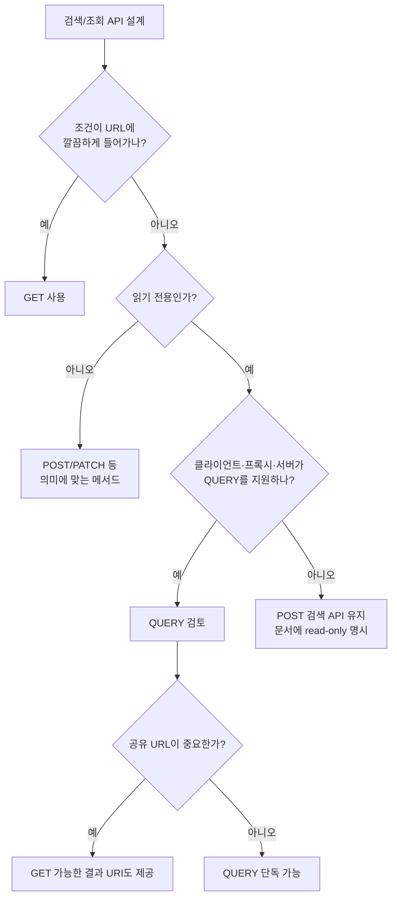

조금 더 짧게 쓰면 이렇게 된다.

| 상황 | 선택 |
|---|---|
| 간단한 필터, 공유 URL 중요 | GET |
| 복잡한 검색, body가 필요, 읽기 전용 | QUERY |
| 복잡한 검색이지만 인프라가 QUERY 미지원 | POST 우회 |
| 서버 상태를 바꾸는 처리 | POST/PUT/PATCH/DELETE |
| 검색 결과를 링크로 공유해야 함 | GET 또는 QUERY 후 GET URI 발급 |

중요한 건 기존 GET을 QUERY로 다 바꾸는 게 아니다. 단순 필터는 GET이 여전히 좋다. QUERY는 GET을 대체하는 게 아니라, **POST로 검색하던 read-only API를 더 정확한 이름으로 옮길 수 있게 해 주는 메서드**에 가깝다.

## 내가 실제 API를 만든다면 어떻게 설계할까?

예를 들어 복잡한 리포트 검색 API를 만든다고 해 보자. 나는 처음부터 QUERY만 던지지는 않을 것 같다. 현실적인 전환 설계는 이렇게 잡겠다.

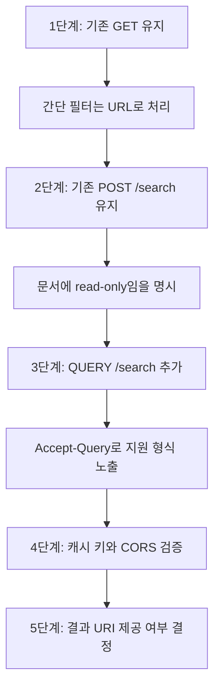

예시로는 이렇게 둘 수 있다.

```http
OPTIONS /reports/search HTTP/1.1
Host: api.example.com

HTTP/1.1 204 No Content
Allow: OPTIONS, QUERY, POST
Accept-Query: application/json
```

```http
QUERY /reports/search HTTP/1.1
Host: api.example.com
Content-Type: application/json
Accept: application/json

{
  "metrics": ["revenue", "retention"],
  "period": {
    "from": "2026-01-01",
    "to": "2026-06-30"
  },
  "filters": {
    "country": ["KR", "JP"],
    "platform": ["ios", "android"]
  }
}
```

그리고 응답에는 필요하다면 GET 가능한 결과 URI를 붙인다.

```http
HTTP/1.1 200 OK
Content-Type: application/json
Content-Location: /reports/search-results/abc123
Cache-Control: max-age=60

{
  "items": []
}
```

이렇게 하면 복잡한 조건은 body에 넣고, 결과는 필요할 때 GET URI로 다시 접근할 수 있다.

## 결론은 무엇인가?

QUERY는 화려한 새 장난감이라기보다, 오래된 실무 우회로에 붙은 표준 이름이다.

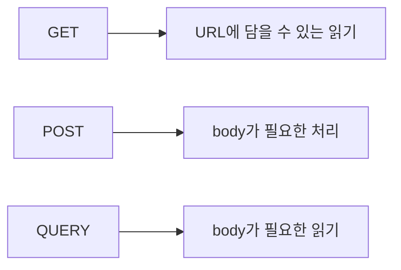

나는 이 구분이 마음에 든다. API에서 메서드는 단순한 문자열이 아니라, 클라이언트와 서버와 중간 장비가 공유하는 의도 표시다. POST 검색 API는 오래 쓸 수밖에 없었지만, 이름표가 늘 조금 어긋나 있었다. QUERY는 그 이름표를 바로잡는다.

다만 당장 모든 검색 API를 QUERY로 바꾸지는 않을 것이다. 단순 조회는 GET을 유지하고, 공유 링크가 필요한 화면도 GET을 유지한다. 대신 조건이 깊고, body가 필요하고, 읽기 전용이라는 의미가 중요한 API라면 이제는 POST 우회 대신 QUERY를 테스트해 볼 만하다.

마지막으로 내가 기억할 문장은 이거다.

```text
GET은 주소로 읽는다.
POST는 몸체로 처리한다.
QUERY는 몸체로 읽는다.
```

## 참고한 원문은 무엇인가?

- [RFC 10008: The HTTP QUERY Method](https://www.rfc-editor.org/info/rfc10008/) - 2026년 6월 발행된 IETF Standards Track RFC. QUERY를 safe·idempotent 요청 body 기반 query 메서드로 정의한다.
- [The new HTTP QUERY method explained - Kreya](https://kreya.app/blog/new-http-query-method-explained/) - GET query, GET body, POST 우회, QUERY 적용 주의점을 실무적으로 풀어 쓴 글.
