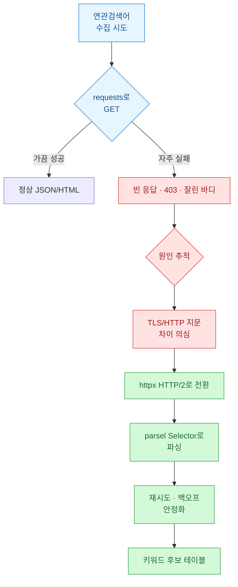
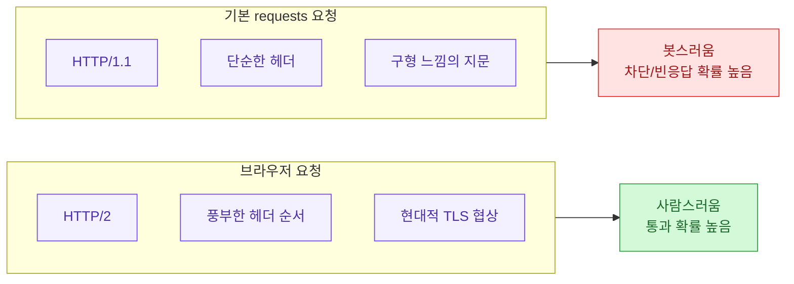
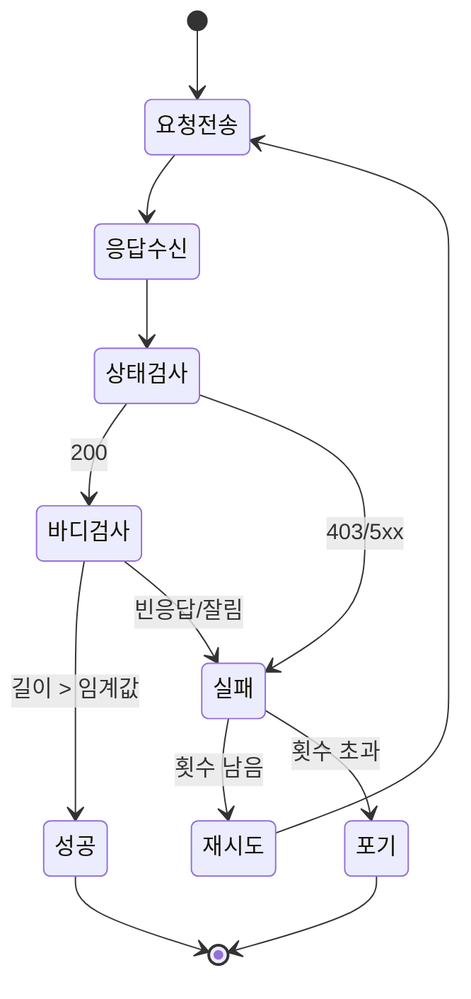
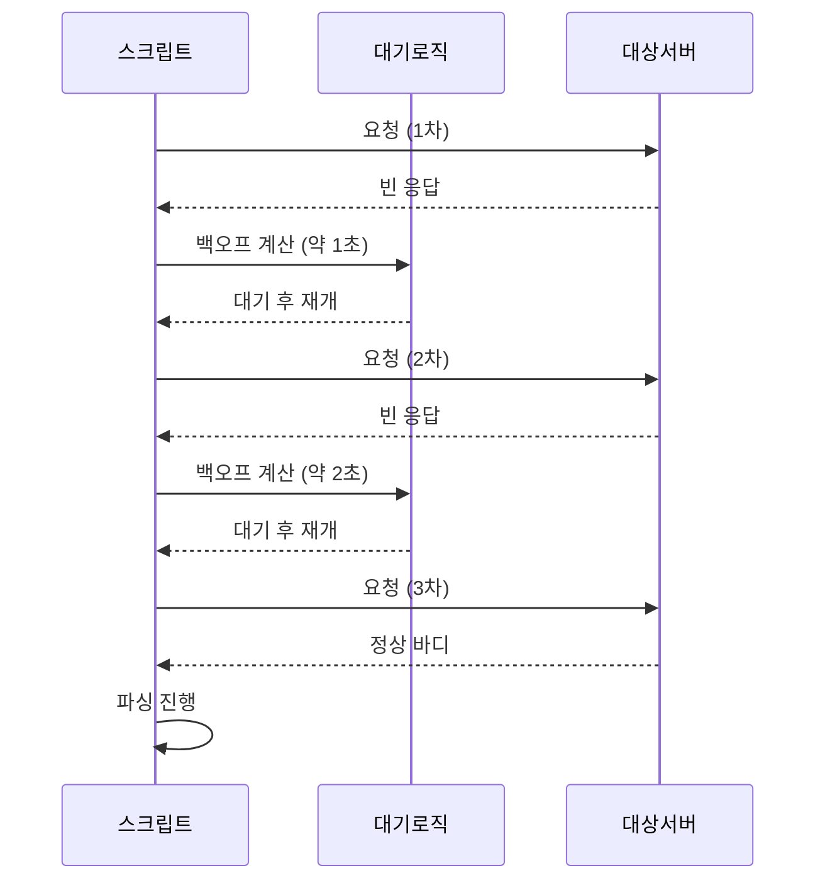
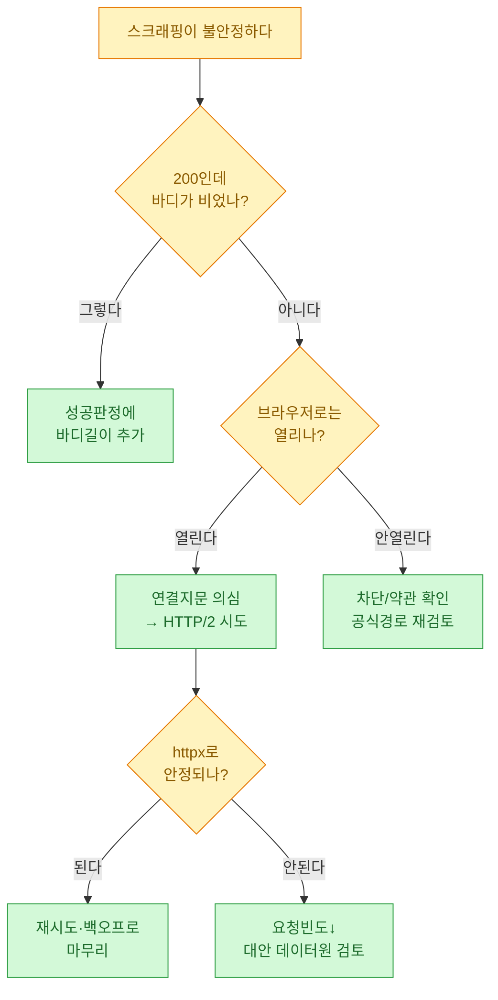

연관검색어(검색창에 단어를 치면 아래로 주르륵 뜨는 그 추천어)를 모아 키워드 후보를 만들려고 했다. 별거 아닌 줄 알고 `requests`로 GET 한 방 날렸는데, 어떤 날은 잘 되고 어떤 날은 빈 응답이 오거나 403이 떨어졌다. 같은 코드인데 결과가 달랐다. 이 글은 그 "왜"를 파고들다 결국 `httpx`의 HTTP/2로 갈아탄 기록이다.

> ⚠️ 이 글의 모든 URL·응답·키워드·수치는 **합성(더미) 데이터**다. 특정 서비스의 실제 엔드포인트나 실제 수집 결과가 아니라, 트러블슈팅 흐름을 재현하기 위한 예시임을 먼저 밝힌다. 스크래핑은 대상 사이트의 이용약관·robots를 반드시 확인하고 진행해야 한다.

## 전체 그림부터: 무엇이 어디서 막혔나?

먼저 이 트러블슈팅의 전체 흐름을 한 장으로 본다. 요청이 어디서 갈리는지가 핵심이다.



정리하면 문제는 "파싱"이 아니라 "연결 자체"에서 났다. HTML을 어떻게 뜯을지 고민하기 한참 전에, 서버가 아예 제대로 된 바디를 안 줬던 거다.

## 왜 같은 코드가 어떤 날은 되고 어떤 날은 막혔나?

처음엔 내 IP가 잠깐 차단됐나 싶었다. 그런데 브라우저로는 멀쩡히 열렸다. 브라우저와 내 스크립트의 차이를 하나씩 지워보니, 결국 **요청의 "지문(fingerprint)"** 이 달랐다. 서버 입장에서 브라우저 요청과 파이썬 요청은 겉보기(헤더)뿐 아니라 연결 계층에서부터 다르게 보인다.



핵심 깨달음은 이거였다. **헤더에 User-Agent만 그럴듯하게 박는다고 되는 게 아니다.** 서버는 HTTP 프로토콜 버전(1.1이냐 2냐)이나 연결 협상 방식까지 본다. `requests`는 기본적으로 HTTP/1.1만 말하고, 최신 브라우저는 대부분 HTTP/2로 붙는다. 이 차이가 "가끔 되고 가끔 막히는" 널뛰기의 배경이었다.

## 어떻게 원인을 좁혀갔나?

막연히 "차단됐네" 하고 끝내면 다음에 또 헤맨다. 그래서 응답을 관찰 가능한 형태로 로깅하며 변수를 하나씩 통제했다. 아래는 실패 응답을 분류하기 위해 남긴 합성 로그다.

| 시도 | 라이브러리 | 프로토콜 | 상태코드 | 바디 길이(byte) | 판정 |
|------|-----------|----------|----------|-----------------|------|
| 1 | requests | HTTP/1.1 | 200 | 0 | 빈 응답 |
| 2 | requests | HTTP/1.1 | 403 | 512 | 차단 페이지 |
| 3 | requests | HTTP/1.1 | 200 | 18,004 | 성공(운) |
| 4 | httpx | HTTP/2 | 200 | 17,880 | 성공 |
| 5 | httpx | HTTP/2 | 200 | 18,120 | 성공 |

표를 만들고 나니 패턴이 눈에 보였다. `requests`는 성공률이 들쭉날쭉했고, HTTP/2로 붙은 시도는 꾸준히 정상 바디를 받았다. 여기서 "상태코드 200"만 믿으면 안 된다는 것도 배웠다. **200인데 바디가 0바이트**인 경우가 있어서, 성공 판정에 바디 길이 검사를 꼭 넣어야 했다.



## httpx로 어떻게 바꿨나?

`httpx`는 인터페이스가 `requests`와 거의 같아서 옮기는 비용이 작았다. 결정적 차이는 클라이언트 생성 시 `http2=True` 한 줄이다. (HTTP/2를 쓰려면 `pip install "httpx[http2]"`로 `h2` 의존성까지 설치해야 한다.)

```python
# 합성 예시 — 실제 엔드포인트가 아니라 더미 URL입니다.
import httpx

DUMMY_ENDPOINT = "https://example.test/complete/search"

HEADERS = {
    "User-Agent": "Mozilla/5.0 (Windows NT 10.0; Win64; x64) Example/120.0",
    "Accept-Language": "ko-KR,ko;q=0.9",
    "Accept": "text/html,application/xhtml+xml",
}

def fetch(query: str) -> httpx.Response:
    # http2=True 가 이 글의 핵심 한 줄
    with httpx.Client(http2=True, headers=HEADERS, timeout=10.0) as client:
        resp = client.get(DUMMY_ENDPOINT, params={"q": query})
        # 협상된 프로토콜 확인 (b'HTTP/2' 여야 기대대로 붙은 것)
        print("negotiated:", resp.http_version)
        return resp

r = fetch("파이썬 크롤링")
print(r.status_code, len(r.text))
```

`resp.http_version`을 찍어보면 실제로 HTTP/2로 협상됐는지 확인할 수 있다. 여기서 `HTTP/1.1`이 나오면 `h2`가 설치 안 됐거나 서버가 2를 거절한 것이니, 그 자체가 진단 단서가 된다.

## 파싱은 왜 parsel로 했나?

바디를 제대로 받고 나면 그다음은 원하는 조각(추천어 목록)만 뽑는 일이다. HTML 형태로 온다고 가정하고 `parsel`의 `Selector`를 썼다. `parsel`은 Scrapy에서 떼어낸 파서로, CSS와 XPath를 한 객체에서 같이 쓸 수 있어 편하다.

```python
# 합성 HTML — 실제 응답이 아니라 구조 설명용 더미입니다.
from parsel import Selector

dummy_html = """
<ul class="suggest">
  <li data-rank="1"><span class="kw">파이썬 크롤링 강의</span></li>
  <li data-rank="2"><span class="kw">파이썬 크롤링 requests</span></li>
  <li data-rank="3"><span class="kw">파이썬 크롤링 httpx</span></li>
</ul>
"""

sel = Selector(text=dummy_html)

# CSS로 텍스트 추출
keywords = sel.css("ul.suggest li span.kw::text").getall()

# XPath로 순위 속성도 함께
rows = []
for li in sel.xpath('//ul[@class="suggest"]/li'):
    rank = li.xpath("./@data-rank").get()
    kw = li.xpath('.//span[@class="kw"]/text()').get()
    rows.append({"rank": int(rank), "keyword": kw})

print(keywords)
print(rows)
# [{'rank': 1, 'keyword': '파이썬 크롤링 강의'}, ...]
```

`BeautifulSoup`에 익숙하면 그걸 써도 된다. 다만 나는 CSS와 XPath를 오가며 뽑을 게 많아 `parsel` 쪽이 손에 붙었다. 여기서 라이브러리 취향 논쟁을 하기보다, "연결이 뚫린 뒤엔 파싱은 상대적으로 쉬운 문제"라는 점이 중요하다.

## 그래도 가끔 막히면? — 재시도와 백오프

HTTP/2로 바꿔도 100%는 아니다. 순간적으로 빈 응답이 오면 곧바로 포기하지 말고, 간격을 늘려가며 다시 시도한다. 아래는 지수 백오프(실패할수록 대기 시간을 배로 늘리는 방식)에 약간의 무작위 지연을 섞은 합성 예시다.

```python
import time
import random
import httpx

def fetch_with_retry(client: httpx.Client, url: str, params: dict,
                     max_try: int = 4, min_body: int = 2000) -> str | None:
    for attempt in range(1, max_try + 1):
        try:
            resp = client.get(url, params=params)
            ok_status = resp.status_code == 200
            ok_body = len(resp.text) >= min_body  # 빈/잘린 응답 방어
            if ok_status and ok_body:
                return resp.text
            reason = f"status={resp.status_code}, len={len(resp.text)}"
        except httpx.HTTPError as e:
            reason = f"error={type(e).__name__}"

        wait = (2 ** (attempt - 1)) + random.uniform(0, 0.8)
        print(f"[retry {attempt}/{max_try}] {reason} -> sleep {wait:.1f}s")
        time.sleep(wait)
    return None  # 전부 실패
```

포인트는 두 가지다. 첫째, 성공 판정에 **바디 길이(`min_body`)** 를 넣어 "200인데 빈 응답"을 실패로 취급한다. 둘째, 대기 시간에 약간의 무작위를 섞어 요청이 기계처럼 규칙적으로 찍히지 않게 한다.



## 이 삽질에서 뭘 배웠나?

같은 문제를 또 만났을 때 빨리 판단하려고 체크리스트로 남겨뒀다.



핵심 3줄로 정리한다.

- **200이라고 성공이 아니다.** 바디 길이까지 봐야 "빈 응답 함정"을 피한다.
- **문제는 파싱보다 연결에서 자주 난다.** User-Agent만 만지지 말고 HTTP/2(`httpx`) 같은 프로토콜 계층을 의심하라.
- **막히면 세게 두드리지 말고 천천히.** 지수 백오프 + 무작위 지연으로 안정성과 예의를 동시에 챙긴다. 그리고 스크래핑 전엔 늘 대상의 약관을 확인한다.
