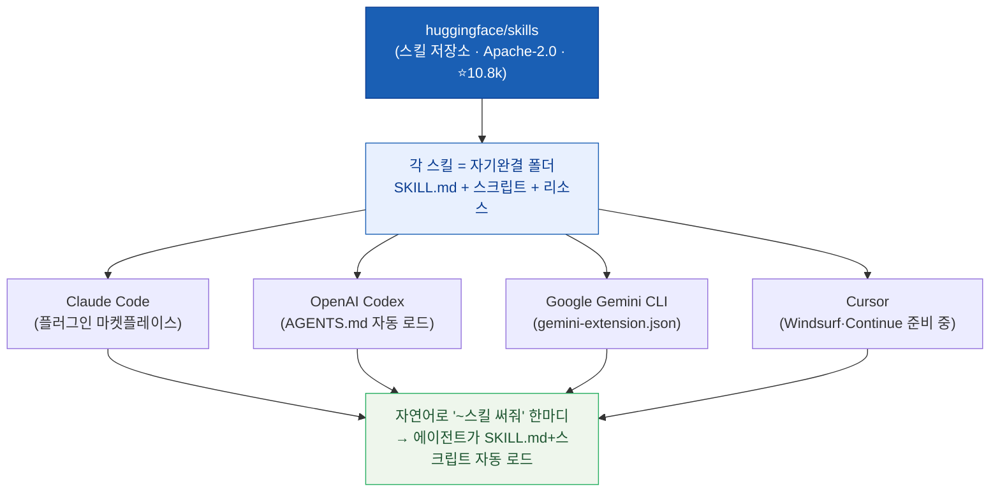
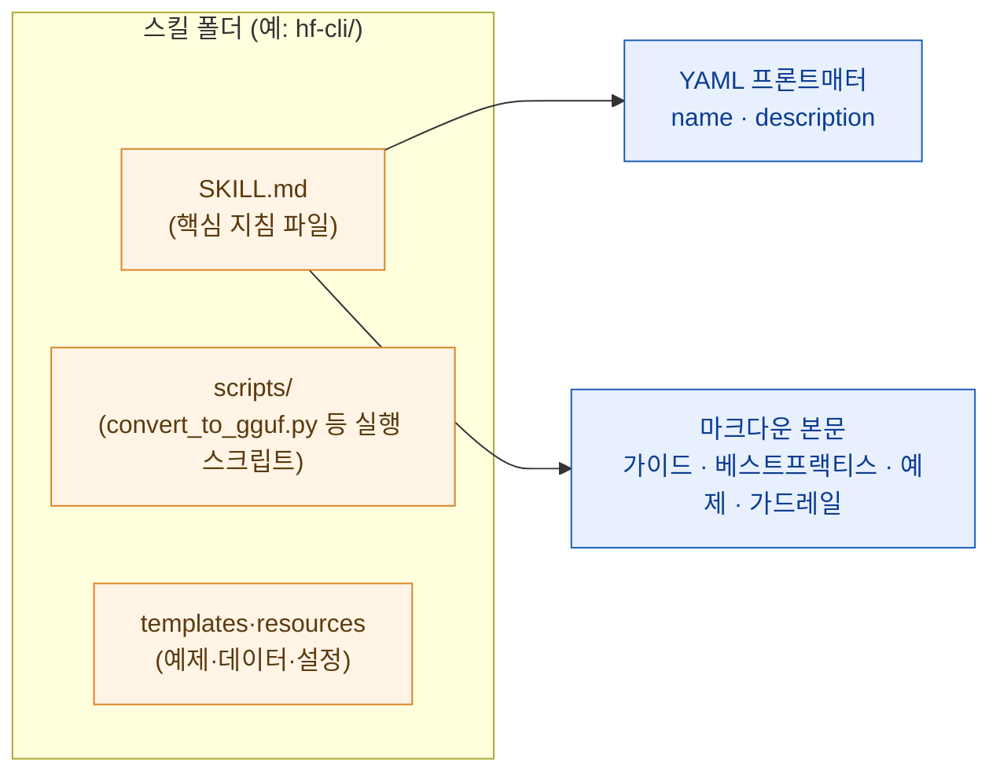
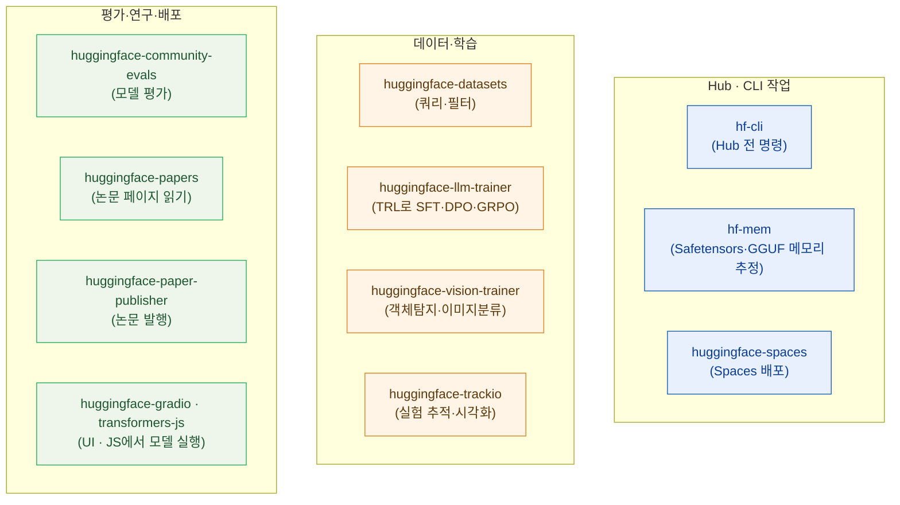
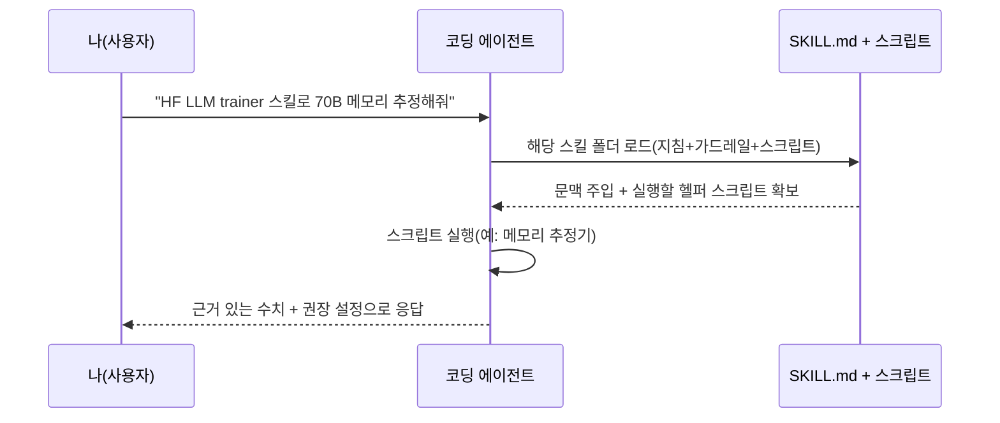
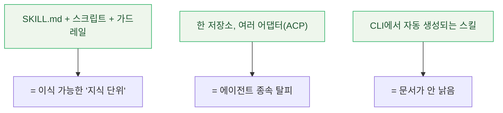

코딩 에이전트를 쓰다 보면 묘한 벽을 만난다. 웹앱 리팩터링이나 SQL 튜닝은 척척 하는데, **"이 70B 모델 파인튜닝하려면 GPU 메모리가 얼마나 필요하냐", "이 데이터셋을 필터링해서 새 버전 만들어줘", "SFT랑 DPO 중에 뭘 써야 하냐"** 같은 걸 물으면 갑자기 말이 흐려진다. 일반 코딩 지식은 방대한데, **AI/ML 생태계의 깊은 도메인 지식은 은근히 얕은** 것이다.

나는 ML 연구자가 아니라 데이터 분석가·마케터다. 그래서 오히려 이 간극이 크게 느껴졌다. 고급 ML 운영은 늘 "그건 전문가 영역"으로 남아 있었으니까. 그런데 Hugging Face가 그 간극을 **스킬(skill)** 로 메꿨다길래 — 그것도 Claude Code 하나가 아니라 여러 에이전트에서 공통으로 도는 형태로 — 직접 저장소를 뜯어봤다. (참고로 나는 이미 스킬을 쓰고 있다. [[hwpx-skill-form-fill-hands-on|한글(HWPX) 스킬]], humanize 스킬 같은 것들. 그래서 "스킬"이라는 포맷 자체가 낯설지 않았다.)

## 전체 그림 — 스킬 하나가 어떻게 여러 에이전트를 관통하나?

먼저 큰 그림부터. 핵심은 **저장소는 하나인데, 에이전트마다 읽는 포맷(어댑터)이 다르다**는 것이다. Hugging Face는 이 공통 규격을 **ACP(Agent Context Protocol)** — 에이전트가 읽는 컨텍스트(지침)의 표준 — 라고 부른다.



> 도식만 봐도 요점은 이거다. **"한 번 쓴 스킬, 어느 에이전트에서도 통한다."** 예전엔 Claude Code용 프롬프트 따로, Codex용 지침 따로 만들어야 했는데, 이제 저장소 하나가 각 에이전트의 포맷으로 자동 변환돼 꽂힌다.

## 그래서 '스킬'이 대체 뭔가?

스킬은 원래 **Anthropic(Claude·Claude Code)의 용어**다. 에이전트가 특정 작업을 할 때 참조하는 **지침·스크립트·리소스를 묶은 자기완결 폴더**를 말한다. Hugging Face가 이걸 가져다, **하나의 스킬 저장소가 모든 주요 코딩 에이전트와 상호운용되도록** 확장한 게 이번 프로젝트다.

스킬 폴더의 심장은 **`SKILL.md`** 라는 파일 하나다. 구조는 이렇게 생겼다.



`SKILL.md`를 열면 위쪽에 **YAML 프론트매터**(문서 맨 앞의 메타데이터 블록)로 `name`과 `description`이 있고, 그 아래 마크다운으로 **에이전트가 이 스킬이 켜져 있는 동안 따라야 할 안내·베스트프랙티스·예제·가드레일(안전 규칙)** 이 적혀 있다.

그런데 이게 텍스트 지침만 있는 게 아니다. **헬퍼 스크립트와 템플릿**도 같이 들어 있다. 데이터셋 쿼리 스크립트, `convert_to_gguf.py`(모델을 GGUF 포맷으로 변환), 비용 추정기 같은 것들. 즉 에이전트가 **말만 하는 게 아니라 실제 코드를 돌린다.** 이게 내가 흥미로웠던 지점이다 — 스킬은 "읽을거리"가 아니라 "실행 가능한 지식 묶음"이다.

> 참고로 위에 나온 **GGUF**는 로컬에서 LLM을 돌릴 때 쓰는 경량 모델 포맷(llama.cpp 계열)이다. 무거운 학습용 가중치를 추론용으로 압축·변환하는 것.

## 어떻게 한 저장소가 여러 에이전트에서 다 돌지?

이게 ACP의 핵심 트릭이다. **내용(SKILL.md 본문)은 같고, 에이전트별 어댑터만 다르게** 붙인다. 저장소 하나에 여러 포맷의 진입점이 공존한다.

| 에이전트 | 읽는 진입점 | 방식 |
|---|---|---|
| Claude Code | 플러그인 마켓플레이스 | `/plugin` 명령으로 설치 |
| OpenAI Codex | `AGENTS.md` | 세션 시작 시 지침 자동 로드 |
| Google Gemini CLI | `gemini-extension.json` | 확장(extension)으로 설치 |
| Cursor | (전용 어댑터) | Windsurf·Continue는 준비 중 |

같은 스킬 콘텐츠를, Codex는 `AGENTS.md`로 읽고, Gemini는 확장 매니페스트로 읽고, Claude Code는 플러그인으로 읽는다. **"콘텐츠는 하나, 어댑터는 여럿."** 이 구조 덕에 스킬 저작자는 한 번만 쓰면 되고, 사용자는 자기가 쓰는 에이전트가 뭐든 그대로 가져다 쓴다.

## 어떻게 설치하나? (에이전트별)

내가 확인한 현재 기준(2026-07-05)으로 설치법을 정리한다. **⚠️ 예전 PyTorch KR 소개글의 마켓플레이스 이름(`@huggingface-skills`)은 낡았다.** 현재는 `huggingface/skills`다.

```bash
# Claude Code — 마켓플레이스 추가 후 원하는 스킬 설치
/plugin marketplace add huggingface/skills
/plugin install hf-cli@huggingface/skills
# (형식: /plugin install <스킬이름>@huggingface/skills)
```

```bash
# OpenAI Codex — AGENTS.md로 지침을 자동 로드한다. 잘 물렸는지 확인:
codex --ask-for-approval never "Summarize the current instructions."
```

```bash
# Google Gemini CLI — 저장소를 확장으로 설치
gemini extensions install https://github.com/huggingface/skills.git --consent
```

> **가장 먼저 깔아야 할 스킬은 `hf-cli`** 다. 이건 에이전트에게 `hf` CLI(허깅페이스 명령줄 도구)의 **모든 명령**을 가르친다 — 모델 검색, 데이터셋·버킷 관리, Spaces 실행, Job 실행까지. 게다가 이 스킬은 **로컬에 설치된 CLI에서 자동 생성**되기 때문에 항상 최신 상태를 따라간다. "낡은 문서" 문제가 구조적으로 안 생긴다는 게 영리하다.

## 지금 어떤 스킬들이 있나?

오늘 저장소에서 직접 확인한 목록이다. **⚠️ 이 로스터는 계속 바뀐다** — 아래는 대표 표본이고, 실제 최신 목록은 저장소에서 확인해야 한다(현재 대략 19개).



용어를 그 자리에서 풀면:

- **TRL**: Transformer Reinforcement Learning. 허깅페이스의 LLM 후처리 학습 라이브러리다.
- **SFT / DPO / GRPO**: 각각 지도 미세조정(정답 예시로 따라 배우게), 선호 최적화(좋은/나쁜 답 쌍으로 취향 학습), 그룹 상대 정책 최적화(강화학습식 정렬). LLM을 "말 잘 듣게" 다듬는 세 가지 방식이다.
- **Safetensors**: 모델 가중치를 안전하게 저장하는 포맷. `hf-mem`은 이걸 보고 메모리 소요를 추정한다.

한 가지 **이름 규칙의 변화(drift)** 도 짚어둔다. 예전 글엔 `hf_dataset_creator`처럼 폴더식(언더스코어) 이름이 있었는데, **현재는 하이픈 이름**(`hf-cli`, `huggingface-datasets`)으로 바뀌었다. 옛 글을 참고할 때 이름이 안 맞으면 이것 때문이다.

## 실제로 어떻게 쓰나?

설치하고 나면 **특별한 명령어가 필요 없다.** 그냥 자연어로 스킬을 언급하면 에이전트가 알아서 해당 `SKILL.md`와 헬퍼 스크립트를 로드한다.

```text
"Use the HF LLM trainer skill to estimate the GPU memory
 needed for a 70B model run."

"HF datasets 스킬로 이 예시들에서 새 데이터셋을 만들어줘."
```

흐름을 도식으로 보면 이렇다.



포인트는 **에이전트가 텍스트만 뱉는 게 아니라 스킬에 딸린 스크립트를 실제로 돌려서** 답을 낸다는 것. "70B면 대충 이 정도"가 아니라, 추정 스크립트를 실행한 결과를 준다.

## MCP랑 뭐가 다른가?

여기서 헷갈리기 쉬워서 한 번 정리하고 간다. 나도 [[claude-code-mcp-servers-github-pat-oauth-dcr-fix|MCP 서버를 붙여 써봤기 때문에]] 처음엔 "이거 MCP랑 겹치는 거 아냐?" 싶었다. 아니다. **결이 다르다.**

| 구분 | Skills | MCP |
|---|---|---|
| 정체 | 에이전트가 **읽는 지침·스크립트 묶음**(컨텍스트) | 도구·데이터 소스를 **연결하는 프로토콜** |
| 주는 것 | "어떻게/무엇을 해야 하는지"에 대한 **지식·절차** | 외부 시스템에 대한 **실시간 도구·데이터 접근** |
| 비유 | 전문가가 옆에 붙여준 **작업 매뉴얼+도구상자** | 외부 세계로 난 **표준 콘센트** |

**상호 배타가 아니다.** HF 스킬은 MCP와 **함께** 쓸 수도 있고(스킬이 지침을 주고, MCP가 도구 연결을 담당), 스킬 **단독**으로도 쓸 수 있다. 스킬은 "지식", MCP는 "연결"이라고 나눠 두면 안 헷갈린다.

## 내 스킬을 만들 수도 있나?

된다. 그리고 생각보다 쉽다. 흐름은 **기존 스킬 복제 → 수정 → 등록 → 재로드**다.


재밌는 건 **코딩 에이전트에게 새 스킬 저작을 도와달라고 할 수도** 있다는 점이다. 스킬이라는 포맷 자체가 마크다운+스크립트라 에이전트가 다루기 좋으니까. 스킬을 쓰는 에이전트가 스킬을 만드는 걸 돕는, 좀 재귀적인 그림이다.

## 그래서 뭐가 인상적이었나 (분석가의 시선)

솔직히 말하면, 나한테 흥미로운 건 ML 그 자체가 아니었다. **패턴**이었다.



- **지식이 '폴더'로 이식된다.** SKILL.md + 스크립트 + 가드레일 한 묶음이면, 특정 도메인의 전문성이 통째로 옮겨 다닌다. 나 같은 일반 SWE·분석가도 고급 ML 운영을 "전문가 폴더 하나 깔아서" 시작할 수 있다는 뜻이다.
- **에이전트에 안 묶인다.** 오늘은 Claude Code, 내일은 Codex를 써도 같은 스킬이 따라온다. 이게 ACP가 노리는 진짜 값어치다.
- **낡지 않는 설계.** `hf-cli`가 로컬 CLI에서 자동 생성되듯, 지식의 출처를 코드에 붙여두면 문서가 뒤처지지 않는다.

나는 이 패턴을 계속 글로 써 왔다. HWPX 스킬도, humanize 스킬도 결국 "지침+스크립트를 묶어 에이전트에 지식을 심는" 같은 계열이다. **HF Skills는 그걸 AI/ML이라는 가장 전문적인 영역에, 그것도 크로스-에이전트로 밀어붙인 사례**라 눈여겨볼 만했다.

## 한 줄 정리

**Skills = 에이전트에 심는 이식 가능한 전문성 폴더(SKILL.md+스크립트+가드레일), ACP = 그걸 어느 에이전트에서도 돌게 하는 공통 규격.** ML 전문가가 아니어도, 스킬 하나 깔면 고급 ML 작업의 문턱이 확 낮아진다. 나처럼 분석·마케팅 쪽에 있는 사람에게도 남의 얘기가 아니었다.

---

> 같이 보면 좋은 글: [[hwpx-skill-form-fill-hands-on|한글(HWPX) 스킬 실전]] · [[claude-code-mcp-servers-github-pat-oauth-dcr-fix|Claude Code에 MCP 서버 붙이기]] · [[claude-code-dynamic-workflow-deepresearch-vs-ultracode|Claude Code 워크플로 언제 뭘 쓰나]]

*이 글은 2026-07-05 기준 `github.com/huggingface/skills`(Apache-2.0, ⭐약 10.8k)의 저장소 상태를 직접 팩트체크해 정리한 것입니다. 스킬 로스터·이름 규칙은 계속 바뀌므로, 최신 목록과 설치법은 저장소에서 다시 확인하세요.*
