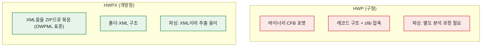
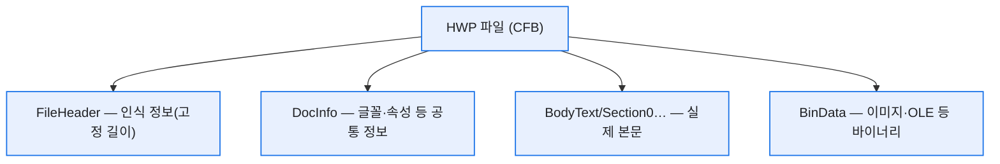
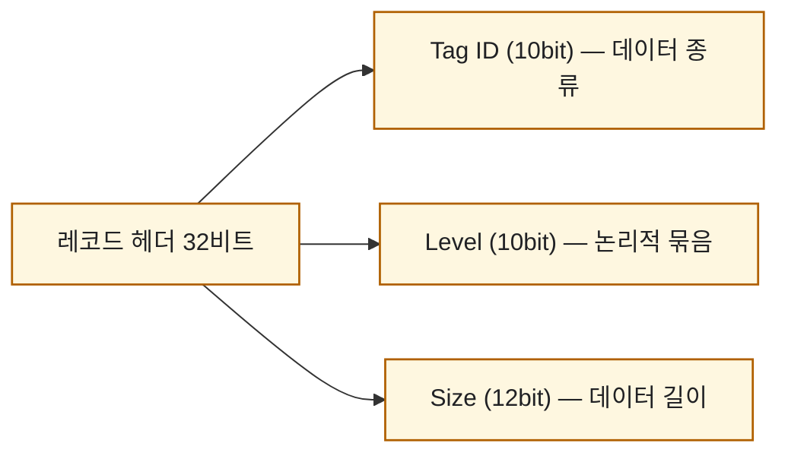
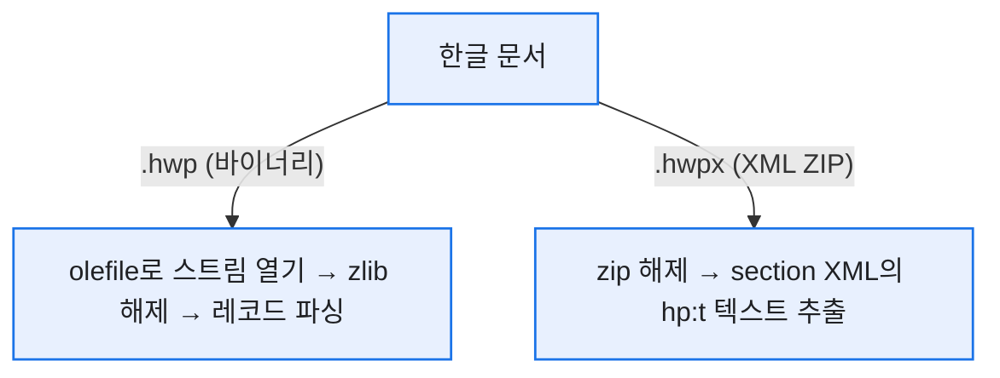

# 한글 HWP·HWPX는 어떻게 파싱하나

> 며칠 전 여러 문서 포맷에서 텍스트를 뽑는 추출기를 만들다가 HWP 앞에서 딱 막혔다. docx·pptx·xlsx는 사실 압축된 XML이라 금방 열렸는데, 구형 HWP는 바이너리라 헥사로 열면 그냥 외계어였다. 그때 길잡이가 된 게 한컴 개발 블로그의 **'한/글 문서 파일 형식' 시리즈**(정우진·김규리 님)다. 이 글은 그 시리즈를 따라 HWP를 뜯어보며 내가 이해한 것을 도식으로 다시 세운 정리다.

## HWP와 HWPX는 뿌리부터 다르다

제일 먼저 붙잡아야 할 건 이거다. 같은 한글 문서라도 **HWP와 HWPX는 저장 방식이 완전히 다르다.**



HWPX는 사실상 확장자만 zip으로 바꿔 풀면 XML 파일들이 쏟아진다. 어려운 건 HWP다. 그래서 이 글의 대부분은 HWP 이야기다.

## HWP는 왜 '폴더가 든 파일'인가?

HWP는 마이크로소프트의 **CFB(Compound File Binary)** 형식이다. 쉽게 말하면 **파일 하나 안에 폴더 구조가 들어 있는** 포맷이다. 내부는 저장소(Storage)와 스트림(Stream)으로 나뉜다.



- **FileHeader**: "나는 HWP다"라는 서명 + 버전 + 속성 비트(압축·암호 여부). 고정 길이라 읽기 쉽다.
- **DocInfo**: 문서가 공통으로 쓰는 글꼴·글자속성·문단속성.
- **BodyText/Section0**: 진짜 본문. 구역 수만큼 Section이 늘어난다.

그래서 파이썬에서 이 내부 구조에 접근하려면 CFB를 읽는 라이브러리가 필요하다. 그게 `olefile`이다.

## 왜 열면 외계어인가? — 압축 해제부터

DocInfo나 Section을 헥사로 열면 알아볼 수 없는 값으로 가득하다. 당황했던 이유가 있었다. **이 스트림들이 zlib으로 압축돼 저장**되기 때문이다. 그래서 읽는 첫 관문이 '압축 해제'다.

```python
import olefile, zlib

ole = olefile.OleFileIO(file_path)          # ① CFB 내부 구조 열기
doc_info = ole.openstream('DocInfo').read()  # ② DocInfo 스트림 읽기
data = zlib.decompress(doc_info, -15)        # ③ zlib 압축 해제 (raw, wbits=-15)
```

포인트는 세 줄이다. ① `olefile`로 파일 안 폴더 구조를 열고, ② 원하는 스트림을 읽고, ③ `zlib.decompress(..., -15)`로 압축을 푼다. `-15`는 헤더 없는 raw deflate라는 뜻인데, HWP가 이 방식으로 압축한다. 이걸 몰라서 처음엔 계속 실패했었다.

## 레코드 구조란 무엇인가?

압축을 풀어도 끝이 아니다. DocInfo·BodyText는 **레코드(record)** 라는 단위가 줄줄이 이어진 구조다. 각 레코드는 앞에 4바이트짜리 헤더를 달고 있고, 그 헤더가 **10·10·12비트**로 쪼개진다.



리틀엔디안 32비트 정수 하나를 읽어서 비트 시프트로 세 조각을 떼면 된다.

```python
import struct

def split_header(b: bytes):
    num = struct.unpack('<I', b)[0]        # 리틀엔디안 32비트
    tag_id = (num >> 0)  & 0x3FF           # 하위 10비트
    level  = (num >> 10) & 0x3FF           # 다음 10비트
    size   = (num >> 20) & 0xFFF           # 상위 12비트
    return tag_id, level, size
```

한 가지 함정이 있다. **Size가 0xFFF(4095)이면** 그건 "진짜 크기는 뒤 4바이트에 있다"는 신호다. 12비트로 표현 못 하는 큰 레코드를 위한 확장 규칙이다. 이걸 놓치면 그다음 레코드부터 전부 어긋난다.

그리고 Tag ID로 레코드의 정체를 안다. DocInfo의 첫 레코드는 보통 이렇다.

| Tag ID | 이름 | 의미 |
|---|---|---|
| 0x010 (16) | HWPTAG_DOCUMENT_PROPERTIES | 문서 속성(구역 수·시작번호·캐럿) |
| 0x011 | HWPTAG_ID_MAPPINGS | ID 매핑 개수 |
| 0x012 | HWPTAG_BIN_DATA | 바이너리 데이터(이미지 등) |
| 0x013 | HWPTAG_FACE_NAME | 글꼴 |

## 가변 길이는 어떻게 다루나?

여기서 바이너리 포맷의 묘미가 나온다. BinData나 글꼴 정보엔 **경로·이름 같은 가변 길이 문자열**이 들어간다. 그런데 바이너리에선 "이 문자열이 어디서 끝나지?"를 알 수 없다. HWP의 해법은 단순하고 견고하다 — **문자열 앞에 항상 그 길이를 먼저 기록**한다.


글꼴 레코드는 한술 더 뜬다. 속성 비트(0x80·0x40·0x20)를 보고 **대체 글꼴·유형 정보·기본 글꼴을 조건부로** 더 읽는다. 시스템에 그 폰트가 없어도 대체 글꼴로 표시하려는 설계다. 읽는 쪽은 이 비트를 안 보면 오프셋이 밀려 깨진다.

## 그럼 HWPX는 왜 편한가?

HWPX는 국가표준 **OWPML**(개방형 워드프로세서 마크업 언어, KS X 6101)을 따르는 XML 기반 포맷이다. 확장자를 zip으로 바꿔 풀면 이런 구조가 나온다.

| 경로 | 역할 |
|---|---|
| `mimetype` | HWPX임을 알리는 시그니처 |
| `Contents/header.xml` | 글꼴·문단 등 매핑 정보 (HWP의 DocInfo에 대응) |
| `Contents/section0.xml` | 구역별 본문 |
| `BinData/` | 이미지·OLE 바이너리 |

본문 텍스트는 `hp:p`(문단) 아래 `hp:run`, 그 아래 `hp:t` 태그에 담긴다. 즉 **hp:t 태그 안의 텍스트만 긁어도** 문서 내용이 추출된다. 레코드 헤더를 비트로 쪼갤 필요가 없다. 그래서 나는 HWPX를 그냥 zip으로 열어 section XML의 텍스트 노드만 뽑도록 처리했다.

## 그래서 내 추출기는 어떻게 됐나

이 구조를 이해하고 나니 추출기의 갈래가 자연스럽게 정리됐다.



물론 실전에선 본문(BodyText) 레코드가 종류가 많고 복잡해서, 견고하게 가려면 전용 라이브러리(예: pyhwp)나 잘 만든 파서를 얹는 게 현실적이다. 그래도 **"열면 왜 외계어인지, 압축을 왜 풀어야 하는지, 레코드가 무엇인지"** 를 손으로 한 번 뜯어본 경험은, 남의 라이브러리가 실패했을 때 원인을 짚는 눈을 남겼다.

## 오늘의 정리

docx가 사실은 압축된 XML이라는 걸 알았을 때처럼, HWP도 뜯어보니 '외계어'가 아니라 **규칙이 분명한 레코드의 나열**이었다. 바이너리 포맷이 어렵게 느껴지는 건 대개 '압축돼 있고, 길이가 앞에 적혀 있다'는 두 규칙을 몰라서다. 이 둘만 손에 쥐면 나머지는 공식 스펙을 따라가는 성실함의 문제였다. 한컴 개발 블로그 시리즈가 그 스펙을 친절히 풀어준 덕을 크게 봤다.

*참고: 한컴디벨로퍼 블로그 '한/글 문서 파일 형식' 시리즈(정우진·김규리 님, 2025). 구조 설명과 코드 예시는 원 시리즈를 바탕으로 재구성했으며, 실제 값·스키마는 공식 스펙을 따릅니다.*
