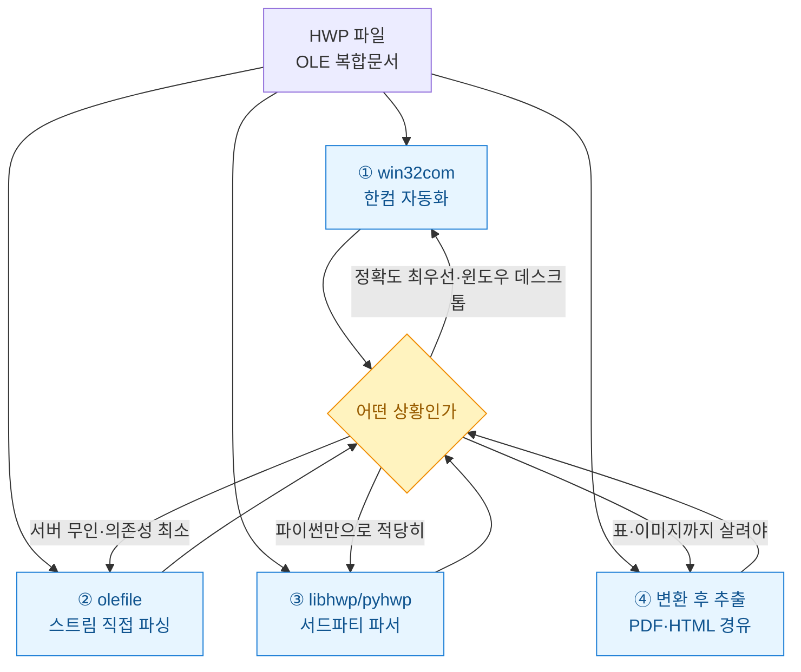
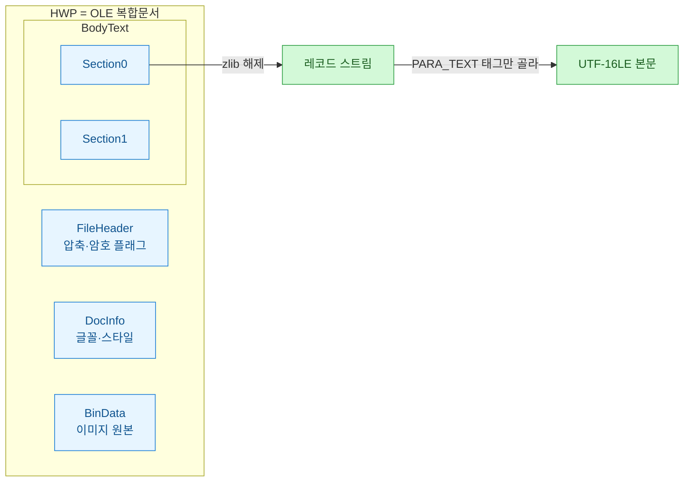
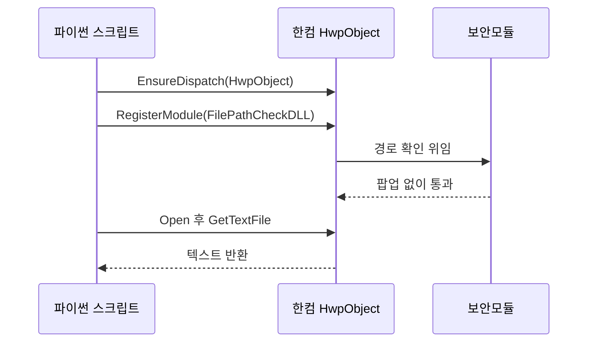

회사에서 넘어오는 문서 절반은 HWP다. 공문, 사업계획서, 정산표까지 전부 아래아한글로 온다. 처음엔 "그냥 텍스트만 뽑으면 되지" 하고 가볍게 봤다가 하루를 통째로 날렸다. HWP는 워드처럼 열어서 긁으면 끝나는 포맷이 아니었다. 그날 이후로 방법 네 가지를 실제로 다 돌려보고 나서야 상황별로 뭘 써야 하는지 감이 잡혔다. 이 글은 그 삽질 기록이다.

먼저 전체 그림부터 깔고 간다. HWP에서 텍스트를 꺼내는 길은 크게 넷이다.



## 왜 HWP는 그냥 텍스트로 못 뽑나?

HWP 5.0 파일은 사실 **OLE 복합문서**(Compound File, 하나의 파일 안에 여러 스트림이 폴더처럼 들어있는 옛 MS 포맷)다. 확장자만 hwp지 내부는 작은 파일시스템이다. 본문은 `BodyText` 안 `Section0`, `Section1` 스트림에 들어있고 그마저도 대부분 **zlib으로 압축**돼 있다. 압축을 풀면 이번엔 4바이트 헤더가 붙은 **레코드**(태그 ID·레벨·크기가 비트로 쪼개진 단위)들이 줄줄이 나온다. 본문 글자는 그중 `PARA_TEXT` 태그 레코드에 UTF-16LE로 박혀 있다.



즉 "텍스트를 뽑는다"는 건 이 3겹(OLE 스트림 → zlib 해제 → 레코드 파싱)을 다 벗겨낸다는 뜻이다. 방법 넷은 이 껍질을 **누가 대신 벗겨주느냐**의 차이다.

## win32com은 왜 서버에서 멈췄나?

가장 정확한 건 역시 한컴 오피스 자기 자신에게 시키는 거다. `win32com`으로 한컴 COM 객체를 띄우면 껍질 세 겹을 한컴이 다 벗겨준다.

```python
import win32com.client as win32

def hwp_to_text(path):
    hwp = win32.gencache.EnsureDispatch("HWPFrame.HwpObject")
    # 이 한 줄이 핵심: 안 하면 파일 열 때 보안 팝업이 떠서 무인 실행이 멈춘다
    hwp.RegisterModule("FilePathCheckDLL", "SecurityModule")
    hwp.Open(path, "HWP", "forceopen:true")
    text = hwp.GetTextFile("TEXT", "")  # 서식 죽이고 순수 텍스트
    hwp.Quit()
    return text
```

처음 크론(cron) 서버에 올렸을 때 스크립트가 아무 로그 없이 멈춰 있었다. 원인은 **파일 경로 확인 보안 팝업**이었다. GUI 없는 서버에선 이 팝업을 누를 사람이 없어 영원히 대기한다. `RegisterModule`로 보안 모듈을 등록해 팝업을 통과시켜야 한다.



정확도는 최고다. 표 순서, 각주, 글상자까지 사람이 보는 순서 그대로 나온다. 대신 **한컴 오피스가 설치된 윈도우**여야 하고 라이선스가 필요하다. 리눅스 컨테이너에 얹는 건 사실상 불가능했다. 데스크톱 배치 작업엔 최선, 클라우드 무인 실행엔 부적합이다.

## olefile로 직접 까면 뭐가 문제였나?

한컴 없이 서버에서 돌리고 싶어 `olefile`로 껍질을 직접 벗겨봤다. 의존성은 `olefile` 하나뿐이라 리눅스 컨테이너에서도 가볍게 돈다.

```python
import olefile, zlib, struct

def read_hwp_text(path):
    ole = olefile.OleFileIO(path)
    header = ole.openstream("FileHeader").read()
    compressed = bool(header[36] & 0x01)  # 압축 플래그
    out = []
    for entry in ole.listdir():
        if entry[0] == "BodyText":
            data = ole.openstream(entry).read()
            if compressed:
                data = zlib.decompress(data, -15)  # raw deflate
            out.append(parse_records(data))
    ole.close()
    return "\n".join(out)

def parse_records(data):
    HWPTAG_PARA_TEXT = 0x43
    pos, buf = 0, []
    while pos < len(data):
        header = struct.unpack_from("<I", data, pos)[0]
        tag = header & 0x3FF
        size = (header >> 20) & 0xFFF
        pos += 4
        if tag == HWPTAG_PARA_TEXT:
            chunk = data[pos:pos + size].decode("utf-16le", "ignore")
            buf.append("".join(c for c in chunk if ord(c) > 31))  # 제어문자 제거
        pos += size
    return "".join(buf)
```

돌아가긴 잘 돌아간다. 그런데 파보니 함정이 많았다. 레코드 크기가 `0xFFF`면 다음 4바이트에 실제 크기가 따로 들어있어서 위 코드는 그 문단을 놓친다. 표 안 글자는 셀 순서가 뒤엉켜 나오고 각주는 본문 사이에 끼어든다. **글자를 놓치진 않는데 "읽는 순서"가 깨진다.** 순수 검색·색인용 텍스트 덤프엔 충분했지만 사람이 그대로 읽을 문서로는 부족했다. 저수준을 다 이해해야 유지보수가 되는 것도 부담이다.

## libhwp랑 변환 방식은 실무에서 쓸만했나?

**서드파티 파서**는 olefile 저수준 작업을 라이브러리가 대신 해준다. `pyhwp`는 CLI 한 줄이 편하다.

```bash
pip install pyhwp
hwp5txt sample.hwp > out.txt   # 순수 텍스트
hwp5html sample.hwp            # 표까지 살린 HTML
```

`libhwp`는 문단·표를 객체로 순회하게 해준다.

```python
from libhwp import HWPReader
hwp = HWPReader("sample.hwp")
for p in hwp.find_all("paragraph"):
    print(p)
```

파이썬만으로 헤드리스 서버에서 도는 게 장점이다. 다만 최신 HWP 기능이나 복잡한 중첩 표에선 일부가 빠지거나 어긋났다. "웬만하면 되는데 100%는 아니다" 정도.

**변환 후 추출**은 아예 다른 포맷으로 바꾸고 검증된 추출기를 쓴다. 서버에선 LibreOffice에 HWP 확장(H2Orestart)을 얹어 헤드리스 변환한다.

```bash
soffice --headless --convert-to pdf --outdir out/ sample.hwp
# 이후 PyMuPDF(fitz)로 PDF 텍스트 추출, 표는 pdfplumber 병행
```

표·이미지·레이아웃까지 사람이 보던 모습에 가장 가깝게 살아난다. 대신 변환 단계가 하나 늘어 느리고 LibreOffice 설치·확장 설정이 필요하다. 배치로 대량 처리할 때 값어치를 했다.

## 그래서 뭘 골라야 하나?

네 방식을 같은 문서 묶음으로 돌려보고 정리한 표다. 정확도는 내가 겪은 상대 느낌이지 절대 벤치마크는 아니다.

| 방법 | 설치 난이도 | 텍스트 정확도 | 표·이미지 | 서버 무인 실행 |
|---|---|---|---|---|
| ① win32com | 높음(한컴+윈도우) | 최상 | 좋음 | ✗ (GUI·라이선스) |
| ② olefile | 낮음(패키지 1개) | 중(순서 깨짐) | 약함 | ○ |
| ③ libhwp/pyhwp | 낮음 | 중상 | 보통 | ○ |
| ④ 변환 후 추출 | 중(LibreOffice) | 상 | 최상 | ○ |

내 결론은 이렇다. 사내 윈도우에서 서식까지 정확히 뽑을 땐 **win32com**, 리눅스 서버에서 검색 색인용 텍스트만 대량으로 긁을 땐 **olefile이나 pyhwp**, 표·이미지가 중요한 리포트 자동화엔 **변환 후 추출**. 하나로 다 해결하려다 하루를 날렸으니 처음부터 "이 문서로 뭘 할 건가"를 먼저 정하는 게 진짜 지름길이었다.

다음엔 변환 방식으로 뽑은 표를 그대로 마크다운 표로 정규화하는 후처리를 정리해볼 생각이다.
