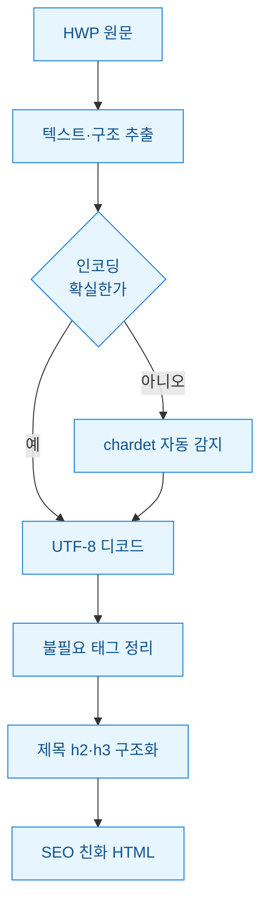
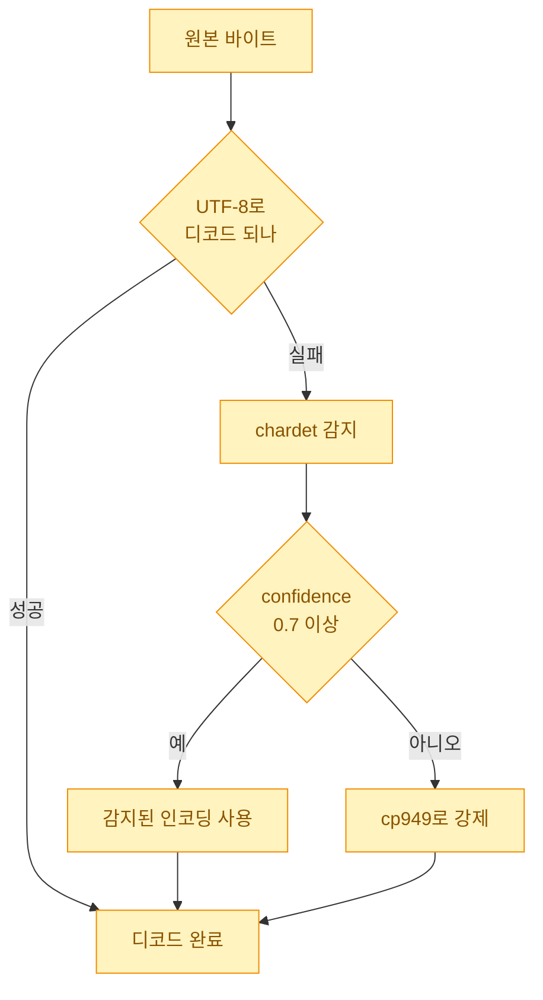
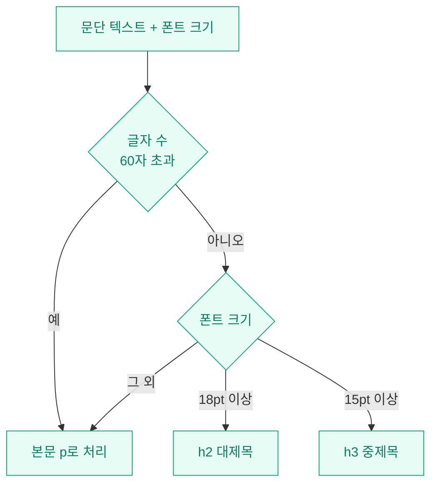

한글(HWP) 문서를 웹에 올려야 하는 일이 종종 생긴다. 공지문, 안내문, 오래된 보고서 같은 것들. 처음엔 단순하게 봤다. "한글에서 열어서 HTML로 저장하면 되잖아?" 그런데 그렇게 뽑은 HTML을 열어보고 마음을 접었다. `<span style="...">`가 글자마다 붙어 있고 인코딩이 깨져서 "한글"이 "�븳湲"로 나왔다. 검색엔진이 이 페이지를 읽어봐야 제목이 뭔지, 무슨 내용인지 알 방법이 없었다.

그래서 직접 파이프라인을 짰다. **텍스트를 뽑고 → 인코딩을 자동으로 잡고 → 쓸데없는 태그를 걷어내고 → 제목 구조를 세워서** 검색 친화적인 HTML을 만드는 흐름이다. 오늘은 그 과정을 정리한다.



## 왜 한글에서 저장한 HTML을 그냥 쓰면 안 됐나?

한글 프로그램이 뽑아주는 HTML은 **화면에 똑같이 보이게** 하는 게 목표다. 검색엔진이 읽기 좋게가 아니라. 그래서 문단마다 인라인 스타일(태그 안에 색·크기·폰트를 직접 박아넣는 방식)이 덕지덕지 붙는다.

문제는 세 가지였다.

- **인코딩 깨짐**: 오래된 HWP일수록 내부 텍스트가 EUC-KR(옛 한글 인코딩) 계열이라 UTF-8로 그냥 읽으면 글자가 다 깨진다.
- **의미 없는 태그**: `<o:p>`, `<span lang=KO>` 같은 태그가 본문의 90%를 차지한다. 검색엔진 입장에선 노이즈다.
- **제목 구조 없음**: 사람 눈엔 큰 글씨가 "제목"이지만 코드로는 그냥 `<p>`에 폰트 크기만 큰 문단이다. `<h1>`, `<h2>` 같은 제목 태그가 없으면 검색엔진이 글의 뼈대를 못 읽는다.

세 번째가 특히 아팠다. SEO(검색엔진 최적화)에서 제목 태그는 목차 같은 역할을 한다. 이게 없으면 본문이 아무리 좋아도 "무엇에 관한 글"인지 신호가 약해진다.

## 인코딩은 어떻게 자동으로 잡았나?

가장 먼저 막힌 게 인코딩이었다. 파일마다 EUC-KR인지 CP949인지 UTF-8인지 제각각이라 하나로 못 박았다. 여기서 `chardet` 라이브러리를 썼다. **바이트를 던지면 "이건 EUC-KR일 확률 99%" 식으로 추측해주는 도구**다.

```python
import chardet

def decode_smart(raw: bytes) -> str:
    # 1) 정석대로 UTF-8부터 시도
    try:
        return raw.decode("utf-8")
    except UnicodeDecodeError:
        pass

    # 2) 실패하면 chardet에게 물어본다
    guess = chardet.detect(raw)
    enc = guess["encoding"] or "cp949"
    conf = guess["confidence"]

    # 3) 확신이 낮으면 한국어 기본값(cp949)으로 강제
    if conf < 0.7:
        enc = "cp949"

    return raw.decode(enc, errors="replace")
```

핵심은 **chardet를 맹신하지 않은 것**이다. 짧은 한글 문서는 표본이 적어서 chardet가 엉뚱하게 "이건 러시아어 Windows-1251"이라고 우기는 경우가 있었다. 그래서 확신도(confidence)가 0.7 미만이면 그냥 한국어 문서라고 보고 CP949로 밀어붙였다. 실제로 이 안전장치 하나로 깨짐이 눈에 띄게 줄었다.



## 지저분한 태그는 어떻게 걷어냈나?

인코딩을 잡고 나니 이번엔 태그가 문제였다. 본문을 파싱해서 **살릴 태그만 화이트리스트(허용 목록)로 남기고 나머지는 통째로 벗겼다.** BeautifulSoup(HTML을 나무 구조로 다뤄주는 파이썬 라이브러리)로 처리했다.

```python
from bs4 import BeautifulSoup

# 남길 태그만 지정. 이 목록에 없으면 태그를 벗긴다(unwrap)
KEEP = {"h1", "h2", "h3", "p", "ul", "ol", "li",
        "a", "strong", "table", "tr", "td", "th"}

def clean_html(html: str) -> str:
    soup = BeautifulSoup(html, "html.parser")

    for tag in soup.find_all(True):
        # 인라인 스타일·잡속성 제거 (href만 예외로 살림)
        for attr in list(tag.attrs):
            if attr != "href":
                del tag[attr]
        # 허용 목록에 없는 태그는 껍데기만 벗기고 내용은 보존
        if tag.name not in KEEP:
            tag.unwrap()

    return str(soup)
```

`unwrap()`이 핵심인데, `decompose()`(태그와 내용을 통째로 삭제)와 다르다. **껍데기 태그만 벗기고 안의 글자는 살린다.** `<span>본문</span>`에서 span만 없애고 "본문"은 남기는 식이다. 실수로 `decompose()`를 썼다가 본문이 텅 비었던 적이 있어서 이 둘의 차이는 몸으로 배웠다.

| 처리 전 | 처리 후 | 이유 |
|---|---|---|
| `<span style="font-size:11pt">글</span>` | `글` | 인라인 스타일은 SEO에 무의미 |
| `<o:p></o:p>` | (삭제) | MS·한글 전용 빈 태그 |
| `<p><a href="/x">링크</a></p>` | `<p><a href="/x">링크</a></p>` | href는 살려야 함 |
| `<font color=red>제목</font>` | `제목` | 시각 스타일일 뿐 구조 아님 |

## 큰 글씨를 어떻게 진짜 제목으로 바꿨나?

마지막 관문. 태그를 다 걷어내니 이제 본문이 전부 `<p>` 문단이었다. 사람이 "제목"으로 인식하던 큰 글씨도 다 그냥 문단이 됐다. 이걸 `<h2>`, `<h3>`로 승격시켜야 검색엔진이 목차를 읽는다.

원본 문서에 남아 있던 **폰트 크기 힌트**를 활용했다. 추출 단계에서 문단별 글자 크기를 같이 뽑아두고, 일정 크기 이상이면 제목으로 판단하는 규칙을 걸었다.

```python
def promote_heading(text: str, font_size: float) -> str:
    if font_size >= 18:      # 대제목급
        return f"<h2>{text}</h2>"
    elif font_size >= 15:    # 중제목급
        return f"<h3>{text}</h3>"
    else:
        return f"<p>{text}</p>"
```

물론 폰트 크기만으로 100% 맞진 않는다. 강조하려고 크게 쓴 본문 문장이 제목으로 오인되기도 했다. 그래서 **글자 수도 같이 봤다.** 60자를 넘어가면 아무리 커도 제목이 아니라 본문으로 처리했다. 제목은 대체로 짧다는 상식을 규칙에 넣은 것이다.



이렇게 h2·h3 뼈대가 서니까 부수 효과도 있었다. Hyeong 블로그처럼 **질문형 소제목을 h2로 쓰면 FAQ 구조화 데이터가 자동으로 붙어서** 검색 결과에 미리보기가 더 잘 뜬다. HWP 변환 결과물도 같은 원리로 제목 구조만 제대로 세우면 검색 노출이 달라진다.

## 정리하면

돌아보면 HWP를 웹에 올리는 일은 "변환"이 아니라 **"구조 복원"**에 가까웠다. 시각적으로만 존재하던 제목·강조를 코드가 읽을 수 있는 의미 태그로 되살리는 작업. 인코딩(chardet + 안전장치) → 태그 정리(화이트리스트 unwrap) → 제목 구조화(폰트+글자수 규칙), 이 세 단계가 뼈대다.

다음엔 표(table) 안의 셀 병합을 제대로 살리는 부분을 손볼 생각이다. 한글 문서의 표는 병합 셀이 많아서 이게 은근히 까다롭다. 그건 다음 글로.

> 참고: HWP 내부 구조와 텍스트 추출 방식은 문서 버전(HWP 5.0 바이너리, HWPX 등)에 따라 다르다. 위 코드는 추출된 텍스트/HTML을 후처리하는 단계를 중심으로 한 합성 예시다.
