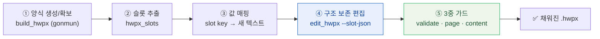
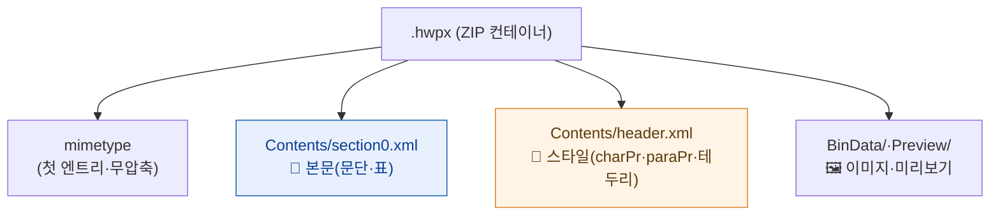
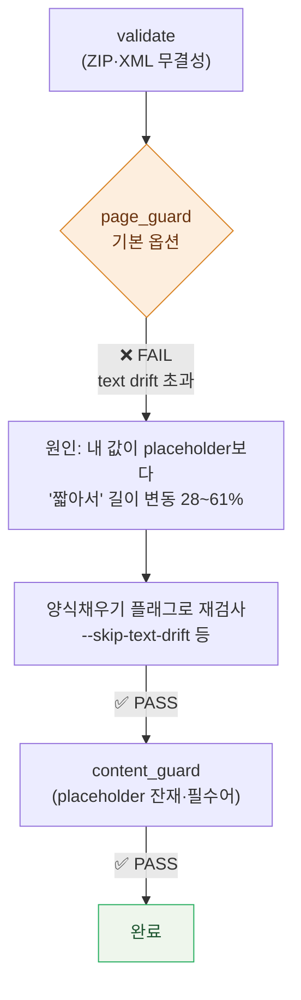
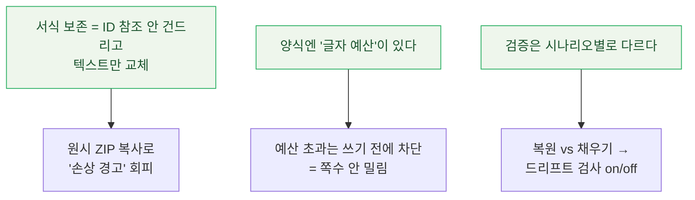

남이 만든 한글(HWPX) 문서 스킬을 "이런 게 있다더라"로 끝내기 싫었다. 그래서 **실제로 돌렸다.** 공문 양식을 하나 만들어, 편집 가능한 칸을 뽑고, 합성 데이터로 채운 뒤, 무결성·쪽수·내용 가드 셋을 다 통과시켰다. 명령과 결과를 그대로 옮기고, 중간에 부딪힌 거친 모서리까지 숨기지 않고 적는다. (스킬 자체의 원리·배경은 [[hwpxskill-hancom-hwpx-agent-skill|HWPX 에이전트 스킬 정리 노트]]에 따로 있다.)

## 전체 그림 — "양식 채우기"는 5단계 파이프라인이다

핵심은 "백지에 새로 쓰는" 게 아니라 **기존 양식의 뼈대를 그대로 두고 글자만 갈아끼우는** 것이다. 그래서 흐름이 이렇게 생겼다.



> 왜 이렇게까지 하나? 한글 공문·정부 양식은 **글자 하나 틀어지면 표·여백·쪽수가 통째로 밀린다.** 그래서 "내용만 바꾸고 서식은 100% 보존"이 이 작업의 전부다. 새로 그리는 것보다, 있는 양식을 **안 깨고** 채우는 게 훨씬 어렵다.

## HWPX는 왜 ZIP이고 XML인가? (원리)

채우기에 들어가기 전에 원리 한 겹. `.hwpx`는 사실 **여러 XML 파일을 묶은 ZIP 컨테이너**(OWPML 표준)다. 압축을 풀면 본문(`Contents/section0.xml`), 스타일(`header.xml`), 표지·미리보기·이미지 같은 부속이 들어 있다.



> 이게 편집자P 강의에서 말한 **"HWPX 구성 원리"** 의 실체다. 본문 텍스트는 `section0.xml`의 `<hp:t>` 안에 있고, 글자 크기·볼드 같은 서식은 `header.xml`에 ID로 정의돼 `charPrIDRef`로 참조된다. **그래서 "서식 보존 = 이 ID 참조 체계를 안 건드리고 `<hp:t>` 텍스트만 교체"** 가 된다. 핵심 한 줄.

여기서 이 스킬이 깐깐하게 지키는 규칙이 하나 있다. 흔히 하는 "압축 풀고 → 고치고 → 다시 ZIP" 방식을 **쓰지 않는다.** 일반 재압축은 CRC·압축바이트·플래그가 미세하게 바뀌어 한컴이 "손상된 문서" 경고를 띄울 수 있기 때문이다. 그래서 **원본 ZIP의 안 바뀐 엔트리는 바이트째 그대로 복사하고, 바뀐 것만 교체**한다. 이 디테일이 "열었더니 깨졌어요"를 막는다.

## 1단계 — 공문 양식 생성하고 검증

먼저 내장 `gonmun`(공문) 템플릿으로 양식을 하나 뽑았다. (이 PC엔 lxml이 이미 있어 venv 없이 `python3`로 바로 돌렸다.)

```bash
python3 "$SKILL_DIR/scripts/build_hwpx.py" --template gonmun --output form.hwpx
# → VALID: form.hwpx  /  Template: gonmun

python3 "$SKILL_DIR/scripts/validate.py" form.hwpx
# → VALID: form.hwpx  /  All structural checks passed.
```

텍스트를 뽑아보니 전형적인 공문 골격에 `{{...}}` 자리표시자가 박혀 있었다.

```text
{{기관명}}
수 신 : {{수신자}}      제 목   {{제목}}
1.  {{본문1}}      2.  {{본문2}}      - 아 래 -
{{표 또는 상세내용}}      끝.      {{직위 성명}}
시행 : {{시행번호}} ( {{시행일자}} )  …  전화 {{전화번호}} …
```

## 2단계 — '슬롯'을 뽑으면 칸마다 글자 예산이 붙어 나온다

이 스킬의 핵심 개념이 **슬롯(slot)** 이다. 표·그림을 품은 컨테이너 문단은 빼고, **실제로 글자를 넣을 수 있는 문단·셀만** 키로 뽑아준다.

```bash
python3 "$SKILL_DIR/scripts/hwpx_slots.py" form.hwpx --output slots.json
# → slots: 15
```

뽑힌 슬롯엔 키와 함께 **`max_chars`(글자 예산)** 가 붙는다. 이게 인상적이었다.

| 슬롯 키 | 자리(미리보기) | 글자 예산(max_chars) |
|---|---|---|
| `p:2` | `{{기관명}}` | 7 |
| `p:6` | `제 목  {{제목}}` | 8 |
| `p:8` | `1. {{본문1}}` | 9 |
| `p:23` | `시행 : {{시행번호}} ( {{시행일자}} ) …` | 25 |
| `p:25` | `전화 {{전화번호}} … / 공개` | 31 |

> **글자 예산(char budget)** 이란? 그 칸이 **레이아웃을 안 깨고 받아낼 수 있는 최대 글자 수**다. 셀 폭과 글자 크기로 계산된다. 공문 본문 칸이 `max_chars: 9`처럼 빡빡한 건, 이 양식이 애초에 **짧고 정형화된 값**을 받도록 설계됐다는 뜻이다. 예산을 넘기면 줄이 늘어 쪽수가 밀리므로, 스킬은 **예산 초과를 쓰기 전에 막는다.**

## 3단계 — 합성 데이터로 채우기 (구조 보존 편집)

슬롯 키에 값을 매핑한 JSON을 만들었다. **전부 가상 행정기관·가상 연락처**다(실제 기관·개인정보 아님).

```json
{
  "p:2":  "행복특별시",
  "p:6":  "제목 : 개방 안내",
  "p:8":  "1. 데이터 개방 확대",
  "p:23": "시행 데이터정책과-2026-0625",
  "p:25": "전화 02-000-0000 / data@ex.go.kr / 공개"
}
```

그리고 구조 보존 편집을 돌렸다.

```bash
python3 "$SKILL_DIR/scripts/edit_hwpx.py" form.hwpx -o filled.hwpx --slot-json values.json
# → EDITED: filled.hwpx
#   paragraphs updated: 11
#   original package entries, header.xml, content.hpf, and BinData were preserved
```

11개 문단이 채워졌고, **header(스타일)·content.hpf·이미지 등 원본 엔트리는 그대로 보존**됐다는 로그가 핵심이다. 서식은 손 안 댔다는 뜻.

## 4단계 — 가드 3종, 그리고 내가 실제로 부딪힌 함정

여기서 멈추지 않았다. 이 스킬은 `validate`만으로 "끝"이라고 안 한다. **쪽수 가드와 내용 가드까지 통과해야** 완료로 친다. 그런데 첫 시도에서 바로 막혔다.



**(가드 1) `validate` — 통과.** 구조 검사 OK.

**(가드 2) `page_guard` — 처음엔 FAIL.** 기본 옵션으로 돌리니 "텍스트 길이 변동 초과(ref=49 → out=19, delta 61%)"가 줄줄이 떴다. 처음엔 당황했는데, 원인은 반대였다 — **내가 채운 값이 원래 `{{placeholder}}`보다 짧아서** 길이가 25% 넘게 줄어든 걸 "드리프트"로 잡은 것이다. 양식 채우기에선 당연한 일이라, 문서가 권하는 **양식채우기 전용 플래그**로 다시 돌려야 맞다.

```bash
# 원본 양식의 칸별 글자 예산을 먼저 추출
python3 "$SKILL_DIR/scripts/page_guard.py" --reference form.hwpx --write-budget budget.json

# 길이 '일치'가 아니라 '예산 이하 + 구조 보존'으로 검사
python3 "$SKILL_DIR/scripts/page_guard.py" \
  --reference form.hwpx --output filled.hwpx \
  --budget-profile budget.json \
  --no-strict-paragraph-budget --skip-text-drift --allow-empty-fill
# → PASS: page-guard
#   구조 fingerprint와 문단/셀별 글자 예산 검사를 통과했습니다.
```

> 교훈: 가드의 FAIL을 곧이곧대로 "내가 틀렸다"로 읽으면 안 됐다. **"같은 길이로 복원"하는 작업과 "빈 양식을 채우는" 작업은 검사 기준이 다르다.** 후자는 길이 드리프트를 끄고 *예산 이하인지*만 본다. 도구를 쓸 땐 그 도구가 "무슨 시나리오를 기본값으로 두는지"를 알아야 한다.

**(가드 3) `content_guard` — 통과.** `{{`·`}}` 잔재 금지 + "행복특별시" 필수어 규칙으로 검사했다.

```bash
python3 "$SKILL_DIR/scripts/content_guard.py" filled.hwpx --rules content.rules.json
# → PASS: content-guard filled.hwpx
```

자리표시자가 하나도 안 남았고 새 기관명이 제대로 들어갔다는 뜻. 최종 결과물 텍스트는 이렇게 떨어졌다.

```text
행복특별시
수신 : 수신자 참조        제목 : 개방 안내
1. 데이터 개방 확대        2. 부서별 회신        - 아 래 -
붙임 개방목록 1부.        끝.        행복특별시장
시행 데이터정책과-2026-0625
전화 02-000-0000 / data@ex.go.kr / 공개
```

### 거친 모서리 하나 — `--write-structure`가 죽었다

숨기지 않고 적는다. 가드를 더 엄격히 걸려고 `page_guard.py --write-structure`(구조 지문 파일 생성)를 따로 돌렸더니, 이 PC의 **lxml 4.9.3 조합에서 `ValueError: Invalid input tag …`로 크래시**했다. 다행히 `page_guard`를 `--output`과 함께 돌릴 때의 내부 구조 검사는 정상 통과해서 결과 검증엔 문제가 없었다. 스킬이 특정 파이썬·라이브러리 조합에선 거친 부분이 있다는 것 — 새 도구를 실무에 올리기 전에 **내 환경에서 한 번은 끝까지 돌려봐야** 아는 종류의 일이다.

## .hwp는 안 되나?

된다/안 된다가 갈린다. 이 스킬은 **`.hwpx`만** 다룬다. 옛날 바이너리 `.hwp`는 지원하지 않는다. 한컴에서 *파일 → 다른 이름으로 저장 → 형식: HWPX*로 한 번 바꿔주면 그다음부터는 위 파이프라인을 그대로 탄다.

## 배운 것



- **자동화의 어려움은 "생성"이 아니라 "안 깨기"에 있다.** 한글 문서는 서식이 곧 양식이라, 글자만 바꿔도 표·쪽수가 밀린다. 슬롯·예산·원시 ZIP 복사는 전부 그 "안 깨기"를 위한 장치였다.
- **가드를 믿되, 가드의 전제를 이해하라.** page_guard의 첫 FAIL은 버그가 아니라 "기본 시나리오가 복원"이라는 신호였다. 채우기엔 채우기용 옵션이 따로 있었다.
- **남이 만든 스킬도 내 환경에서 끝까지 돌려봐야 한다.** `--write-structure` 크래시처럼, 문서만 봐선 안 보이는 모서리는 직접 돌려야 드러난다.

편집자P 강의가 "원리편(만들기)"과 "사용편(가져다 쓰기)"으로 나뉜 이유를 직접 돌려보고 알았다. 원리를 알면 FAIL이 떠도 당황하지 않고, 사용법을 알면 5분이면 양식 하나를 채운다. 그 사이의 거리가 딱 이 글 한 편이었다.

---

> 같이 보면 좋은 글: [[hwpxskill-hancom-hwpx-agent-skill|HWPX 에이전트 스킬 — 원리·구현 정리]] · [[insane-search-playwright-two-tier-setup|Insane Search + Playwright 2티어 세팅 기록]] · [[claude-code-mcp-servers-github-pat-oauth-dcr-fix|Claude Code에 MCP 서버 붙인 기록]] · 내 소개는 [[about]].

*위 명령·로그·결과는 실제로 실행한 그대로이며, 문서에 넣은 기관명·주소·연락처는 전부 가상의 합성 데이터입니다(실제 기관·개인정보 아님). 스킬의 동작·가드 옵션은 버전에 따라 바뀔 수 있고, `--write-structure` 크래시는 이 PC의 Python/lxml 4.9.3 조합에서 관찰된 것입니다.*
