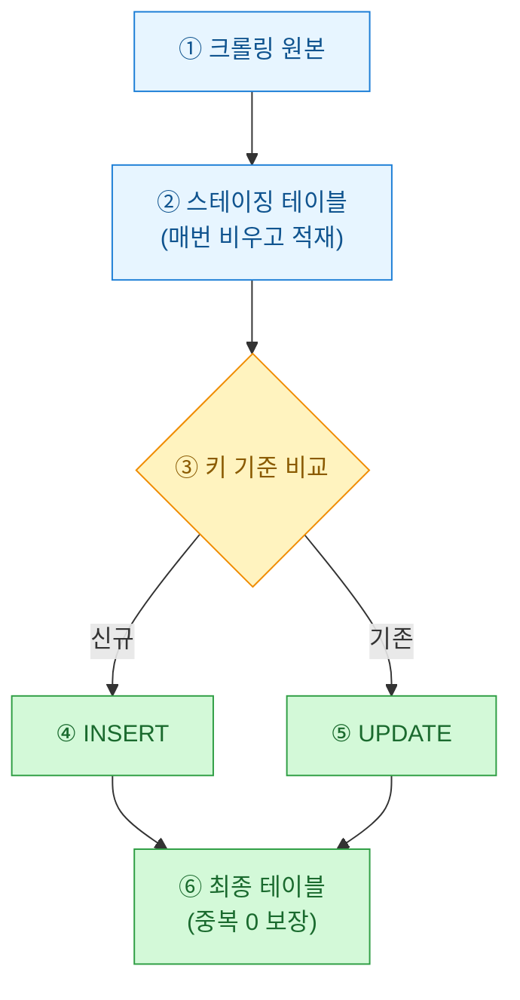
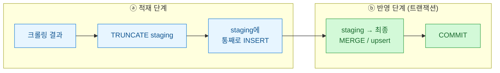

게임 랭킹 데이터를 매일 긁어 DB에 쌓는 잡을 짜고 나서 며칠 뒤, 대시보드의 일별 유저 수가 정확히 두 배로 튀는 걸 봤다. 원인은 단순했다. 아침에 잡이 한 번 실패해서 재실행했는데, 실패한 게 아니라 "적재까지는 됐고 알림만 못 보낸" 상태였던 거다. 같은 데이터가 두 번 들어갔다. 이날 이후로 나는 모든 적재 잡을 **멱등(idempotent)하게**, 즉 몇 번을 돌려도 결과가 같게 만드는 걸 원칙으로 삼았다. 그 정리를 남긴다.



## 왜 append만 하면 중복이 쌓이나?

가장 흔한 초기 코드는 긁은 걸 그냥 `INSERT INTO` 하는 형태다. 문제는 파이프라인이 "정확히 한 번" 도는 보장이 세상에 거의 없다는 점이다. 재시도, 수동 재실행, 스케줄러 중복 트리거, 네트워크 타임아웃 후 부분 성공 — 전부 같은 데이터를 두 번 넣는 경로가 된다.

| 상황 | append-only 결과 | 멱등 설계 결과 |
|------|------------------|----------------|
| 정상 1회 실행 | 정상 | 정상 |
| 실패 후 재실행 | 중복 2배 | 그대로 |
| 스케줄러 중복 트리거 | 중복 | 그대로 |
| 어제치 다시 채우기(백필) | 중복 | 그대로 |

핵심은 "실행 횟수"가 아니라 "데이터의 최종 상태"를 기준으로 생각하는 것이다. **멱등성(idempotency)이란**, 같은 입력으로 여러 번 실행해도 상태가 한 번 실행한 것과 동일하다는 성질이다.

## 무엇을 기준으로 같은 행이라 볼까?

멱등의 출발점은 **자연 키(natural key)**, 곧 "이 행을 유일하게 식별하는 값"을 정하는 일이다. 게임 랭킹이라면 `(수집일자, 유저ID)` 조합이 그렇다. 이걸 DB 제약으로 못박아야 upsert가 작동한다.

```sql
-- 최종 테이블: 자연 키에 UNIQUE 제약을 건다
CREATE TABLE rank_daily (
    snapshot_date DATE      NOT NULL,
    user_id       BIGINT    NOT NULL,
    rank_no       INT       NOT NULL,
    score         INT       NOT NULL,
    updated_at    TIMESTAMP DEFAULT now(),
    CONSTRAINT uq_rank UNIQUE (snapshot_date, user_id)
);
```

이 `UNIQUE (snapshot_date, user_id)`가 없으면 아무리 좋은 upsert 문법을 써도 DB가 "같은 행"을 판단할 근거가 없다. 제약이 곧 계약이다.

## upsert는 어떻게 쓰나?

PostgreSQL 기준 `INSERT ... ON CONFLICT`가 가장 깔끔하다. 충돌(같은 키)이 나면 넣는 대신 갱신한다.

```sql
INSERT INTO rank_daily (snapshot_date, user_id, rank_no, score)
VALUES ('2026-07-13', 1001, 3, 15200)
ON CONFLICT (snapshot_date, user_id)
DO UPDATE SET
    rank_no    = EXCLUDED.rank_no,
    score      = EXCLUDED.score,
    updated_at = now();
```

`EXCLUDED`는 "넣으려다 충돌난 새 값"을 가리키는 특수 별칭이다. 이 문장은 몇 번을 돌려도 최종 행은 하나, 값은 항상 최신이다. 그게 멱등이다.

| DB | 문법 |
|----|------|
| PostgreSQL | `INSERT ... ON CONFLICT ... DO UPDATE` |
| MySQL | `INSERT ... ON DUPLICATE KEY UPDATE` |
| SQLite | `INSERT ... ON CONFLICT ... DO UPDATE` |
| 표준/대용량 | `MERGE INTO ... WHEN MATCHED / NOT MATCHED` |

## 스테이징 테이블은 왜 한 겹 더 두나?

행 하나씩 upsert하면 되지만, 수만 행을 크롤링해 넣을 땐 두 가지가 걸린다. 크롤링 도중 절반만 들어가다 죽으면 최종 테이블이 어중간해지고, 건별 upsert는 느리다. 그래서 나는 **스테이징(staging) 테이블**, 곧 "잠깐 쌓았다 옮기는 임시 창고"를 한 겹 둔다.



포인트는 세 가지다. 스테이징은 **매 실행 첫머리에 비운다(`TRUNCATE`)** — 이전 실행 찌꺼기를 원천 차단하니 그 자체로 멱등하다. 크롤링이 도중에 죽어도 최종 테이블은 손대지 않았으니 무사하다. 그리고 스테이징이 온전히 다 찬 뒤에야 한 번의 트랜잭션으로 최종 테이블에 반영한다.

```sql
BEGIN;
INSERT INTO rank_daily AS t (snapshot_date, user_id, rank_no, score)
SELECT snapshot_date, user_id, rank_no, score
FROM   rank_staging
ON CONFLICT (snapshot_date, user_id)
DO UPDATE SET
    rank_no = EXCLUDED.rank_no,
    score   = EXCLUDED.score,
    updated_at = now();
COMMIT;
```

`set` 기반 일괄 처리라 건별 루프보다 훨씬 빠르고, 트랜잭션으로 감싸 "전부 반영 or 전혀 반영 안 됨"을 보장한다.

## 실행 파이썬 쪽은 어떻게 감싸나?

파이썬 오케스트레이션에서도 순서를 지켜야 멱등이 유지된다. 합성 예시다.

```python
def load_ranking(rows):  # rows: 크롤링한 더미 리스트
    with conn:                      # 트랜잭션 컨텍스트
        cur = conn.cursor()
        cur.execute("TRUNCATE rank_staging;")   # ① 매번 비움
        cur.executemany(
            "INSERT INTO rank_staging "
            "(snapshot_date, user_id, rank_no, score) "
            "VALUES (%s, %s, %s, %s);", rows)    # ② 통째 적재
        cur.execute(MERGE_SQL)                   # ③ 최종 반영(upsert)
    # with 블록 정상 종료 시에만 COMMIT
```

여기서 실수하기 쉬운 함정 하나. 스테이징에 넣기 전에 **크롤링 결과 자체의 키 중복을 먼저 제거**해야 한다. 같은 배치 안에 같은 키가 두 번 있으면 `ON CONFLICT`가 한 문장 안에서 두 번 갱신을 시도하다 에러가 난다. `dict`로 키를 눌러 마지막 값만 남기는 식으로 미리 정리한다.

## 정리 — 체크리스트

| 항목 | 확인 |
|------|------|
| 자연 키 정의 + `UNIQUE` 제약 | 최종 테이블에 걸었나 |
| 스테이징 매 실행 `TRUNCATE` | 첫 줄에서 비우나 |
| 반영은 upsert/MERGE | append-only 아님 |
| 트랜잭션으로 감쌈 | 부분 반영 없음 |
| 배치 내부 키 중복 선제거 | upsert 전에 처리 |

이 다섯 줄만 지키면 아침에 잡이 죽어도 마음 편히 재실행 버튼을 누를 수 있다. "몇 번 돌렸나"를 세는 대신 "최종 상태가 맞나"만 보면 되는, 그 홀가분함이 멱등 설계의 진짜 이득이다.
