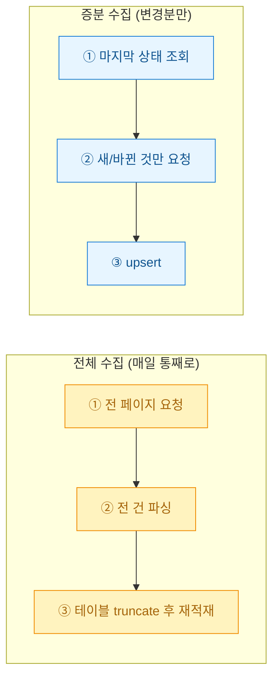
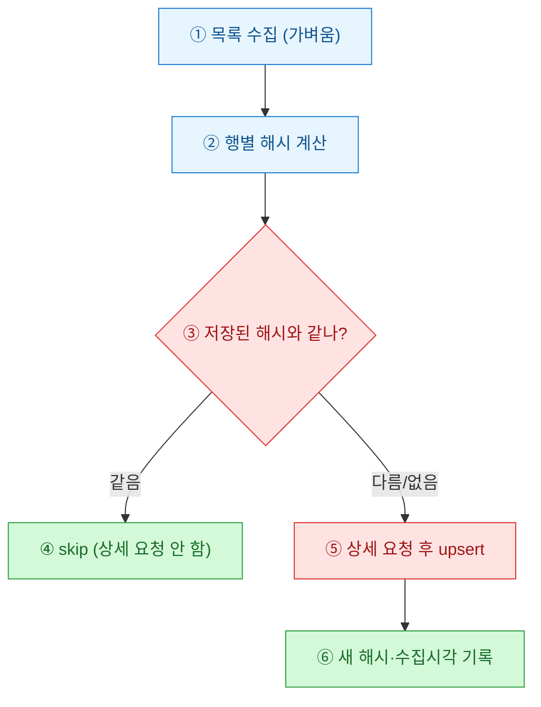
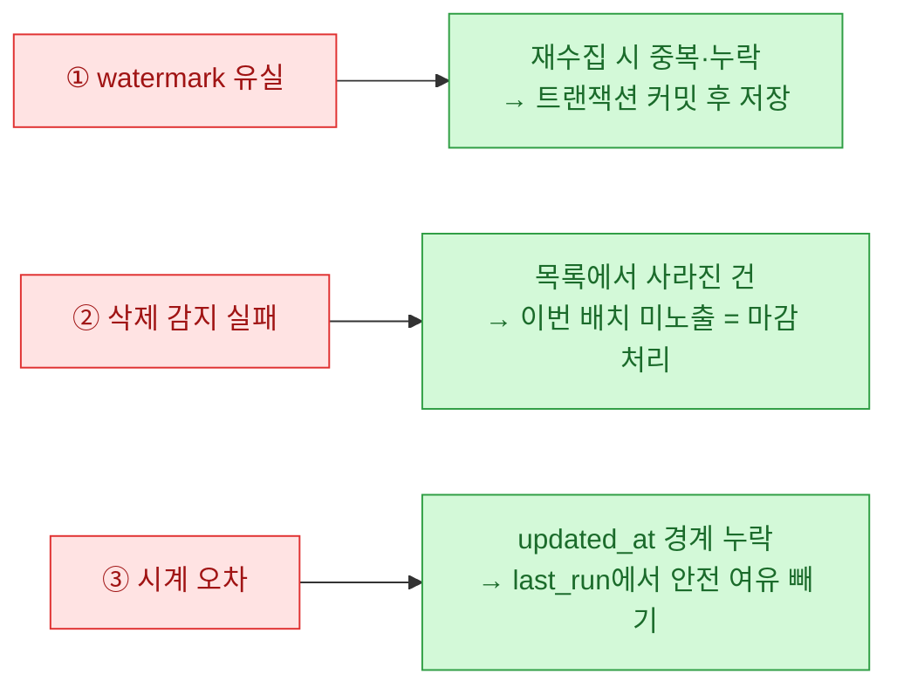

처음 매물 수집기를 만들었을 때 나는 아무 생각이 없었다. 매일 새벽 3시에 전체 목록을 처음부터 끝까지 다 긁어서 테이블을 통째로 갈아엎었다. 데이터가 수천 건일 때는 몰랐는데, 수십만 건이 되니 새벽 배치가 두 시간을 넘겼고 대상 사이트에서 슬슬 요청을 막기 시작했다. "어차피 어제와 99%는 똑같은데 왜 다 긁지?"라는 당연한 질문에서 증분 수집(incremental crawl)이 시작됐다.

이 글은 공개·더미 데이터 기준의 설계 기록이며, 특정 사이트의 실서비스 크롤링을 권유하는 글이 아니다.

## 전체 수집과 증분 수집은 무엇이 다른가?



핵심 차이는 "무엇을 안 해도 되는가"다. 증분 수집은 이미 가진 데이터를 다시 요청하지 않는 것이 목적이다. 그러려면 "어디까지 가져왔는지"를 시스템이 기억해야 한다. 그 기억의 기준을 무엇으로 삼느냐에 따라 전략이 갈린다.

| 기준 | 판단 방법 | 적합한 경우 | 한계 |
|------|-----------|-------------|------|
| **최신 ID(watermark)** | 저장된 max(id)보다 큰 것만 | ID가 단조 증가·신규만 관심 | 기존 건 수정·삭제 감지 못 함 |
| **수집 시점(timestamp)** | last_run 이후 updated_at | 서버가 갱신시각 제공 | 서버 시계·누락에 취약 |
| **콘텐츠 해시(hash)** | 본문 해시 비교 | 갱신시각이 없음 | 목록은 받아야 비교 가능 |

## 최신 ID 기준: 가장 싸지만 새 것만 본다

매물 ID가 등록순으로 증가한다면, 내가 마지막에 본 ID보다 큰 것만 새 매물이다. 목록 첫 페이지부터 훑다가 이미 본 ID를 만나면 즉시 멈춘다.

```python
# 합성 예시: 최신 ID를 만나면 조기 종료
last_seen = get_watermark()  # 예: 100238 (DB에 저장해 둔 값)
new_rows = []
for page in range(1, 50):
    items = fetch_list(page)        # 목록만, 상세는 아직 안 감
    for it in items:
        if it["id"] <= last_seen:
            save_watermark(max(r["id"] for r in new_rows))
            raise StopIteration      # 여기서 끝. 뒤 페이지는 안 긁는다
        new_rows.append(it)
```

체감은 극적이다. 하루 신규가 200건이면 목록 2\~3페이지만 보고 끝난다. 다만 이 방식은 **기존 매물의 가격 변경이나 삭제(마감)**를 절대 못 본다. 신규 유입만 필요한 파이프라인에서만 안전하다.

## 시점·해시 기준: 바뀐 것까지 잡으려면?

"가격이 내렸다", "마감됐다" 같은 변화를 잡으려면 기존 건도 다시 봐야 한다. 그렇다고 상세 페이지를 전부 다시 긁으면 증분의 의미가 없다. 그래서 **목록 단계에서 지문(fingerprint)을 만들어 비교**하고, 달라진 것만 상세를 요청한다.



해시는 가격·상태·제목처럼 "바뀌면 다시 봐야 하는 필드"만 이어붙여 만든다. 목록에 이미 노출되는 값이라 상세 요청 없이도 비교된다.

```python
import hashlib

def row_fingerprint(item):
    # 갱신을 감지하고 싶은 필드만 골라 해시
    key = f'{item["price"]}|{item["status"]}|{item["title"]}'
    return hashlib.sha1(key.encode()).hexdigest()
```

적재는 지우고 다시 넣는 대신 **upsert**로 처리한다. 새 ID면 insert, 있던 ID인데 해시가 다르면 update, 같으면 손대지 않는다.

```sql
-- 변경분만 반영하는 upsert (PostgreSQL 문법 예시)
INSERT INTO listings (id, price, status, title, fp, crawled_at)
VALUES (:id, :price, :status, :title, :fp, now())
ON CONFLICT (id) DO UPDATE
SET price = EXCLUDED.price,
    status = EXCLUDED.status,
    title = EXCLUDED.title,
    fp = EXCLUDED.fp,
    crawled_at = now()
WHERE listings.fp <> EXCLUDED.fp;   -- 해시 같으면 write조차 안 함
```

마지막 `WHERE`가 숨은 이득이다. 해시가 동일하면 UPDATE 자체가 실행되지 않아 불필요한 디스크 쓰기와 인덱스 갱신, 그리고 `updated_at` 오염을 막는다.

## 실제로 무엇이 줄었나? (더미 기준)

전체 20만 건, 하루 신규 200건·변경 500건이라는 합성 시나리오로 비교했다.

| 항목 | 전체 수집 | 증분 수집 | 감소 |
|------|-----------|-----------|------|
| 상세 페이지 요청 | 200,000 | 700 | 약 99.7% |
| 배치 소요 | 2시간+ | 3\~5분 | 약 95% |
| DB write 행수 | 200,000 | 700 | 약 99.7% |
| 차단 위험 | 높음 | 낮음 | — |

## 증분에서 밟은 지뢰 세 가지



특히 세 번째, 서버 시각을 믿고 `updated_at > last_run`으로 자르면 배치 실행 중 등록된 건이 영영 누락된다. 나는 `last_run`에서 몇 분을 빼서 살짝 겹치게 긁고, upsert가 중복을 흡수하게 뒀다. 증분 수집의 원칙은 결국 하나다. **덜 요청하되, 겹쳐서 안전하게.** 매일 전체를 긁던 습관 하나를 버렸을 뿐인데 배치는 조용해졌고 차단 메일도 끊겼다.
