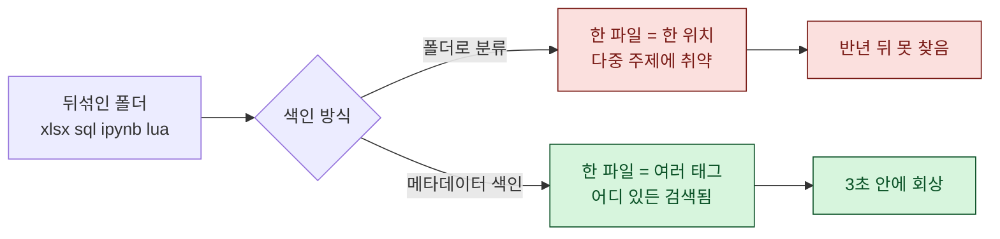
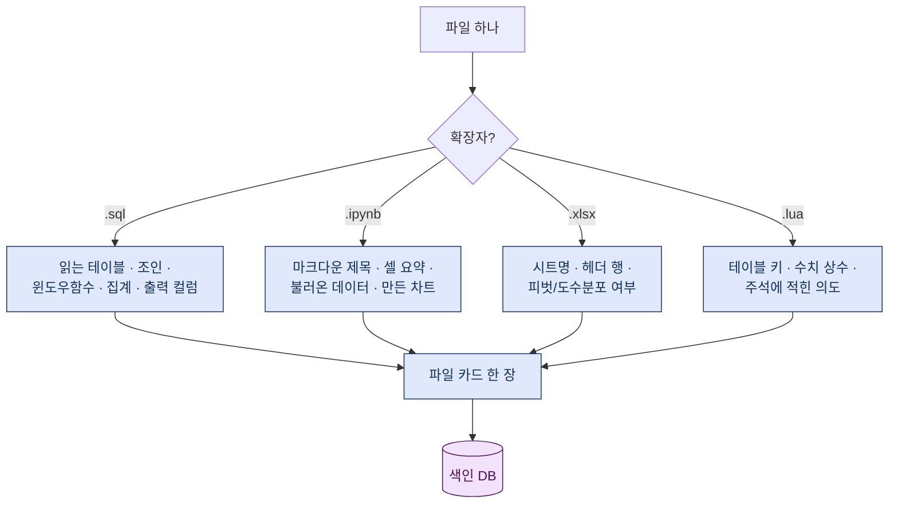
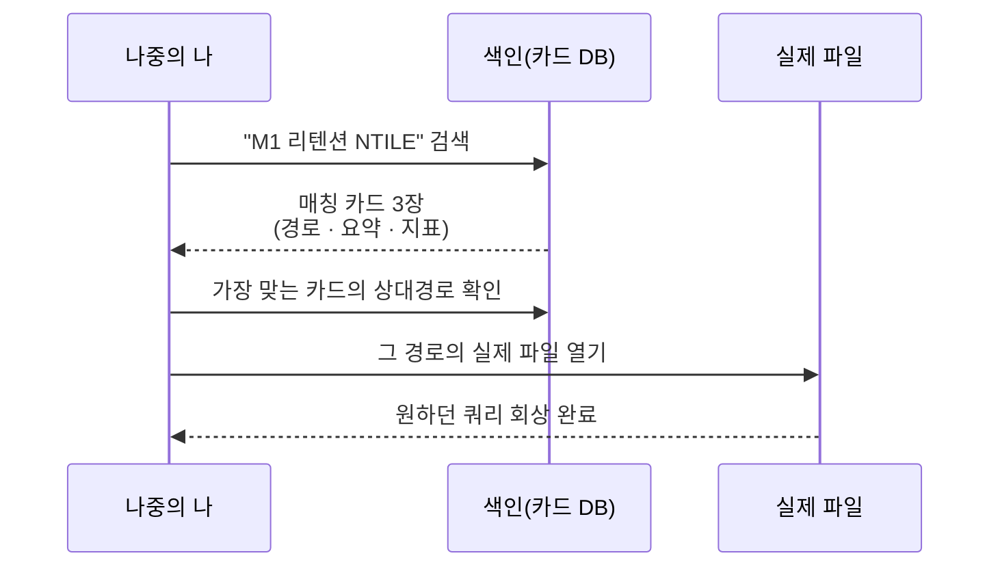

> "3개월 전에 그 리텐션 쿼리 어디 뒀더라." — 이 한 문장이 반나절을 잡아먹는다. 색인은 그 반나절을 3초로 줄이는 일이다.

게임 데이터를 다루다 보면 한 분석이 파일 한 개로 끝나는 경우가 거의 없다. 원본 추출은 SQL 쿼리(`.sql`)로, 중간 가공은 노트북(`.ipynb`)에서, 최종 요약은 엑셀(`.xlsx`)로, 심지어 게임 클라이언트 쪽 설정을 뜯어볼 땐 Lua 스크립트(`.lua`)까지 딸려 온다. 한 폴더 안에 성격이 완전히 다른 파일 네 종류가 뒤엉킨다. 그리고 몇 달 지나면 나조차도 어디에 뭘 뒀는지 못 찾는다.

오늘은 이 '뒤섞인 아카이브'를 어떻게 회상 가능한 상태로 색인하는지, 내가 실제로 쓰는 방식을 정리해 본다. 핵심 결론부터 말하면 하나다. **본문을 뒤지기 전에 메타데이터부터 색인하라.**

## 왜 폴더 정리로는 안 되는가?

처음엔 다들 폴더로 해결하려 한다. `2024_리텐션분석/`, `매출시뮬/` 같은 폴더를 파고, 그 안에 파일을 넣는다. 문제는 파일 하나가 여러 주제에 걸친다는 점이다. 리텐션을 계산한 쿼리가 매출 시뮬레이션의 입력이 되기도 하고, 픽률 노트북이 밸런스 패치 분석에도 재활용된다. 폴더는 한 파일을 한 곳에만 놓게 강제한다. 현실의 분석은 그렇게 깔끔하게 나뉘지 않는다.

두 번째 문제는 '파일명이 곧 기억'이라는 착각이다. `retention_v3_final_진짜최종.sql` 같은 이름은 만든 그 주에만 의미가 있다. 반년 뒤엔 v3가 뭐였는지, final과 진짜최종 중 뭘 썼는지 기억나지 않는다.

그래서 필요한 건 폴더가 아니라 **색인(index)** 이다. 파일이 어디 있든, 이름이 뭐든, 그 안에 무엇이 들었는지를 별도의 표로 뽑아 두는 것.

## 메타데이터 우선 색인이란 무엇인가?

'메타데이터 우선'이라는 말이 거창해 보이지만 뜻은 단순하다. **파일 안의 모든 내용을 읽지 말고, 그 파일이 무엇인지를 설명하는 최소 정보만 먼저 뽑아라.** 그 최소 정보가 메타데이터다.

내가 파일마다 뽑는 메타데이터는 대략 이 정도다. 전부 예시용 더미 값으로 적는다.

| 필드 | 예시(더미) | 왜 필요한가 |
|---|---|---|
| 파일종류 | `sql` / `ipynb` / `xlsx` / `lua` | 어떤 도구로 열지 즉시 판단 |
| 주제태그 | `리텐션`, `코호트`, `M1` | 여러 개 붙여 다중 주제 해결 |
| 다루는 지표 | `M1 리텐션`, `ARPPU` | 지표 이름으로 검색 가능 |
| 입력 대상 | `일별 접속 로그(가명)` | 무엇을 읽는 쿼리/노트북인지 |
| 산출물 | `코호트 히트맵`, `요약 표` | 결과가 뭐였는지 한 줄 |
| 한 줄 요약 | "월별 가입 코호트의 익월 잔존율 계산" | 나중의 내가 읽을 문장 |
| 상대경로 | `analysis/retention/...` | 드라이브 문자 안 박기 |

여기서 중요한 감각 하나. 상대경로를 쓰고 절대경로(드라이브 문자 포함)를 박지 않는 것이다. 색인은 PC를 옮기거나 폴더를 통째로 이사해도 살아남아야 한다. `D:\...`로 시작하는 경로를 색인에 넣는 순간, 그 색인은 그 PC에서만 쓸 수 있는 물건이 된다.

## 파일 종류마다 무엇을 뽑아야 하나?

네 가지 파일은 성격이 다르니 뽑는 메타데이터의 결도 다르다. 파일을 열어 전체를 읽는 대신, 종류별로 '카드 한 장' 분량의 핵심만 추출한다.

- **SQL**: 읽는 테이블(가명), 조인 조건, `NTILE`이나 코호트 계산에 쓴 윈도우 함수, `CASE`로 만든 버킷, 최종 출력 컬럼. 쿼리는 '무엇을 무엇으로 자르는지'가 전부라, 이 몇 줄만 카드에 담아도 나중에 검색으로 정확히 걸린다.
- **ipynb**: 노트북은 마크다운 셀에 이미 저자의 설명이 들어 있는 경우가 많다. 그 마크다운 제목과 셀별 한 줄 요약, 불러온 데이터 소스, 생성한 그래프 종류를 뽑는다. 코드 전체를 읽을 필요가 없다.
- **xlsx**: 시트 이름과 헤더 행만 봐도 그 파일이 도수분포표인지, 피벗 요약인지, 원본 덤프인지 판별된다. 셀 수십만 개를 다 읽지 않는다.
- **lua**: 게임 쪽 설정/밸런스 스크립트라면 테이블 키 이름, 수치 상수, 그리고 주석에 적힌 의도만 있어도 '이게 무슨 값의 정의였는지'가 회상된다.

이렇게 종류별로 뽑은 걸 나는 '파일 카드'라고 부른다. 파일 하나당 카드 한 장. 이 카드들의 모음이 곧 색인이다.

## 어떻게 검색해서 회상하는가?

카드를 다 모았으면, 이제 이 카드 텍스트를 전문 검색(full-text search)으로 뒤진다. 파일 원본이 아니라 **카드를 검색**한다는 점이 핵심이다. 카드는 이미 요약돼 있으니 검색이 빠르고, 노이즈도 적다.

예를 들어 "익월 잔존율을 `NTILE`로 자른 쿼리"를 찾고 싶다면, 카드에 이미 `M1 리텐션`, `NTILE`, `코호트` 같은 키워드가 들어 있으니 두 단어만 넣어도 정확히 걸린다. 파일 이름이 `retention_v3_final_진짜최종.sql`이든 뭐든 상관없다. 이름이 아니라 내용을 검색하기 때문이다.

회상은 두 단계다. 먼저 색인에서 카드를 찾아 '어떤 파일이 맞는지' 좁히고, 그 다음에야 실제 파일을 연다. 처음부터 폴더를 헤매며 파일을 하나씩 열어보는 것과는 속도가 다르다. 이게 '메타데이터 먼저'가 주는 실질적 이득이다.

## 색인을 살아있게 유지하려면?

한 번 만든 색인은 방치하면 죽는다. 새 분석을 할 때마다 카드가 늘어야 하고, 파일을 옮기면 경로가 갱신돼야 한다. 그래서 나는 색인 갱신을 분석 워크플로의 마지막 단계로 못 박아 둔다. 분석 하나를 끝내면 → 관련 파일들의 카드를 뽑아 색인에 추가한다. 습관으로 박아두지 않으면 색인은 반드시 낡는다.

| 유지 규칙 | 이유 |
|---|---|
| 새 분석 끝날 때마다 카드 추가 | 색인이 항상 최신 |
| 상대경로만 저장 | PC/폴더 이사에도 생존 |
| 민감 정보는 카드에서 제외 | 실 테이블명·유저정보 색인 금지 |
| 카드는 사람이 읽을 문장으로 | 검색어와 요약을 동시에 만족 |

마지막 규칙 하나만 더. 색인에도 **넣지 말아야 할 것**이 있다. 실제 회사/게임 이름, 진짜 테이블·스키마 이름, 유저 개인정보 같은 민감 정보는 카드에 옮기지 않는다. 카드는 '무엇을 어떻게 했는지'라는 방법과 구조만 담으면 충분하다. 값 자체가 아니라 값의 의미를 색인하는 것이다.

## 마무리

정리하면 이렇다. 흩어진 게임 아카이브는 폴더로 이기려 하지 말고, 메타데이터를 먼저 뽑아 카드로 색인하라. 파일 종류마다 뽑을 것이 다르니 SQL·노트북·엑셀·Lua 각각의 '핵심 한 장'만 추출하고, 그 카드를 전문 검색으로 뒤져 회상하고, 새 분석마다 카드를 더해 색인을 살려 둔다. 경로는 상대경로로, 민감 정보는 빼고.

이 방식의 진짜 수혜자는 지금의 내가 아니라 반년 뒤의 나다. "그 쿼리 어디 뒀더라"를 3초 만에 끝내는 미래의 나에게, 오늘의 내가 카드 한 장을 남겨두는 일. 색인은 결국 미래의 나에게 보내는 메모다.

## 참고자료

- [[game-metrics-7-definitions]] — 리텐션·ARPPU·픽률 등 기본 지표 정의
- [[cohort-m1-retention-sql]] — 코호트/M1 리텐션을 SQL로 계산하는 방법
- [[game-data-sql-recipes-retention-ltv]] — 리텐션·LTV 쿼리 레시피 모음
- [[code-index-fts-graph-mcp]] — 전 파일형식 메타데이터 색인 도구(FTS + 그래프)
- game-data-recipes: https://github.com/DBhyeong/game-data-recipes

<!-- 안전: 합성/더미 데이터, 회사·실데이터·PII 없음. -->
