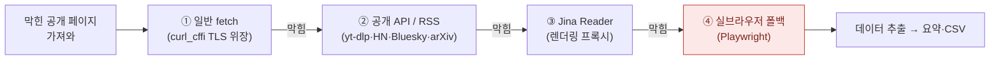
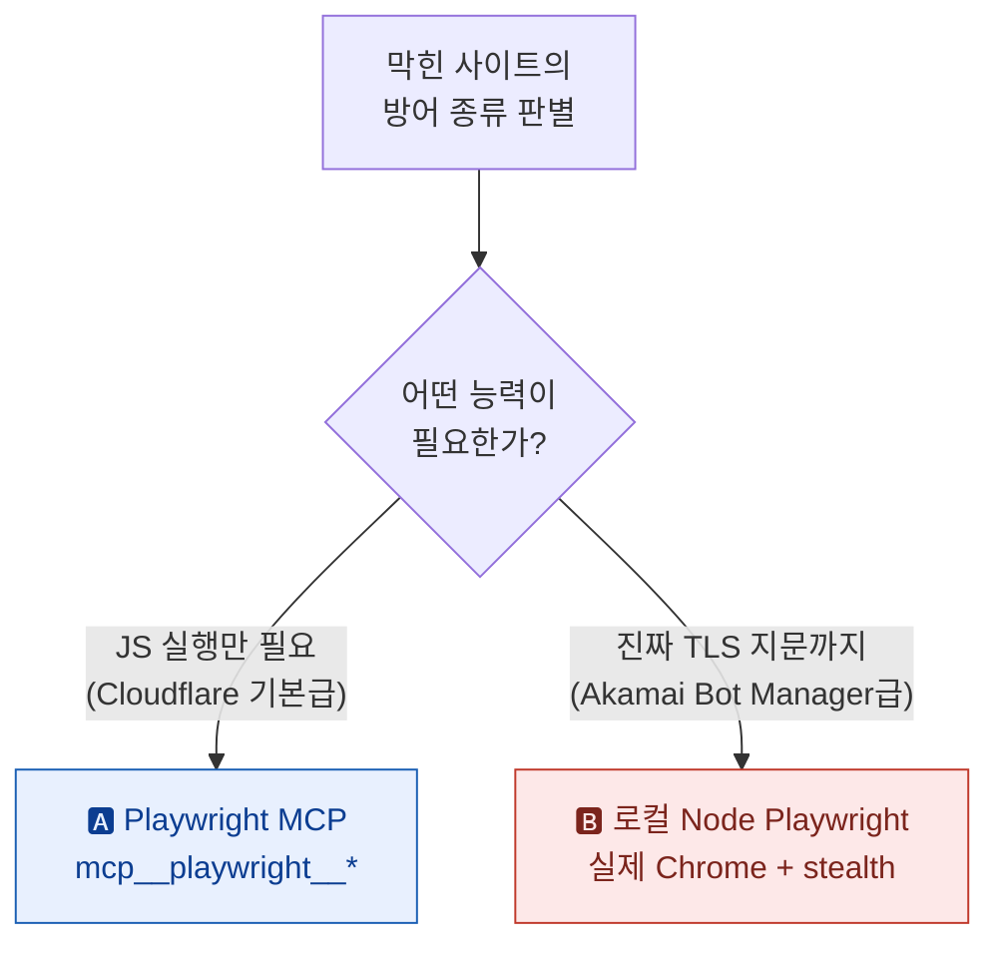
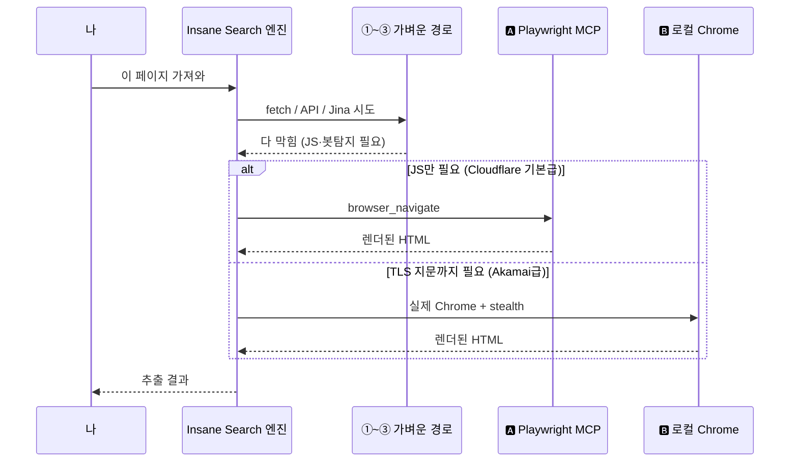
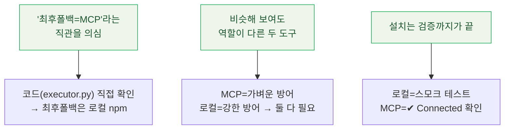

플러그인 하나(`Insane Search`)를 깔다가 마지막 단계에서 멈칫했다. 이 플러그인은 막힌 페이지를 여러 경로로 단계적으로 뚫는데, **맨 끝 단계가 "실제 브라우저(Playwright)를 띄우는" 것**이다. 그런데 이걸 깔려고 보니 헷갈렸다. **"Playwright도 MCP로 깔아야 하나?"**

결론부터: **아니었다.** Insane Search의 Playwright는 **두 개의 서로 다른 티어**이고, 하나는 `npm`(로컬), 다른 하나는 `MCP`다. 흔히 "실브라우저 최후폴백 = MCP"라고 오해하는데, 실제로 **최후폴백은 로컬 npm 쪽**이고 MCP는 더 약한 방어를 상대하는 별도 티어였다. 플러그인 엔진 코드를 직접 열어 확인하고, 결국 **둘 다** 붙였다. 그 과정을 정리한다.

## 전체 그림 — Insane Search는 "사다리"다

먼저 Insane Search가 뭘 하는지부터. 단순 크롤링은 봇탐지·WAF(웹 방화벽)에 바로 막힌다. 그래서 이 플러그인은 **가벼운 방법부터 차례로 올라가는 사다리(escalation)** 로 동작한다. 맨 아래는 그냥 HTTP 요청, 맨 위가 실제 브라우저다.



대부분(Reddit·X·유튜브·네이버 등)은 ①~③에서 끝난다. **④ 실브라우저까지 가는 건 진짜 최후의 수단**이다. 그리고 바로 이 ④가 두 갈래로 갈린다.

> **WAF / 봇탐지** 란? 사람이 아니라 자동 프로그램(봇)이 접근하는지 감시·차단하는 보안 장치다. Cloudflare·Akamai 같은 서비스가 대표적인데, **방어 강도가 제품마다 다르다.** 이 "강도 차이"가 아래에서 티어가 갈리는 이유다.

## 왜 Playwright가 '두 갈래'인가?

플러그인 엔진(`engine/executor.py`)을 열어 보니, 사이트가 요구하는 능력(`capabilities_needed`)을 읽고 **실행기를 자동으로 골라준다.** 핵심은 "JS만 실행하면 되는가" vs "진짜 같은 TLS 지문까지 필요한가"였다.



둘의 차이를 표로 정리하면 이렇다.

| 구분 | 🅰️ Playwright MCP | 🅱️ 로컬 Node Playwright |
|---|---|---|
| 정체 | Claude가 직접 호출하는 **MCP 도구**(`mcp__playwright__*`) | 플러그인이 띄우는 **npm 패키지 + 실제 Chrome** |
| 설치 | MCP 서버 등록 | `npm i -g` + `npx playwright install chrome` |
| 상대하는 방어 | Cloudflare **기본** 방어급 (JS 실행만 우회) | **Akamai Bot Manager급** (TLS 지문까지 위장) |
| 위치 | "최후폴백"이 **아님** — 더 가벼운 티어 | 엔진의 **일반 최후폴백**(`executor.py`의 `safest general fallback`) |
| MCP인가? | ✅ 맞음 | ❌ **아님** (그냥 로컬 npm) |

> 여기가 내가 헷갈렸던 지점이다. "실브라우저 최후폴백"이라는 말 때문에 **MCP로 깔아야 하는 줄 알았는데**, 코드상 최후폴백은 🅱️ 로컬 npm 쪽이었다. 🅰️ MCP는 Cloudflare 기본급처럼 **JS만 돌리면 되는** 더 가벼운 경우에 쓰는 별도 티어. 그래서 **둘은 대체재가 아니라 역할이 다른 두 도구**다. 완전 커버하려면 둘 다 있는 게 맞다.

## 1단계 — 로컬 Node Playwright (npm, 진짜 최후폴백)

먼저 Node가 깔려 있어야 한다. 내 환경은 Node v24, npm 11이었다.

```bash
node --version   # v24.x
npm --version    # 11.x
```

그다음 패키지 세 개를 전역 설치한다. `playwright` 본체에 더해, 봇탐지를 덜 받게 해주는 `playwright-extra` + `stealth` 플러그인까지 같이 깐다.

```bash
npm i -g playwright playwright-extra puppeteer-extra-plugin-stealth
```

> **stealth(스텔스) 플러그인** 이란? 자동화된 브라우저는 `navigator.webdriver` 같은 흔적을 남겨서 봇탐지에 걸린다. stealth는 그런 흔적을 지워 **"사람이 켠 브라우저"처럼 보이게** 위장해주는 보조 도구다. Akamai급 방어를 상대하려면 이게 필요하다.

마지막으로 **실제 Chrome 바이너리**를 받는다. (번들된 Chromium이 아니라 진짜 Chrome 채널을 쓰는 게 핵심 — TLS 지문이 진짜라야 Akamai급을 통과한다.)

```bash
npx playwright install chrome
```

설치가 끝나면 **진짜 뜨는지** 한 번 찔러봐야 안심이 된다. 나는 이 짧은 스모크 테스트로 확인했다.

```bash
node -e "const {chromium}=require('playwright'); (async()=>{
  const b=await chromium.launch({channel:'chrome',headless:true});
  const p=await b.newPage();
  await p.goto('https://example.com');
  console.log('TITLE:', await p.title());
  await b.close();
})()"
# → TITLE: Example Domain  이 뜨면 로컬 경로 OK
```

`channel:'chrome'`로 실제 Chrome을 띄워 `example.com` 제목까지 받아오면, 🅱️ 티어는 준비 끝이다.

## 2단계 — Playwright MCP (Cloudflare 기본급용)

이쪽은 npm 전역 설치가 아니라 **MCP 서버로 등록**한다. Claude Code에 한 줄이면 된다. (`-s user`로 전역 등록 — 모든 프로젝트에서 쓰이게.)

```bash
claude mcp add playwright -s user -- npx -y @playwright/mcp@latest
```

> **MCP(Model Context Protocol)** 란? AI 에이전트에 외부 도구를 꽂는 **표준 규격(USB 포트 같은 것)** 이다. 등록해 두면 Claude가 `browser_navigate` → `browser_snapshot` 같은 도구를 **직접** 호출해 페이지를 렌더하고 읽어온다. (MCP를 처음 붙이는 이야기는 [[claude-code-mcp-servers-github-pat-oauth-dcr-fix|MCP 서버 4개 붙인 기록]]에 따로 적어뒀다.)

붙였으면 연결됐는지 확인한다.

```bash
claude mcp list
# playwright: npx -y @playwright/mcp@latest - ✔ Connected   ← 이게 떠야 성공
```

> ⚠️ 함정 하나: **MCP 도구는 추가 직후 현재 세션엔 안 뜬다.** MCP는 세션 시작 시점에 로드되기 때문에, 등록 뒤엔 **새 세션(재시작)** 부터 `mcp__playwright__*` 도구가 보인다. 로컬 npm 경로는 지금 당장도 동작하지만, MCP 쪽은 한 번 재시작이 필요하다.

## 그래서 둘이 실제로 어떻게 협력하나?

세팅이 끝나면 내가 티어를 고를 일은 없다. 엔진이 사이트 방어를 보고 알아서 라우팅한다.



핵심은 **둘 다 있어야 이 분기가 완성된다**는 것. MCP만 있으면 Akamai급에서 막히고, 로컬만 있으면 가벼운 경우에 무겁게 도는 셈이다.

## 합법성은? — 도구는 진짜, '공개=합법'은 단정 금지

기술은 인상적이지만, 이걸 **업무로 반복**할 거면 짚을 게 있다. "공개 페이지니까 무조건 합법"은 만든 사람·소개 측 프레이밍이지 법적으로 끝난 얘기가 아니다. 국내에선 약관상 자동수집 금지(민사), 정보통신망법(보호조치 우회), 저작권법상 DB제작자 권리 같은 쟁점이 얽힌다. 이 부분은 따로 [[insane-search-gptaku-plugin|Insane Search 팩트체크 노트]]에 정리해뒀다. 요지만 옮기면 — **개인적 공개 데이터 탐색엔 써볼 만하지만, 경쟁사 대상 대량·반복 수집이라면 약관·규모·목적을 먼저 점검하고 공식 API와 비교한 다음 결정하는 게 맞다.**

## 배운 것



- **이름에 속지 말 것.** "실브라우저 최후폴백"이라는 말이 MCP를 떠올리게 했지만, 코드를 열어 보니 최후폴백은 로컬 npm이었다. 헷갈리면 **문서보다 엔진 코드**가 정확하다.
- **둘은 대체재가 아니다.** MCP와 로컬 Playwright는 상대하는 방어 강도가 달라서, 완전 커버는 둘 다 깔아야 나온다. "하나면 되겠지"가 함정.
- **설치 = 검증까지.** 로컬은 실제 Chrome으로 `example.com`을 띄워봤고, MCP는 `✔ Connected`를 눈으로 확인했다. 둘 다 통과해야 "깔았다"고 말할 수 있다.

플러그인 하나 깔면서도, 결국 **"이 도구가 내부적으로 무엇을 어떻게 쓰는지"** 를 코드로 들여다본 게 제일 남았다. 자동화는 편하지만, 편한 만큼 안에서 뭐가 도는지는 알고 써야 통제가 된다.

---

> 같이 보면 좋은 글: [[insane-search-gptaku-plugin|Insane Search 팩트체크 — '합법' 프레이밍 점검]] · [[claude-code-mcp-servers-github-pat-oauth-dcr-fix|Claude Code에 MCP 서버 4개 붙인 기록]] · [[build-tech-blog-with-quartz-github-pages|Quartz로 기술 블로그 만든 기록]] · 내 소개는 [[about]].

*위 설치·명령·검증은 전부 실제 작업 그대로이며, 민감한 값은 없습니다(이 세팅엔 API 키가 들어가지 않습니다). 플러그인/도구의 동작·티어 라우팅은 버전에 따라 바뀔 수 있어요. 합법성 관련은 법률 자문이 아니라 쟁점 정리입니다.*
