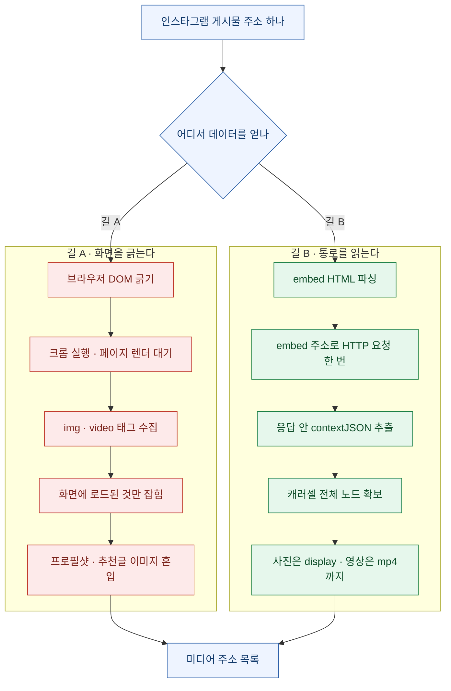
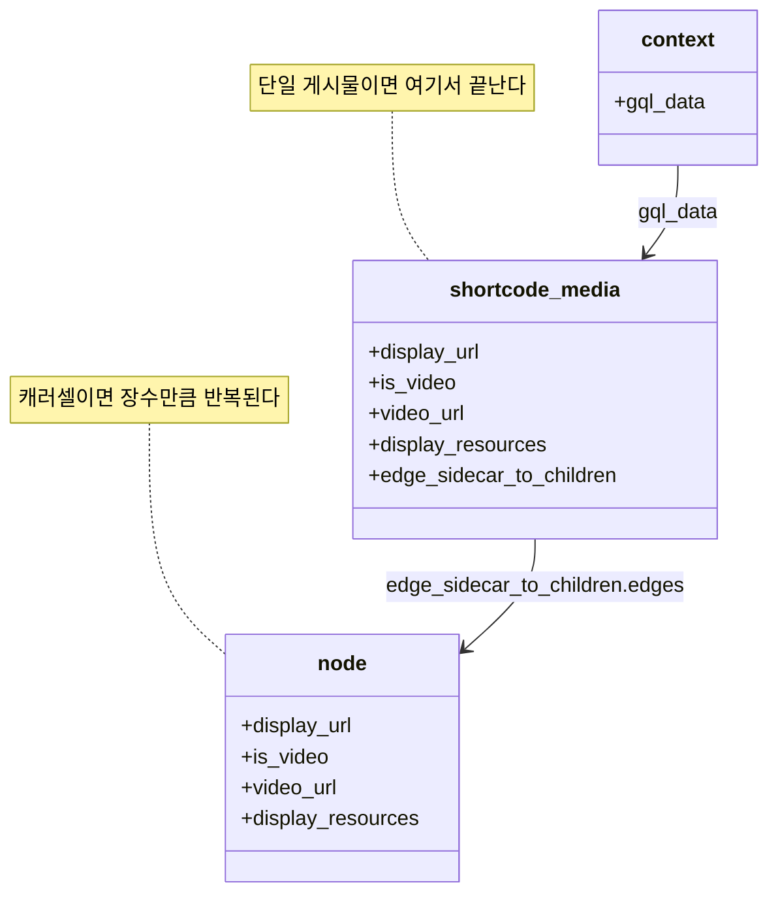
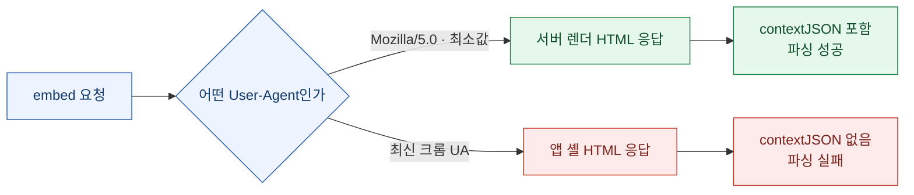
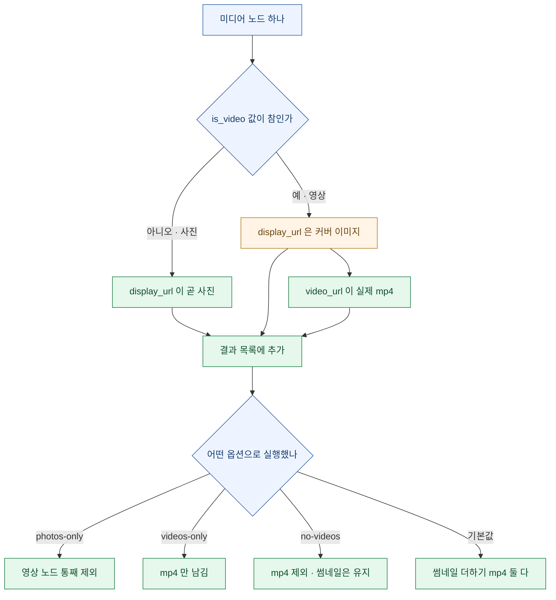
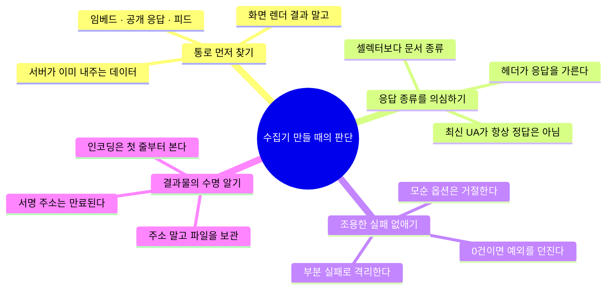

> "화면에 보이는 것을 긁을 것인가, 서버가 이미 내주고 있는 것을 받을 것인가."

수집 도구를 만들 때 나는 이 질문을 제일 먼저 던진다. 대부분의 사람이 첫 번째 길로 간다. 브라우저를 띄우고, 개발자도구를 열고, `document.querySelectorAll('img')`를 돌린다. 눈에 보이니까 확실해 보인다. 그런데 이 길은 거의 항상 **느리고, 빠뜨리고, 쓰레기가 섞인다.**

이번에 인스타그램 게시물에서 이미지와 영상 주소를 뽑는 작은 도구를 정리하면서, 그 두 갈래가 왜 그렇게까지 다른 결과를 내는지 다시 확인했다. 그리고 이 방식에서 가장 반직관적인 함정을 하나 만났다. **User-Agent를 최신 크롬으로 바꾸면 오히려 실패한다.** 보통은 정반대일 거라고 생각하지 않나. 그 얘기를 하려고 이 글을 쓴다.

> ⚠️ **범위 고지**: 공개 게시물의 임베드(embed) 응답을 읽는 방법을 다룬다. 비공개 계정·로그인 필요·연령 제한 게시물은 애초에 응답이 오지 않고, 그건 우회 대상이 아니라 **경계선**이다. 그리고 받아온 미디어의 저작권은 별개 문제다. 내가 권리를 가진 콘텐츠(내 계정 백업, 사용 허락을 받은 소재)에만 쓰는 걸 전제로 한다.

## 전체 그림 — 두 갈래 길은 어디서 갈라지나?



핵심 차이는 **"렌더링에 의존하느냐"**다. 길 A는 브라우저가 그려준 결과물을 읽으므로, 브라우저가 아직 안 그린 건 존재하지 않는 것과 같다. 길 B는 서버가 응답 본문에 통째로 박아 보내는 JSON을 읽으므로 렌더링과 무관하다.

## 왜 DOM 긁기는 캐러셀에서 반드시 새는가?

인스타그램의 여러 장짜리 게시물(캐러셀)은 슬라이드를 넘기기 전까지 뒷장을 DOM에 올리지 않는다. 지연 로딩(lazy loading)이라고 부르는, 요즘 웹에서 지극히 정상적인 최적화다. 문제는 수집기 입장에서 이게 **조용한 누락**이라는 것이다. 에러가 나지 않는다. 그냥 12장짜리 게시물에서 3장만 나오고 스크립트는 성공으로 끝난다.

DOM 방식이 새는 지점을 정리하면 이렇다.

| 누락·오염 지점 | 무슨 일이 벌어지나 | 겉으로 드러나나 |
|---|---|---|
| 미조회 캐러셀 항목 | 넘겨보지 않은 슬라이드는 DOM에 없음 | ❌ 조용히 빠짐 |
| 영상 항목 | `img`만 긁으면 커버 이미지만 잡힘 | ❌ 그림 파일이 나와서 성공처럼 보임 |
| 프로필 사진·추천 게시물 | 같은 CDN 도메인이라 필터를 통과 | ❌ 결과에 섞여 들어옴 |
| `srcset` 다중 해상도 | 같은 사진의 여러 크기가 중복 수집 | 🟡 중복 제거로 완화 가능 |
| 렌더 타이밍 | 대기 시간이 짧으면 0건, 길면 느림 | 🟡 실행할 때마다 결과가 달라짐 |

마지막 줄이 제일 고약하다. **실행할 때마다 결과 개수가 달라지는 수집기**는 신뢰할 수 없다. 어제 8개, 오늘 5개가 나오면 게시물이 바뀐 건지 내 스크립트가 진 건지 알 수가 없다.

## embed 응답 안에는 정확히 뭐가 들어 있나?

임베드 주소는 게시물 주소에 `embed/captioned/`를 붙인 형태다. 원래는 블로그나 뉴스 기사에 게시물을 끼워 넣으라고 인스타그램이 공개해 둔 통로다. 그런데 이 응답 HTML 안에는 화면을 그리는 데 필요한 데이터가 **`contextJSON`이라는 이름의 문자열로 통째로** 들어 있다.



읽는 순서는 이렇다.

① 게시물 주소에서 shortcode(주소 끝의 짧은 식별자)를 뽑는다
② `embed/captioned/` 주소로 HTTP 요청을 한 번 보낸다
③ 응답 HTML에서 `contextJSON` 문자열을 정규식으로 찾는다
④ 두 번 디코딩해서 딕셔너리로 만든다
⑤ 캐러셀이면 자식 노드 배열을, 단일이면 자신을 한 개짜리 목록으로 통일한다
⑥ 노드마다 사진 주소와 영상 주소를 각각 꺼낸다

이 여섯 단계에 브라우저는 한 번도 등장하지 않는다. 요청 한 번이면 끝이다.

## 왜 JSON을 두 번 디코딩해야 하나?

`contextJSON`은 이름 그대로 JSON인데, HTML 안에 들어가야 하니 **JSON 문자열이 다시 JSON 문자열 안에 감싸여 있다.** 그래서 이렇게 두 번 푼다.

```python
def load_context_json(html):
    match = re.search(r'"contextJSON":"((?:\\.|[^"\\])*)"', html)
    if not match:
        raise ValueError("Could not find Instagram contextJSON in embed HTML")
    context_json = json.loads(f'"{match.group(1)}"')   # 1차: 이스케이프 해제
    return json.loads(context_json)                     # 2차: 실제 객체로
```

1차 `json.loads`는 백슬래시 이스케이프(`\"`, `\\/`, `\\u0026` 같은 것)를 푸는 용도다. 정규식으로 뽑아온 조각을 큰따옴표로 감싸서 "이건 JSON 문자열이야"라고 알려준 뒤 파싱하면, 파이썬이 이스케이프 규칙을 알아서 처리해 준다. 직접 `replace`로 백슬래시를 걷어내려 들면 반드시 어딘가에서 틀린다. **이스케이프 해제는 손으로 하는 게 아니라 파서에게 시키는 일이다.**

2차 `json.loads`가 진짜 데이터 구조를 만든다.

정규식 `((?:\\.|[^"\\])*)`도 한 번 볼 만하다. "이스케이프된 두 글자이거나, 큰따옴표도 백슬래시도 아닌 한 글자"의 반복이다. 단순히 `"(.*?)"`로 잡으면 값 안에 있는 `\"`에서 끊겨 버린다. 문자열 리터럴을 정규식으로 뜰 때 늘 나오는 고전적인 함정이다.

## 최신 크롬 User-Agent를 쓰면 왜 실패하나?

이게 이 도구에서 제일 반직관적인 부분이다. 요청 헤더는 이렇게 되어 있다.

```python
USER_AGENT = "Mozilla/5.0"
```

버전도 OS도 없는, 거의 텅 빈 값이다. 보통 차단을 피하려고 UA를 손댈 때는 **더 진짜 같고 더 최신인** 값을 넣는다. 그런데 여기서는 반대다. 최신 크롬 UA를 넣으면 `contextJSON`이 없는 **앱 셸(app shell) HTML**이 내려온다. 껍데기만 오고 데이터는 나중에 자바스크립트가 따로 받아오는 형태다.



이유는 차단이 아니라 **분기(branching)** 다. 서버가 클라이언트 능력을 보고 응답 형태를 고른다. 구형·저사양 클라이언트로 보이면 "네가 직접 그리기 어려울 테니 내가 다 그려서 줄게" 하고 서버 렌더 HTML을 내주고, 최신 브라우저로 보이면 "너는 자바스크립트를 잘 돌리니 껍데기만 줄게" 하고 앱 셸을 내준다. 성능 최적화로는 완전히 합리적인 설계다.

여기서 얻는 교훈이 하나 있다.

> **UA를 최신으로 올리는 건 "차단 회피"에는 맞을 수 있어도, "서버 렌더 응답 확보"에는 정반대다.**

같은 엔드포인트가 요청 헤더에 따라 **다른 종류의 문서**를 내주는 경우가 생각보다 많다. 그래서 파싱이 어느 날 갑자기 깨졌을 때, 나는 이제 셀렉터부터 고치지 않는다. **응답 본문이 예전과 같은 종류인지부터 확인한다.** 셀렉터가 안 맞는 게 아니라 아예 다른 문서를 받고 있는 경우가 많기 때문이다.

## 사진과 영상은 왜 필드를 따로 봐야 하나?

여기서 조용히 틀리기 딱 좋은 지점이 나온다. **영상 노드에도 `display_url`이 있다.** 그런데 그건 영상이 아니라 커버 이미지다.



코드로는 이렇게 갈린다.

```python
def video_url(node):
    if node.get("is_video") and node.get("video_url"):
        return node["video_url"]
    return None
```

`is_video`와 `video_url`을 **둘 다** 확인하는 게 포인트다. 플래그는 참인데 주소가 비어 있는 경우(권한·상태 문제)가 있고, 그때 `node["video_url"]`로 바로 접근하면 `KeyError`로 스크립트가 통째로 죽는다. `.get()`으로 두 번 확인하면 그 노드만 건너뛰고 나머지는 살아남는다.

**부분 실패가 전체 실패가 되지 않게 하는 것** — 수집기에서 이건 취향이 아니라 요구사항이다.

## 단일 게시물과 캐러셀을 어떻게 같은 코드로 다루나?

인스타그램 응답은 단일 게시물과 캐러셀의 모양이 다르다. 단일이면 `shortcode_media` 자체가 미디어이고, 캐러셀이면 그 아래 `edge_sidecar_to_children.edges` 배열에 장수만큼 들어 있다.

이걸 호출부에서 `if`로 가르면, 이후 모든 함수가 두 갈래를 알아야 한다. 그래서 진입점에서 한 번에 **모양을 통일한다.**

```python
def media_nodes(context):
    media = context["gql_data"]["shortcode_media"]
    edges = media.get("edge_sidecar_to_children", {}).get("edges") or []
    if edges:
        return [edge["node"] for edge in edges]
    return [media]
```

단일 게시물이어도 **원소 하나짜리 리스트**로 감싸서 돌려준다. 이 한 줄 덕분에 뒤쪽 코드 전체가 "노드 목록을 순회한다"는 한 가지 경우만 알면 된다.

`.get("edge_sidecar_to_children", {}).get("edges") or []` 부분도 잔재주가 아니라 방어다. 키가 아예 없을 수도, 있는데 값이 `null`일 수도, 있는데 빈 배열일 수도 있다. 세 경우를 전부 "빈 목록"으로 수렴시킨다.

## 옵션 조합은 왜 미리 막아야 하나?

이 도구는 사진만·영상만·둘 다 같은 조합을 플래그로 받는다. 그런데 사람이 손으로 치는 명령줄에서는 **서로 모순되는 조합**이 반드시 들어온다.

| 막아야 하는 조합 | 왜 모순인가 |
|---|---|
| `--photos-only` + `--videos-only` | 사진만 원하면서 영상만 원한다 |
| `--photos-only` + `--include-videos` | 영상을 빼면서 영상을 넣는다 |
| `--photos-only` + `--no-videos` | 이미 영상이 없는데 또 뺀다 |
| `--include-videos` + `--videos-only` | 더하기와 오직이 충돌 |
| `--include-videos` + `--no-videos` | 정면 충돌 |

```python
if args.photos_only and (args.include_videos or args.no_videos or args.videos_only):
    parser.error("--photos-only cannot be combined with ...")
```

이걸 안 막으면 어떻게 되나. 프로그램이 죽지 않는다. **조용히 둘 중 하나를 이기게 하고 그냥 실행된다.** 그리고 사용자는 자기가 요청한 것과 다른 결과를 받아 놓고 그게 정답인 줄 안다. `parser.error()`로 즉시 종료시키는 게 훨씬 친절하다.

명령줄 도구를 만들 때 나는 이걸 규칙으로 삼는다. **모호한 입력은 마음대로 해석하지 말고 거절한다.**

## 저장할 때 왜 BOM이 문제가 되나?

파워셸에서 결과를 파일로 넘길 때 함정이 하나 더 있다.

```powershell
py .\extract_instagram_img_srcs.py "<게시물 주소>" > .\urls.txt
```

이 `>` 리다이렉션은 환경에 따라 파일 맨 앞에 **BOM(Byte Order Mark)** 을 붙인다. 눈에는 안 보이는 3바이트짜리 표식인데, 이걸 다시 읽어서 브라우저에 넘기면 **첫 번째 주소만** 이상하게 열린다. 나머지는 멀쩡하다. 그래서 원인 찾기가 유난히 오래 걸린다.

| 증상 | 원인 | 처치 |
|---|---|---|
| 첫 URL만 검색어처럼 열림 | 파일 선두 BOM이 주소 앞에 붙음 | BOM 없이 저장 |
| 나머지 URL은 정상 | BOM은 파일당 한 번뿐 | 위와 동일 |

BOM 없이 저장하려면 인코딩을 명시한다.

```powershell
[System.IO.File]::WriteAllLines($path, $urls, (New-Object System.Text.UTF8Encoding($false)))
```

`UTF8Encoding($false)`의 `$false`가 "BOM 쓰지 마"라는 뜻이다. 파이썬 쪽에서 직접 파일을 쓸 때도 `encoding="utf-8"`(BOM 없음)과 `encoding="utf-8-sig"`(BOM 있음)는 다르다는 걸 기억해 두면 좋다.

**"첫 줄만 이상하다"는 증상을 보면 나는 이제 인코딩부터 의심한다.** 로직이 첫 원소만 틀릴 이유는 거의 없기 때문이다.

## 받아온 주소는 왜 오래 못 쓰나?

추출한 CDN 주소를 보면 꼬리에 `oh=`, `oe=`, `_nc_gid=` 같은 값이 붙어 있다. 이건 장식이 아니라 **서명과 만료 시각**이다. 정해진 시간이 지나면 같은 주소가 403을 뱉는다.

그래서 이 도구의 결과물을 다루는 원칙은 하나다.

> **주소를 보관하지 말고, 파일을 보관하라.**

주소 목록을 텍스트로 아카이브해 두면 며칠 뒤엔 전부 죽은 링크가 된다. 뽑았으면 그 자리에서 내려받아야 한다. 이건 인스타그램만의 얘기가 아니고, 서명 URL을 쓰는 모든 CDN에 해당한다.

## 이 방식의 한계는 어디까지인가?

정직하게 적어 둔다. 이 도구가 못 하는 것들이다.

| 한계 | 상세 | 대응 |
|---|---|---|
| 릴스 주소 미지원 | 정규식이 `/p/<shortcode>/` 형태만 인식 | 패턴에 릴스 경로를 추가해야 함 |
| 비공개·제한 게시물 | 임베드 응답 자체가 안 옴 | 우회 대상이 아님 |
| 응답 구조 변경 | 인스타그램이 바꾸면 파싱이 깨짐 | 실패 시 예외를 명확히 던지게 해 둠 |
| 서명 만료 | 시간이 지나면 주소가 죽음 | 즉시 다운로드 |
| 레이트 리밋 | 짧은 시간에 많이 호출하면 막힘 | 간격을 두고 호출 |

특히 세 번째가 중요하다. 이런 도구는 **언젠가 반드시 깨진다**는 걸 전제로 만들어야 한다. 그래서 `load_context_json`이 실패하면 조용히 빈 목록을 돌려주는 게 아니라 `ValueError`를 던지게 해 뒀다. 조용히 0건을 반환하는 수집기는 "오늘은 게시물이 없었나 보다"라고 오해하게 만든다. 예전에 청년정책 수집기에서 정확히 이걸로 데인 적이 있다. **파싱 결과가 0건이면 사이트가 아니라 내 파서를 먼저 의심해야 한다**는 교훈이 그때 나왔다.

## 결국 뭐가 남았나?

코드보다 습관이 남았다.



세 줄로 줄이면 이렇다.

1. **화면을 긁기 전에, 서버가 이미 내주고 있는 통로가 있는지 먼저 본다.** 브라우저를 띄우는 순간 속도·안정성·정확도를 모두 잃는다.
2. **파싱이 깨졌을 때 셀렉터부터 고치지 않는다.** 응답이 예전과 같은 종류의 문서인지부터 확인한다. 헤더 한 줄이 문서 종류를 바꾼다.
3. **조용한 성공을 가장 경계한다.** 12장 중 3장만 가져오고도 성공으로 끝나는 코드가, 에러로 죽는 코드보다 훨씬 위험하다.

마지막이 제일 값진 것 같다. 수집 도구를 오래 굴려 보면 알게 된다. 무서운 건 빨간 글씨로 죽는 스크립트가 아니라, **초록 불을 켜고 절반만 가져오는 스크립트**다.
