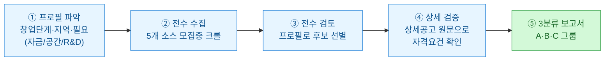
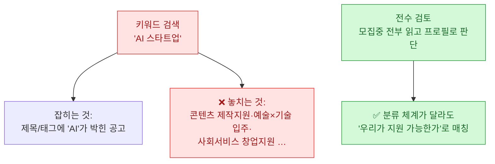
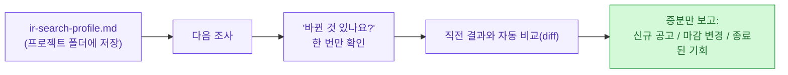
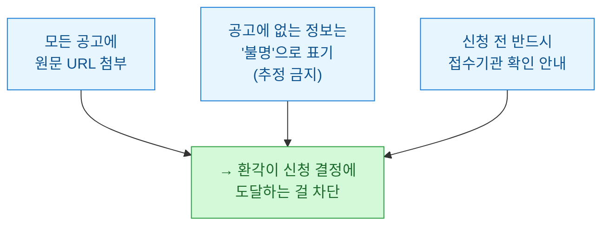

정부 지원사업 찾는 일, 해 본 사람은 안다. 사이트가 부처마다 따로 놀고, 검색창에 "AI 스타트업" 쳐 봐야 정작 우리가 지원할 수 있는 **콘텐츠 제작지원**이나 **예술×기술 입주** 공고는 안 뜬다. 키워드가 아니라 분류 체계가 다르기 때문이다. 그래서 결국 사람이 수백 건을 손으로 넘긴다.

[djfksjd/ir-search](https://github.com/djfksjd/ir-search)는 이 문제를 **전수조사**로 푸는 Claude Code 스킬이다(⚠️한국 전용). 오늘은 이 저장소를 뜯어보고, 자동화·마케팅을 하는 내 눈에 걸린 설계 판단을 정리한다.

## ir-search는 무엇을 하나?

한 줄로: **모집중 공고를 전부 긁어 → 내 프로젝트 프로필에 맞는 것만 골라 → 원문으로 자격을 검증해 → 3분류 보고서로 만든다.**



산출물은 `~/Documents/지원사업조사_<대상>_<날짜>/`에 **보고서 md + 원시 jsonl + 상세공고 원문**으로 저장된다. 핵심은 보고서의 3분류다.

| 그룹 | 의미 | 정렬/강조 |
|---|---|---|
| **A — 지금 즉시 지원 가능** | 현재 신분 그대로 자격 충족 | 마감순, 임박(D-N) 강조 |
| **B — 요건 충족 시(로드맵)** | 법인 설립·투자유치 등 트리거와 연쇄 경로 명시 | 조건부 |
| **C — 변형하면 가능** | 아이템을 다른 분야 언어로 재서술하는 프레이밍 각도 제안 | 리스크 병기 |

A는 "지금 신청해", B는 "이걸 하면 열려", C는 "이렇게 포장하면 대상"이다. 특히 **C그룹**이 이 스킬의 개성이다 — "AI 음성 기술"을 "오디오 콘텐츠 제작 파이프라인"으로 재서술하면 KOCCA 콘텐츠 지원 대상이 된다는 식의, **프레이밍 각도**를 제안한다(리스크: 결과물이 콘텐츠여야 함, 이라고 솔직히 붙인다).

## 왜 '키워드 검색'이 아니라 '전수 검토'인가?

이게 이 스킬의 철학이자 존재 이유다. README의 문장을 그대로 옮기면 — **"AI 스타트업"이 지원할 수 있는 콘텐츠 제작지원·예술×기술 입주·사회서비스 창업지원 같은 사업은 키워드로 잡히지 않기 때문**이다.



키워드는 **공고가 스스로를 부르는 이름**에 의존한다. 하지만 지원 자격은 그 이름과 무관할 때가 많다. 전수 검토는 이 간극을 메운다 — 모집중 공고를 전부 읽고, "이 공고가 뭐라고 불리든, 우리 프로필로 지원 가능한가"를 판단한다. 커버리지를 '검색어에 걸린 것'이 아니라 '지금 열려 있는 것 전부'로 정의하는 셈이다.

커버하는 소스는 다섯이다.

| 소스 | 내용 | 크롤러 |
|---|---|---|
| K-Startup | 창업지원 통합(기본) | `kstartup_crawl.py` |
| 기업마당(bizinfo) | 전 부처·지자체 중소기업 지원(최대 커버리지) | `sources_crawl.py` |
| NIPA | AI/ICT 사업 | `sources_crawl.py` |
| KOCCA | 콘텐츠 지원 | `sources_crawl.py` |
| SMTECH | 중기부 R&D | `sources_crawl.py` |

그 외 NIA·IITP·IRIS·지역기관 등은 `references/sources.md` 레지스트리로 관리한다.

## 매번 250건을 다시 읽지 않으려면? — 프로필 영속화 + 증분 diff

이 스킬이 단발 도구가 아니라 **반복 사용을 전제로** 설계됐다는 점이 마음에 들었다. 자동화를 짜 본 사람이면 안다 — 반복 실행에서 진짜 비용은 '매번 처음부터'다.



- **프로필 영속화**: 창업 단계·지역·필요 같은 정보를 프로젝트 폴더의 `ir-search-profile.md`에 저장한다. 다음 조사부터는 다시 묻지 않고 "바뀐 것 있나요?" 한 번만 확인한다.
- **증분 diff 재조사**: `diff_surveys.py`가 직전 결과와 자동 비교해 **신규 공고 / 마감 변경 / 종료된 기회만** 증분 보고한다. 250건+를 매번 다시 읽지 않는다.

이 두 장치가 "한 번 써 보는 도구"와 "계속 쓰는 도구"를 가른다. 지원사업은 계속 새로 뜨고 마감이 바뀌니, 재조사에서 diff만 보는 건 딱 맞는 설계다.

## '불명은 추정하지 않는다' — 이 스킬의 안전장치

내가 가장 높이 산 대목이다. README가 못박는다 — **모든 공고에 원문 URL이 붙고, 공고에 없는 정보는 추정하지 않고 '불명'으로 표기한다.**

지원사업 정보에서 환각은 치명적이다. 마감일이나 자격요건을 그럴듯하게 지어내면, 사람이 그걸 믿고 준비하다 낭패를 본다. 그래서 이 스킬은 두 가지로 방어한다.



어제 정리한 [[llm-agent-fleet-bug-audit-adversarial-verification|에이전트 함대]]의 "빈 배열이 정답 / 근거(evidence) 강제"와 결이 같다. **LLM이 뭐라도 채우려는 성향을 명시적으로 눌러, '모른다'를 정답으로 허용하는 것.** 게다가 산출물이 조사 시점 텍스트 기준이라 마감·자격·금액은 수시로 바뀐다는 점, 공개 공고 페이지만 접근하며 요청 간 지연을 둔다는 점까지 명시해 뒀다. 크롤러를 붙이는 도구가 갖춰야 할 **예의**(레이트 제한·ToS 존중)를 문서에 박아 둔 게 신뢰를 준다.

## 어떻게 쓰나

설치는 스킬 디렉터리에 clone하고, 차단 회피용 `curl_cffi`를 권장 설치한다.

```bash
git clone https://github.com/djfksjd/ir-search.git ~/.claude/skills/ir-search
pip install 'curl_cffi>=0.15'   # TLS 지문 차단 회피(권장)
```

Claude Code에서 프로젝트 폴더를 연 채로 "우리 아이템에 맞는 지원사업 전수조사 해줘" 또는 `/ir-search`. 폴더에서 프로젝트 정보를 읽고, 비는 항목만 물어본 뒤 조사를 시작한다. 크롤러는 단독으로도 쓸 수 있다.

```bash
python3 scripts/kstartup_crawl.py list -o all.jsonl          # K-Startup 모집중 전수
python3 scripts/sources_crawl.py list all -o sources.jsonl   # 4개 소스 일괄
python3 scripts/sources_crawl.py detail <URL> -o details/    # 소스 무관 상세공고
```

구성은 단출하다 — `SKILL.md`(워크플로: 프로필→전수수집→전수검토→상세검증→3분류 보고), `scripts/`(크롤러 2종 + `diff_surveys.py`), `references/sources.md`(소스 레지스트리). Python 100%, MIT 라이선스, 별 163·포크 34(작성 시점).

## 내가 눈여겨본 것 — '전수 + 검증 + 불명 표기'의 조합

나는 마케팅·자동화를 하며 "정보를 넓게 긁어 좁게 판단하는" 파이프라인을 자주 짠다. ir-search는 그 패턴의 **정부 지원사업 버전**인데, 세 가지 설계가 특히 배울 만했다.

- **전수 → 프로필 매칭**: 검색어의 편향을 버리고 '지금 열린 것 전부'에서 출발한다. 커버리지를 검색어가 아니라 대상 전체로 잡는 발상은 그대로 다른 도메인(경쟁사 모니터링·키워드 발굴)에 옮길 수 있다.
- **원문 검증 + 불명 표기**: LLM 산출물에 반드시 1차 출처(URL)를 달고, 없는 건 지어내지 않는다. 내가 [[reading-stream-and-factcheck-workflow|팩트체크 워크플로]]에서 지키는 원칙과 정확히 같다.
- **영속 프로필 + 증분 diff**: 반복 실행에서 '변한 것만' 본다. 재조사 비용을 극적으로 줄이는 이 구조는 사실상 모든 주기적 크롤링 자동화의 정석이다.

지원사업을 찾는 사람에게 바로 쓸모 있는 도구이면서, 자동화를 짜는 사람에게는 **'전수 수집 → 프로필 선별 → 원문 검증 → 증분 보고'**라는 재사용 가능한 뼈대를 보여준다. 도구 하나에서 이 두 층을 다 챙길 수 있는 게 잘 만든 스킬의 특징이다.

> ⚠️ 실무 주의는 README가 이미 못박은 그대로다 — 공고의 마감·자격·금액은 수시로 바뀌니 **신청 전 반드시 접수기관에 확인**하고, 산출물은 조사 시점 텍스트 기준임을 잊지 말자. 그리고 크롤러를 쓸 땐 대상 사이트 이용약관을 존중할 것.

---

*소스: [djfksjd/ir-search](https://github.com/djfksjd/ir-search) (GitHub, MIT). 기능·구성·인용은 저장소 README에 귀속하며, 해석과 실무 적용은 내 관점이다. 한국 정부·공공기관 지원사업 전용 스킬이다.*
