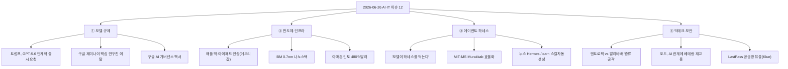
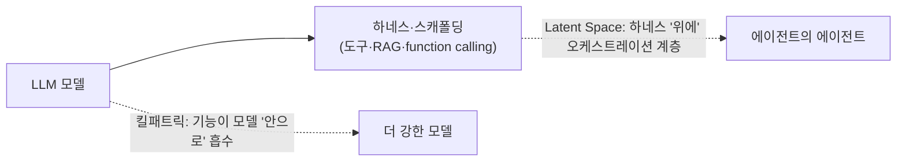

매일 아침 피드를 긁는 스크립트(`digest.js`, 의존성 0짜리 Node 수집기)로 오늘치를 모았더니, 6/26 하루도 꽤 굵직했다. **정부가 한 회사의 모델 출시를 사실상 세웠고, 애플이 메모리값을 못 버티고 가격표를 갈아끼웠고, IBM은 "1나노 벽"을 넘었다고 했다.**

그런데 늘 그렇듯, 화제가 큰 헤드라인일수록 **한 단계만 거슬러 올라가면 숫자나 뉘앙스가 어긋난다.** 그래서 오늘도 핵심 12개를 골라 **각 항목을 1차 출처(공식 발표·원보도·논문)로 적대적 팩트체크**하고, 흔한 서술이 틀린 건 ⚠️로 떼어냈다. (이 시점 스냅샷이고, 이후 사실관계는 바뀔 수 있다. 투자 권유 아님.)

## 오늘 뭐가 터졌나 — 전체 맵

> 카테고리 4개로 나눠 짚는다. 각 항목 끝에 **출처**를 달고, 흔한 서술이 틀린 건 그 자리에서 ⚠️로 정정했다.

## ① 모델·규제 — 정부가 모델 출시에 손을 댔나?

오늘 가장 무거운 건 **미국 정부가 프런티어 모델 출시에 직접 개입한 정황**이다.

- **트럼프 행정부, OpenAI에 GPT-5.6 "단계적 출시" 요청.** 백악관 국가사이버국장실(ONCD)·과학기술정책실(OSTP)이 안보를 이유로 GPT-5.6을 **정부 승인 고객부터 우선 제공**하도록 요청했다. 샘 알트먼은 사내 메모/Q&A에서 "프리뷰 동안 정부가 **고객별로 접근을 승인**할 것이고, 검토가 순조로우면 약 2주 뒤 광범위 공개를 기대한다"고 설명했다. 원보도는 The Information, [Engadget](https://www.engadget.com/2202129/openai-will-initially-only-release-chatgpt-5-6-to-government-approved-customers/)·[AI타임스](https://www.aitimes.com/news/articleView.html?idxno=212122) 등이 교차 보도.
  - ⚠️ **"사실상 허가제(licensing)"는 정부가 도입한 공식 제도가 아니다.** 영어 원보도는 일관되게 정부가 "요청(asked)"했다고 쓰고, 근거가 된 행정명령도 **"자발적(voluntary) 테스트 프로토콜"**로 표현된다. 알트먼 본인도 "이게 우리가 장기적으로 선호하는 방식은 아니다"라며 거리를 뒀다. '허가제'는 사안의 성격을 둘러싼 **비판 측 프레이밍**으로 읽는 게 정확하다.

- **구글, 6일 새 제미나이 핵심 연구진 연쇄 이탈.** 요나스 아들러·알렉산더 프리첼(제미나이)이 **앤트로픽**으로, 앞서 존 점퍼(알파폴드·노벨화학상)도 앤트로픽, 노암 셰이저('Attention Is All You Need' 공저)는 **오픈AI**로 옮겼다. 동인으로는 상장 임박한 두 랩의 **비상장(pre-IPO) 지분 기대**가 꼽힌다. 원보도: [Bloomberg](https://www.bloomberg.com/news/articles/2026-06-24/google-poised-to-lose-two-more-high-profile-ai-staffers-to-anthropic).
  - ⚠️ 두 가지 정정. ① 한국어 기사가 단 "WSJ·비즈니스 인사이더 원보도"는 부정확하고, **아들러·프리첼 건 단독 원보도는 Bloomberg**다. ② **"하루 5% 급락"은 앞선 점퍼·셰이저 발표분**이고, 이번 아들러·프리첼 당일 변동은 약 1% 안팎이다. 'IPO 지분 대박'은 기자·분석가 해석이지 당사자 확인 발언이 아니다.

- **구글, AI 거버넌스 백서 "과잉 규제도 무규제도 안 된다".** [공식 백서](https://blog.google/company-news/outreach-and-initiatives/public-policy/white-paper-ai-regulation/) "A Pragmatic Approach to AI Governance in America"에서 **프런티어 AI(연방 감독·자발적 감사)**와 **대중화 앱(기존 법률 보완)**을 나누는 이중 거버넌스를 제안했다. 백서·핵심 골자 모두 1차 출처로 확인됨.
  - ⚠️ 기사에 함께 인용되는 '35GW 신규 발전·2,800만 가구' 수치는 구글 **자체 발표 부수 통계**로, 거버넌스 제안 핵심과는 별개다.

## ② 반도체·인프라 — 메모리값이 가격표를 흔들었나?

AI 데이터센터발 메모리 수요가 **소비자 제품 가격까지** 밀어 올렸다.

- **애플, 맥·아이패드 가격 인상 — 아이폰·워치·에어팟은 동결.** 맥 약 15~20%, 아이패드 약 15~25%(기본 아이패드는 ~29%) 올랐다. 팀 쿡은 "이렇게 빠르고 큰 부품가 인상은 본 적 없다"고 했고, **발표 당일 애플 주가는 6% 넘게 급락**(2025년 4월 이후 최악). 출처: [CNBC](https://www.cnbc.com/2026/06/25/apple-macbook-ipad-price-hike-memory.html)·[9to5Mac](https://9to5mac.com/2026/06/25/apple-price-increases-mac-ipad-more/).
  - ⚠️ 원보도는 **Reuters·CNBC 등 동시 보도**이지 'WSJ 단독'이 아니다. 또 기본 아이패드는 ~29%라 "15~25%" 상단을 살짝 넘는다.

- **IBM, "세계 최초 1nm 미만" 0.7nm 나노스택 공개.** 손톱 크기에 약 1,000억 트랜지스터, 2nm 대비 성능 최대 50%·효율 70% 개선을 주장했다. 출처: [IBM Newsroom](https://newsroom.ibm.com/2026-06-25-ibm-debuts-worlds-first-sub-1-nanometer-chip-technology).
  - ⚠️ "세계 최초"는 미디어 과장이 아니라 **IBM이 보도자료에 직접 쓴 자체 표현**이다(그래서 독립 검증치 아님). 더 중요한 건 **이게 양산 칩이 아니라 VLSI 2026에서 발표된 '실험적 검증' 연구 단계**라는 점 — 상용화는 빨라야 5년 후 목표이고, 모든 수치는 IBM 자체 측정이다.

- **아마존, 인도에 130억 달러 추가 투자.** 앤디 재시 CEO가 뉴델리에서 발표, **2026~2030년 인도 누적 480억 달러**(약 74조원)로 늘었다. [아마존 공식 발표](https://www.aboutamazon.com/news/company-news/amazon-india-investment)와 수치 일치 — 이번 12개 중 가장 깔끔하게 컨펌된 항목이다.

## ③ 에이전트·하네스 — "모델이 하네스를 먹는다"는 게 무슨 뜻인가?

내가 제일 관심 있게 보는 줄기다. 오늘 하네스(harness, 모델을 감싸 도구·복구·오케스트레이션을 붙이는 골격) 담론이 한꺼번에 터졌다.

- **"모델이 하네스를 먹어 치울 것" (구글 로건 킬패트릭).** AI 스튜디오 책임자가 [Sequoia 'Training Data' 팟캐스트](https://sequoiacap.com/podcast/google-deepminds-logan-kilpatrick-why-the-model-eats-the-harness/)에서 "지금 스타트업들이 다투어 만드는 **스캐폴딩의 수명은 약 12개월**이고, 모델이 그 기능을 흡수하면 경쟁우위는 다른 데로 이동한다"고 주장했다. 프롬프트 엔지니어링·RAG·function calling이 외부 프레임워크였다가 모델 기본기능으로 흡수된 선례가 근거. 같은 주에 한국 연구진의 [arXiv 2606.25447](https://arxiv.org/abs/2606.25447)("Harness Design과 Post-Training의 상호작용")도 나왔다.
  - ⚠️ AI타임스가 묶은 세 출처는 **서로 인용한 단일 사건이 아니다.** 특히 Latent Space "[Meta-Harness Summer](https://www.latent.space/p/ainews-its-meta-harness-summer)"는 오히려 **반대 방향** — 기능을 모델 '안으로' 넣는 게 아니라 하네스 '위에' 오케스트레이션 계층(에이전트의 에이전트)을 쌓는 흐름을 다룬다. "같은 트렌드"는 맞지만 인과 사슬로 묶으면 과대해석이다.

- **MIT·MS, 에이전트 워크플로 효율화 'Murakkab' — "에너지 73% 절감".** 에이전트 워크플로의 설계→배포→실행을 자동 최적화해 **GPU 최대 2.8배·에너지 3.7배·비용 4.3배**(≈65/73/75% 절감)를 주장. 출처: [MIT News](https://news.mit.edu/2026/improving-ai-agent-speed-and-energy-efficiency-0625)·[arXiv 2508.18298](https://arxiv.org/abs/2508.18298).
  - ⚠️ 세 가지나 걸린다. ① **"6/25 공개"는 MIT 보도자료 날짜이고, 논문 자체는 2025-08에 이미 arXiv에 올라왔다** — 신규 발표가 아니라 홍보 타이밍이다. ② 수치는 연구진 **자체 측정 + "up to(최대)" 상한치**다. ③ 가장 큰 절감은 **정확도 약 2% 손실을 동반**한다. "73% 절감"만 떼면 맥락이 빠진다.

- **누스리서치, Hermes에 '/learn' 추가 — 스킬 자동 생성.** 문서·코드·대화에서 재사용 스킬(SKILL.md)을 자동 생성한다. 출처: [MarkTechPost](https://www.marktechpost.com/2026/06/24/nous-research-adds-learn-to-hermes-agents-skills-system-capturing-workflows-as-slash-commands-without-hand-writing-skill-md/)·[GitHub](https://github.com/nousresearch/hermes-agent).
  - ⚠️ SKILL.md·슬래시 명령은 **Anthropic의 Agent Skills 표준을 차용·확장**한 것이지 독자 발명이 아니다. "자가개선"은 마케팅 표현 — /learn은 **스킬 문서를 자동 생성**하는 기능이지 모델 가중치를 스스로 갱신하는 게 아니다.

## ④ 빅테크·보안 — 베끼고, 털리고, 사람을 다시 부르고

- **앤트로픽, 알리바바 'AI 증류 공격' 美 상원에 고발.** 알리바바 연계 운영자가 **2.5만 개 위조 계정으로 2,880만 회 대화**를 돌려 Claude의 에이전트 추론·코딩 역량을 빼내려 했다는 주장. 출처: [Nikkei Asia](https://asia.nikkei.com/business/technology/artificial-intelligence/anthropic-accuses-alibaba-of-largest-known-distillation-attack-on-claude).
  - ⚠️ "공개 비난"이 아니라 **6/10자 비공개 상원 서한을 CNBC가 입수**해 알려진 것이다. 원문 키워드는 'illicitly(부정하게)'이고(불법 기소 아님), **2,880만 회·2.5만 계정·'역대 최대'는 모두 앤트로픽의 일방 주장**이며 알리바바 반박·제3자 검증은 보도 시점에 없었다.

- **포드, AI 품질검사 한계에 'gray beard' 베테랑 350명 재고용.** 불완전한 데이터로 학습한 자동화에 과의존하고 베테랑 암묵지를 잃어 품질이 흔들리자, 지난 3년간 베테랑을 다시 불러 신입 멘토링·AI 도구 재프로그래밍에 투입했다 — 결과는 **J.D. Power 신차초기품질 대중브랜드 1위(16년 만)**. 출처: [Bloomberg](https://www.bloomberg.com/news/articles/2026-06-25/ford-has-been-rehiring-quality-inspectors-after-ai-fell-short)·[긱뉴스](https://news.hada.io/topic?id=30843).
  - ⚠️ "AI가 실패했다"는 단정보다 원보도 톤은 **"AI 단독으론 부족, 베테랑 판단과 결합해야 한다"는 보완론**에 가깝다.

- **LastPass, 또 데이터 유출 통지 — 단, 이번엔 외부 파트너.** 시장 인텔리전스 협력사 **Klue의 Salesforce 공급망 침해**로 고객 이름·연락처·CRM·지원케이스가 노출됐다. 출처: [LastPass 공식](https://blog.lastpass.com/posts/klue-supply-chain-incident-and-lastpass-response)·[BleepingComputer](https://www.bleepingcomputer.com/news/security/lastpass-confirms-data-breach-in-klue-supply-chain-attack/).
  - ⚠️ "또 털렸다"가 2022년 금고 유출의 재발처럼 읽히지만, 이번 건은 **LastPass 인프라가 아니라 파트너 Klue**를 통한 공급망 침해이고 **비밀번호 금고(vault)는 영향 없음**. LastPass 단독 사건도 아니다 — BeyondTrust·Tanium 등 **Klue 고객 12곳 이상이 동시 피해**다.

## 정리하며 — 이번에 걸러낸 과장은?

뉴스도 데이터 다루듯 **"이 숫자/주장의 1차 출처가 어디인가"를 화살표로 거슬러 봤다.** 오늘 12개 중 ⚠️가 붙은 것들:

| 흔한/화제 서술 | 실제(1차 출처 확인) |
|---|---|
| GPT-5.6 **"정부 허가제 도입"** | 정부는 "요청(asked)", 행정명령도 "자발적". 알트먼도 "장기 선호 아냐" — **비판 측 프레이밍** |
| 인재 이탈로 **"주가 5% 급락"** | 그 5%는 앞선 점퍼·셰이저 건. 아들러·프리첼 당일은 ~1%. 원보도도 **Bloomberg**(WSJ 아님) |
| IBM 0.7nm **"세계 최초 칩"** | "세계 최초"는 **IBM 자체 표현**·실험검증 연구단계, 양산은 빨라야 5년 후, 수치 자체측정 |
| 애플 인상 **"WSJ 단독"** | **Reuters·CNBC 동시 보도**. 기본 아이패드는 ~29%로 "15~25%" 상단 초과 |
| Murakkab **"73% 절감 신기술 공개"** | 논문은 **2025-08**(6/25는 홍보), 자체측정 **"up to" 상한** + **정확도 ~2% 손실** 동반 |
| Hermes/Murakkab **"자가개선"** | 마케팅 용어. /learn은 **Anthropic Agent Skills(SKILL.md) 차용·확장** |
| 앤트로픽 **"알리바바 공개 비난"** | **비공개 상원 서한(6/10)**을 CNBC가 입수. 'illicitly', 수치 전부 **앤트로픽 일방 주장** |
| LastPass **"또 털렸다"** | LastPass 인프라 아님 — **파트너 Klue(Salesforce) 공급망** 침해, **금고 무사**, 12개사 동시 피해 |

## 배운 점

오늘도 확인한 건, **"여러 매체가 똑같이 말한다"가 사실의 보증은 아니라는 것**이다. '세계 최초'는 알고 보니 회사가 직접 쓴 표현이었고, '73% 절감 신기술'은 사실 작년 논문이었고, '주가 5% 급락'은 다른 날 일이었다. 출처를 한 단계만 거슬러 올라가면 갈린다.

그리고 묘하게 일관된 하루였다. **포드는 AI가 못 잡는 걸 베테랑 사람에게 맡겼고, 구글의 킬패트릭은 "결국 모델이 다 흡수한다"고 했다.** 자동화가 어디까지 사람을 대체하고 어디서 멈추는가 — 데이터로 먹고사는 입장에선, 그 경계를 정직하게 보는 습관이 결국 제일 오래 남는 자산 같다.

> 같이 보면 좋은 글: [[ai-industry-roundup-2026-06-24|6/24 AI 업계 이슈 12선]] · [[ai-news-digest-multi-agent-factcheck|의존성 0 다이제스트 + 다중 에이전트 팩트체크]] · [[harness-engineering-checklist|하네스 엔지니어링 실무 체크리스트]]

---

*2026-06-26 시점 스냅샷입니다. AI·IT 업계는 빠르게 바뀌므로 이후 사실관계가 달라질 수 있고, 각 항목은 표기한 1차 출처와 여러 매체 교차로 확인했으나 일부는 '보도 기반·미확정' 상태입니다. 특정 종목·기업에 대한 투자 권유가 아닙니다.*
