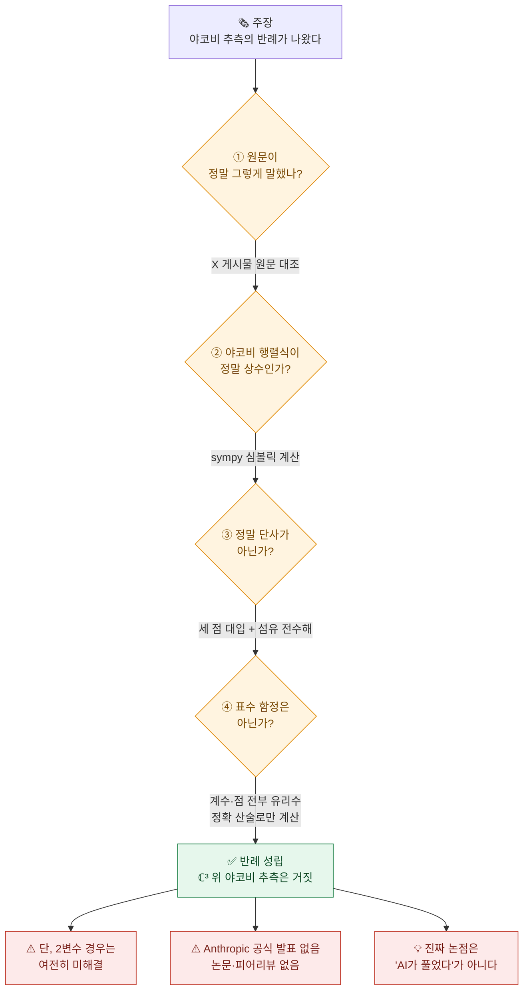
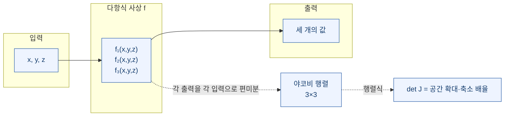
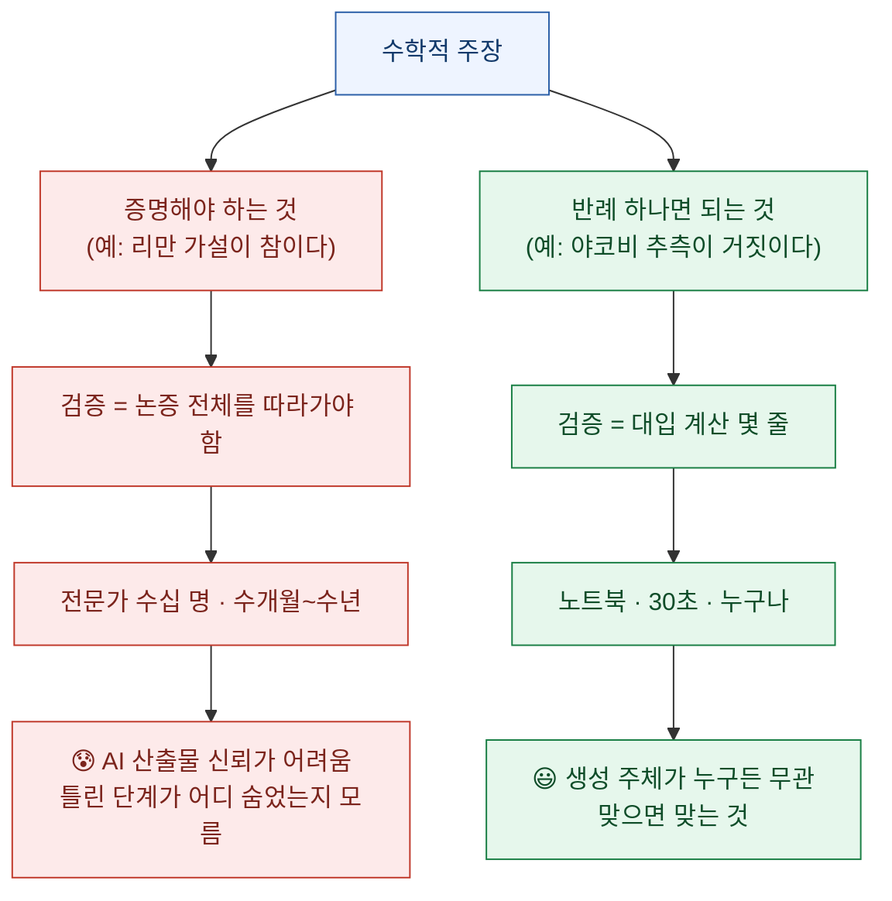

오늘 아침 목록에서 제목 하나가 눈에 걸렸다. **"Claude Fable이 야코비 추측의 반례를 만들다."**

솔직히 첫 반응은 의심이었다. 이런 제목은 대개 셋 중 하나로 끝난다. 표수(characteristic)를 헷갈렸거나, 추측의 진술을 잘못 읽었거나, 애초에 원문이 그런 말을 한 적 없거나. 야코비 추측은 1939년에 나와 87년을 버틴 문제고, 그동안 "반례를 찾았다"는 주장은 여러 번 나왔다가 전부 무너졌다.

그런데 이번 건 성격이 좀 달랐다. **반례는 검증 비용이 증명과 다르다.** 증명이 맞는지 보려면 논증 전체를 따라가야 하지만, 반례는 대입해보면 끝난다. 그래서 나는 기사를 더 읽는 대신 파이썬을 켰다.

결론부터: **진짜였다.** 내 노트북에서 30초 만에 재현됐다.

## 오늘 확인한 것을 한 장으로 보면?



## 야코비 추측이 뭔데?

수학 전공이 아니어도 이해할 수 있는 문제다. 오히려 **"당연해 보이는데 87년간 아무도 증명 못 한"** 유형이라 더 재밌다.

다항식으로만 이루어진 함수 하나를 생각하자. 입력도 숫자 여러 개, 출력도 숫자 여러 개다. 예를 들어 입력 `(x, y, z)`를 받아 출력 세 개를 내놓는 사상 `f`가 있고, 그 세 출력이 전부 `x, y, z`의 다항식이다.

여기서 **야코비 행렬식(Jacobian determinant)** 이라는 값이 나온다. 이름이 무섭지만 뜻은 단순하다. 각 출력을 각 입력으로 미분해서 표를 만들고, 그 표의 행렬식을 구한 것이다. 직관적으로는 **"이 함수가 어느 지점에서 공간을 얼마나 늘이거나 줄이는가"** 를 나타내는 배율이다.



이 배율이 **모든 점에서 똑같은 0이 아닌 상수**라면? 공간이 어디서도 찌그러지지 않는다는 뜻이다. 어느 지점에서도 납작해지는 곳이 없다. 그럼 자연스럽게 이런 기대가 생긴다. **"찌그러지는 데가 없으면 서로 다른 두 점이 같은 곳으로 겹쳐 갈 리 없지 않나?"**

이 기대를 정식으로 적은 게 야코비 추측이다.

> **야코비 추측(Ott-Heinrich Keller, 1939)**
> 표수 0인 체(복소수 등) 위에서, 다항식 사상 `f`의 야코비 행렬식이 0이 아닌 상수이면, `f`는 다항식 역함수를 갖는다. (즉 일대일 대응이다.)

87년간 아무도 증명하지 못했고, 아무도 반증하지 못했다. 오늘까지는.

## 그래서 반례가 뭔가?

정수론 수학자 **Levent Alpöge**(@\_\_alpoge\_\_)가 2026년 7월 20일 02:19 UTC(한국시간 11:19)에 X에 올린 게시물이 시작이다. 문장은 놀랄 만큼 짧고 가볍다.

> "hello there the jacobian conjecture is false thanx to my close friend akhil for asking about it and my other close friend fable for working during the world cup final"
>
> (안녕하세요 야코비 추측은 거짓입니다 이걸 물어봐준 친한 친구 akhil과 월드컵 결승 중에 일해준 또 다른 친한 친구 fable에게 감사를)

"akhil"은 시카고대 수학과 교수 **Akhil Mathew**로 확인된다(Kevin Buzzard 블로그 경유). "fable"은 Claude Fable이다. 그리고 게시물 본문에 반례가 통째로 들어 있다.

```
f₁ = (1+xy)³·z + y²·(1+xy)·(4+3xy)      (7차)
f₂ = y + 3x(1+xy)²·z + 3xy²·(4+3xy)      (6차)
f₃ = 2x − 3x²y − x³z                     (4차)
```

주장은 두 줄이다. **야코비 행렬식이 −2**이고, **세 점 `(0,0,−1/4)`, `(1,−3/2,13/2)`, `(−1,3/2,13/2)`이 모두 `(−1/4,0,0)`으로 간다**는 것.

세 점이 같은 곳으로 간다면 일대일이 아니다. 그럼 역함수가 있을 수 없다. 다항식 역함수는커녕 **어떤 종류의 역함수도** 불가능하다. 추측이 거짓이 된다.

## 직접 계산해보면 정말 그런가?

여기가 이 글의 핵심이다. 나는 기사를 믿는 대신 계산했다. 코드는 이게 전부다.

```python
from fractions import Fraction as F
import sympy as sp

def f(x, y, z):
    a = 1 + x*y
    return (a**3 * z + y*y*a*(4 + 3*x*y),
            y + 3*x*a*a*z + 3*x*y*y*(4 + 3*x*y),
            2*x - 3*x*x*y - x**3*z)

# ① 세 점의 상 — 부동소수점 없이 정확 유리수로만
pts = [(F(0),F(0),F(-1,4)), (F(1),F(-3,2),F(13,2)), (F(-1),F(3,2),F(13,2))]
for p in pts:
    print("f%s = %s" % (tuple(str(v) for v in p), tuple(str(v) for v in f(*p))))
print("세 점 서로 다름:", len(set(pts)) == 3)

# ② 야코비 행렬식 심볼릭 계산
x, y, z = sp.symbols('x y z')
Fm = sp.Matrix(list(f(x, y, z)))
det = sp.expand(Fm.jacobian(sp.Matrix([x, y, z])).det(method='berkowitz'))
print("det J =", det, "| 상수인가:", det.free_symbols == set())

# ③ 그 점 위 섬유(fibre)를 통째로 풀어본다
sol = sp.solve([Fm[0] + sp.Rational(1,4), Fm[1], Fm[2]], [x, y, z], dict=True)
print("f⁻¹((-1/4,0,0)) 해 개수:", len(sol))
for s in sol: print("   ", s)
```

출력은 이랬다.

```
f('0', '0', '-1/4') = ('-1/4', '0', '0')
f('1', '-3/2', '13/2') = ('-1/4', '0', '0')
f('-1', '3/2', '13/2') = ('-1/4', '0', '0')
세 점 서로 다름: True
det J = -2 | 상수인가: True
f⁻¹((-1/4,0,0)) 해 개수: 3
    {x: -1, y: 3/2, z: 13/2}
    {x: 0, y: 0, z: -1/4}
    {x: 1, y: -3/2, z: 13/2}
```

세 줄 다 맞았다. 그리고 세 번째 검사가 특히 마음에 들었다. **세 점을 대입해보는 것과, 그 점 위에 놓인 해를 전부 풀어보는 것은 다른 강도의 검증이다.** 앞의 것은 "이 세 점은 겹친다"만 보여주고, 뒤의 것은 "겹치는 점이 정확히 셋이며 그중 하나도 중복 계산이 아니다"를 보여준다. 섬유의 해집합이 정확히 3원소로 나왔다.

## 함정은 없었나?

역사적으로 야코비 추측 "반례"가 무너진 자리는 대개 정해져 있다. 나는 그 목록을 하나씩 짚었다.

| 의심한 함정 | 판정 | 왜 |
|---|---|---|
| **표수 p 함정** (𝔽₂·𝔽₃ 같은 유한체에서만 성립) | 해당 없음 | 계수가 전부 정수, 점이 전부 유리수. 모든 산술을 `Fraction`·`sp.Rational`로 **정확히** ℚ ⊂ ℂ 안에서 수행했다. 부동소수점을 한 번도 쓰지 않았다 |
| **오히려 반대** | — | 표수 2에서는 `det = −2 ≡ 0`이 되어 **가정 자체가 깨진다**. 이건 표수 0에서만 유효한 반례다 |
| **차원 불일치** | 해당 없음 | 3변수 다항식 3개 → ℂ³ → ℂ³ 정사각 |
| **다항식이 아니라 유리함수** | 해당 없음 | 세 성분 모두 분모가 없다 |
| **추측 진술 오해** | 해당 없음 | 야코비 추측은 "det J가 0 아닌 상수 ⇒ 역함수 존재". 여기선 역함수가 아예 불가능하다 |
| **전달 과정 왜곡** | 없음 | 국내 요약본과 X 원문을 대조했고 글자 단위로 일치했다 |

특히 첫 줄이 중요하다. **부동소수점을 쓰면 "-2.0000000001"을 보고 "상수 -2"라고 착각할 수 있다.** 그래서 유리수 정확 산술로만 돌렸고, sympy를 아예 쓰지 않은 순수 `Fraction` 손코딩 버전으로도 무작위 유리점 여섯 곳에서 전부 `-2`가 나오는지 따로 확인했다. 라이브러리 버그 가능성까지 지운 것이다.

## 수학계는 뭐라고 했나?

반박은 하나도 못 찾았다.

- **Kevin Buzzard**(임페리얼 칼리지, Lean mathlib 메인테이너) — 블로그에서 사실상 승인: *"The Jacobian conjecture is resolved! Wow!"*
- **Tim Gowers**(필즈상) — *"assuming this is correct... pretty amazing"*
- **Daniel Litt**(토론토대) — *"Very bullish for near-term impact of AI on math... it's a huge deal"*
- **Bartosz Naskręcki**(포즈난대) — 유일한 유보: Fable이 자율적으로 푼 게 아닐 것이고 프롬프트에 진짜 통찰이 필요했을 것이며, 전체 리포트를 기다린다는 취지
- 해커뉴스 스레드(661포인트)에도 **반박 시도가 0건**이다. 초기의 오해("자기 역함수 아니냐")는 스레드 안에서 즉시 교정됐다

형식 검증도 이미 돌고 있다. Google DeepMind의 `formal-conjectures` 저장소에 **Lean 형식화 PR(#4474)** 이 올라왔고, `[Field k] [CharZero k]`로 표수 0을 명시한 채 `answer(False)`로 적혀 있다. 다만 이 글을 쓰는 시점에 **아직 머지되지 않았다.**

## 그런데 오늘 진짜 논점은 그게 아니다

"AI가 87년 난제를 풀었다"는 헤드라인은 자극적이지만, 나한테 남은 질문은 다른 거였다.

**왜 하필 이 문제였나?**

수학 문제는 두 종류로 갈린다. 이 구분이 오늘의 핵심이다.



야코비 추측은 **탐색은 극도로 어렵지만 검증은 극도로 쉬운** 문제였다. 7차·6차·4차 다항식 세 개를 계수까지 맞춰 찾아내는 건 사람 손으로 하기 힘든 탐색이다. 하지만 일단 나오면? 나 같은 비전공자도 30초 만에 확인한다.

이건 내가 업무 자동화에서 매일 쓰는 기준과 정확히 같다. **"이 작업을 AI에 맡겨도 되는가"의 진짜 기준은 난이도가 아니라 검증 가능성이다.**

- 결과를 기계적으로 검증할 수 있으면 → 생성이 아무리 창의적이어도 맡길 수 있다
- 결과 검증이 원 작업만큼 어려우면 → 아무리 쉬워 보여도 위험하다

DART 공시에서 숫자를 뽑는 작업은 원문 대조로 검증된다. 그래서 맡긴다. 반면 "이 회사가 유망한가"를 요약하게 하면 검증할 기준이 없다. 그래서 안 맡긴다. 오늘 수학계에서 벌어진 일은 이 원칙이 최고 난도에서 작동한 사례에 가깝다.

Naskręcki의 유보도 이 맥락에서 읽힌다. "AI가 자율적으로 풀었느냐"는 여전히 열린 질문이다. **하지만 반례의 진위는 그 질문과 무관하게 이미 결정됐다.** 누가 만들었든, 어떤 프롬프트를 썼든, `det J = −2`이고 세 점이 겹친다는 사실은 변하지 않는다. 이게 반례라는 형식이 가진 힘이다.

## 아직 확인 안 된 것들

과장하지 않기 위해 남은 구멍도 적어둔다. 오늘 시점(2026-07-21 KST)에 **확인하지 못한 것들**이다.

| 항목 | 상태 |
|---|---|
| **Anthropic 공식 발표** | ❌ 없음. anthropic.com/news에 관련 항목 0건. 발표 채널은 **개인 X 게시물 하나**가 전부다 |
| **arXiv 프리프린트·논문** | ❌ 없음. 피어리뷰 이전 단계 |
| **Fable이 어떻게 찾았는가** | ❌ 프롬프트·추론 기록 미공개. "기존 문헌의 실패한 반례를 구조 보존하며 확장한 것 같다"는 추측이 있지만 추측이다 |
| **Lean PR 머지** | ⏳ 열려 있음(mergeable). 형식 검증 완료 선언은 아직 |
| **게시자의 소속** | ⚠️ 2차 매체·커뮤니티 댓글은 Anthropic 소속이라 하나 1차 확인 실패 |
| **2변수 야코비 추측** | ❌ **여전히 미해결.** 오늘 깨진 건 3변수 이상이다. Lean PR에도 2변수는 `open`으로 남아 있다 |

마지막 줄이 특히 중요하다. 국내외 요약이 "야코비 추측이 풀렸다"로 뭉뚱그리는데, **정확히는 ℂ³ 이상에서 거짓임이 보였고 ℂ² 경우는 그대로 열려 있다.** 이 구분을 안 하면 틀린 말이 된다.

## 오늘 내가 챙긴 것

87년 된 추측이 깨진 날 내가 실제로 한 일은 파이썬 15줄을 돌린 것뿐이다. 그런데 그 15줄 덕분에 나는 이 뉴스를 "들은 것"이 아니라 "확인한 것"으로 갖게 됐다.

**요약을 읽고 넘겼다면 나는 오늘 아무것도 모르는 채였을 것이다.** 요약에는 "상수 -2"라고만 적혀 있었고, 그게 부동소수점 근사인지 정확값인지, 표수 문제가 없는지, 세 점 말고 다른 겹침이 있는지는 아무것도 안 적혀 있었다. 그걸 알아내는 데 든 비용은 30초였다.

검증 비용이 30초인 주장을 검증 없이 옮기는 건, 그냥 습관의 문제다.

---

## 참고

- Levent Alpöge 원 게시물 — `x.com/__alpoge__/status/2079028340955197566` (2026-07-20 02:19 UTC)
- Kevin Buzzard, *"Human mathematicians are being outcounterexampled"* — Xena Project 블로그 (2026-07-20)
- Google DeepMind `formal-conjectures` PR #4474 — Lean 형식화(미머지)
- 야코비 추측 원 진술: Ott-Heinrich Keller (1939)
- 계산 환경: Python 3 + sympy, 유리수 정확 산술(`fractions.Fraction`·`sympy.Rational`)

*이 글의 모든 계산은 직접 실행해 출력을 그대로 옮겼다. 수학 전공자가 아니므로 추측의 역사적 맥락과 관련 정리에 대한 서술은 인용한 1차 출처의 범위를 넘지 않도록 제한했다.*
