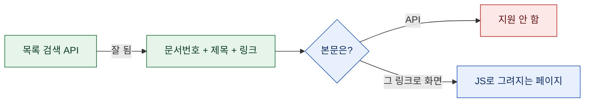
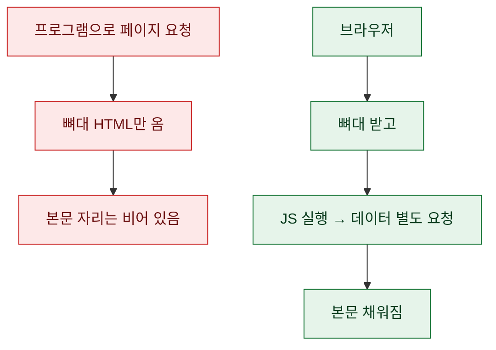
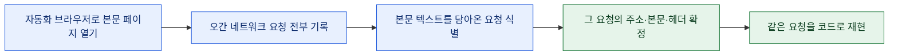
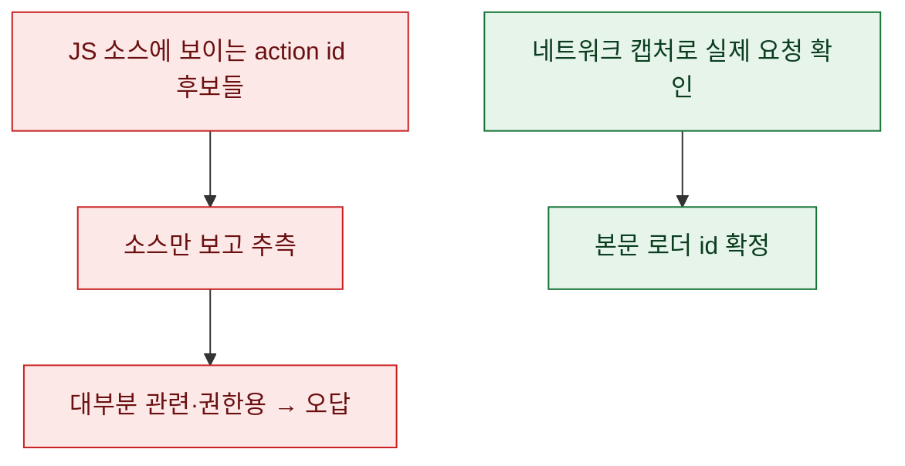
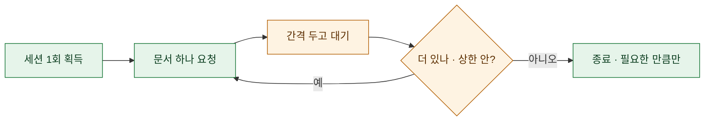
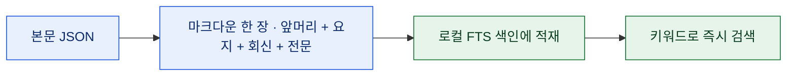
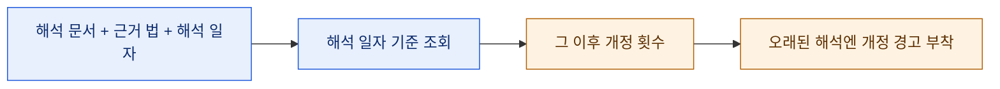

# 목록은 주는데 본문은 안 주는 사이트

> 공개된 자료인데도 손에 안 잡히는 경우가 있다. 검색하면 제목 목록은 주르륵 나오는데, 정작 클릭해서 들어간 본문은 프로그램으로 받으면 텅 비어 있다. 데이터가 막힌 게 아니라, **화면을 그리는 방식**에 가려 있을 뿐이었다.

## 목록은 왔는데 본문이 안 온다

공공기관 정보 포털에는 이런 구조가 흔하다. 해석·질의회신·고시 같은 문서가 **목록 검색은 잘 되는데**, 각 문서의 **본문은 별도 페이지**에 있고 그 페이지가 자바스크립트로 그려진다. 목록에서 얻는 건 문서 번호(식별자)와 제목뿐, 본문은 그 번호로 다시 화면을 열어야 나온다.

내가 마주친 것도 정확히 이 모양이었다. 목록 검색은 공개 API로 깔끔하게 되는데(문서 번호·제목·원문 링크까지), **본문만은 API가 "지원 안 함"**을 돌려줬다. 본문은 오로지 그 외부 화면 안에 있었다.



여기서 얻은 첫 교훈. **목록 API와 본문 API는 별개다.** 목록이 열려 있다고 본문도 같은 문으로 나오리란 법이 없다. 목록은 공개 창구로, 본문은 화면 뒤 다른 경로로 가는 경우가 많다.

## 왜 그냥 받아오면 껍데기만 오나?

이유는 단순하다. 요즘 웹페이지는 HTML 안에 내용을 다 담아 보내지 않는다. 뼈대만 먼저 보내고, 브라우저가 자바스크립트를 실행하면서 **그 뒤에 데이터를 따로 불러와 채운다.** 그러니 `requests`처럼 자바스크립트를 실행하지 않는 도구로 페이지를 받으면, 뼈대(껍데기)만 손에 쥐게 된다.



그럼 답은 나와 있다. 브라우저가 "본문을 채우려고 뒤에서 몰래 보내는 그 요청"을 찾아내면, 나도 똑같이 그 요청만 직접 보내면 된다. 화면 전체를 렌더링할 필요 없이, **데이터를 실어오는 진짜 요청 하나**만 있으면 되는 것이다.

## 화면 뒤의 '진짜 요청'을 어떻게 찾나?

진짜 브라우저로 그 페이지를 한 번 열고, **네트워크 탭(또는 자동화 브라우저의 요청 로그)**을 들여다본다. 본문이 화면에 뜨는 순간 오가는 요청들 중에서, 본문 데이터를 담아 오는 그 하나를 집어낸다.



이 방법의 좋은 점은 **추측을 없앤다**는 것이다. 코드만 읽고 "이 함수가 본문을 부르겠지" 짐작하면 십중팔구 틀린다. 실제로 오간 요청을 잡으면 주소도, 보낸 값도, 필요한 헤더도 눈앞에 그대로 있다. 브라우저 자동화 도구 선택은 [[requests-selenium-playwright-decision|requests·Selenium·Playwright 결정 기준]] 편에서 다룬 그대로다.

## 함정 — 코드에 보이는 action id는 미끼였다

내가 마주친 사이트는 모든 화면 요청이 **하나의 게이트웨이 주소**로 모이는 구조였다. 요청마다 "무슨 동작인지"를 가리키는 action id와, 그 동작에 넘길 파라미터를 함께 실어 보낸다. 그러니 "본문을 가져오는 action id"만 알면 끝이다.

그런데 여기서 크게 헛발을 짚었다. 화면의 자바스크립트 소스를 열어보면 action id 후보가 여럿 보이는데, **눈에 잘 띄는 것들이 하나같이 오답**이었다. 그것들은 관련 문서·권한 확인용이었고, 정작 본문을 실어오는 id는 소스만 봐서는 짚이지 않는 다른 값이었다. 결국 소스 읽기가 아니라 **네트워크 캡처로만** 진짜를 확정할 수 있었다.



파라미터에도 함정이 있었다. 문서 번호를 그냥 평평하게 넘기는 게 아니라, **한 겹 감싼 형태**로 넣어야 통했다. 이런 건 명세가 어디에도 없다. 실제 요청 본문을 그대로 베끼는 수밖에 없었다.

## 세션 먼저, 그다음 본문

캡처로 확정한 절차는 딱 두 걸음이었다. 대상은 특정 정부 정보 포털(국세법령정보시스템, `taxlaw.nts.go.kr`)이 공개하는 국세청 법령해석이었다.

1. **세션 얻기.** 아무 페이지나 평범하게 한 번 GET 하면 세션 쿠키가 발급된다. 이후 요청은 이 쿠키만 지니면 된다.
2. **본문 요청.** 게이트웨이로 POST 한 번. 실은 이게 전부다.

```text
① 세션:  GET https://taxlaw.nts.go.kr/qt/USEQTA002P.do      → 세션 쿠키 획득

② 본문:  POST https://taxlaw.nts.go.kr/action.do
         actionId  = ASIQTB002PR01
         paramData = {"dcmDVO":{"ntstDcmId":"<문서번호>"}}   (폼 인코딩)

③ 응답(JSON):  제목 · 요지 · 회신 + 전문 HTML
```

키도, 로그인도, 브라우저 렌더링도 필요 없다. 세션 쿠키 하나와 올바른 action id, 그리고 한 겹 감싼 파라미터. 이 셋이 맞으면 표준 라이브러리만으로 본문이 JSON으로 떨어진다. 소스만 봤으면 절대 못 맞췄을 조합이다.

## 긁기 전에 — 공개 데이터라도 예의가 필요하다

여기서 잠깐 멈추자. 이 데이터는 **공개된 것**이다(누구나 로그인 없이 무료로 읽는 법령해석). 그렇다고 마구 두드려도 된다는 뜻은 아니다. 상대는 공공 서비스고, 무리하게 호출하면 다른 이용자에게 폐가 된다. 그래서 나는 [[crawler-robots-tos-ratelimit-checklist|크롤러 전 점검 체크리스트]]를 그대로 적용했다.

- **세션은 한 번만** 얻어 재사용한다(매번 새로 열지 않는다).
- **요청 사이에 간격**을 둔다 — 쉼 없이 두드리지 않는다.
- **한 번에 조금씩.** 키워드 하나, 건수 상한을 두고 필요한 만큼만.
- **목적은 조회**다 — 통째로 복제해 재배포하는 게 아니라, 내가 찾아 읽을 것만.



공개 데이터라는 건 "가져가도 된다"이지 "함부로 해도 된다"가 아니다. 이 구분을 지키면 상대 서버도, 내 접근권도 오래간다.

## 뽑은 본문을 검색엔진에 담기

본문을 받았으니 이제 **찾을 수 있게** 만든다. 각 문서를 앞머리(제목·번호·일자·출처 링크)와 본문(요지·회신·전문)으로 나눠 마크다운 한 장으로 저장하고, 그 폴더를 앞 편들에서 만든 로컬 전문검색에 색인했다.



이렇게 하면 흩어진 개별 문서들이 **하나의 검색 가능한 묶음**이 된다. "이 주제를 다룬 해석이 어디 있더라"가 브라우저 왕복 없이 로컬 키워드 검색 한 번으로 끝난다. 색인 계층 자체는 [[knowledge-vault-fts-graph-mcp-search|볼트에 검색엔진을 얹다]] 편의 그 물건 그대로다.

## 보너스 — '이 해석 이후 법이 몇 번 바뀌었나'

여기서 한 걸음 더 나갔다. 법령해석은 **작성 시점의 법**을 근거로 한다. 그러니 오래된 해석은 "그 뒤로 근거 법이 바뀌었을 수도" 있다. 앞 편에서 단 실시간 법령 창구에는 **특정 시점 기준으로 조문을 되짚는 기능**이 있어서, "이 해석 일자 이후 근거 법이 몇 번 개정됐는지"를 물어볼 수 있다.



이게 있으면 "이 해석 아직 유효한가?"라는 질문에 감이 아니라 **숫자로** 답할 수 있다. 근거 조문이 어떻게 바뀌었는지 개정 전후를 나란히 보고, 해석 이후 몇 차례 손댔는지 세는 것. 검색으로 문서를 찾는 데서 그치지 않고, **그 문서가 지금도 살아 있는지까지** 확인하는 계층이 얹혔다.

## 무엇이 달라졌나?

| 이전 | 이후 |
|---|---|
| 목록만 되고 본문은 화면 안 | 내부 요청 재현으로 본문 확보 |
| 소스 읽고 action id 추측 | 네트워크 캡처로 진짜만 확정 |
| 문서마다 브라우저 왕복 | 마크다운으로 모아 로컬 검색 |
| "이 해석 유효한가"는 감 | 개정 횟수로 확인 |

정리하면 이 편의 뼈대는 세 문장이다. **목록 API와 본문 API는 다르다. 화면 뒤 진짜 요청은 추측이 아니라 캡처로 확정한다. 그리고 공개 데이터라도 예의를 갖춰 가져온다.** 이 셋을 지키면, 화면에 가려 손에 안 잡히던 공개 자료가 검색 가능한 내 자산이 된다.

> 데이터가 막힌 게 아니라 그리는 방식에 가려 있던 것이더라. 브라우저가 뒤에서 하는 일을 한 번만 들여다보면, 그 문은 대개 이미 열려 있다 — 다만 예의를 갖춰 드나들 뿐.

## 마무리

- 관련 글: [[crawler-robots-tos-ratelimit-checklist|크롤러 전 점검 체크리스트]] · [[requests-selenium-playwright-decision|requests·Selenium·Playwright 결정]] · [[knowledge-vault-fts-graph-mcp-search|볼트에 검색엔진을 얹다]]
- 앞 편: [[korean-public-data-mcp-global-install|공공데이터 창구를 에이전트에 열어주기]]

<!-- 안전: 공개 공공데이터(무료·무로그인)만 대상. 회사 실데이터·고객/제3자 PII·개인 API키/쿠키/토큰 값 없음. 레이트리밋·이용약관 준수 프레이밍 포함. -->
