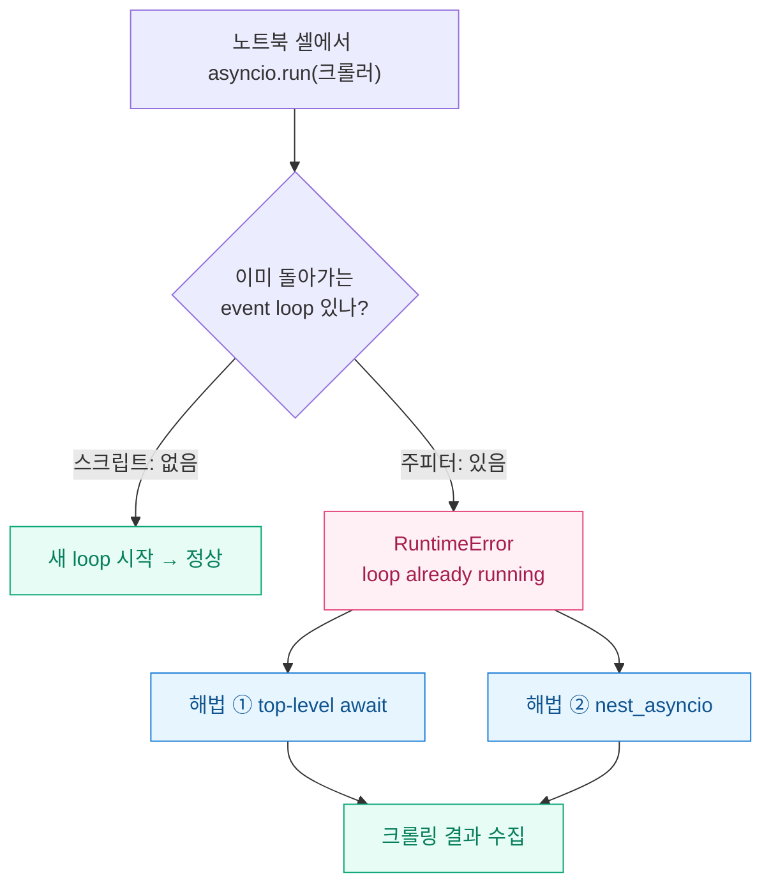
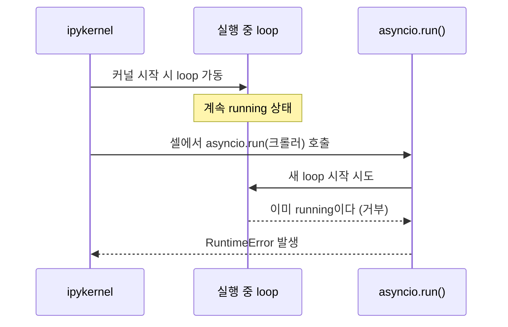
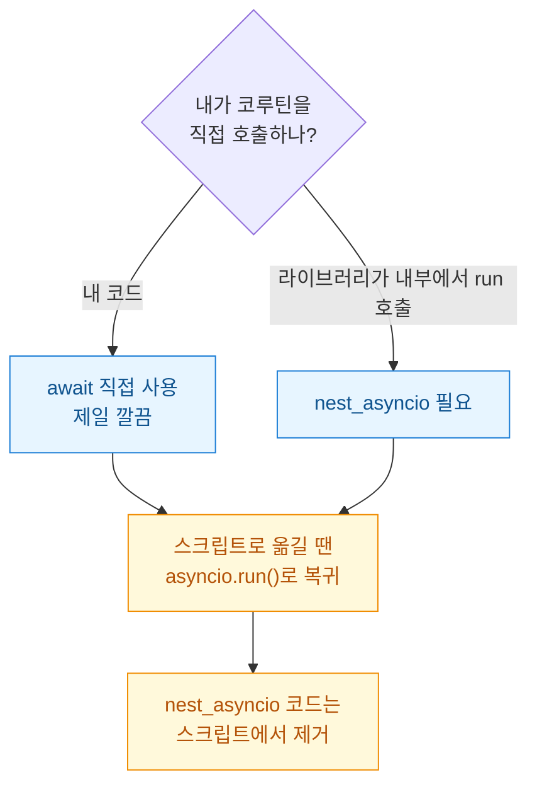

주피터 노트북(Jupyter, 브라우저에서 셀 단위로 코드를 돌리는 대화형 파이썬 환경)에서 비동기 크롤러를 처음 돌렸을 때 나는 이 에러 앞에서 한참 멈췄다.

```
RuntimeError: asyncio.run() cannot be called from a running event loop
```

로컬 `.py` 스크립트에서는 멀쩡히 돌던 코드다. 똑같이 복사해 노트북 셀에 붙였더니 대뜸 죽었다. 처음엔 내 크롤러 코드가 잘못됐나 싶어 aiohttp(비동기 HTTP 요청 라이브러리) 쪽을 뒤졌는데, 범인은 크롤러가 아니라 **노트북 환경 그 자체**였다. 정리해두면 나중에 또 삽질 안 할 것 같아 기록한다.



## 왜 스크립트에선 되는 게 노트북에선 죽나?

핵심은 이거다. **주피터 커널(ipykernel)은 이미 자기만의 asyncio event loop를 켜둔 채 돌아간다.**

event loop는 비동기 작업들을 번갈아 실행시켜주는 "관제탑" 같은 존재다. 셀 하나를 실행하고 결과를 받아오는 커널의 통신 자체가 이 loop 위에서 돌아간다. 그런데 `asyncio.run()`은 "내가 **새 loop를 만들어서** 시작하고, 끝나면 닫겠다"는 함수다. 이미 관제탑이 떠 있는데 관제탑을 또 세우려니 파이썬이 거부하는 것이다.



스크립트로 실행할 때는 파이썬 프로세스에 돌아가는 loop가 없다. 그러니 `asyncio.run()`이 첫 관제탑을 세우는 게 정상 동작이고, 노트북에서는 두 번째 관제탑이라 충돌하는 것이다. 코드가 틀린 게 아니라 실행 맥락이 다른 셈이다.

## 가장 간단한 해법은 그냥 await 아닌가?

맞다. 주피터는 셀 최상단에서 바로 `await`를 쓸 수 있다(top-level await). 이미 loop가 떠 있으니 굳이 새 loop를 만들 필요 없이 그 loop에 코루틴을 얹으면 된다.

```python
import aiohttp, asyncio

async def fetch(session, url):
    async with session.get(url) as resp:
        return resp.status, await resp.text()

async def crawl(urls):
    async with aiohttp.ClientSession() as session:
        tasks = [fetch(session, u) for u in urls]
        return await asyncio.gather(*tasks)

urls = ["https://example.com"] * 5
# 노트북에선 asyncio.run() 대신 이 한 줄
results = await crawl(urls)
```

`asyncio.run(crawl(urls))`를 `await crawl(urls)`로 바꾸는 것만으로 끝난다. 내가 새로 짜는 코드라면 이게 제일 깔끔하다.

문제는 **남이 만든 라이브러리 내부에서 `asyncio.run()`을 부르는 경우**다. 대표적으로 일부 크롤링/스크래핑 프레임워크는 동기 함수처럼 보이는 API 안에서 내부적으로 `asyncio.run()`이나 `loop.run_until_complete()`를 호출한다. 이건 내가 `await`로 못 바꾼다. 라이브러리 소스를 뜯을 게 아니니까. 여기서 `nest_asyncio`가 필요해진다.

## nest_asyncio는 뭘 하는 물건인가?

`nest_asyncio`는 이름 그대로 event loop를 **중첩(nested) 실행**할 수 있게 만들어주는 패치다. `apply()`를 부르면 현재 loop를 monkeypatch(실행 중인 객체의 동작을 런타임에 바꿔치기)해서, 이미 돌아가는 loop 위에서 `run_until_complete()`를 또 불러도 죽지 않게 해준다.

```python
import nest_asyncio
nest_asyncio.apply()   # 셀 맨 위, 딱 한 번

# 이제 노트북에서도 이게 돌아간다
results = asyncio.run(crawl(urls))
```

`pip install nest_asyncio` 후 `apply()` 한 줄이면 아까 그 RuntimeError가 사라진다. 라이브러리가 내부에서 `asyncio.run()`을 부르든 뭘 하든, 중첩 호출이 허용되니 통과한다.

## 그럼 무조건 nest_asyncio 쓰면 되는 거 아닌가?

여기서 내가 좀 데였다. 편하다고 아무 데나 바르면 곤란하다.



내가 새긴 주의점은 이렇다.

- **monkeypatch라 부작용이 있다.** loop의 표준 동작을 바꾸는 것이라 드물게 재진입 순서 꼬임이나 예상 못 한 동작이 나올 수 있다. 프로덕션 서비스 코드에 심는 건 피한다. 어디까지나 노트북에서 탐색·실험하는 용도로 본다.
- **레이트리밋은 별개 문제다.** 중첩 실행이 된다고 크롤링이 예의 바른 건 아니다. `asyncio.Semaphore`로 동시 요청 수를 묶어 상대 서버를 두들기지 않게 한다.

```python
sem = asyncio.Semaphore(5)   # 동시 5개까지만

async def fetch(session, url):
    async with sem:
        async with session.get(url) as resp:
            await asyncio.sleep(0.3)   # 요청 간 간격
            return resp.status
```

- **스크립트로 옮길 때가 진짜 함정이다.** 노트북에서 `nest_asyncio.apply()`를 넣고 `asyncio.run()`으로 잘 돌던 코드를 `.py`로 그대로 복사하면, 스크립트엔 실행 중인 loop가 없으니 `nest_asyncio`는 사실상 할 일이 없다. 굳이 남겨둘 이유도 없고, 의존성만 늘어난다. 스크립트로 승격할 땐 `nest_asyncio` 두 줄을 지우고 순정 `asyncio.run(main())` 형태로 돌려놓는다.

정리하면 노트북과 스크립트는 loop 상태가 정반대라서, 같은 코드가 한쪽에선 nest_asyncio를 필요로 하고 다른 쪽에선 필요 없어진다.

## 한 줄 교훈

`event loop already running`이 뜨면 크롤러 코드를 의심하기 전에 **"내가 지금 이미 loop가 도는 환경(주피터)에 있나?"** 부터 확인한다. 내 코드면 `await`로 끝, 남의 라이브러리가 문제면 `nest_asyncio.apply()`, 그리고 스크립트로 내보낼 땐 그 패치를 빼고 `asyncio.run()`으로 되돌린다. 환경이 다르면 정답도 다르다는 걸 이 에러가 알려줬다.

> 크롤링은 대상 사이트의 robots.txt와 이용약관, 레이트리밋을 지키는 선에서. 위 예시는 공개 테스트 도메인 기준의 합성 코드다.
