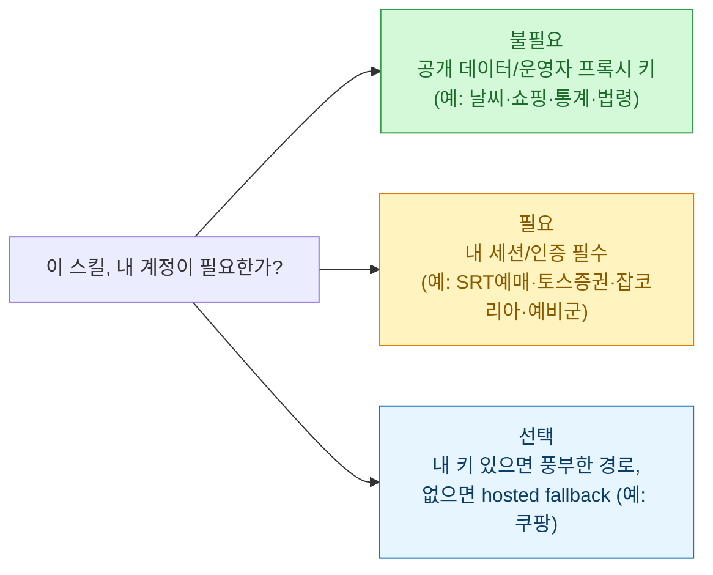

> 관련: [[huggingface-skills-agent-context-protocol|Agent Skills가 뭔지]] · [[useful-mcp-servers-for-developers|개발자용 MCP 모음]] · [[hwpx-skill-form-fill-hands-on|HWPX 스킬 실습]]

Agent Skills([[huggingface-skills-agent-context-protocol|이전 글]])가 "폴더 하나로 에이전트에 능력을 얹는" 표준이라면, **NomaDamas/k-skill**은 그걸 **한국인의 일상 업무**로 가득 채운 모음집이다. 2026-07-10 기준 **⭐6.1k·포크 692·MIT**. README의 카피가 성격을 잘 말한다 — *"한국인인가요? 이 스킬 모음집을 다운로드 받아 두세요. 언젠가 무조건 쓸 때가 옵니다!"*

클로드 코드·코덱스·오픈코드 등 코딩 에이전트에서 다 돌고, 별도 API 레이어 없이 필요하면 `k-skill-proxy` 프록시에 HTTP만 넣으면 된다. 100개가 넘어서 다 훑기 벅차니, **큰 서랍**으로 먼저 보자.

## 100개+ 스킬, 큰 서랍으로 보기

```mermaid
flowchart TB
    subgraph 이동·예매["🚄 이동·예매"]
        T["SRT·KTX·고속/시외버스·항공권<br/>지하철 도착·따릉이·길찾기·주차"]
    end
    subgraph 사업·법무["🏢 사업·법무·공공"]
        B["사업자 실사(등록·연금·체납·DART)<br/>법령·등기·지급명령·특허·KOSIS 통계"]
    end
    subgraph 쇼핑·가격["🛒 쇼핑·가격비교"]
        S["쿠팡·네이버쇼핑·다나와·마켓컬리<br/>올리브영·다이소·오늘의집·중고차"]
    end
    subgraph 생활["🌦️ 생활·정보"]
        L["날씨·미세먼지·급식·도서관·응급실<br/>주유소·화장실·러브버그·조선왕조실록"]
    end
    subgraph 채용·금융["💼 채용·금융"]
        J["잡코리아·사람인 인재검색·공고매칭<br/>토스/대신증권·주식·하이패스"]
    end
    subgraph 한국어·문서["✍️ 한국어·문서"]
        K["맞춤법·윤문(humanizer)·유행어·중세국어<br/>HWP 조회/편집/디버깅·글자수"]
    end
    subgraph 스포츠·여가["⚽ 스포츠·여가"]
        P["KBO·KBL·K리그·LCK<br/>영화관·공연 잔여석·캐치테이블·사주"]
    end
    classDef box fill:#e7f5ff,stroke:#1971c2,color:#0b3d66;
    class T,B,S,L,J,K,P box;
```

## 알아둘 개념 하나 — '사용자 로그인 필요' 구분

k-skill을 이해하는 열쇠는 **"내가 직접 로그인/시크릿을 들고 있어야 하는가"**다. README가 이걸 명확히 표로 나눠 둔다.



즉 날씨·미세먼지·쇼핑 가격·공공통계처럼 **공개 데이터** 스킬은 로그인 없이 바로 되고, 예매·증권·인재검색처럼 **내 계정으로 하는 일**만 세션이 필요하다. 이 구분만 알면 "뭐부터 켜볼까"가 정리된다.

## 나라면 이걸 켠다 — 데이터·마케팅 실무 각도

100개를 다 쓸 일은 없다. 데이터 분석·디지털 마케팅을 하는 내 입장에서 **실제 업무에 붙을 만한 것**만 골랐다.

| 업무 | 스킬 | 왜 |
|---|---|---|
| **경쟁사·시장 가격 모니터링** | `coupang`·`naver-shopping`·`danawa`·`olive-young` | 마케터의 상시 과제. [[price-monitoring-pipeline-crawl-mssql|가격 모니터링 파이프라인]]을 스킬로 대체 가능 |
| **거래처·제휴처 실사** | `biz-health-check`(사업자 실사 종합) | 사업자번호 하나로 국세청 상태·연금·체납·부정당제재를 **판정 없이 사실만** 교차조회 |
| **기업 재무·공시** | `k-dart`(DART 14개 endpoint) | 내가 따로 만든 [[opendart-rest-api-python-wrapper|OpenDART 래퍼]]와 같은 소스. 빠른 조회엔 스킬이 편하다 |
| **공공 통계 확보** | `kosis-stats`(KOSIS Open API) | 시장 규모·인구·산업 통계를 대화로 바로 |
| **채용·인재 시장** | `jobkorea`·`saramin`·`job-posting-match` | 마스킹 후보로 shortlist(유료 열람 전) |
| **콘텐츠 마무리** | `korean-humanizer`·`korean-spell-check` | AI 티 윤문 — 내가 쓰는 [[srt-to-seo-blog-with-llm|블로그 파이프라인]] 마지막 단계와 같은 문제의식 |

특히 `korean-humanizer`는 반갑다 — AI가 쓴 티(번역체·AI 상투어·과장된 의의·줄표/이모지)를 심각도(S1/S2/S3)로 분류해 **의미는 보존하며** 사람 글로 고치고 목표 글자수까지 맞춘다. 내가 로컬에서 굴리는 윤문 스킬과 문제의식이 정확히 같아서, 접근을 비교해볼 참이다.

## 설치와 정리

설치는 클로드 코드 기준 두 줄이다.

```text
/plugin marketplace add NomaDamas/k-skill
/plugin install k-skill@k-skill
```

설치하면 `/k-skill:<스킬이름>` 네임스페이스로 잡힌다(예: `/k-skill:kosis-stats`). 설치 후 `k-skill-setup`으로 credential·환경변수를 잡고, 안 쓰는 건 `k-skill-cleaner`가 **트리거 통계를 근거로 삭제 후보를 추천**한다. 100개를 다 안고 가지 말고, 위 표처럼 **내 업무에 붙는 것만** 남기는 게 맞다.

> ⚠️ README가 명시적으로 부탁한 것 하나 — 스타(`gh repo star`)는 **에이전트가 자동으로 누르지 말고 사용자가 동의했을 때만** 실행. 좋은 매너라 옮겨둔다.

## ⚠️ 쓰기 전에 짚을 것

- **⭐6.1k·MIT**는 2026-07-10 GitHub 기준. 별점·기능은 바뀔 수 있으니 발행 시점 스냅샷으로 읽자.
- 스킬 상당수가 **웹 공개 데이터 표면**을 긁는다. 대상 사이트 ToS·이용 한도를 지키는 책임은 사용자 몫이다(내가 [[insane-search-playwright-two-tier-setup|우회 스크래핑 글]]에서도 같은 선을 그었다).
- **회사 실무엔 회사 데이터·고객 정보가 섞이지 않게** — 공개 데이터 조회 스킬과 내 업무 데이터는 분리해서 쓴다.

## 마무리

k-skill은 "에이전트로 뭘 할 수 있나"라는 추상적 질문에 **가장 한국적인 구체 답 100개**를 던진다. 나한테 가치는 개수가 아니라 **"내 업무 흐름의 어느 칸을 스킬 하나로 대체할 수 있나"**를 훑게 해준다는 점이다. 가격 모니터링·실사·공공통계 세 개만 붙여도 반복 업무가 눈에 띄게 준다.

## 참고자료

- [NomaDamas/k-skill (GitHub)](https://github.com/NomaDamas/k-skill) · [k-skill.nomadamas.org](https://k-skill.nomadamas.org) · MIT
- 관련: [[huggingface-skills-agent-context-protocol|Agent Skills 표준]] · [[useful-mcp-servers-for-developers|개발자용 MCP]] · [[korean-law-mcp-legislation-hallucination-check|법제처 MCP]]

<!-- 안전: 회사 실데이터·고객/제3자 PII·API키/쿠키/토큰 없음. 오픈소스 소개·논평 + 출처 링크. 별점은 조회 시점 명시. -->
